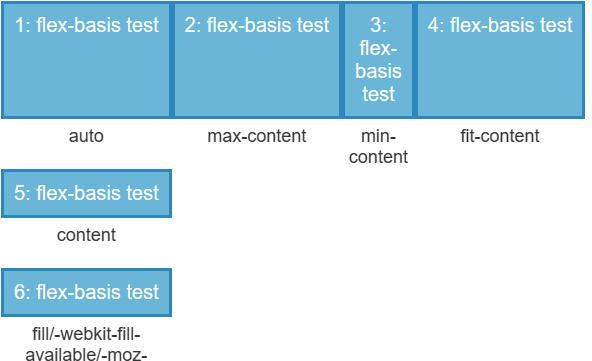

`Flexbox` 布局也叫 `Flex` 布局。

它决定了元素如何在页面上排列，使得它们能在不同屏幕尺寸下可预测地展现出来，可以响应式地实现各种页面布局。

其主要思想是使父元素能够调整子元素的宽度、高度、排列方式，从而更好地适应可用的布局空间。

## 指定 `Flex` 布局

采用 `Flex` 布局的元素，称为 `flex container`。任何容器都可以被指定为 `Flex` 容器：

~~~css
.box{
  display: flex;
  display: -webkit-flex; /* Safari */
}

.inlineBox{
    display: inline-flex;
}
~~~

`flex container` 中的所有子元素（不是所有后代元素）会成为容器的成员，称为 `flex item`。

## `Flex` 模型

当元素为 `flex container` 时，它会沿着两个轴来布局。

`flex container` 中存在主轴（`main axis`）和交叉轴（`cross axis`）。主轴的开始和结束位置被称为 `main start` 和 `main end`，交叉轴的开始和结束位置被称为 `cross start` 和 `cross end`。

`flex items` 默认沿 `main axis` 排列，单个 `flex item` 占据的主轴方向的空间大小叫做 `main size`，占据的交叉轴方向的空间大小叫做 `cross size`。

## `flex container` 相关

### `Flex` 流

`flex container` 提供 `flex-direction` 属性用于指定主轴的方向。默认值是 `row`，可以指定为 `column`。 当方向指定为 `row` 时，主轴会沿着浏览器的默认语言方向排列（在英语/中文浏览器中是从左到右）。

`flex-direction` 的可选值有：

- `row`：主轴方向与文本方向相同。
- `row-reverse`：`row` 的基础上互换了 `main start` 和 `main end`。
- `column`：主轴方向垂直于文本方向。
- `column-reverse`：`column` 的基础上互换了 `main start` 和 `main end`。

当 `flex container` 使用了定宽或定高时，其中的 `flex items` 有可能会溢出。此时可以指定 `flex container` 容器的 `flex-wrap` 属性来控制是否允许 `flex-items` 排列为多行。

`flex-wrap` 的可选值有：

- `nowrap`：默认值，单行排列。
- `wrap`：允许多行排列。
- `wrap-reverse`：允许多行排列，并将 `cross start` 与 `cross end` 互换。

可以使用 `flex-flow` 同时指定 `flex-direction` 和 `flex-wrap` ，如：`flex-flow: row wrap;`。

### 对其方式

- `justify-content`：

  该属性定义 `items` 在主轴上的对其方式。

  [justify-content - CSS：层叠样式表 | MDN (mozilla.org)](https://developer.mozilla.org/zh-CN/docs/Web/CSS/justify-content)

- `align-items`：

  该属性定义单行 `item` 在交叉轴上的对齐方式。

  [align-items - CSS：层叠样式表 | MDN (mozilla.org)](https://developer.mozilla.org/zh-CN/docs/Web/CSS/align-items)

- `justify-content`：

  该属性定义多行排列时，每一行的 `items` 的对齐方式。

  [align-content - CSS：层叠样式表 | MDN (mozilla.org)](https://developer.mozilla.org/zh-CN/docs/Web/CSS/align-content)

## `flex item` 相关

### 动态尺寸

`flex item` 的 `flex` 属性用于控制其动态尺寸，它是三个不同属性的缩写。

#### `flex-grow`

`flex-grow` 属性定义 `flex item` 的 `main size` 的增长系数。

当 `flex container` 的 `main size` 中减去 `flex items` 的初始 `main size` 之和后有剩余时，所有的 `flex items` 会根据各自 `flex-grow` 的值来分配剩余空间。

`flex-grow` 的默认值是 `0`，即当有剩余空间时，不会参与分配。

#### `flex-shrink`

`flex-shrink` 属性定义 `flex item` 的 `main size` 的收缩系数。

当 `flex items` 的初始 `main size` 之和大于 `flex container` 的 `main size` 时，所有的 `flex items` 会根据各自的 `flex-shrink` 的值来收缩。

`flex-shrink` 的默认值是 `1`。

如果 `flex-shrink` 的值为 `0`，则表示该 `flex item` 不会收缩。

#### `flex-basis`

`flex-basis` 属性定义 `flex item` 的初始 `main size`。使用该属性指定的尺寸优先级要高于元素原本的尺寸。

默认值为 `auto`，表示使用元素原本的尺寸。

可用值如下：

~~~css
/* 指定<'width'> */
flex-basis: 10em;
flex-basis: 3px;
flex-basis: auto;

/* 固有的尺寸关键词 */
flex-basis: fill;
flex-basis: max-content;
flex-basis: min-content;
flex-basis: fit-content;

/* 在 flex item 内容上的自动尺寸 */
flex-basis: content;
~~~

#### `flex`

`flex` 属性是以上属性的简写属性。按顺序分别表示 `flex-grow`，`flex-shrink`，`flex-basis`，默认值为 `0 1 auto`。

有两个快捷值：

- `auto`：表示 `1 1 auto`。
- `none`：表示 `0 0 auto`。

### `align-self`

该属性允许单个 `item` 与其它 `items` 有不一样的对齐方式，可选值同 `align-items`。

[align-self - CSS：层叠样式表 | MDN (mozilla.org)](https://developer.mozilla.org/zh-CN/docs/Web/CSS/align-self)

### `order`

该属性用于定义 `item` 的排列顺序，数值越小，排列越靠前。默认值为 `0`。

[order - CSS：层叠样式表 | MDN (mozilla.org)](https://developer.mozilla.org/zh-CN/docs/Web/CSS/order)