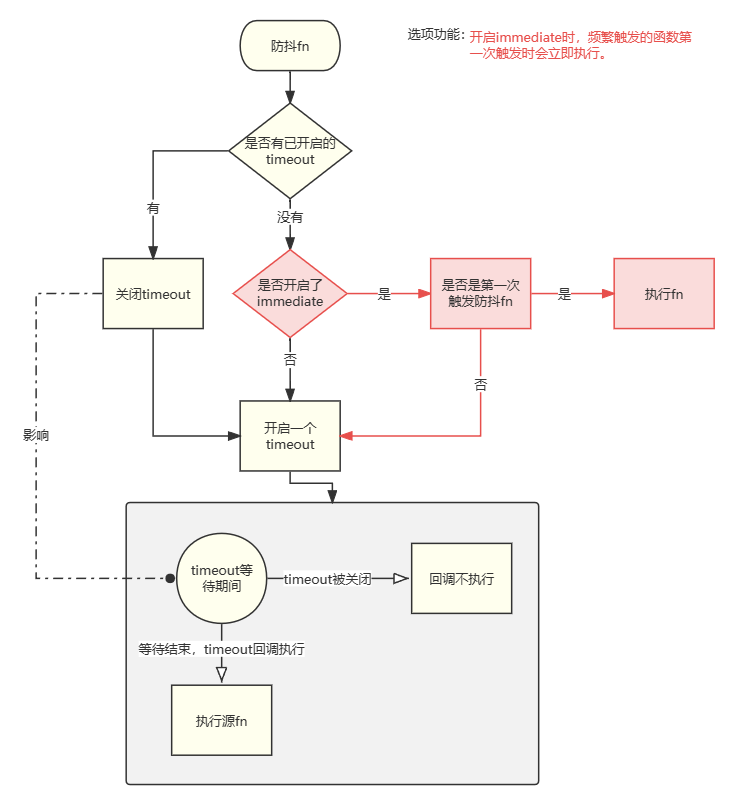
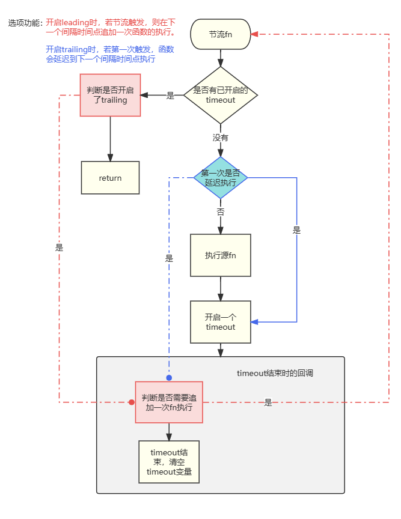

- 防抖与节流的作用
  - 某些频繁的事件处理会造成性能的损耗，可以通过函数的防抖和节流来限制函数对事件的响应

- 防抖与节流的区别
  - 防抖(`debounce`)
    - 过程
      - 当事件触发时，响应的函数并不会立即触发，而是会延迟一段时间
      - 当该事件在延迟时间内再次触发时，函数的触发会被继续推迟
      - 只有在延迟时间结束前该事件没有被再次触发，才会真正执行响应的函数
    - 简单理解
      - 只有在事件触发一段时间内，没有再次触发该事件时，才真正调用响应的函数
    - 常见应用场景
      - 输入框中频繁输入的内容
      - 页面滚动停止后，完成某些特定操作
      - 用户缩放浏览器resize事件
      - 用户频繁点击按钮操作
  - 节流(`throttle`)
    - 过程
      - 当事件触发时，会立即执行响应的函数
      - 在响应事件后的一定时间内，如果该事件再次被触发，无论多少次，都不会再次执行响应的函数
      - 在响应事件后的一定时间之后，触发的事件会再次被响应
    - 简单理解
      - 事件被响应后一段时间内，再次触发的该事件都不会被响应
    - 常见应用场景
      - 页面滚动时，完成某些特定操作
      - 鼠标移动事件
      - 用户频繁点击按钮操作

- 原生JS实现防抖和节流

  - 使用`timeout`实现

    - 防抖

      

      ~~~javascript
      function debounce(fn, delay, immediate = false) {
      	let timer
      	let isFirstTime = true
      	const fnDecounce = (...args) => {
      		return new Promise(resolve => {
      			if (timer) {
      				clearTimeout(timer)
      			} else {
      				if (immediate && isFirstTime) {
      					const res = fn.call(this, ...args)
      					resolve(res)
      					isFirstTime = false
      					return
      				}
      			}
      			timer = setTimeout(() => {
      				const res = fn.call(this, ...args)
      				resolve(res)
      				timer = undefined
      				isFirstTime = true
      			}, delay)
      		})
      	}
      	fnDecounce.cancel = () => {
      		if (timer) clearTimeout(timer)
      		timer = undefined
      		isFirstTime = true
      	}
      	return fnDecounce
      }
      ~~~

    - 节流

      

      ~~~javascript
      function throttle(fn, interval, options = { leading: false, trailing: true }) {
      	let timer
      	let isAllow = false // 是否允许源fn的执行
      	let isTrail = false // 是否在间隔时间点上追加一次源fn的执行
      	const fnTt = (...args) => {
      		return new Promise(resolve => {
      			const { leading, trailing } = options
      			// console.log('timer', timer)
      			if (timer) {
      				if (trailing) isTrail = true
      				return
      			}
      			if (leading || isAllow) {
      				console.log('fnTt_this:', this)
      				const res = fn.call(this, ...args)
      				resolve(res)
      			} else {
      				isTrail = true
      			}
      			isAllow = true
      			timer = setTimeout(() => {
      				timer = undefined
      				if (isTrail) {
      					fnTt(...args)
      					isTrail = false
      				} else {
      					isAllow = false
      				}
      			}, interval)
      		})
      	}
      	fnTt.cancel = () => {
      		clearTimeout(timer)
      		timer = undefined
      		isAllow = false
      		isTrail = false
      		console.log(this)
      	}
      	return fnTt
      }
      ~~~
    
      