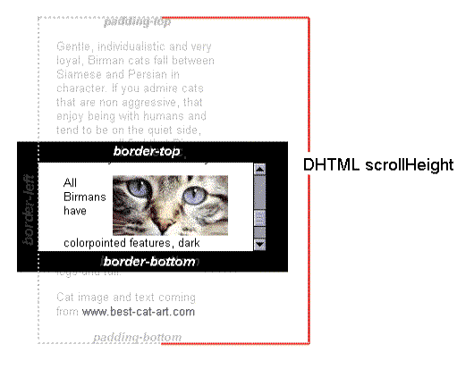

## `client`、`scroll`、`offset`

每个 `HTMLElement` 元素都有以下属性：

>  `[xxx]Width`、`[xxx]Height`、`[xxx]Left`、`[xxx]Top`。
>
> 其中 `[xxx]` 可以是 `client`、`scroll`、`offset` 中的一种。

这些属性获取到的值会四舍五入取整（除了 `scrollLeft`、`scrollHeight` 在使用了显示缩放的系统上的返回值）。

### `client` 家族

`clientWidth` / `clientHeight` 是只读属性，表示元素的  `content + padding - 滚动条尺寸（如果存在）`。

`clientLeft` 和 `clientTop` 是只读属性，分别表示元素的左边框和上边框的宽度。

> 特例情况：如果一个元素的 `direction` 样式属性为 `rtl`，且由于内容溢出导致左边出现了垂直滚动条，则 `clientLeft` 会包含该滚动条的宽度。

### `scroll` 家族

`scrollWidth` 和 `scrollHeight` 是只读属性，表示一个元素的 `content + padding` 部分的尺寸，包括溢出导致的视图中不可见的 `content` 部分。如果元素中的内容不会溢出，则相当于 `clientWidth` 和 `clientHeight`。

`scrollLeft` 和 `scrollTop` 表示元素往左侧、顶部方向溢出的距离。它们的值可以被修改并被应用到元素上。如果使用显示比缩放的系统上，它们的值可能会是小数。

### `offset` 家族

`offsetWidth` 和 `offsetHeight` 是只读属性，表示一个元素的布局尺寸，包含 `content + padding + 滚动条尺寸 + border`。

`offsetLeft` 和 `offsetTop` 是只读属性，表示当前元素相对于 `offsetParent` 元素（如果 `offsetParent` 是 `null`，则相对于 `body` 元素）的左侧、顶部的 `border` 内侧的距离。

`HTMLElement.offsetParent` 是一个只读属性，它指向 `HTMLElement` 在包含层级上最近的一个定位元素（即 `position` 不为 `static` 的元素）。

## `Element.prototype.getBoundingClientRect()`

`getBoundingClientRect()` 方法返回一个 `DOMRect` 对象，它代表一个矩形，提供了元素的大小及其相对于视口的位置。

`DOMRect` 对象提供的属性如上图所示。并且还包含 `width` 和 `height` 属性，它们是否包含 `padding` 和 `border` 取决于元素的 `box-sizeing` 样式属性。