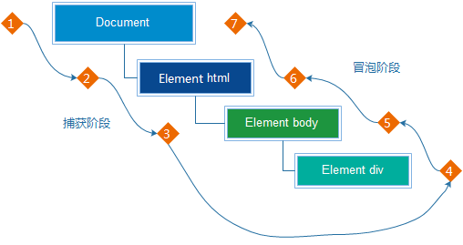

# DOM事件高级

## 事件对象

- 事件对象是什么

  - 事件对象也是个对象，里面包含了事件触发时的相关信息
  - 例如，鼠标点击事件中，事件对象存放了鼠标点击时的位置等信息

- 事件对象的获取

  - ~~~javascript
    document.addEventListener('click',function (e) {
    console.log(e)
    })
    ~~~

    在事件监听中的回调函数的第一个形参就是事件对象

  - 一般命名为e、ev、event

- 事件对象的一些常用属性
  - type
    - 获取当前事件类型
  - clientX/clientY
    - 获取光标相对于浏览器可见窗口左上角的位置
  - offsetX/offsetY
    - 获取光标相对于当前DOM元素左上角的位置
  - pageX/pageY
    - 获取光标相对于网页页面左上角的位置
  - key
    - 用户按下的键盘键的值
    - 现在不提倡使用keyCode

## 事件流

- 事件流指的是事件完整执行过程中的流动路径

  

- 当触发事件时，会经历捕获阶段和冒泡阶段这两个阶段

- 事件冒泡：

  - 当一个元素被触发时，同样的事件会在该元素的所有祖先事件中依次被触发，这一过程被称为冒泡事件
  - 简单理解：当一个元素触发事件后，会依次向上掉调用所有父级元素的同名事件
  - 事件冒泡是默认存在的

- 事件捕获：

  - 事件捕获是从DOM的根元素开始去执行对应的事件

  - 事件捕获需要通过对应代码触发

    > 监听对象.addEventListener(事件类型，事件处理函数，是否使用捕获机制)

    - 事件监听的第三个参数传入true代表的是捕获阶段触发（很少使用），默认为false
    - 若使用L0事件监听，则不会有捕获阶段

- 阻止事件流动

  - 因为事件冒泡默认存在，所以容易导致事件影响到父级元素

  - 若想把事件限制在当前元素内，需要阻止事件流动

  - 阻止事件流动需要拿到事件对象

  - 语法：

    - 事件对象.stopPropagation()

  - 此方法可以阻止事件流动传播，且在冒泡阶段和捕获阶段都有效

  - 鼠标经过事件：

    - mouseover和mouseout会有冒泡效果
    - mouseenter和mouseleave没有冒泡效果（推荐）

  - 阻止默认行为，比如链接点击不跳转，表单域不提交

    语法:

    - 事件对象.preventDefault()

- 两种注册事件的区别

  - 传统on注册（L0）
    - 同一个对象和同一种事件，后面的注册会覆盖之前的
    - 直接使用null覆盖，即可实现事件的解绑
    - 只能在冒泡阶段执行的
  - 事件监听注册（L2）
    - 同一个对象和同一种事件，后面的注册不会覆盖之前的
    - 使用 监听对象.removeEventListener(事件类型，事件处理函数，是否使用捕获机制) 来解绑事件，且匿名函数无法被解绑
    - 可以通过参数去确定是在冒泡或捕获阶段执行

## 事件委托

- 原理：事件委托是利用事件冒泡的特点，给父元素添加事件，子元素也可以触发事件

- 实现：<u>事件对象</u>.target可以获得真正触发事件的元素

- 优点：一些情况下可以不再使用遍历来监听每一个需要监听的子元素，而只需要监听它们的父元素，可以提高性能

- 事件委托中用到的事件对象属性

  - <u>事件对象</u>.target.tagName 

    值为触发事件的目标元素的大写标签名

  - <u>事件对象</u>.target.id

    值为触发事件的目标元素的id名