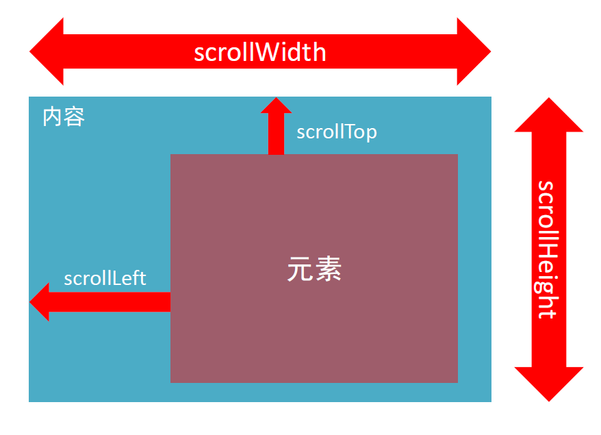
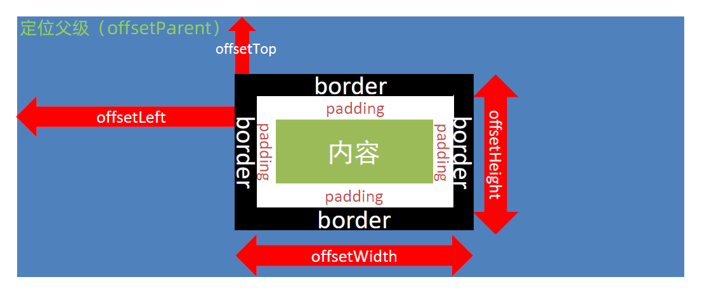
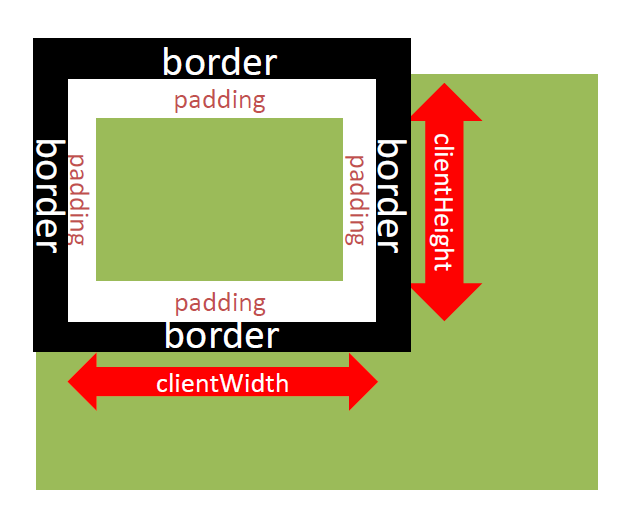

# DOM网页特效

## 滚动事件和加载事件

### 1. 滚动事件

- 当页面进行滚动时触发的事件

- 事件名：scroll

- 监听整个页面滚动：

  ~~~javascript
  window.addEventListener('scroll',function(){
      // 要执行的操作
  })
  ~~~
  
- 当监听某个元素的内部滚动也可使用

### 2. 加载事件

- load

  - 加载外部资源（如图片、外联CSS和 JavaScript等）加载完毕时触发的事件

  - 事件名：load

  - 监听页面所有资源加载完毕

    ~~~javascript
    window.addEventListener('load',function(){
        // 执行的操作
    })
    ~~~
  
  - 也可针对某个资源绑定load事件

- DOMContentLoader

  - 当初始的HTML文档被完全加载和解析完成之后，DOMContentLoaded事件被触发，而无需等待样式表、图像等完全加载

  - 监听页面DOM元素加载完毕：

    ~~~javascript
    document.addEventListener('DOMContentLoaded',function(){
        // 执行的操作
    })
    ~~~

## 元素大小和位置

### 1. scroll家族

- 获取宽高
  - 获取元素的内容总宽高（不包含滚动条），返回值不带单位
  - srollWidth和scrollHeight
- 获取位置：
  - 获取元素内容往左、往上滚动出显示区域而看不到的内容的距离
  - scrollLeft和scrollTop
  - **这两个属性是可以修改的**
- 

- 用控制台输出页面实时的向上滚动的距离

  ~~~javascript
  window.addEventListener('scroll',function(){
      console.log(document.documentElement.scrollTop)
  })
  ~~~

  - document.documentElement的返回对象为HTML元素

### 2. offset家族

- 获取宽高：
  - 获取元素的自身宽高、包含元素自身设置的宽高、padding、border
  - offsetWidth和offsetHeight
- 获取位置：
  - 获取元素距离自己最近一级的有定位的父级元素的左、上的距离
  - offsetLeft和offsetTop
- 

### 3. client家族

- 获取宽高
  - 获取元素的可见部分的宽高（不包含边框、滚动条等）
  - clientWidth和clientHeight
- 获取位置
  - 获取左边框和上边框宽度
  - clentLeft和clientTop
- 

- 检测页面宽度

  ~~~javascript
  // resize事件会在浏览器窗口尺寸改变的时候触发
  window.addEventListener('resize',function(){
      console.log(document.documentElement.clientWidth)
  })
  ~~~

  
