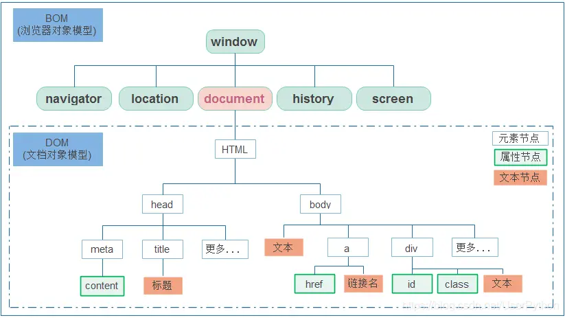
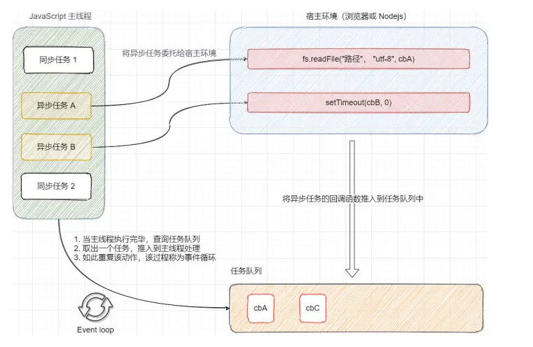

# BOM操作浏览器

## Window对象

### 1. BOM

- BOM(Browser Object Model)是浏览器对象模型

- window是浏览器内置中的全局对象
- window对象下包含了navigator、location、document、history、screen属性
- document是实现DOM的基础，document对象是window对象的一部分，可以通过window.document属性对其进行访问
- 依附于window对象的所有属性和方法，使用时可以省略window

### 2. 延时函数

- JavaScript内置的一个用来让代码延迟执行的函数

- 语法：

  - setTimeout(<u>回调函数</u>, <u>等待的毫秒数</u>)

- 清除延时函数：

  >let timer1 = setTimeout(<u>回调函数</u>, <u>等待的毫秒数</u>)
  >
  >clearTimeout(timer)

- 和间歇函数的对比
  - setInterval的特征是重复执行，首次执行会延时
  - setTimeout的特征是延时执行，只执行一次
  - setTimeout结合递归函数，能模拟setInterval重复执行
  - 两者共享一个ID池

### 3. JS执行机制（经典面试题）

- JS是单线程执行的，页面加载时，会自上而下执行主线程上的同步任务，当主线程代码执行完毕时，才开始执行在任务队列中的异步任务
- 具体如下：
  1. 所有同步任务都在主线程上执行，形成一个执行栈
  2. 主线程之外，还存在一个任务队列（eventloop队列或消息队列），异步任务的回调函数会按任务的执行顺序被推入任务队列中进入等待状态
  3. 一旦执行栈中所有的同步任务执行完毕，系统就会读取“任务队列”，如果其中存在任务，则按被推入的顺序取出一个任务，推入到执行栈处理
  4. 主线程不断重复第三步
  

### 4. location对象

- location的数据类型是对象，它拆分并保存了URL地址的各个组成部分
- 常用属性和方法：
  - href属性获取完整的URL地址，对其赋值时用于地址的跳转
  - search属性获取地址中携带的参数，符号**?**后面的部分
  - hash属性获取地址中的哈希值，符号**#**后面的部分
  - reload方法用来刷新当前页面，传入参数true时表示强制刷新

### 5. navigator对象

- navigator对象记录了浏览器自身的相关信息

- 通过navigator.userAgent检测浏览器的版本及平台

  ~~~javascript
  // 检测 userAgent（浏览器信息）
  (function () {
      const userAgent = navigator.userAgent
      // 验证是否为Android或iPhone
      const android = userAgent.match(/(Android);?[\s\/]+([\d.]+)?/)
      const iphone = userAgent.match(/(iPhone\sOS)\s([\d_]+)/)
      // 如果是Android或iPhone，则跳转至移动站点
      if (android || iphone) {
          location.href = 'https://www.baidu.com'
      }
  })()
  ~~~

### 6. history对象

- history对象与浏览器地址栏的操作相对应，比如前进、后退、历史记录等

- 常用方法

  - back()

    后退功能

  - forward()

    前进功能

  - go(<u>参数</u>)

    前进后退功能，如果参数是1则前进一个页面，如果是-1则后退一个页面

## 本地存储(webStorage)

#### localStorage

- 特点

  - 生命周期永久有效，除非手动删除，否则关闭页面也会存在
  - 同一浏览器下可以多窗口共享
  - 以键值对的形式存储使用

- 方法

  - 存储数据

    - localStorage.setItem(<u>key</u>, <u>value</u>)
  - 获取数据

    - localStorage.getItem(<u>key</u>)
  - 如果key不存在，则获取到的是null
  - 删除数据

    - localStorage.removeItem(<u>key</u>)
  - 清空数据
    - localStorage.clear()

- 复杂数据类型的存储

  本地存储只能存储字符串，复杂数据类型需要转换成JSON字符串再存储到本地

  - JSON.stringify(<u>复杂数据类型</u>)

    将复杂数据类类型转换成JSON字符串

  - JSON.parse(<u>JSON字符串</u>)

    将JSON字符串转换成复杂数据类型

#### sessionStorage

- 生命周期为直到关闭浏览器窗口，其余基本和localStorage相同

## 自定义属性

- 固有属性

  标签天生自带的属性，如class、id等，可以直接用点语法操作

- 自定义属性

  自己添加的属性，无法直接在于DOM对象中找到，  需使用对应的API进行操作

  - getAttribute('<u>属性名</u>') // 获取自定义属性
  - setAttribute('<u>属性名</u>', '<u>属性值</u>') // 设置自定义属性
  - removeAttribute('<u>属性名</u>') // 删除自定义属性

- data-自定义属性

  html5中推出的data-自定义属性，为自定义属性定义规则

  属性命名方式：data-<u>自定义属性名</u>

  从DOM中获取属性值的方式：<u>element</u>.dataset.<u>自定义属性名</u>