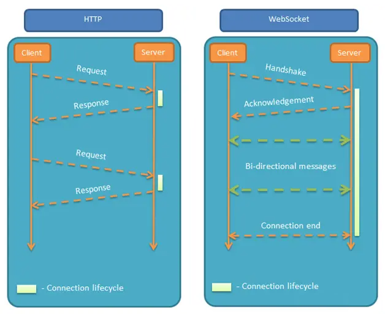

## `WebSocket` 协议

`WebSocket` 是基于 `TCP` 的应用层协议，实现了浏览器与服务器全双工（`full-duplex`）通信。`WebSocket` 协议主要为了解决基于 `HTTP/1.x` 的 `Web` 应用无法实现服务端向客户端主动推送的问题，为了兼容现有的设施，`WebSocket` 协议使用与 `HTTP` 协议相同的端口，并使用 `HTTP Upgrade` 机制来进行 `WebSocket` 握手，当握手完成后，通信双方便可以按照 `WebSocket` 协议的方式进行交互。

`WebSocket` 的主要特点包括：

- 建立在 `TCP` 协议上，服务端的实现比较容易。
- 与 `HTTP` 协议有着良好的兼容性，默认端口也是 `80` 和 `443`，并且握手阶段采用 `HTTP` 协议，因此握手时不容易被屏蔽，能通过各种 `HTTP` 代理服务器。
- 数据可是比较轻量，性能开销小。
- 可以发送文本，也可以发送二进制数据。 
- 没有同源限制，客户端可以与任意服务器通信。
- 协议标识符是 `ws`（如果加密，则是 `wss`），服务器网址就是 `URL`。

`HTTP` 与 `WebSocket` 的生命周期对比：

>图示：
>
>
>
>与 `HTTP` 协议一样，`WebSocket` 协议也需要通过已建立的 `TCP` 连接来传输数据。具体实现上是通过 `HTTP` 协议建立通道，然后在此基础上用真正的 `WebSocket` 协议进行通信。
>
>`HTTP` 生命周期通过 `Request` 来界定，客户端发送了一个 `Request`，服务端响应一个 `Response`，在 `HTTP 1.0`，这次 `HTTP` 请求就结束了。
>
>在 `HTTP 1.1` 中，新增了 `keep-alive`，使得在一个 `HTTP` 连接中，可以发送多个 `Request`。但是一个 `Request` 仍然只会收到一个 `Response` 响应，`Response`  也无法主动发起。
>
>对于 `WebSocket`，会借用 `HTTP` 协议来完成一部分握手。示例：
>
>~~~http
>GET /chat HTTP/1.1
>Host: server.example.com
>Upgrade: websocket
>Connection: Upgrade
>Sec-WebSocket-Key: x3JJHMbDL1EzLkh9GBhXDw==
>Sec-WebSocket-Protocol: chat, superchat
>Sec-WebSocket-Version: 13
>Origin: http://example.com
>~~~
>
>- `Upgrage: websocket` 表示客户端希望将连接升级为 `WebSocket`。
>- `Connection: Upgrade` 表示如果服务器同一，那么连接将被升级。
>- `Sec-WebSocket-Key: x3JJHMbDL1EzLkh9GBhXDw==` 包含了一个 `Base64` 编码的随机值，服务器会用这个值来构造一个响应，以证明它收到了请求。
>- `Sec-WebSocket-Protocol: chat, superchat` 表示客户端希望使用的子协议。
>- `Sec-WebSocket-Version: 13` 表示客户端使用的 `WebSocket` 协议版本。
>
>服务器返回以下响应，表示已接收到请求，并开启了 `WebSocket` 连接：
>
>~~~http
>HTTP/1.1 101 Switching Protocols
>Upgrade: websocket
>Connection: Upgrade
>Sec-WebSocket-Accept: HSmrc0sMlYUkAGmm5OPpG2HaGWk=
>Sec-WebSocket-Protocol: chat
>~~~
>
>- `Connection: Upgrade` 表示已经升级了连接。
>- `Sec-WebSocket-Accept: HSmrc0sMlYUkAGmm5OPpG2HaGWk=` 这里的值是经过服务器确认，并且加密过后的 `Sec-WebSocket-Key`。
>- `Sec-WebSocket-Protocol: chat` 表示服务器最终选择的子协议。
>
> 客户端接收到连接成功的消息后，就可以开始借助 `TCP` 传输通信进行全双工通信。

## `WebSocket Web API`

`WebSocket` 对象提供了用于创建和管理 `WebSocket` 连接，以及可以通过该连接发送和接收数据的 `API`。

### 构造函数

语法：

~~~javascript
const webSocket = new WebSocket(url [, protocols]);
~~~

可选的 `protocols` 参数可以是一个协议字符串或一个包含协议字符串的数组，这些字符串用于指定子协议。

### 静态属性常量

| **Constant**           | **Value** |
| :--------------------- | :-------- |
| `WebSocket.CONNECTING` | `0`       |
| `WebSocket.OPEN`       | `1`       |
| `WebSocket.CLOSING`    | `2`       |
| `WebSocket.CLOSED`     | `3`       |

### 实例方法

- `close([code][, reason])`：

  该方法将关闭 `WebSocket` 连接或连接尝试。

- `send(data)`：

  该方法将需要通过 `WebSocket` 连接传输至服务器的数据排入队列，并根据所需要传输的 data bytes 的大小来增加 `bufferedAmount`的值。若数据无法传输（例如数据需要缓存而缓冲区已满）时，套接字会自行关闭。

  `data` 参数必须是以下类型之一：

  - `USVString`：

    文本字符串。字符串将以 `UTF-8` 格式添加到缓冲区，并且 `bufferedAmount` 将加上该字符串以 `UTF-8` 格式编码时的字节数的值。

  - `ArrayBuffer`：

    可以使用一有类型的数组对象发送底层二进制数据；其二进制数据内存将被缓存于缓冲区，`bufferedAmount` 将加上所需字节数的值。

  - `Blob`：

    `Blob` 类型将队列 blob 中的原始数据以二进制中传输。 `bufferedAmount` 将加上原始数据的字节数的值。

  - [`ArrayBufferView`](https://developer.mozilla.org/zh-CN/docs/Web/JavaScript/Reference/Global_Objects/TypedArray)：

    可以以二进制帧的形式发送任何 [JavaScript 类数组对象](https://developer.mozilla.org/zh-CN/docs/Web/JavaScript/Guide/Typed_arrays) ；其二进制数据内容将被队列于缓冲区中。值 `bufferedAmount` 将加上必要字节数的值。

### 实例属性

- `binaryType`：

   该属性决定了通过 WebSocket 连接接收的二进制数据的类型。

  它有两个可能的值：

  - `"blob”`：

    如果设置为 `“blob”`，接收到的二进制数据会被封装成一个 `Blob` 对象，适用于处理文件和多媒体数据。

  - `"arraybuffer"`：

    如果设置为 `“arraybuffer”`，接收到的二进制数据会被封装成一个 `ArrayBuffer` 对象，适用于直接处理原始二进制数据。

- `bufferedAmount`：

  只读属性。用于返回已经被 `send()` 方法放入队列中，但还没有被发送到网络中的数据的字节数。一旦队列中的所有数据被发送至网络，该属性的值将被重置为 `0`。如果在发送过程中连接被关闭，则属性值不会被重置为 `0`。

- `extensions`：

  只读属性。用于返回服务器已选择的扩展值。目前，链接可以协定的扩展值只有空字符串或者一个扩展列表。

- `protocol`：

  只读属性。用于返回服务器端选中的子协议的名字。

- `readyState`：

  只读属性。返回当前 `WebSocket` 的链接状态。

  值为以下其中之一：

  - `0`：即 `WebSocket.CONNECTING`，表示正在连接中。
  - `1`：即 `WebSocket.OPEN`，表示以及连接并且可以通信。
  - `2`：即 `ebSocket.CLOSING`，表示连接正在关闭。
  - `3`：即 `WebSocket.CLOSED`，连接已关闭或者没有连接成功。

- `url`：

  只读属性。返回创建 `WebSocket` 实例时传入的 `URL` 的绝对路径。

### 继承

`EventSource` 接口从其父接口 `EventTarget` 继承属性和方法，包括：

- `EventTarget.addEventListener()`
- `EventTarget.removeEventListener()`
- `EventTarget.dispatchEvent()`
- 以及各种 `onevent` 属性

### 事件

- `"open"`：当 `WebSocket` 连接的 `readyState` 变为 `OPEN`（`1`） 时被触发。

- `"close"`：

  当 `WebSocket` 连接的 `readyState` 变为 `CLOSED` （`3`）时被触发。

  [CloseEvent - Web API 接口参考 | MDN (mozilla.org)](https://developer.mozilla.org/zh-CN/docs/Web/API/CloseEvent)

- `"message"`：

  当 `WebSocket` 连接从服务器接收到消息时触发。

  示例：

  ~~~javascript
  // 创建一个 WebSocket 连接
  const socket = new WebSocket("ws://localhost:8080");
  
  // 监听消息
  socket.addEventListener("message", function (event) {
    console.log("Message from server ", event.data);
  });
  ~~~

  [MessageEvent - Web API 接口参考 | MDN (mozilla.org)](https://developer.mozilla.org/zh-CN/docs/Web/API/MessageEvent)
  
- `"error"`：

  当 `websocket` 的连接由于一些错误事件的发生 (例如无法发送一些数据) 而被关闭时将被触发。

  示例：

  ~~~javascript
  // 创建一个 WebSocket 连接
  const socket = new WebSocket("ws://localhost:8080");
  
  // 监听可能发生的错误
  socket.addEventListener("error", function (event) {
    console.log("WebSocket error: ", event);
  });
  ~~~