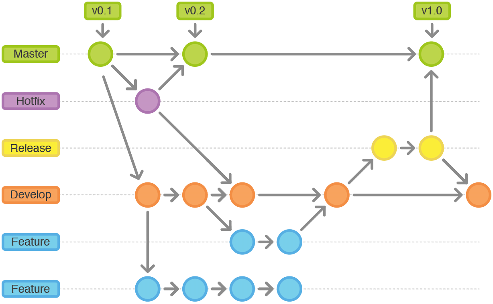

- `Git`说明[Git - Book (git-scm.com)](https://git-scm.com/book/zh/v2)

## Linux常用命令

- ls
  - 查看当前文件夹下的文件
  - list的缩写
- cd
  - 进入某一个文件夹内
  - change directory的缩写
  - Tab键自动补全路径
  - cd ..
    - 回到上一级
  - cd /c
    - 进入c盘
    - 斜杠代表根目录
- clear
  - 清屏
  - 快捷键ctrl+l
- mkdir
  - 新建文件夹
  - mkdir 文件夹名
  - make directory的缩写
- touch
  - 新建文件
  - touch 文件名
- rm
  - 删除文件
  - rm 参数 文件名
    - 参数
      - -i
        - 删除前逐一询问确认
      - -f
        - 强制删除，无视只读属性
      - -r
        - 递归删除，可删除文件夹
      - -rf
        - 强制删除文件夹
  - rm / -rf
    - 删除硬盘虽有内容
  - git rm --cached 文件名
    - 删除暂存区中的文件
  - 直接删除，不会进入回收站
  - remove的缩写
- mv
  - 移动文件
  - mv 文件名 路径
    - 移动文件到路径中
  - mv 文件名 
-  --help / -h
  - 获取帮助
  - git -h
  - ls --help

## Vim/Vi工作模式

- vi 文件名
  - 进入命令模式
- :wq
  - 保存并退出命令模式
- :q!
  - 不保存并退出命令模式
- i/a/o
  - 进入输入模式
- ESC键
  - 退出输入模式
- ctrl + insert
  - 复制
- shift + insert
  - 粘贴


## Git使用

### 起始配置

- 配置用户名和邮箱

  ~~~bash
  git config --global user.name "Your Name"

  git config --global user.email "email@example.com"
  ~~~

- 查看配置信息

  ~~~bash
  git config -l
  ~~~

### 基本操作

- 起始操作

  1. 创建并进入空文件
  2. 运行Git Bash
  3. 仓库初始化
     - git init
  4. 创建一个初始化文件 
     - index.html
  5. 将文件的修改加入到暂存区
     - git add index.html
       - 添加index.html文件的修改到暂存区
     - git add -A
       - 添加所有文件的修改到暂存区
  6. 提交到仓库
     - git commit -m '注释'
     - m为mesaage的缩写

  

### .git目录

- hooks目录
  - 包含客户端或服务端的钩子脚本，在特定操作下自动执行
- info目录
  - 包含一个全局性排除文件，可以配置文件忽略
- log目录
  - 日志信息
  - 使用git log查看内容
- objects目录
  - 本地版本库，存储所有数据内容
- refs目录
  - 指向数据的提交对象的指针（分支）
- COMMIT_EDITMSG文件
  - 最后一次提交时的文字说明
- config文件
  - 项目配置选项
- description文件
  - 仓库的描述信息
- HEAD文件
  - 指示目前被检出的分支
- index文件
  - 暂存区文件，是一个二进制文件
  - 使用git Is-files查看内容

### 版本库的三个区域

- 三个区域
  - 工作区（代码编辑区）
  - 暂存区（修改待提交）
  - 仓库区（代码保存区）
- 使用[git add 文件名]命令，将工作区文件添加到暂存区
  - git add --all / git add -A 将项目里所有的文件变动都添加到暂存区
- 使用[git commit]命令，将暂存区文件提交到仓库区

### 常用命令

- git status
  - 版本状态查看
  - 修改信息颜色
    - 红色代表此修改只存在于工作区
    - 绿色代表次修改存在于工作区和暂存区，未提交到仓库区
- git log
  - 查看日志（提交记录） 
- git add -A
  - 添加所有新文件到暂存区
- git commit -m '注释'
  - 提交修改并注释
- git diff
  - 查看工作区与暂存区的差异（不显示新增文件），显示做了哪些修改
- git diff --cached
  - 查看暂存区与仓库-的差异
- git restore 文件名
  - 复原工作区未暂存的修改
- git restore --staged 文件名
  - 复原暂存区未提交的修改

### 历史版本回滚

##### 回滚

- 查看历史记录
  - git log
    - 如果内容偏多，需要使用方向键上下滚动，按q退出
  - git log --oneline
    - 日志简短信息
- 根据版本号进行回滚
  - git reset --模式 哈希值前七位 
    - 模式
      - hard
        - 工作区，暂存区，仓库都会被重置
      - soft
        - 工作区不变，暂存区与仓库会被重置，差异保留在暂存区
      - mixed
        - 默认
        - 工作区不变，暂存区清空，仓库重置，差异保留在工作区
- 查看所有的操作记录
  - git reflog

### 配置忽略文件

##### 仓库中没有提交的文件

- 常见的情况有

  1. 临时文件
  2. 多媒体文件，如音频，视频等
  3. 编辑器生成的配置文件，如.idea文件夹
  4. npm安装的第三方模块

- 创建一个.gitignore文件以配置忽略，一般与.git目录同级

  ~~~.gitignore
  # 忽略所有的.idea文件夹和文件
  .idea
  # 忽略所有以.test结尾的文件
  *.test
  # 忽略当前目录下的node_modules文件和文件夹
  /node_modules
  ~~~

##### 仓库中已提交的文件

1. 先在暂存区中删除该文件
   - git rm --cached 文件名
2. 在.gitignore中配置忽略
3. add+commit

### 分支

- 分支(Branch)是Git重要的功能特性之一，开发人员可以在主开发线的基础上分离出新的开发线
- 主分支名为master

##### 基本操作

- 创建分支

  ~~~shell
  git branch 分支名
  ~~~

- 查看分支

  ~~~shell
  git branch
  ~~~

- 切换分支

  ~~~shell
  git checkout 分支名
  ~~~

- 合并分支

  ~~~shell
  git merge 被合并的分支名
  ~~~

  - 被合并的分支不会被删除

- 删除分支

  ~~~shell
  git branch -d 分支名
  ~~~

- 创建并切换分支

  ~~~shell
  git checkout -b 分支名
  ~~~

##### 冲突

- 当多个分支修改同一文件后，合并分支的时候会产生冲突
- git status可定位有冲突的文件
- 将冲突内容修改为最终想要的结果，并重新add+commit

## GitHub

- GitHub是一个Git仓库管理网站，可以创建远程中心仓库，为多人合作开发提供便利

### 将本地仓库推送到远程仓库

1. 注册并激活账号

2. 创建仓库

3. 获取仓库的地址

4. 本地配置远程仓库的地址

   ```shell
   git remote add origin https://github.com/xiaohigh/test2.git  
   # 远端仓库管理
   # add  添加
   # origin 远端仓库的别名，用于指代仓库，可自定义，默认为origin
   # https://github.com/xiaohigh/test2.git    仓库地址
   ```

5. 本地提交（确认代码已经提交到本地仓库）

6. 将本地仓库内容推送到远程仓

   ```shell
   git push -u origin master:main
   # push 推送
   # -u   --set-upstream 的简写, 加上以后,后续提交时可以直接使用 git push
   # origin 远端仓库的别名
   # master 本地仓库的分支
   # :main 推送到远端的main分支，可选，如省略，则推送到远端的同名分支
   ```

### 克隆远程仓库到本地

1. 注册并激活账号

2. 克隆仓库

   ```shell
   git clone https://github.com/xiaohigh/test2.git 重命名文件夹名（可选）
   ```

3. 增加和修改代码

4. 本地提交

   ```shell
   git add -A
   git commit -m 'message'
   ```

5. 推送到远程

   ```shell
   git push origin master
   # 克隆回来的仓库别名默认为origin
   ```

> 克隆代码之后， 本地仓库会默认有一个远程地址的配置， 名字为 origin

### 多人合作

##### 账号仓库配置

GitHub 团队协作开发也比较容易管理，可以创建一个组织

- 首页 -> 右上角 `+` 号-> new Organization
- 免费计划
- 填写组织名称和联系方式（不用使用中文名称）
- 邀请其他开发者进入组织（会有邮件邀请）

* 点击组织右侧的 settings 设置
* 左侧 Member privileges
* 右侧 Base permissions 设置 write 👌

##### 协作流程

第一次

* 得到 Git 远程仓库的地址和账号密码

* 将代码克隆到本地（地址换成自己的）

  ```shell
  git clone https://github.com/xiaohigh/test.git
  ```

* 切换分支

  ```
  git checkout -b xiaohigh
  ```

* 开发代码

* 本地提交

  ```shell
  git add -A
  git commit -m '注释内容'
  ```

* 合并分支

  ```shell
  git checkout master
  git merge xiaohigh
  ```

* 更新本地代码

  ```shell
  git pull
  # 完整写法为 git pull 别名 分支名
  ```

* 提交代码

  ```shell
  git push 
  ```

##### 工作流程

第二次流程

1. 更新代码

   ```shell
   git checkout master
   git pull
   ```

2. 切换并合并分支

   ```shell
   git checkout xiaohigh
   git merge master
   ```

3. 开发功能

4. 提交

   ```shell
   git add -A
   git commit -m '注释'
   ```

5. 合并分支

   ```shell
   git checkout master
   git merge xiaohigh
   ```

6. 更新代码

   ```shell
   git pull
   ```

7. 推送代码

   ```shell
   git push
   ```

##### clone与pull

- clone会拉取远端仓库的所有分支
- pull只会拉取指定的分支内容

### GitFlow

- GitFlow 是团队开发的一种最佳实践，将代码划分为以下几个分支



- Master 主分支。上面只保存正式发布的版本
- Hotfix  线上代码 Bug 修复分支。开发完后需要合并回Master和Develop分支，同时在Master上打一个tag
- feature 功能分支。当开发某个功能时，创建一个单独的分支，开发完毕后再合并到 dev 分支
- Release 分支。待发布分支，Release分支基于Develop分支创建，在这个Release分支上测试，修改Bug
- Develop 开发分支。开发者都在这个分支上提交代码

