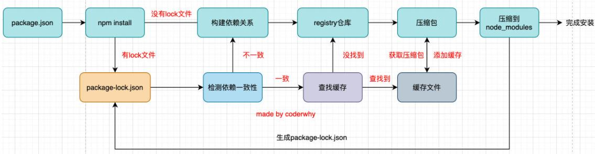

## package.json

- `private`

  - 当前项目是否私有，使用布尔值表示
  - 防止误操作执行 `npm publish`

- `main`

  - 配置入口文件

- `script`

  - 配置一些脚本命令，已键值对的形式存在
  - 配置好后可以通过 `npm run [key]` 或 `yarn key` 执行

- 依赖类的属性

  - `dependencies`

    - 开发环境和生产环境都需要依赖的包

  - `devDependencies`

    - 仅在开发环境需要依赖的包

  - `peerDependencies`

    - 同级依赖

    - 例，如果一个 `helloWorld` 工程，在 `dependencies` 中声明了 `packageA`，以及有两个基于 `packageA` 的插件 `pluginA` 和 `pluginB`

      - 如果在插件中 使用 `dependencie` 来声明 `packageA`，则安装完后的依赖图会是：

        ~~~
        ├── helloWorld
        │   └── node_modules
        │       ├── packageA
        │       ├── plugin1
        │       │   └── nodule_modules
        │       │       └── packageA
        │       └── plugin2
        │       │   └── nodule_modules
        │       │       └── packageA
        ~~~

      - 如果在插件中，使用 `peerDependencies` 来声明 `packageA`，则安装完后的依赖图会是：

        ~~~
        ├── helloWorld
        │   └── node_modules
        │       ├── packageA
        │       ├── plugin1
        │       └── plugin2
        ~~~

    - 在 `npm3 - npm6`  中安装依赖时会忽略 `peerDependencies`

    - 在 `npm 7` 中安装依赖时，该依赖的 `peerDependencies` 声明：

      - 如果已经被用户显式依赖，则 `peerDependencies` 声明会被忽略
      - 如果没有被用户显式依赖，则  `peerDependencies` 声明的依赖将被安装到用户项目的根目录中

    - `npm7` 之后，如果用户显示依赖的包版本和子项目的同级依赖不兼容，则会阻断安装流程，需修改依赖声明，如果要忽略版本问题，则可以在安装指令后加上 `–legacy-peer-deps` 指定为 `npm3 - npm6` 中的安装方式

- `engines`

  - 用于指定 `Node` 和 `npm` 的版本号

  - 安装过程中会检查对应的版本，不符合就会报错

    ~~~json
    "engines": {
      "node": ">=8.10.3 <12.13.0",
      "npm": ">=6.9.0"
    }
    ~~~

  - 也可以指定所在的操作系统，但很少用到

    ~~~json
    "engines": {
      "os": ["darwin", "linux"]
    }
    ~~~

- `browserslist`

  - 配置打包后的 `JavaScript` 浏览器的兼容情况，否则需要手动添加 `polyfills` 让其支持语法
  - 该属性是为 `webpack` 等打包工具服务的

## 依赖的版本管理

- `npm` 的包通常需要遵从 `semver` 版本规范：[语义化版本 2.0.0 | Semantic Versioning (semver.org)](https://semver.org/lang/zh-CN/)

- `X.Y.Z`
  - X：主版本号（`major`）
    - 当做了向下不兼容的`API`修改时更新
  - Y：次版本号（`minor`）
    - 当增加了向下兼容的功能性时更新
  - Z：修订号（`patch`）
    - 当做了向下兼容的问题修正时更新
- 指定版本号
  - `x.y.z` 表示一个明确的版本号
  - `^x.y.z` 表示主版本为`x`的最新版本
  - `~x.y.z` 表示次版本为`y`的最新版本

## 缓存策略

- 当执行 `npm install`/`yarn` 命令时，会检测是否存在 `package-lock.json`/`yarn.lock` 文件

  - 没有 `lock` 文件

    1. 分析整理依赖关系
    2. 从 `registry` 仓库或镜像服务器下载压缩包
    3. 获取压缩包后对压缩包进行缓存（`npm 5` 版本之后）
    4. 将压缩包解压到项目的 `node_modules` 文件夹中

  - 有 `lock` 文件

    - 检测 `lock` 文件中包的版本是否和 `package.json` 中一致

      - 如不一致，则会重新构建依赖关系，直接走顶层流程

      - 如一致，则会优先查找缓存
        - 如缓存中没有，则从上面的第2步开始执行
        - 如查找到，则从上面的第4步开始执行

- 

## npx

- `npx` 是 `npm 5.2` 之后自带的一个命令

- `npx` 是 `npm package executor` 的缩写

- `npx` 有很多作用，但常见的是用它来调用项目中的某个模块的指令

- 场景：
  - 全局安装了 `yarn 1.22.19`
  
  - 项目中安装了 `yarn 0.25.1`
  
  - 此时如果在终端执行 `yarn --version` 命令，则显示结果是 `yarn 1.22.19`
  
  - 如果需要使用项目中安装的 `yarn 0.25.1`，则可以：
  
    - 方式一：
  
      - 在终端中执行`npx yarn --version` 命令
        - `npx` 命令会到当前目录的 `node_modules/bins` 目录下查找对应的命令
  
    - 方式二：
  
      - 在 `package.json` 中定义
  
        ~~~json
        {
            "scripts": {
                "yarn": "yarn --version"    
            }
        }
        ~~~
  
        - `scripts` 中定义的脚本执行时，会从当前项目中找
  
    - 方式三：
  
      - 在终端中的项目根目录下执行
        - `./node_modules/.bin/yarn --version`
  
  - 部分包（如 `webpack` ）做了特殊处理，当在终端执行 `webpack` 指令时，会先寻找当前目录下是否存在`./node_modules/.bin/webpack`，如不存在，则执行全局安装的 `webpack`