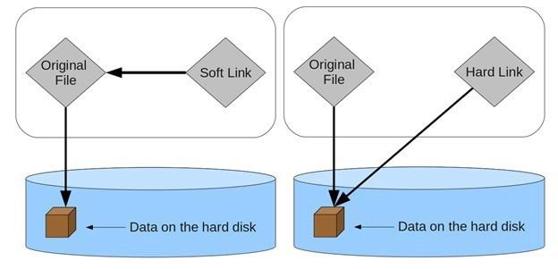
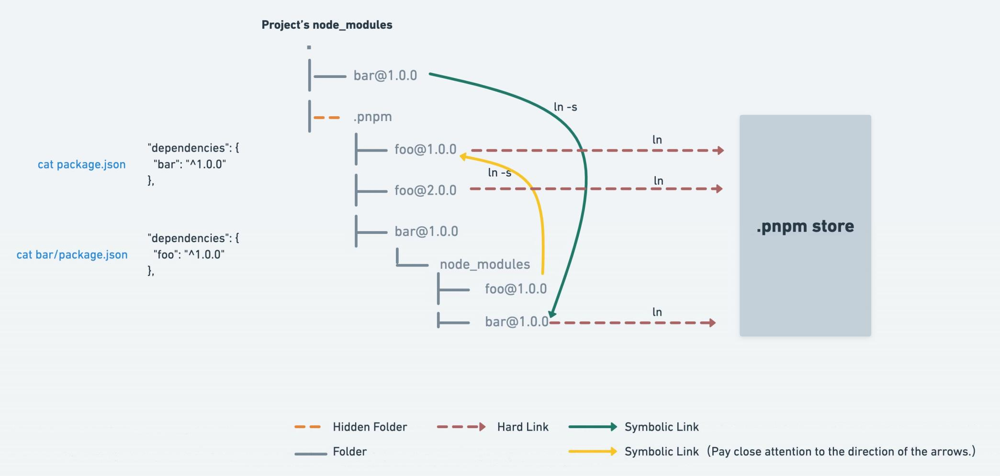

# pnpm

- `pnpm` ，可以理解成是 `performant npm` 的缩写
- [Fast, disk space efficient package manager | pnpm](https://pnpm.io/zh/)

## 操作系统中的硬链接与软链接概念

- 硬链接（`hard link`）
  - 是电脑文件系统中多个文件平等地共享同一个文件存储单元
  - 删除一个文件名字后，还可以用其它名字继续访问该文件
- 符号链接（`symbolic link`）/软链接（`soft link`）
  - 是一类特殊的文件，包含有一条以绝对路径或相对路径形式指向其它文件或者目录的引用

- 使用命令行创建文件的硬链接与软连接

  - 硬链接

    - windows

      ~~~shell
      mklink /H foo_hard.js foo.js
      ~~~

    - macos

      ~~~shell
      ln foo.js foo_hard.js
      ~~~

  - 软链接

    - windows

      ~~~shell
      mklink foo_soft.js foo.js
      ~~~

    - macos

      ~~~shell
      ln -s foo.js foo_soft.js
      ~~~

## pnpm 依赖原理

- `pnpm` 中的所有依赖包会被存放在一个统一的位置(`store`)

  - 当项目中安装依赖时，其包含的文件都会硬链接到 `store`，多次用到的文件不会占用额外的硬盘空间
  - 如果不同项目需要安装同一个依赖包的不同版本，不同版本间相同的文件也会以硬链接的方式共享同一个文件存储单元

- `pnpm` 的非扁平目录

  

## 一些命令

- `pnpm store path`
  - 获取当前的 `store` 目录
- `pnpm store prune`
  - 删除 `store` 中当前未被引用的包