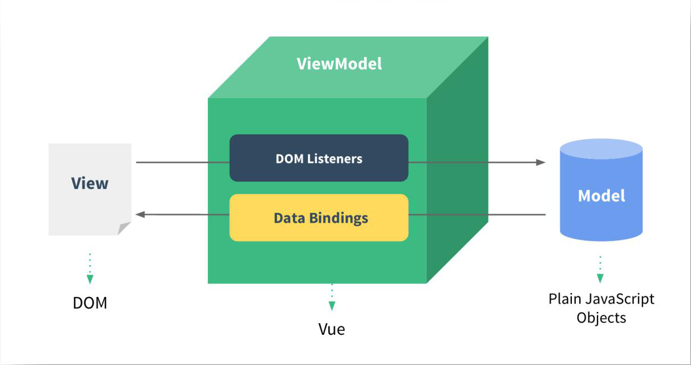
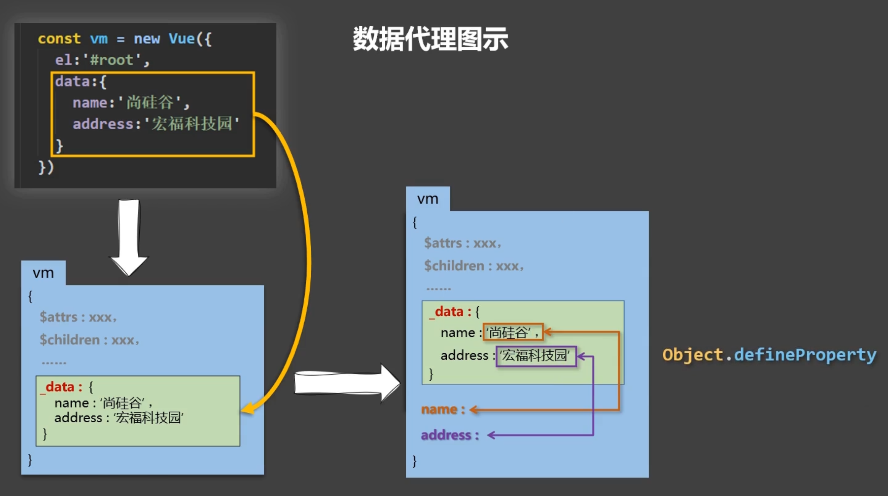
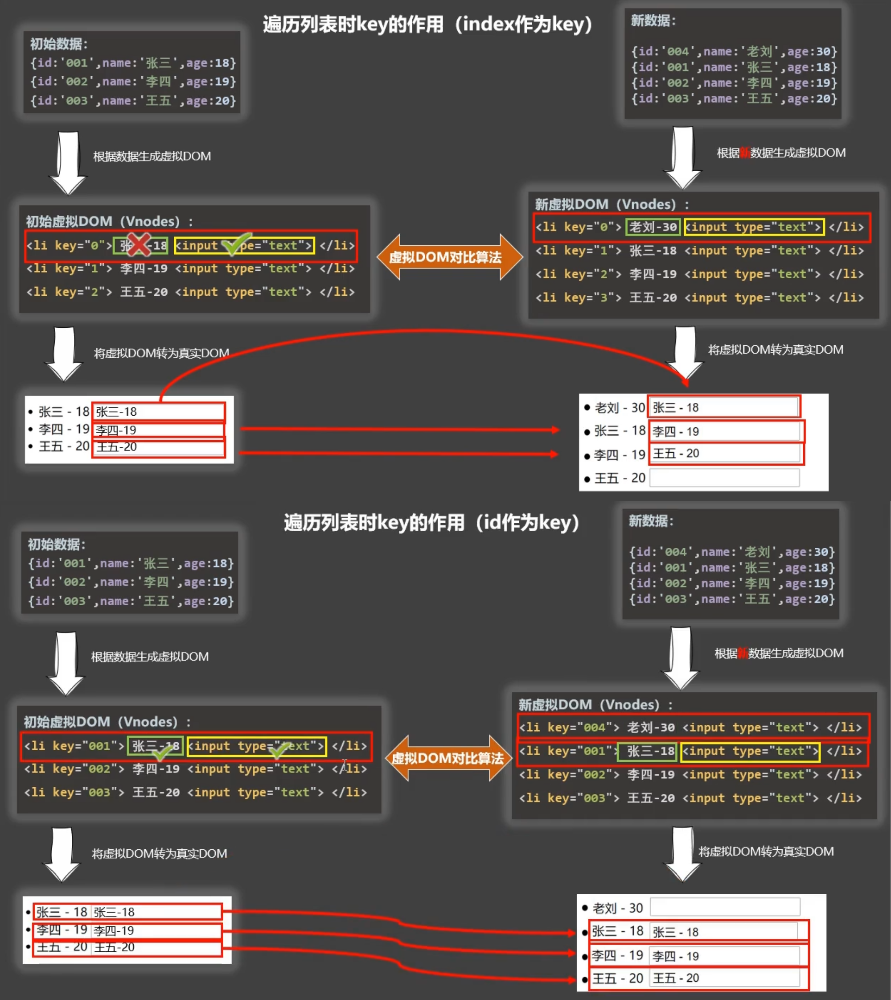
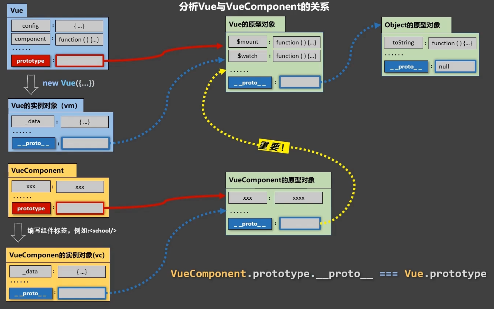

# Vue2

## Vue基础

### 官方文档

[介绍 — Vue.js (vuejs.org)](https://v2.cn.vuejs.org/v2/guide/)

### 简介

- Vue是一套用于`构建用户界面`的`渐进式JavaScript框架`
  - 全程`Vue.js`或`Vuejs`
  - 基于HTML、CSS和JavaScript构建，并提供了一套声明式的、组件化的编程模型
  - 帮助开发者高效开发用户界面
- 渐进式框架
  - 即可以在项目中一点点来引入和使用Vue，不一定需要全部使用Vue来开发整个项目

### Vue开发者工具

安装chrome插件 [Vue Devtools](https://github.com/vuejs/vue-devtools#vue-devtools)

### 全局配置

- 通过Vue.config修改全局配置

  - 关闭生产环境提 示

    ~~~javascript
    Vue.config.productionTip = false
    ~~~

### Vue实例

#### 简介

- 想让Vue工作，必须创建一个Vue实例，且要传入一个配置对象，包含el对象、data对象等
- 容器里的代码依然符合html规范，只是混入了一些特殊的Vue语法
- 容器和Vue实例只能一对一接管
- root容器里的代码被称为【Vue模板】

#### el对象与data对象的不同指定方式

~~~javascript
// 创建一个Vue实例
new Vue({
    el:'#root', // element的简称，用于指定当前Vue实例为哪个容器服务，值通常为css选择器字符串，也可以使用DOM对象
    data: { // 此处data使用的是对象式写法
        name:'小明'
    }, // data中存储数据，供el所指定的容器使用
})
~~~

~~~javascript
const vm = new Vue({
    data(){ // data的函数式写法，函数中的this是Vue实例对象，如果是箭头函数，则this是undefined
        return{
            name:'小明'
        }
    } // 使用Vue组件时，data必须使用函数式，且不要写箭头函数
})

vm.$mount('#root') // 指定要挂载的容器
~~~

### 模板语法

#### 插值语法

- 功能：用于解析标签体内容

- 写法：{{xxx}}，xxx是JS表达式，并且可以直接读取到data中的所有属性

#### 指令语法

- 功能：用于解析标签，操作DOM元素，包括操作标签属性、标签体内容、绑定事件等
- 用法：作为属性在标签中使用
- 举例：v-bind:href="xxx" 或简写为 :href="xxx" ，xxx同样要写JS表达式，并且可以直接读取到Vue实例及其原型中的所有属性
- 备注：Vue中的指令的完整写法形式都是 v-xxx

### 数据绑定

#### 单向绑定

- v-bind指令：数据只能从data流向页面

~~~javascript
<input type="text" :value="name">
~~~

#### 双向绑定

- v-model指令：数据不止能从data流向页面，还可以从页面流向data
  - 双向绑定只能用于输入元素，一般应用在表单类元素上
  - 当表单类型为text时，v-model收集value值

~~~javascript
<input type="text" v-model="name">
~~~

##### 收集表单数据

- 当input的type为text时

  - v-model收集的是value值，用户输入的是value值

- 当input的type为radio时

  - ​    v-model收集的是value值，且要给标签配置value值
  - 当多个radio用v-model绑定了同一个属性时，它们是一组radio，同时只有一个能被选中

  ~~~html
  1<input type="radio" v-model="radio" value="1"> 
  2<input type="radio" v-model="radio" value="2"> 
  3<input type="radio" v-model="radio" value="3"> 
  ~~~

- 当input的type为checkbox时

  - 如果标签没有配置value属性，那么v-model收集的就是checked属性的布尔值
  - 如果标签配置了value属性
    - 当v-model绑定的属性初始值是非数组时，v-model收集的是checked的布尔值
    - 当一系列checkbox用v-model绑定了同一个初始值是数组的属性时，v-model收集的是被选中的checkbox的value组成的数组

- v-model的三个修饰符：number、lazy、trim

### Vue与MVVM模型

- Vue的设计受到了MVVM模型的启发，因此Vue实例经常会被用vm(ViewModel)这个变量名来表示

- MVVM模型的组成

  - M：模型(Model)

    data中的数据

  - V：视图(View)

    模板代码

  - VM：视图模型(ViewModel)

    Vue实例

  

- data中所有的属性，都会出现在vm身上

- vm身上及Vue原型上的所有属性，都可以在Vue模板中直接使用

### 数据代理

- 数据代理就是通过一个对象代理对另一个对象中属性的操作

- 数据代理实现方式

  ~~~javascript
  // 简单的数据代理实现方式
  let obj = {x:100}
  let obj2 = {y:200}
  
  Object.defineProperty(obj2, 'x', {
      get(){
          return obj.x
      }, // 调用obj2.x值，得到的时obj.x的值
      set(value){
          obj.x = value
      } // 给obj2.x赋值时，修改的是obj.x的值
  }) 
  ~~~

- Vue中的数据代理

  - 通过vm对象来代理data对象中属性的操作
  - 可以更加方便地操作data中的数据
  - 基本原理
    - 通过Object.defineProperty()把data对象中所有属性添加到vm上
    - 为每一个添加到vm上的属性，都指定一个getter和一个setter
    - 在getter/setter内部去操作data中对应的属性

  

### Vue管理的函数

- 配置对象的method对象中可配置被Vue管理的函数
- 非箭头函数定义的方法中的this指向vm或组件实例对象
- method中的方法可以被事件绑定，也可以被插值语法调用
  - 如果被插值语法调用，要获取其返回值，需要在插值语法中加上小括号执行
- method对象中没有数据代理，Vue方法也可以写在data对象中，但会造成多余的数据代理

### 事件处理 

#### 事件的基本使用

- 使用 v-on:xxx 或 @xxx 绑定事件，xxx是事件名

- 事件的回调需要配置在methods对象中，最终会在vm上

- methods中配置的函数，都是被Vue所管理的函数，this指向vm或组件实例对象，如果为箭头函数，则会指向undefined（Vue默认开启严格模式，所以指向的不是window）

- 事件函数传递参数

  - @click = "test" 等同于 @click = "test($event)" 

    不另外传递参数的写法，默认接收一个参数，就是事件对象

  - @click = "test($event, '传参')"

    另外传递参数的写法，如果需要接收事件对象，则必须在形参中使用 $event 进行占位，传参的顺序没有要求
  
- 一个事件绑定多个函数

  - 多个函数名之间使用分号分隔，函数名后需加上小括号

    `@click = "test1(); test2()"`

#### 事件修饰符

- 绑定事件时，可以添加修饰符，如 @click.prevent = "test" ，表示阻止事件的默认行为
- 不同修饰符支持连写以同时使用

##### 事件修饰符

- prevent

  阻止事件的默认行为，等同于event.preventDefault()，常用

- stop

  停止事件冒泡（传播），等同于event.stopPropagation()，常用

- once

  事件绑定的回调函数只会在该事件第一次被触发时执行，常用

- capture

  使用事件捕获模式（默认为冒泡）

- self

  只有当触发事件的元素是当前标签元素时，才会触发事件，也能达到阻止事件冒泡的效果

- passive

  事件的默认行为立即执行，无需等待事件回调执行完毕

  常用于移动端项目

##### 按键修饰符

- 绑定键盘事件时，使用按键修饰符，可以指定特定按键才可以触发事件

- 案件修饰符可以用按键名(key)，或按键编码(keyCode)，或Vue提供的按键别名

- 如果使用按键名做修饰符，当按键名有两个以上单词时，需转换命名规则

  - 如：CapsLock => caps-lock

- Vue中常用的按键别名

  - enter：回车键
  - delete：删除键和退格键
  - esc：退出键
  - space：空格键
  - tab：跳格键
  - up/down/left/right：上下左右

- 注意点

  - tab键

    - tab键会切换当前元素的焦点，如果绑定的是keyup事件，则事件触发前元素就失去了焦点，导致事件无法触发，因此需绑定keydown事件

  - 系统修饰键：ctrl、alt、shift、meta(即win键)

    - 绑定keyup时
      - 单独按下一个修饰键不会触发事件
      - 需要另一个键和修饰键同时处于被按下的状态，且另一个键先被释放时，事件触发
      - 如果组合键导致元素失去了焦点，则事件也不会被触发
    - 绑定keydown时
      - 事件正常触发

  - 任何让当前元素失去焦点的行为都会使得键盘事件不被触发

  - 键盘修饰符连写

    - 当系统修饰键以外的按键同时使用时，代表这些按键任一一个都可以触发事件

      - @keydown.z.x 当按下z或x时，都可以触发事件

    - 当系统修饰键和其它按键同时使用时，代表它们需同时按下才能触发事件

      - @keydown.ctrl.z 当按下ctrl后，再按下z时，触发事件
      - @keyup.ctrl.z 当同时按下ctrl和z，且z先释放时，触发事件
      - @keydown.ctrl.alt 当同时按下crtl和alt时，触发事件
      - @keyup.ctrl.alt 当同时按下crtl和alt以及另一个按键，且另一个按键先被释放时，触发事件

  - keyCode特性已从Web标准中删除，因此尽量不使用keyCode作为按键修饰符（Vue3已不支持keyCode）

- 自定义按键别名

  - 例：Vue.config.keyCodes.huiche = 13 // 自定义按键别名huiche
  - 必须指定keyCode，因此也不推荐使用

### 计算属性与监视属性

#### 计算属性(computed)

- 在computed对象中定义计算属性

- 计算属性最终会被挂载到vm身上，其属性值本身不存在，其底层调用了Object.defineproperty方法提供的getter和setter，计算得到一个值

- getter执行的情况

  1. 初次读取计算属性时会执行一次
  2. 当依赖的数据发生改变时会再次调用

- 通过在插值语法中调用method中的方法也可以实现计算属性的功能，与之相比，computed的优势在于它的缓存机制，即method每次使用都会调用函数，computed只有当依赖数据发生改变时才会再次调用getter，效率更高

- 如果计算属性要被修改，则必须在计算属性中定义setter去响应修改

- computed属性配置示例

  ~~~javascript
  const vm = new Vue({
      data: {
          firstName: 'Graves',
          lastName: 'Zhang'
      },
      computed: {
          fullName:{
              get() {
                  return this.fitstName + '-' + this.lastName
              },
              set(value) {
                  const arr = value.split('-')
                  this.firstName = arr[0]
                  this.lastName = arr[1]
              }
          }
      }
  })
  ~~~

  ~~~javascript
  // 当不需要定义setter时，computed可以使用简写写法
  const vm = new Vue({
      data: {
          firstName: 'Graves',
          lastName: 'Zhang'
      },
      computed: {
          fullName() {
              return this.fitstName + '-' + this.lastName 
          } // 相当于定义了fullName计算属性的getter
      }
  })
  ~~~

#### 监视属性(watch)

- 当监视属性变化时，回调函数自动调用，进行相关操作

- 当配置 immediate: true 时，会在初始化时立即调用一次handler

- Vue中的watch默认不检测对象内内部值的改变，当配置 deep: true 时，可以检测对象内部值的改变

- 当watch只需要配置handler时，可以使用精简写法

- 监视属性的几种方式示例

  ~~~javascript
  // 在配置对象中传入watch配置，完整写法
  const vm = new Vue({
      data: {
          num1: 1,
          num2: 2,
          a: {
              b: 3
          }
      },
      computed: {
          sum() {
              return this.num1 + this.num2
          }
      },
      watch: {
          sum: {
              immediate: true, // 初始化时立即调用一次handler，默认为false
              handler(newValue, oldValue) {
                  console.log('sum被修改了', newValue, oldValue)
              }
          },
          'a.b': {
              handler(newValue, oldValue) {
                  console.log('a.b被修改了', newValue, oldValue)
              }
          },
          a: {
              deep: true, // 检测a指向的对象的内部值的改变，且检测的对象不会随着a的重新重新赋值而被改变
              handler(newValue, oldValue) { // 此时的参数是a的值指向的对象
                  console.log('a对象中有内容被修改了', newValue, oldValue)
              }
          },
          a: { // 检测a指向的对象是否被改变
              handler(newValue, oldValue) { // 此时的参数是a的值指向的对象
                  console.log('a的指向改变了', newValue, oldValue)
              }
          }
      }
  })
  ~~~

  ~~~javascript
  // 在配置对象中传入watch配置，精简写法
  const vm = new Vue({
      data: {
          num: 1,
      },
      watch: {
          num(newValue, oldValue) {
              console.log('num被修改了', newValue, oldValue)
          }
      }
  })
  ~~~

  ~~~javascript
  // 使用$watch配置监视
  const vm = new Vue({
      data: {
          num: 1,
      }
  })
  
  vm.$watch('num',function(newValue, oldValue){
      console.log('num被修改了', newValue, oldValue)
  }, {immediate: true})
  ~~~

- computed能完成的功能，watch都可以完成
- watch可以完成的功能，有一些computed无法完成，比如进行异步操作（因为computed需要return返回值，无法在异步操作中实现）

### class绑定与style绑定

- 作用
  - class绑定与sutyle绑定可以用来实现动态样式效果
- class绑定
  - 字符串写法，适用于绑定单个类，类名不确定，需要动态指定
    - :class="<u>classString</u>"
    - <u>classString</u>中存放字符串，通过修改<u>classString</u>的值来切换类名
  - 数组写法
    1. 适用于要绑定的类的个数和类名都不确定
       - :class="<u>classArr</u>"
       - classArr: ['class1', 'class2', 'class3']
       - 通过修改<u>classArr</u>中元素的值来切换类名
    2. 适用于要绑定的类的个数确定、类名不确定
       - :class="[<u>classString1</u>, <u>classString2</u>, <u>classString3</u>]"
       - 通过修改<u>classString1</u>、<u>classString2</u>、<u>classString3</u>的值来切换类名
  - 对象写法，适用于有预定的一些class类名，从中动态决定要不要使用
    - :class="<u>classObj</u>"
    - classObj: {class1:true, class2:false, class3: true}
    - <u>classObj</u>中的属性名对应类名，通过修改其布尔值，来决定该类名要不要使用

- style绑定
  - 单个对象写法
    - :style="<u>styleObj</u>"
    - styleObj: {fontSize: '20px', backgroundColor: 'red' }
  - 多个对象写法
    - :style="<u>styleArr</u>"
    - styleArr: [<u>styleObj1</u>, <u>styleObj2</u>]
  - 维护到data中
    - :style="{fontSize: <u>activeFontSize</u> + 'px' , backgroundColor: <u>activeColor</u>}"
    - activeFontSize和actoveColor是data属性
  - 通过修改<u>styleObj</u>来修改样式
  - 注意多个单词组成的样式名需要用小驼峰命名法改写

### 条件渲染

- v-if/v-else-if/v-else
  - 使用逻辑与原生JS中的if判断语句相同
  - 当条件为false时，该标签的所有子节点都不会被解析
  - v-if/v-else-if/v-else作为一组标签配合使用时，不能被其它标签中断
  - 将v-if指令用在template标签上，可控制template中的子节点是否会被解析，且template标签在解析时不会存在于页面结构上，其子节点独立存在

- v-show
  - 控制元素dom节点是否显示
  - 如果条件为false，相当于给该便签加上 diaplay: none 的样式属性
  - v-show指令无法用在template标签上，因为template标签在解析时不会存在于页面结构上，无法为其设置样式

### 列表渲染

#### v-for指令

- 用于遍历展示列表数据

- 语法：v-for="(item, index) in xxx" :key="yyy"

  - xxx为要遍历的数据，可以是数组、对象、字符串（很少用）、指定次数（遍历一个正整数，从1开始，很少用）
  - 需指定一个唯一的key
  - 与原生JS的for-in循环和for-of循环不同，且此处用in和for都可以

- key的原理

  - 虚拟DOM中key的作用
    - key是虚拟DOM对象的表示，当状态中的数据发生变化时，Vue会根据【新数据】生成【新的虚拟DOM】，随后Vue进行【新虚拟DOM】与【旧虚拟DOM】的差异比较
    - 对比规则：
      1. 如果旧虚拟DOM中找到了与新虚拟DOM相同的key
         - 若虚拟DOM中内容没变，则直接使用之前的真实DOM
         - 若虚拟DOM中内容变了，则生成新的真实DOM，替换掉页面中之前的真实DOM
      2. 如果旧虚拟DOM中未找到与新虚拟DOM相同的key
         - 创建新的虚拟DOM，随后渲染到页面

  

#### 列表过滤+列表排序案例

~~~html

    <h1>人员列表</h1>
    <input v-model="keyword" type="text" placeholder="请输入筛选关键字">&nbsp;
    <button @click="sortType=1">年龄升序</button>&nbsp;
    <button @click="sortType=-1">年龄降序</button>&nbsp;
    <button @click="sortType=0">原顺序</button> 
    <ul>
        <li v-for="item in filteredPerson" :key="item.id">{{item.name}}-{{item.age}}-{{item.gender}}</li>
    </ul>

~~~

### 数据监视

#### 模拟简易的数据监视功能

- 检测一个对象的第一层可枚举属性

~~~javascript
// 需求：当data中的第一层属性发生改变时，控制台提示
let data = {
    a: 1,
    b: { c: [1,2] }
}

// 定义一个Observer类
class Observer {
    constructor(obj) {
        const keys = Object.keys(obj)
        keys.forEach((key) => {
            Object.defineProperty(this, key, {
                get() {
                    return obj[key]
                },
                set(val) {
                    if (obj[key] === val) return
                    console.log(`${key}被修改了`)
                    obj[key] = val
                }
            })
        })
    }
} 

// 实例化一个检测者obsData，用来检测data中的属性，检测者obsData实现了对data的数据代理
const obsData = new Observer(data)
~~~

- 检测一个对象的所有可枚举属性

~~~javascript
// 需求：当data中的第一层属性发生改变时，控制台提示
let data = {
    a: 1,
    b: [1, 2, { a: 1 }, 3, 123],
    c: { a: { b: 1 } }
}

class Observer {
    constructor(obj) {

        // 如果obj是一个数组
        if (obj instanceof Array) {
            obj.forEach((item, index) => {
                // 如果item是复杂数据类型
                if (item instanceof Object) {
                    // 递归处理
                    this[index] = new Observer(item)
                }
                // 设置obj的数据代理
                {
                    Object.defineProperty(this, index, {
                        get() {
                            return item
                        },
                        set(val) {
                            if (item === val) return
                            console.log('有属性被修改了')
                            obj[index] = val
                        }
                    })
                }
            })
        }

        // 如果obj是一个一般对象
        else if (obj instanceof Object) {
            const keys = Object.keys(obj)
            keys.forEach((key) => {
                // 如果obj中key对应的值为复杂数据类型
                if (obj[key] instanceof Object) {
                    // 递归思想，将检测obj中key属性的检测者实例赋值给obj[key]
                    this[key] = new Observer(obj[key])
                }
                // 设置obj的数据代理
                {
                    Object.defineProperty(this, key, {
                        get() {
                            return obj[key]
                        },
                        set(val) {
                            if (obj[key] === val) return
                            console.log('有属性被修改了')
                            obj[key] = val
                        }
                    })
                }
            })
        }

        // 如果obj是简单数据类型
        else {
            throw '请传入对象或数组'
        }

    }
}

// 实例化一个检测者obsData，用来检测data中的属性，检测者obsData实现了对data的数据代理
const obsData = new Observer(data)
~~~

#### Vue的数据监视

- Vue会监视Vue实例的根数据对象(_data)中所有层次的数据
- 检测对象中的数据
  - 通过setter实现监视，setter调用时会重新解析模板，实现页面更新
  - 如果要追加监视的属性，需使用Vue.set/vm.$set方法，如果直接赋值追加的属性默认不会做响应式处理
- 检测数组中的数据
  - Vue将被监视的数组的变更方法，在原生JS方法基础上进行了包裹，这些包裹过的方法有
    - push()
    - pop()
    - shift()
    - unshift()
    - splice()
    - sort()
    - reverse()
  - 被Vue管理的数组在调用这些方法时，会做两件事
    1. 调用对应的原生JS方法对数组进行更新
    2. 重新解析模板，实现页面更新
  - 更新数组的方式
    - 如果直接给数组中的元素赋值，则不会触发模板的重新解析
    - 如果修改数组中元素对象的属性，则会调用到setter，触发模板的重新解析
    - 如果调用数组变更方法，则会触发模板的重新解析
    - 如果使用Vue.set/vm.$set方法，则会触发模板的重新解析

### 向Vue实例中的对象追加属性

#### Vue.set()

- Vue.set(target, key, val)

  - target

    - 追加的目标

    - 如要追加data中a对象里的属性，则写成 vm.a 或 vm._data.a
    - target不可以是 vm（Vue实例） 或 vm._data（Vue实例的根数据对象）

  - key、val

    - 追加的属性的键和值
    - 如果target是一个数组，则key是数组的索引，可用于数组的更新

#### vm.$set()

- vm.$set(target, key, val)
  - 功能和用法与Vue.set()相同

### 过滤器

- 过滤器可以对要显示的数据进行特定格式化后再显示，适用于一些简单逻辑的处理
- 注册过滤器
  - 局部过滤器配置
    - 在new Vue时的配置项中的filters对象中配置过滤器函数
  - 全局过滤器配置
    - Vue.filter(name, callback)
    - 要在创建Vue实例之前配置
- 使用过滤器
  - 在插值语法中使用
    - {{ JS表达式 | 过滤器名 }}
      - 使用一个过滤器
    - {{ JS表达式 | 过滤器名1 | 过滤器名2 }}
      - 使用多个过滤器时，会按顺序，依次将前一个过滤器格式化后的数据传给下一个过滤器
  - 在v-bind指令语法中使用
    - :属性=" JS表达式 | 过滤器名 "
- 过滤器参数
  - {{ JS表达式 | 过滤器名 }}
    - 此时JS表达式会作为过滤器函数的实参，过滤器函数返回的数据会作为这个插值语法的解析结果
  - {{ JS表达式 | 过滤器名(参数1, ..., 参数n) }}
    - 此时JS表达式会作为过滤器函数的第一个实参，括号中传入的参数跟在其后

### 指令

#### 参数

- 一些指令能够接收参数，形式为`v-指令名:参数`

- 如在`v-bind:标签属性="xxx"`中，标签属性就是参数，告知v-bind指令将标签属性与`"xxx"`表达式的值绑定

  在`v-on:事件名="回调函数"`中，事件名就是参数

- 动态参数

  - 从 2.6.0 开始，可以用方括号括起来的JS表达式作为一个指令的参数

  - ~~~html
    <a v-bind:[attributeName]="url"> ... </a>
    ~~~

    - 这里的`attributeName`会被作为一个在data中维护的JS表达式进行动态求值，求得的值将会作为最终的参数来使用

#### 修饰符(modifier)

- v-on的修饰符详见事件修饰符

- v-model的修饰符
  - 用法：v-model.modifier
  - 修饰符
    - number
      - 将输入的value值转换为number类型
    - lazy
      - 失去焦点时再收集value值
    - trim
      - 去除value值中前后的空格

#### 常用内置指令

- v-bind:xxx

  - 单向绑定解析表达式，可简写为 :xxx

- v-model:xxx

  - 双向数据绑定，可简写为 v-model ，常用于表单类标签，可根据不同情况自行绑定不同的标签属性

- v-for

  - 用于遍历数组/对象/字符串/指定次数

- v-on

  - 绑定事件监听，可简写为 @

- v-if/v-else-if/v-else

  - 条件渲染，可动态控制节点是否存在

- v-show

  - 条件渲染，可动态控制节点是否展示

- v-text

  - 向其所在的节点中渲染文本内容，会覆盖节点中原本的内容

- v-html

  - 向其所在节点中渲染包含html结构的内容，会覆盖节点中原本的内容

  - 安全问题

    - 在网站上动态渲染任意HTML内容是非常危险的，容易导致XSS攻击(Cross Site Scripting，跨站脚本攻击)
    - 攻击者可以在渲染的HTML标签中使用js代码，获取cookies等敏感内容

    - 如果使用v-html，一定要确保渲染的是可信内容，不要使用在用户提交的内容上

- v-cloak

  - 没有属性值
  - 功能：作为一个特殊标签属性，在Vue实例创建完毕并接管容器后，会自行将v-cloak属性删除
  - 使用场景：当网速慢等原因导致Vue.js未被加载时，页面上含有未被解析的插值语法的元素直接被渲染展示，可使用v-cloak暂时隐藏这些元素
  - 使用方法：
    - 在含有插值语法的元素中设置v-cloak属性
    - 在css中配置 [v-cloak]{ display: none }

- v-once

  - 没有属性值
  - 设置了v-once的节点在初次动态渲染后，就视为静态内容了，之后数据的变化不会引起该节点的更新

- v-pre

  - 没有属性值
  - 设置了v-pre的节点会在渲染时跳过Vue的编译过程
  - 对于没有使用其它指令语法，没有使用插值语法的节点，可利用v-pre加快编译效率

#### 自定义指令

- 定义语法

  - 局部指令:在配置对象的directives对象中配置
    - 完整对象写法
      - 指令名: 配置对象
    - 函数简写
      - 指令名: 指令函数
  - 全局指令
    - 完整对象写法
      - Vue.directive(指令名, 配置对象)
    - 函数简写
      - Vue.directive(指令名, 指令函数)

- 自定义指令的完整配置对象

  ~~~javascript
  // 常用的钩子函数及参数示例
  {
      bind(el, binding) {
          // 函数体
      },
      inserted(el, binding) {
          // 函数体
      },
      updata(el, binding) {
          // 函数体
      }
  }
  ~~~

  - 提供一些可选的钩子函数

    - bind

      当指令第一次绑定到元素时调用，进行一次性的初始化设置

    - inserted

      当被绑定的元素插入到父节点时调用（仅保证父节点存在，但不一定已被插入到文档中）

    - update

      指令所在组件的VNode(虚拟DOM)更新时调用，可能发生在其子VNode更新之前

    - componentUpdated

      指令所在组件的VNode及其子VNode全部更新后调用

    - unbind

      指令与元素解绑时调用

  - 钩子函数的参数

    - el

      - 指令所绑定的元素的真实DOM

    - binding

      与绑定相关的对象，包含以下属性

      - name
        - 指令名，不包含`v-`前缀
      - value
        - 指令的绑定值
        - 例如`v-my-directive="1 + 1"`中，绑定值为`2`
      - oldValue
        - 指令绑定的前一个值，仅在`update`和`componentUpdated`钩子函数中可用，无论值是否发生改变都可用
      - expression
        - 指令表绑定的表达式，为字符串形式
        - 例如`v-my-directive="1 + 1"`中，表达式为`"1 + 1"`
      - arg
        - 传给指令的参数，可选
        - 例如 `v-my-directive:foo` 中，参数为 `"foo"`
      - modifiers
        - 修饰符对象
        - 例如：`v-my-directive.foo.bar` 中，修饰符对象为 `{ foo: true, bar: true }`

    - vnode

      - Vue编译生成的虚拟节点

    - oldVnode

      - 上一个虚拟节点，仅在`update`和`componentUpdated`钩子函数中可用

- 自定义指令的函数简写

  - 函数简写中的指令函数，相当于在完整写法的`bind`和`update`阶段触发相同的行为

- 指令名

  - 指令名在定义时不用加`v-`前缀，使用时要加
  - 指令名如果由多个单词组成，要使用kebab-case（短横线）命名，不要使用camelCase（驼峰式）命名

- 对象字面量

  - 如果指令需要多个值，可以传入一个 JavaScript 对象字面量
  - 指令函数能够接受所有合法的 JavaScript 表达式

  ~~~html
  

  ~~~

  ~~~javascript
  Vue.directive('demo', function (el, binding) {
    console.log(binding.value.color) // => "white"
    console.log(binding.value.text)  // => "hello!"
  })
  ~~~

### Vue生命周期

#### 生命周期流程图

.png)

#### 概念

- 生命周期函数，又称生命周期钩子，是Vue在特定时刻调用的一些特殊名称的函数
- 生命周期函数的名字不可更改，函数体可以根据需求编写
- 生命周期函数中的this指向vm或组件实例对象

#### 生命周期的四个阶段及对应的生命周期钩子

##### create

- 在实例初始化后，进行对数据检测、代理的配置

###### beforeCreate

- 在实例初始化之后，create阶段前调用

###### created

- create阶段完成后立即调用

##### mount

- 实例挂载阶段

###### beforeMount

- 在mount阶段前调用
- 此时Vue将页面上模板中的真实DOM与vm.$el关联
- 在服务器渲染期间不被调用

###### mounted（常用）

- mount阶段完成后调用
- 常用于：发送ajax请求、启动定时器、绑定自定义事件、订阅消息等初始化操作
- 不会保证所有的子组件也都被挂载完成，如果希望所有子组件都挂载完成时执行某些操作，可以在`mounted`内部使用`this.$nextTick(callback)`，在`callback`中配置这些操作
- 在服务器渲染期间不被调用

##### update

- 在被监测的数据发生改变后，真实DOM进行重新渲染的阶段

###### beforeUpdate

- 在update阶段之前调用
- 在服务器渲染期间不被调用，因为只有初次渲染会在服务器端进行

###### updated

- update阶段完成之后调用
- 不会保证所有子组件完成update，如果希望所有子组件重新渲染完成之后执行某些操作，可以在`updated`内部使用`this.$nextTick(callback)`，在`callback`中配置这些操作
- 在服务器渲染期间不被调用

##### destroy

- 实例销毁阶段
- 此阶段将对应Vue实例的所有指令解绑，所有自定义事件监听被移除（原生DOM事件仍有效），所有子实例销毁
- vm或组件实例对象销毁自身：`this.$destroy()`

###### beforeDestroy（常用）

- destroy阶段之前调用
- 常用于：清除定时器、解绑自定义事件、取消订阅等收尾工作
- 此时操作实例中的数据不会触发`update`阶段

###### destroyed

- destroy阶段之后调用

## Vue组件化编程

### 模块与组件

模块

- 向外提供特定功能的JS程序，一般是一个JS文件

组件

- 实现应用中局部功能代码的资源的集合

### 使用组件

#### 定义组件

- 使用`Vue.extend(配置对象)`

- 配置对象与创建Vue实例时传入的配置对象类似，有如下区别

  - 不配置el属性

    最终所有的组件都要经过一个Vue实例的管理，由Vue实例来指定容器

  - data必须写成函数，在函数中返回对象

    避免组件被复用时，数据来自同一个对象

#### 注册组件

- 在注册组件时定义组件名

- 局部注册和全局注册

  - 局部注册：在vm或组件实例的配置对象中传入components选项

    ~~~javascript
    components: {
        组件名1: 组件1，// 当组件名和存放组件（组件配置对象）的变量名相同时，可采用对象简写形式
        组件名2: 组件配置对象2，
        ......
    }  
    ~~~

  - 全局注册：使用`Vue.component('组件名', 组件或组件配置对象)`

- 如果注册组件时，传入的是组件的配置对象，则Vue会自动调用`Vue.extend(配置对象)`，因此编写代码时可以省略定义组件的步骤，只定义配置对象即可

#### 挂载组件

- 在vm或组件实例的模板中使用已注册的组件标签
- 自闭合标签或双标签的写法皆可
  - 如果不在Vue脚手架环境中，自闭合标签无法复用

### 组件命名

- 定义组件名

  - 在Vue脚手架环境中，推荐使用`PascalCase`（帕斯卡命名法/大驼峰命名法）

  - 在Vue脚手架环境外，由于html标签名仅支持小写字母，因此无法使用`PascalCase`，可使用`kebab-case`

- 组件名不得使用HTML中已有的标签名，如`h2`、`H2`都不可以

- Vue开发者工具中显示的组件名

  - 默认显示注册的组件名的`PascalCase`形式
  - 可以在定义组件时传入的配置对象中，使用`name`配置项，指定组件在开发者工具中呈现的名字

### VueComponent

#### VueComponent构造函数与组件实例对象

##### 如何创建组件实例对象

- Vue组件本质是一个名为`VueComponent`的构造函数，由`Vue.extend(options)`生成，`options`作为一个属性挂在`VueComponent`上

- 每次调用`Vue.extend`时，返回的都是一个全新的`VueComponent`

- Vue在解析模板中的组件标签时，会创建`VueComponent`的实例对象（组件实例对象），即执行`new VueComponent(options)`

##### 如何找到组件实例对象

- 组件配置对象中，data函数、methods中的函数、watch中的函数、computed中的函数、生命周期钩子函数，它们的this均指向该组件的实例对象

- 在`new Vue`的配置对象中注册过的组件的实例对象会以数组元素的形式保存在vm的`$children`属性中

  在父组件的配置对象中注册过的子组件的实例对象会以数组元素的形式保存在父组件的vc的`$children`属性中

- 通过给子组件标签设置ref标识，可通过ref得到该子组件的实例对象

#### Vue与VueComponent的关系

- `VueComponent.prototype.__proto__ === Vue.prototype`

- 该引用关系使得`组件实例对象`和`Vue实例对象(vm)`一样都可以访问到Vue原型上的属性和方法

### 单文件组件

- 单文件组件，即以`.vue`为后缀，只包含一个组件的文件

- 单文件组件的组成

  ~~~vue
  <template>
      <!--- 模板页面 --->
  </template>
  
  
  
  
  ~~~

- 组件使用方式

  1. 引入组件
  2. 映射成标签
  3. 使用组件标签

## Vue脚手架(Vue CLI)

### 初始化Vue脚手架

- 步骤
  1. 使用包管理工具全局安装`@vue/cli`
  2. 使用命令`vue create xxx`创建项目
  3. 在项目目录下，使用`yarn serve`/`npm run serve`启动项目
- 修改新建项目的默认包管理工具
  - 找到文件`C:\Users\{用户名}\.vuerc`，修改packageManager的值

#### 一些初始化设置

- 在使用`yarn serve`/`npm run serve`时自动打开浏览器

  - 在`package.json`中，找到`"scripts"`=>`"serve"`，将值改为`"vue-cli-service serve --open"`

- 关闭`eslint`校验功能

  - 在项目根目录下的`vue.config.js`文件中添加配置

    ~~~javascript
    const { defineConfig } = require('@vue/cli-service')
    module.exports = defineConfig({
        transpileDependencies: true,
        // 关闭eslint
        lintOnSave: false
    })
    ~~~

- 为`src`文件夹配置别名`@`

  - 在项目根目录下的`jsconfig.json`文件中添加配置

    ~~~javascript
    {
      "compilerOptions": {
        "baseUrl": "./",
        "paths": {
          "@/*": [
            "src/*"
          ]
        },
        "exclude": [
          "node_moduleses",
          "dist"
        ]
      }
    }
    ~~~

    

### 项目结构

- `node_modules`
- `public`
  - `favicon.ico`
  - `index.html` <!-- 主页面 -->
- `src`
  - `assets` <!-- 存放静态资源 -->
    - `logo.png`
  - `components` <!-- 存放组件 -->
    - `HelloWorld.vue`
  - `App.vue` <!-- 汇总所有组件 -->
  - `main.js` <!-- 入口文件 -->
- `.gitignore` <!-- git版本管制忽略的配置 -->
- `babel.config.js` <!-- babel配置文件 -->
- `package.json` <!-- 应用包配置文件 -->
- `README.md` <!-- 应用描述文件 -->
- `package-lock.json`/`yarn.lock` <!-- 包版本控制文件 -->

#### 目录及文件说明

- `node_modules`
  - 项目依赖文件夹
- `public`
  - 一般放置一些静态资源
  - 放在public文件夹中的静态资源，webpack进行打包的时候会原封不动地打包到dist文件夹中
- `src`
  - 程序员源代码文件夹
  - `assets`文件夹
    - 一般放置多个组件共用的静态资源
    - 放在assets文件夹里的静态资源，webpack进行打包的时候会被当作一个模块，打包到JS文件里
  - `components`
    - 一般放置非路由组件（全局组件）
  - `App.vue`
    - 项目中唯一的根组件
  - `main.js`
    - 程序入口文件，也是整个程序中最先执行的文件
- `package.json`
  - 记录项目名称，项目中的依赖，项目如何运行等信息

#### 项目文件

- main.js

  ~~~javascript
  // 该文件是整个项目的入口文件
  
  // 引入Vue
  import Vue from 'vue'
  
  // 引入App组件
  import App from './App.vue'
  
  // 关闭Vue的生成提示
  Vue.config.productionTip = false
  
  // 创建Vue实例对象---vm
  new Vue({
      // 将App组件放入容器中
      render: h => h(App),
  }).$mount('#app')
  ~~~
  
- App.vue

  ~~~vue
  <template>
      

          
          <HelloWorld msg="Welcome to Your Vue.js App"/>
      

  </template>
  
  
  
  
  ~~~

- index.html

  ~~~html
  <!DOCTYPE html>
  <html lang="">
      <head>
          <meta charset="utf-8">
          <!-- 针对IE浏览器的一个特殊配置，含义是让IE浏览器以最高的渲染级别渲染页面 -->
          <meta http-equiv="X-UA-Compatible" content="IE=edge">
          <!-- 开启移动端的理想视口 -->
          <meta name="viewport" content="width=device-width,initial-scale=1.0">
          <!-- 配置页签图标，<%= BASE_URL %>会被解析为public目录 -->
          <link rel="icon" href="<%= BASE_URL %>favicon.ico">
          <!-- 配置页签标题，指向package.json中的name属性 -->
          <title><%= htmlWebpackPlugin.options.title %></title>
      </head>
          <body>
              <!-- 当浏览器不支持JS时渲染的内容 -->
              <noscript>
                  <strong>We're sorry but <%= htmlWebpackPlugin.options.title %> doesn't work properly without JavaScript enabled. Please enable it to continue.
                      </strong>
              </noscript>
              <!-- 容器 -->
              

              <!-- built files will be auto injected -->
          </body>
  </html>
  ~~~

### Vue脚手架中的模板解析

- 不同版本的vue库文件的区别

  - `vue.js`是完整版的Vue，包含核心功能+模板解析器
    
    - 模板解析器用于解析`template`配置项中的`字符串模板`
    
      - 如下`template`配置项中的字符串即`字符串模板`：
    
        ~~~javascript
        new Vue({
            template:'<myComponent></myComponent>'
        })
        ~~~
    
  - `vue.runtime.xxx.js`是运行版的Vue，只包含核心功能

- Vue脚手架中，使用ES6模块化语法引入的Vue库，默认是`vue.runtime.esm.js`文件，因此不能使用`template`配置项

  - 在单文件组件中，可以在`template`标签中配置模板

  - 在`main.js`中，需在配置对象中配置`render`函数来渲染App组件

- render函数

  - `render`函数是`字符串模板`的代替方案
  - 该函数接收一个`createElement`方法作为第一个参数来创建`VNode`

  ~~~javascript
  // vm配置项中的render
  render(createElement){
      return createElement(App)
  }
  
  // 简写
  render: h => h(App) // h可以看作是hyperscript，即超文本标记语言
  ~~~

### Vue脚手架的默认配置

- 查看默认配置
  - Vue脚手架隐藏了所有webpack相关的配置，如果要查看具体的webpack配置，需执行`vue inspect > output.js`
  - 得到`output.js`，注意该文件仅为默认配置的输出展示，修改文件无法生效配置
- 修改默认配置
  - 在项目根目录下新建`vue.config.js`
  - 将需要配置的内容配置在`vue.config.js`中，Vue脚手架会将这些配置覆盖默认配置
  - 配置内容参考[配置参考 | Vue CLI (vuejs.org)](https://cli.vuejs.org/zh/config/)

### ref与props

#### ref

- 作用：给元素或子组件注册引用信息
  - 应用在html标签上，则可以获取真实DOM元素
  - 应用在组件标签上，则可以获取组件实例对象
- 标识方式：在模板中的元素标签或组件标签中使用ref属性
  - `ref="xxx"`
- ref存放位置：在组件实例对象的$refs属性中
  - `this.$refs.xxx`

#### props

- 作用：为子组件传递数据

- 使用props

  - 在组件标签中传递数据

    - 以Demo组件为例
      - `<Demo name="xxx" age="xxx"/>`
    - 默认传递的数据类型为Srting类型，如果需要传递其它类型的数据，可以使用`v-bind`指令，将属性值绑定为表达式
      - `<Demo name="xxx" :age="xxx" :setName="xxx"/>`
      - 此处`name`属性值为字符串`'xxx'`，`age`属性值和`setName`属性值绑定了表达式`xxx`，可以传递其它数据类型，如Number和函数表达式

  - 在配置对象的props属性中注册props

    - 只指定名称

      - `props: ['name', 'age', 'setName']`

    - 指定名称和数据类型

      - ~~~
        props: {
            name: String,
            age: Number,
            setName: Function
        }
        ~~~

    - 指定名称、数据类型、必要性、默认值

      - ~~~
        props: {
            name: {
                type: String,
                required: true
            },
            age: {
                type: String,
                default: 18
            },
            setName: {
                type: Function
            }
        }
        ~~~

  - props存放位置：组件的`prototype`以及组件实例对象的`_props`属性中，可在模板语法中直接使用

  - 接收到的props不可以直接修改，可以存到data中，或者在事件回调中作为参数传递后修改

### mixin(混入/混合)

- 作用：可以把多个组件共用的配置提取成一个混入对象

- 使用方式

  - 定义mixin	

    ~~~javascript
    // 定义文件 mixin.js
    
    // 分别暴露混入对象
    
    export const mixin1 = {
        methods: {
            // methods的内容
        }
    }
    
    export const mixin2 = {
        data() {
            return {
            // data的内容
            }
        },
        mounted() {
            // mounted函数体
        }
    }
    ~~~

  - 使用mixin

    - 局部混入

      - 在需要使用混入的组件中引入`mixin.js`

      - 在组件的配置对象的mixins属性中配置

        `mixins: ['mixin1', 'mixin2']`

    - 全局混入

      - 在`main.js`中引入`mixin.js`

      - `Vue.mixin(mixin1)`

        `Vue.mixin(mixin2)`

  - 注意

    - 如果组件与mixin有相同的配置项（生命周期钩子除外），则以组件的配置项优先
    - 如果组件与mixin有配置同类型的生命周期钩子，则都会生效，且mixin中配置的生命周期钩子先执行
    - 如果使用全局混入一个mixin，若该mixin中配置了生命周期钩子，则会在所有组件（包括vm和App组件）中都会执行

### plugins(插件)

- 功能：用于增强Vue

- 本质：一个包含`install`函数的对象，`install`函数的第一个参数是`Vue`，第二个以后的参数是插件使用者传递的数据

- 定义插件

  ~~~javascript
  // 定义文件 plugins.js
  
  export default {
      install(Vue, a, b) {
          // 在install函数中可定义全局过滤器、全局指令、全局混入，也可以给Vue实例添加方法
      }
  }
  ~~~

- 使用插件

  ~~~javascript
  // main.js
  import plugins from './plugins.js'
  Vue.use(plugins, 1, 2) // 1, 2为传递给插件中的install函数的数据
  ~~~

### 组件中的style标签

#### scoped属性

- 作用：让样式在局部生效，防止冲突

- 原理：会给元素加上`data-v-xxx`自定义属性

- scoped穿透

  - 普通css的样式穿透

    ~~~css
    //外层 >>> 第三方组件   
    .wrap>>> .el-input__inner{
        height: 1rem;
    }
    ~~~

  - sass和less的样式穿透 使用/deep/

    ~~~less
    //外层 /deep/ 第三方组件
    .wrap /deep/ .el-input__inner{
        height: 1rem;
    }
    ~~~

    

#### lang属性

- lang(即language)属性指定样式格式，可指定less等样式，需配合loader使用
- 例：指定less样式
  1. 安装`less`、`less-loader`依赖
  2. 在`style`标签上加上`lang=less`属性

### 组件的自定义事件

- 作用：用于子组件给父组件传递数据

- 使用场景：A是父组件，B是子组件，B想给A传数据，需要在A中给B绑定自定义事件，事件的回调函数在A中定义

- 自定义事件的使用

  为子组件`Demo`绑定自定义事件`custom`

  - 绑定自定义事件

    - 方式一，在`Demo`组件标签中使用`v-on`指令 

      `<Demo @custom="test"/>`

    - 方式二，给`Demo`组件打ref标识，在父组件的`mounted`钩子中调用`Demo`组件实例对象的`$on`方法来绑定自定义事件

      `<Demo ref="demo"/>`

      ~~~javascript
      mounted() {
          this.$refs.xxx.$on('custom', this.test) // 如果事件回调函数直接在此处定义，则需要使用箭头函数，否则事件回调中的this会指向子组件实例对象
      }
      ~~~

    - 如果想让自定义事件只触发一次，方式一中使用`once`修饰符，方式二中将`$on`方法改为`$once`方法

  - 触发自定义事件

    - 子组件的实例对象调用$emit方法：`this.$emit('custom', 传参)`
    - $emit调用时传入的第一个参数是要触发的自定义事件的名称，之后传入的参数传给事件回调函数

  - 解绑自定义事件

    - 解绑单个自定义事件

      `this.$off('custom')`

    - 解绑多个自定义事件

      `this.$off(['custom1', 'custom2'])`

    - 解绑该组件的所有自定义事件

      `this.$off()`

  - 在组件上绑定的事件，默认会被认为是自定义事件，若要绑定原生DOM事件，需要使用`native`修饰符

### 全局事件总线(Global Event Bus)

- 作用：用于任意组件之间的通信

- 安装全局事件总线

  ~~~javascript
  // main.js
  ......
  new Vue({
      ......
      beforeCreate() {
          Vue.prototype.$bus = this
      },
      ........
  }).$mount('#app')
  ~~~

  - 被`Vue.prototype.$bus`所引用的`vm`就是`全局事件总线`
  - 为什么在`Vue.prototype`中引用
    - 全局事件总线必须能被所有组件实例获取，由于`VueComponent.prototype.__proto__ === Vue.prototype`，因此将`全局事件总线`的引用放在`Vue.prototype`中
  - 为什么要指向`vm`
    - 组件间的通信需要在`全局事件总线`上绑定、触发自定义事件，因此它必须要有`$on`、`$off`、`$emit`这些方法，使用`vm`可以最方便地实现
  - 为什么要在`beforeCreate`钩子中安装（）
    - 需要在vm已存在，组件的实例对象未被创建的阶段完成引用
    - 如果vm未存在，则无法引用vm
    - 如果组件实例对象已被创建，则绑定自定义事件到全局事件总线的代码已被执行，此时全局事件总线必须存在

- 使用全局事件总线

  - 接收数据

    - A组件想接收数据，则在A组件的`mounted`钩子中给`$bus`绑定自定义事件，事件的回调留在A组件中

      `this.$bus.$on('自定义事件名', 事件回调)`

  - 提供数据

    - 触发想接收数据的组件在`$bus`上绑定的自定义事件，并传递数据

      `this.$bus.$emit('自定义事件名', 数据)`

- 如果需要卸载组件，建议在`beforeDestroy`钩子中，使用`$off`解绑当前组件用到的自定义事件

### nextTick

- 语法：`this.$nextTick(callback)`
- 作用：
  - 在下一次DOM更新循环结束后执行指定的回调
  - 即如果在修改数据之后立即使用这个方法，可以在执行的回调中可访问到的DOM是因本次数据修改而更新完成后的
- 作为Promise使用(2.1.0起新增)
  - 如果没有提供回调且在支持Promise的环境中，则返回一个Promise，在成功的回调中可访问到的DOM是因本次数据修改而更新完成后的
- `nextTick`也是一个生命周期钩子

### 在Vue中使用过渡与动画

- 原理：在插入、更新或移除DOM元素时，在合适的时候给元素添加样式类名

- 图示：

  

- 过渡标签

  - 使用`transition`标签包裹要实现过渡的单元素或组件

  - 使用`transition-group`标签包裹要实现过渡的列表元素，且每个列表元素都要指定`key`值
  - 过渡标签的属性
    - name
    - appear
      - 在初始渲染时使用过渡或动画效果
    - 自定义过渡类名属性
      - 用以配合第三方CSS动画库使用

- 过渡的类名

  - 在进入/离开的过渡中，会有6个class切换

    1. v-enter
       - 定义进入过渡的开始状态
       - 在元素被插入时生效，在元素被插入之后的下一帧移除
    2. v-enter-active
       - 定义进入过渡生效时的状态
       - 在元素被插入时生效，在过渡或动画完成后被移除
       - 可以用来定义进入过渡的过程时间，延迟和速度曲线
    3. v-enter-to
       - 定义过渡的结束状态
       - 在元素被插入之后的下一帧（v-enter被移除的同时）生效，在过渡或动画完成后被移除
    4. v-leave
    5. v-leave-active
    6. v-leave-to

  - 如果过渡标签没有设置`name`属性，则`v-`是这些类名的默认前缀

    如果过渡标签设置了`name`属性，则`name属性值-`会代替`v-`作为控制对应过渡标签的类名的前缀

- 自定义过渡类名

  - 可通过以下属性来自定义过渡类名
    - enter-class
    - enter-active-class
    - enter-to-class
    - leave-class
    - leave-active-class
    - leave-to-class
  - 自定义过渡类名的优先级高于普通过渡类名，可配合第三方CSS动画库，如`Animate.css`结合使用

### Vue脚手架中配置代理

- 在`vue.config.js`中配置代理规则

  - 配置单个代理

    ~~~javascript
    module.exports = {
        devServer: {
            proxy: "http://localhost:5000"
        }
    }
    ~~~

    - 请求资源时直接发给前端端口
    - 按此代理配置，当请求了前端不存在的资源时，该请求会转发给服务器

  - 配置多个代理

    ~~~javascript
    module.exports = {
        devServer:{
            proxy: {
                '/api1': { // 匹配所有以'/api1'开头的请求路径
                    target: 'http://localhost:5000', // 代理目标的基础路径
                    pathRewrite: {'^/api1': ''}, // 正则匹配请求路径中的'api1'前缀，将其去除，否则服务器收到的请求地址也会带有该前缀
                    changeOrigin: true // 为ture时，服务器收到的请求头中的host为服务器本身地址，否则服务器收到的请求头中的host为代理服务器地址
                },
                '/api2': { // 匹配所有以'/api2'开头的请求路径
                    target: 'http://localhost:5000', 
                    pathRewrite: {'^/api2': ''}, 
                    changeOrigin: true
                }
            }
        }
    }
    ~~~

    - 请求资源时需加上代理规则的指定的前缀 

### 插槽(slot)

- 作用：让父组件可以向子组件指定位置插入html结构，也是一种组件间的通信方式

- 使用方式（以子组件名为Category为例）

  - 默认插槽

    ~~~vue
    // 父组件中
    <template>
        ......
        <Category>
            
html结构

        </Category>
        ......
    </template>
    
    // 子组件中
    <template>
        

            <!-- 子组件模板内容 -->
            ......
            <slot>插槽默认内容</slot>
        

    </template>
    ~~~
  
    - 当父组件的模板中使用子组件的标签时，双标签中的内容会作为子组件的插槽，插槽内可以包含任何模板代码
    - 组件渲染时，子组件模板中的`slot`标签会被替换为插槽内容，如果`slot`标签中有标签体内容，则会在没有插槽内容时作为插槽的默认内容
  
  - 具名插槽
  
    ~~~vue
    // 父组件中
    <template>
        ......
        <Category>
            <template slot="header"> // 使用slot属性（或v-slot属性）指定插槽名
                
html结构1

            </template>
            <template v-slot:footer> // 如果是template标签，则可以使用`v-solt:插槽名`这种写法
                
html结构2

            </template>
        </Category>
        ......
    </template>
    
    // 子组件中
    <template>
        

            <slot name="header">插槽默认内容</slot>
            <!-- 子组件模板内容 -->
            ......
            <slot name="footer">插槽默认内容</slot>
        

    </template>
    ~~~
  
  - 作用域插槽
  
    - 数据在子组件上，但需要由父组件决定html结构的情况下使用
  
    ~~~vue
    // 父组件中
    <template>
        ......
        <Category>
            <template scope="scopeData"> // 使用scope属性（完整写法为slot-scope属性）来接收Category组件传递过来的props，如果使用简写的scope属性，则必须使用template标签
                // scope的属性值可以自己命名，此处命名为scopeData，则props会存放在scopeData对象中
                <ul>
                    <li v-for="(item,index) in scopeData.games" :key="index">{{item}}</li>
                </ul>
            </template>
        </Category>
        <Category>
            <template slot-scope="scopeData">
                <ol>
                    <li v-for="(item,index) in scopeData.games" :key="index">{{item}}</li>
                </ol>
            </template>
        </Category>
        ......
    </template>
    
    // 子组件中
    <template>
        

            <slot :games="games">插槽默认内容</slot> // 通过给slot标签将数据作为props传递
        

    </template>
    
    ~~~

## Vuex

### 版本选择

- Vue2中，要使用Vuex的3版本
- Vue3中，要使用Vuex的4版本

### 概念

- 在Vue中实现集中式状态（数据）管理的一个Vue插件，对Vue应用中多个组件的共享状态进行集中式的管理（读/写），也是一种组件间通信的方式，且适用于任意组件间通信

### Vuex核心

#### state

- Vuex管理的状态对象

#### actions

- 值为一个对象，包含多个响应用户动作的回调函数
- 在组件中使用`this.$store.dispatch('action中的方法名', 数据)`来触发`actions`中的回调函数
- `actions`中的方法可以包含异步代码

#### mutations

- 值是一个对象，包含多个更新`state`的方法

- 可在`actions`的方法中使用`context.commit('mutation中的方法名', 数据)`，

  或在组件中使用`this.$store.commit('mutation中的方法名', 数据)`触发

- `mutations`中的方法只单纯操作`state`

### 搭建Vuex环境

1. 使用包管理工具在项目中安装vuex对应版本

2. 创建文件：`src/store/index.js`

   ~~~javascript
   // 引入Vue核心库
   import Vue from 'vue'
   // 引入Vuex
   import Vuex from 'vuex'
   // 应用Vuex插件
   Vue.use(Vuex)
   
   // 准备actions对象 - 响应组件中用户的动作
   const actions = {}
   // 准备mutations对象 - 用来改state中的数据
   const mutations = {}
   // 准备state对象 - 保存具体的数据
   const state = {}
   
   // 创建并暴露store
   export default new Vuex.store({
       actions,
       mutations,
       state
   })
   ~~~

3. 在`main.js`中创建vm时传入`store`

   ~~~javascript
   ......
   // 引入store
   import store from './store'
   ......
   
   // 创建vm
   new Vue({
       render: h => h(App),
       store
       ......
   }).$mount('#app')
   ~~~

### Vuex的基本使用

1. 在创建`store`的文件中初始化`state`数据、配置`actions`、配置`mutations`

   ~~~javascript
   // 引入Vue核心库
   import Vue from 'vue'
   // 引入Vuex
   import Vuex from 'vuex'
   // 应用Vuex插件
   Vue.use(Vuex)
   
   // 准备actions对象 - 响应组件中用户的动作
   const actions = {
       increaseAsync(context, value){
           setTimeout(() => {
               context.commit('INCREASE', value)
           }, 1000)
       }
   }
   
   // 准备mutations对象 - 需要改state中的数据
   const mutations = {
       INCREASE(state, value){
           state.sum += value
       }
   }
   
   // 准备state对象 - 保存具体的数据
   const state = {
       sum:0
   }
   
   // 创建并暴露store
   export default new Vuex.store({
       actions,
       mutations,
       state
   })
   ~~~

   - actions
     - `actions`中的函数接收`context`和`value`两个参数
       - context：在`actions`的函数中需要用到的上下文对象，里面包含`dispatch`、`commit`、`state`等`$sotre`中提供的核心方法或属性
       - value：使用`dispatch`方法指定该`actions`函数时传入的数据
     - 可以在`actions`的函数中进行一些逻辑判断、异步处理等方式来使用`commit`方法指定`mutations`函数，也可以使用`dispatch`方法指定其它`actions`函数
   - mutations
     - `mutations`中的函数接收`state`和`value`两个参数
       - state：即`state`对象的引用
       - value：使用`commit`方法指定该`mutations`函数时传入的数据
     - 在`mutations`的函数中直接对state中的数据进行处理
     - `commit`方法可以在`actions`中使用`context.commit`调用，也可以在组件中使用`this.$store.commit`调用
     - `mutation`中的函数名一般用全大写表示以示区分

2. 组件中读取Vuex中的数据：`this.$store.state.xxx`

3. 组件中修改Vuex中的数据：`this.dispatch('action中的方法名', 数据)`、`this.commit('mutations中的方法名', 数据)`

### getters

-  概念：当`state`中的数据需要经过加工后再使用时，可以使用`getters`加工

- 在创建`store`的文件中追加`getters`配置

  ~~~javascript
  ......
  // 创建getters对象
  const getters = {
      double(state){
          return state.sum * 2
      }
  }
  
  // 创建并暴露store
  export default new Vuex.store({
      actions,
      mutations,
      state,
      getters
  })
  ~~~

- 在组件中读取`gettets`中的数据：`this.$store.getters.double`

### 映射方法

- 映射方法需要从`vuex`中引入

  `import {mapState, mapGetters, mapMutations, mapActions} from 'vuex'`

#### mapState

- 可用于将`state`中的数据批量映射为组件中的计算属性

~~~javascript
// 假设state中有属性：sum、sum2、sum3
computed: {
    // 借助mapState生成计算属性：sum、sum2、sum3
    ...mapState(['sum', 'sum2', 'sum3'])
}
~~~

- mapState方法的使用方式
  - 传入一个对象或数组，返回一个对象，包含`state`中的sum、sum2、sum3属性
    - 使用对象写法
      - `mapState({sum: 'sum', sum2: 'sum2', sum3: 'sum3'})`
      - 返回的对象的属性名和传入的参数对象的属性名相同
    - 使用数组写法
      - `mapState(['sum', 'sum2', 'sum3'])`
      - 返回的对象的属性名和传入的参数数组中的字符串相同

#### mapGetters

- 可用于将`getters`中的数据批量映射为组件中的计算属性

~~~javascript
// 假设getters中有属性：double、triple、quadruple
computed: {
    // 借助mapGetters生成计算属性：double、triple、quadruple
    ...mapGetters(['double', 'triple', 'quadruple'])
}
~~~

- mapGetters方法的使用方式
  - 传入一个对象或数组，返回一个对象，包含`getters`中的double、triple、quadruple属性
    - 使用对象写法
      - `mapGetters({double: 'double', triple: 'triple', quadruple: 'quadruple'})`
      - 返回的对象的属性名和传入的参数对象的属性名相同
    - 使用数组写法
      - `mapGetters(['double', 'triple', 'quadruple'])`
      - 返回的对象的属性名和传入的参数数组中的字符串相同

#### mapActions

- 内部包含了`$store.dispatch()`函数，可用于批量生成与`actions`对话的方法

~~~javascript
// 假设actions中有方法：increaseIfOdd、increaseAsync
methods: {
    // 借助mapActions生成：increaseIfOdd、increaseAsync
    ...mapActions(['increaseIfOdd', 'increaseAsync'])
}
~~~

- mapActions方法的使用方式
  - 传入一个对象或数组，返回一个对象，包含的方法会调用`$store.dispatch()`与`actions`对话
  - 由`mapActions`生成的方法在调用`$store.dispatch()`时不会自行指定`value`参数，需在模板中绑定该方法时传入一个参数作为`$store.dispatch()`的`value`参数，否则接收的参数会变成事件对象
    - 使用对象写法
      - `mapActions({increaseIfOdd: 'increaseIfOdd, increaseAsync: 'increaseAsync'})`
      - 返回的对象的方法名和传入的参数对象的属性名相同
    - 使用数组写法
      - `mapActions(['increaseIfOdd', 'increaseAsync'])`
      - 返回的对象的方法名和传入的参数数组中的字符串相同

#### mapMutations

- 内部包含了`$store.commit()`函数，可用于批量生成与`mutations`对话的方法

~~~javascript
// 假设mutations中有方法：INCREASE、DECREASE
methods: {
    // 借助mapMutations生成：increase、decrease
    ...INCREASE({increase: 'INCREASE', decrease: 'DECREASE'})
}
~~~

- mapMutations方法的使用方式
  - 传入一个对象或数组，返回一个对象，包含的方法会调用`$store.commit()`与`mutations`对话
  - 由`mapMutations`生成的方法在调用`$store.commit()`时不会自行指定`value`参数，需在模板中绑定该方法时传入一个参数作为`$store.commit()`的`value`参数，否则接收的参数会变成事件对象
    - 使用对象写法
      - `mapMutations({increaseIfOdd: 'increaseIfOdd, increaseAsync: 'increaseAsync'})`
      - 返回的对象的方法名和传入的参数对象的属性名相同
      - 由于`mutation`中的方法一般会使用全大写作区分，因此推荐使用对象写法来重新指定组件中的方法名
    - 使用数组写法
      - `mapMutations(['increaseIfOdd', 'increaseAsync'])`
      - 返回的对象的方法名和传入的参数数组中的字符串相同

### Vuex模块化与命名空间

- 目的：让代码更好维护，让多种数据分类更加明确

- Vuex模块化使用

  1. 在`store`中创建模块，并开启命名空间

     ~~~javascript
     export default {
         namespaced: true, // 开启命名空间
         state: {sum: 0, sum2:0, sum3:0},
         mutations: {...},
         actions: {...},
         getters: {
             double(state) {
                 return state.sum * 2 // 此处的state为当前模块内的state
             }
         }
     }
     ~~~

  2. 在`store`的主文件中引入并使用模块

     ~~~javascript
     // 引入模块，此处举例命名为countOptions
     ......
     const store = new Vuex.Store({
         modules: {
             countOptions
         }
     })
     ~~~

  3. 开启命名空间后，在组件中获取Vuex模块中的数据的方式将发生变化

     - 开启命名空间后，如何在组件中读取模块中的`state`数据
  
       ~~~javascript
       // 方式一：直接读取
       this.$store.state.countOptions.list
       
       // 方式二：借助mapState读取
       ...mapState('countOptions',['sum', 'sum2', 'sum3'])
       ~~~

     - 开启命名空间后，如何在组件中读取模块中的`getters`数据
  
       ~~~javascript
       // 方式一：直接读取
       this.$store.getters['countOptions/double']
       
       // 方式二：借助mapGetters读取
       ...mapGetters('countOptions', ['bigSum'])
       ~~~

     - 开启命名空间后，如何在组件中调用`dispatch`
  
       ~~~javascript
       // 方式一：直接调用
       this.$store.dispatch('countOptions/increaseAsync', num)
       
       // 方式二：借助mapActions调用
       ...mapActions('coumtOptions', ['increaseAsync'])
       ~~~

     - 开启命名空间后，如何在组件中调用`commit`
  
       ~~~javascript
       // 方式一：直接调用
       this.$store.commit('countOptions/INCREASE', num)
       
       // 方式二：借助mapMutations调用
       ...mapMutations('coumtOptions', {increase: 'INCREASE'}})
       ~~~

## vue-router

### 版本选择

- Vue2中，要使用vue-router的3版本
- Vue3中，要使用vue-router的4版本

### 相关概念

#### vue-router

- Vue的一个插件库，用以实现SPA应用

#### SPA应用

- 单页面Web应用(single page web application)
- 整个应用只有一个完整的页面
- 点击页面中的导航链接不会刷新页面，只会做页面的局部更新
- 数据需要通过ajax请求获取

#### 路由

- 什么是路由
  - 一个路由就是一组映射关系(key - value)
  - key为路径，value是function或component
- 路由分类
  - 后端路由
    - 理解：value是function，用于处理客户端提交的请求
    - 工作过程：服务器接收到一个请求时，根据请求路径找到匹配的函数来处理请求，返回响应数据
  - 前端路由
    - 理解：value是component，用于展示页面内容
    - 工作过程：当浏览器的路径改变时，对应的组件就会展示

### vue-router的使用

#### 基本使用

1. 在项目中安装`vue-router`的对应版本

2. 在`/src/router/index.js`中编写`router`配置项

   ~~~javascript
   // 引入VueRouter
   import VueRouter from 'vue-router'
   // 引入Vue
   import Vue from 'vue'
   // 引入路由组件
   import About from '../pages/About'
   import Home from '../pages/Home'
   
   // 应用VueRouter插件
   Vue.use(VueRouter)
   
   // 创建router实例对象，配置路由规则，并将其暴露
   const router = new VueRouter({
       routes:[
           {
               path: '/about',
               component: About
           },
           {
               path: '/home',
               component: Home
           }
       ]
   })
   export default router
   ~~~

3. 在`main.js`中应用`vue-router`，并引入`router`配置项

   ~~~javascript
   ......
   import Vue from 'vue'
   import VueRouter from 'vue-router'
   import router from './router'
   ......
   new Vue({
       render: h => h(App),
       router
       ......
   }).$mount('#app')
   ~~~
   
4. 在组件中使用路由的方式

   - 声明式路由导航
     - `router-link`标签为导航路由链接，类似于原生HTML中的`a`标签，使用`active-class`属性可配置高亮样式，`to`属性中配置要跳转的路由路径
   
       - `<router-link active-class="active" to="/about">About</router-link>`
   
     - 使用`router-view`标签指定展示位置
     
   - 编程式路由导航
     
     - 利用组件实例的`$router.push`或`$router.replace`方法实现路由跳转
     
     - 编程式路由导航除了可以实现声明式路由导航的功能外，还可以实现其它逻辑
   
- 几个注意点

  - 路由组件通常存放在`pages`文件夹内

  - 路由组件被切换走时，默认会被销毁，需要的时候再挂载

  - 每个路由组件都有独立的`$route`属性，存储的该组件的路由信息

  - 整个应用只有一个`router`，可以通过组件的`$router`属性获取

#### 多级路由(嵌套路由)

1. 在`/src/router/index.js`中配置路由规则时，使用`children`配置项

   ~~~javascript
   ......
   export default = new VueRouter({
       routes:[
           {
               path: '/about',
               component: About
           },
           {
               path: '/home',
               component: Home,
               children:[
                   {
                       path: 'news', // 前面不要加斜杠，否则会被识别为绝对路径
                       component: News
                   },
                   {
                       path: 'message', // 前面不要加斜杠，否则会被识别为绝对路径
                       component: Message
                   }
               ]
           }
       ]
   })
   ~~~

2. 在`router-link`链接中设置跳转

   - `<router-link active-class="active" to="/home/news">News</router-link>`

#### 重定向

- 当访问配置规则之外的url时，重定向到home路由

  ~~~javascript
  ......
  export default = new VueRouter({
      routes:[
          {
              path: '/about',
              component: About
          },
          {
              path: '/home',
              component: Home,
              children:[
                  {
                      path: 'news', // 前面不要加斜杠，否则会被识别为绝对路径
                      component: News
                  },
                  {
                      path: 'message', // 前面不要加斜杠，否则会被识别为绝对路径
                      component: Message
                  }
              ]
          },
          { // 重定向路由配置在最后
              path: '*',
              redirect: '/home'
          }
      ]
  })
  ~~~

#### 命名路由

- 作用：可以简化路由的跳转

- 命名路由的使用

  1. 在`/src/router/index.js`中配置路由规则时，使用`name`配置项给路由命名

     ~~~javascript
     ......
     export default = new VueRouter({
         routes:[
             {
                 path: '/about',
                 component: About
             },
             {
                 path: '/home',
                 component: Home,
                 children:[
                     {
                         name: 'news', // 给路由命名
                         path: 'news', 
                         component: News
                     },
                     {
                         name: 'message', // 给路由命名
                         path: 'message', 
                         component: Message
                     }
                 ]
             }
         ]
     })
     ~~~

  2. 在组件中使用导航路由链接时，可通过路由名跳转

     ~~~vue
     // 使用路径跳转
     <router-link to="/hone/news">跳转</router-link>
     ~~~

     ~~~vue
     // 通过路由名跳转
     <router-link :to={name:'news'}}>跳转</router-link>
     ~~~

#### 路由的query参数

- 传递参数

  - 在路由链接中传递query参数

    - 字符串写法

      ~~~vue
      <router-link to="/home/message/detail?id=666&title=你好">跳转</router-link>
      ~~~

    - 对象写法

      ~~~vue
      <router-link 
      	:to="{
      		path:'/home/message/detail',
      		query:{
      		   id:666,
                  title:'你好'
      		}
      	}"
      >跳转</router-link>
      ~~~

- 接收参数

  - 在需要接收参数的路由组件的实例对象的`$route.query`中可以找到接收的query参数

#### 路由的params参数 

1. `/src/router/index.js`中配置路由规则时，在`path`中申明接收params参数

   ~~~javascript
   ......
   export default = new VueRouter({
       routes:[
           {
               path: '/about',
               component: About
           },
           {
               path: '/home',
               component: Home,
               children:[
                   {
                       name: 'news', 
                       path: 'news', 
                       component: News
                   },
                   {
                       name: 'message', 
                       path: 'message',
                       component: Message,
                       children:[
                           name: 'detail',
                           path: 'detail/:id/:title' // 使用占位符声明接收params参数 
                           component: Detail
                       ]
                   }
               ]
           }
       ]
   })
   ~~~

2. 在组件中使用导航路由链接时传递params参数

   ~~~vue
   // 使用字符串写法传递params参数
   <router-link to="/home/message/detail/666/你好">跳转</router-link>
   ~~~

   ~~~vue
   // 使用对象写法传递params参数
   <router-link
       :to= "{
           name: "detail", // 如果用对象写法传递params参数，此处只能用name指定路由组件，不能使用path
           params: {
               id: 666,
               title: '你好'
           }     
       }"
   >跳转</router-link>
   ~~~

3. 接收参数

   - 在需要接收参数的路由组件的实例对象的`$route.params`中可以找到接收的params参数

#### 路由的props配置

- 作用：让路由组件更方便地收到参数

- 配置方法：在`/src/router/index.js`中配置路由规则时，使用`props`配置项

  ~~~javascript
  ......
  export default = new VueRouter({
      routes:[
          {
              path: '/about',
              component: About
          },
          {
              path: '/home',
              component: Home,
              children:[
                  {
                      name: 'news', 
                      path: 'news', 
                      component: News
                  },
                  {
                      name: 'message', 
                      path: 'message',
                      component: Message,
                      children:[
                          name: 'detail',
                          path: 'detail/:id/:title'
                          component: Detail
                          
  // 第一种写法：props值为对象，该对象中的所有key-value组合会作为props传递给对应路由组件
                       // props: {id: 666, title: '你好'}
                  
  // 第二种写法：props值为true时，则把路由收到的所有params参数作为props传给对应路由组件 
                       // props: true
                          
  // 第三种写法：props为函数，该函数接收对应路由组件实例的$route对象作为参数，并将其返回的对象中的所有key-value组合会作为props传递给对应路由组件，可用这种方法传递query参数
                          props(query: {id, title}}) { // 使用解构赋值取出$route.query中的属性
                              return {id, title} 
                          }
                      ]
                  }
              ]
          }
      ]
  })
  ~~~

#### router-link的replace属性

- 作用：控制路由跳转时操作浏览器历史记录的模式
- 浏览器的历史记录有两种写入方式
  - push：往栈中追加历史记录
  - replace：替换当前栈顶的记录
- `router-link`的跳转默认为`push`模式，如果要开启`replace`模式，则可在`router-link`标签中加入`replace`属性

#### 编程式路由导航

- 作用：不借助`router-link`实现路由跳转

- 使用方法

  ~~~javascript
  // 使用$router中的API
  
  // push模式跳转
  this.$router.push({
      name: 'detail',
      params: {
          id: xxx,
          title: xxx
      }
  })
  
  // replace模式跳转
  this.$router.replace({
      name: 'detail',
      paramsL: {
          id: xxx,
          title: xxx
      }
  })
  
  // 前进一步
  this.$router.forward()
  
  // 后退一步
  this.$router.back()
  
  // 前进或后退指定步数，n为正数时前进，为负数时后退
  this.$router.go(n)
  ~~~

#### 缓存路由组件

- 作用：让不展示的路由组件保持挂载，不被销毁

- 使用方法

  ~~~vue
  <keep-alive includes="News">
      <router-view></router-view>
  </keep-alive>
  ~~~

  - 在`router-view`标签外包裹`keep-alive`标签
  - 默认情况下会缓存该处展示的所有路由组件
  - 如需指定要缓存的路由组件，则在`keep-alive`中添加`includes`属性
    - 如果指定一个路由组件，则属性值用该路由组件的组件名字符串表示
    - 如果指定多个路由组件，则属性值用这些路由组件的组件名字符串组成的数组表示

### 路由组件独有的生命周期钩子

- 作用：用于捕获路由组件的激活状态，即使设置了路由组件的缓存也可使用

- 名称：

  - `activated`

    路由组件被激活时触发

  - `deactivated`

    路由组件失活时触发

### 路由元信息

- 定义路由时可以配置`meta`字段，可在`meta`配置项中自定义键值对

  ~~~js
  const routes = [
    {
      path: '/posts',
      component: PostsLayout,
      children: [
        {
          path: 'new',
          component: PostsNew,
          // 只有经过身份验证的用户才能创建帖子
          meta: { requiresAuth: true }
        },
        {
          path: ':id',
          component: PostsDetail
          // 任何人都可以阅读文章
          meta: { requiresAuth: false }
        }
      ]
    }
  ]
  ~~~

### 路由守卫

- 作用：对路由进行控制
- 分类：全局守卫、独享守卫、组件内守卫

#### 全局守卫

- 全局守卫，即可以在整个路由器中生效的守卫
- 全局守卫会在路由器初始化以及路由器每次切换规则的前后执行

- 全局守卫分为前置守卫与后置守卫

  - 前置守卫：在`router`初始化时以及每次路由切换前执行
  - 后置守卫：在`router`初始化时以及每次路由切换后执行

- 在`/src/router/index.js`中配置全局路由守卫

  ~~~javascript
  ......
  const router = new VueRouter({ // 将router实例对象赋值给router变量
      routes:[
          {
              path: '/about',
              component: About
          },
          {
              path: '/home',
              component: Home,
              children:[
                  {
                      name: 'news',
                      path: 'news', 
                      component: News,
                      // 在meta配置项中可以配置一些自定义配置项 
                      meta:{requiresAuth: true, title: 'news'} 
                  },
                  {
                      name: 'message', 
                      path: 'message', 
                      component: Message,
                      // 在meta配置项中可以配置一些自定义配置项
                      meta:{requiresAuth: true, title: 'message'} 
                  }
              ]
          }
      ]
  })
  
  // 设置全局前置守卫
  router.beforeEach((to, from, next) => {
      // to是将要跳转的路由的信息对象，from是跳转前的路由的信息对象，调用next函数即跳转路由
      if(to.meta.requiresAuth) { // 如果跳转的路由的meta配置项中requiresAuth属性为true，则进入鉴权阶段
          // 此处用localStorage中的键值对来模拟鉴权
          if (localStorage.getItem('authority') === true){ 
              next()
          }else{
              alert('没有权限!')
          }
      }else{
          next() //没有在meta配置项配置值为true的requiresAuth属性的路由则直接跳转
      }
  })
  
  // 设置全局后置守卫
  router.afterEach((to, from) => {
      // 如果路由的meta配置项中有设置title属性，则将其作为页面标题
      document.title = to.meta.title || '默认标题'
  })
  
  export default router
  ~~~

#### 独享守卫

- 独享守卫，即给指定的路由单独配置的守卫
- 独享守卫会在指定路由被激活前执行
- 使用方法：在路由规则中给需要配置独享守卫的路由设置`beforeEnter`配置，内容为一个函数，接收`to`, `from`, `next`三个参数，只能作为前置守卫

#### 组件内守卫

- 组件内守卫，即设置在路由组件内的守卫

- 组件内守卫在路由组件通过路由规则进入或离开前执行

- 使用方法：在路由组件的配置对象中添加路由守卫函数，接收`to`, `from`, `next`三个参数，只能作为前置守卫

  - `beforeRouteEnter`

    通过路由规则进入该组件时执行

  - `beforeRouteLeave`

    通过路由规则离开该组件时执行

### 路由器的hash模式与history模式

- 对于一个url来说，hash值是指路由中#符号以及之后的内容

- hash值不会包含在HTTP请求中，即hash值不会带给服务器

- hash模式与history模式

  - hash模式
    - 地址中带着#号
    - 若地址通过第三方手机app分析，若app校验严格，则地址会被标记为不合法
    - 兼容性较好
  - history模式
    - 地址中不带#号
    - 兼容性比hash模式差
    - 应用部署时需要在后端解决前端路由发往服务器的问题
    - 原理：利用H5的 history中新增的两个API pushState() 和 replaceState() 和一个事件onpopstate监听URL变化

- 切换模式

  - 默认为hash模式，如果需要切换为history模式，需要在router配置项中配置

    ~~~javascript
    ......
    const router = new VueRouter({
        mode: 'history',
        routes:[
            ......
        ]
    })
    ......
    ~~~

### 路由跳转时的滚动行为

- 当切换到新路由时，可以自定义页面的滚动条如何滚动

- 配置方法：在`/src/router/index.js`中配置

  ~~~javascript
  ......
  const router = new VueRouter({
      routes:[
          ......
      ],
      scrollBehavior(to, from, savedPosition) {
          if (savedPosition){ // 如果存在上次该页面滚动条的位置，则滚动到这个位置
              return savedPosition
          }
          return {x: 0, y: 0} // 否则滚动条回到原点位置
      }
  })
  ......
  ~~~

  - 在配置对象中加入一个`scrollBehavior`方法

    - 参数

      - `to`/`from` 跳转前后的路由对象
      - `savedPosition` 记录上次该页面滚动条的位置信息的对象，只有在浏览器前景后退的时候才可用

    - 返回值

      - 跳转后滚动条的位置信息

      - 默认为绝对坐标

      - 如果加入一个`el`配置项指定一个选择器或DOM元素，则位置信息被视为相对该元素的偏移量

        ~~~javascript
        return {
            el:'#main',
            x:-10 // x方向相对el选中的元素偏移-10
        }
        ~~~

## Vue UI组件库

### 常用UI组件库

#### 移动端

- Vant
- Cube UI
- Mint UI

#### PC端

- Element UI
- IView UI

