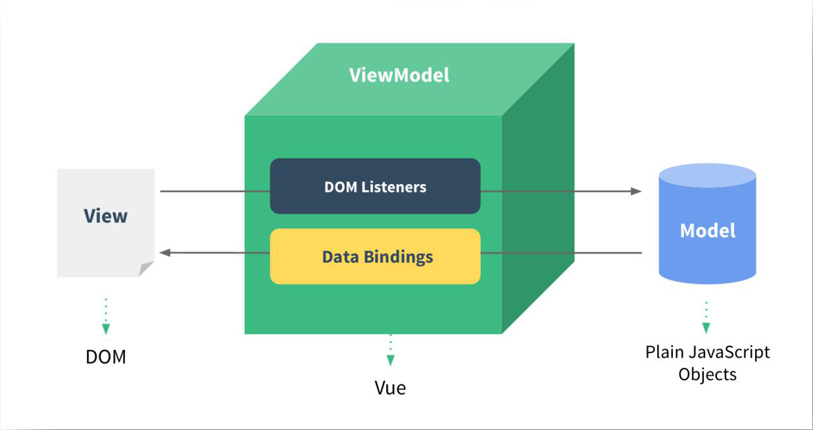
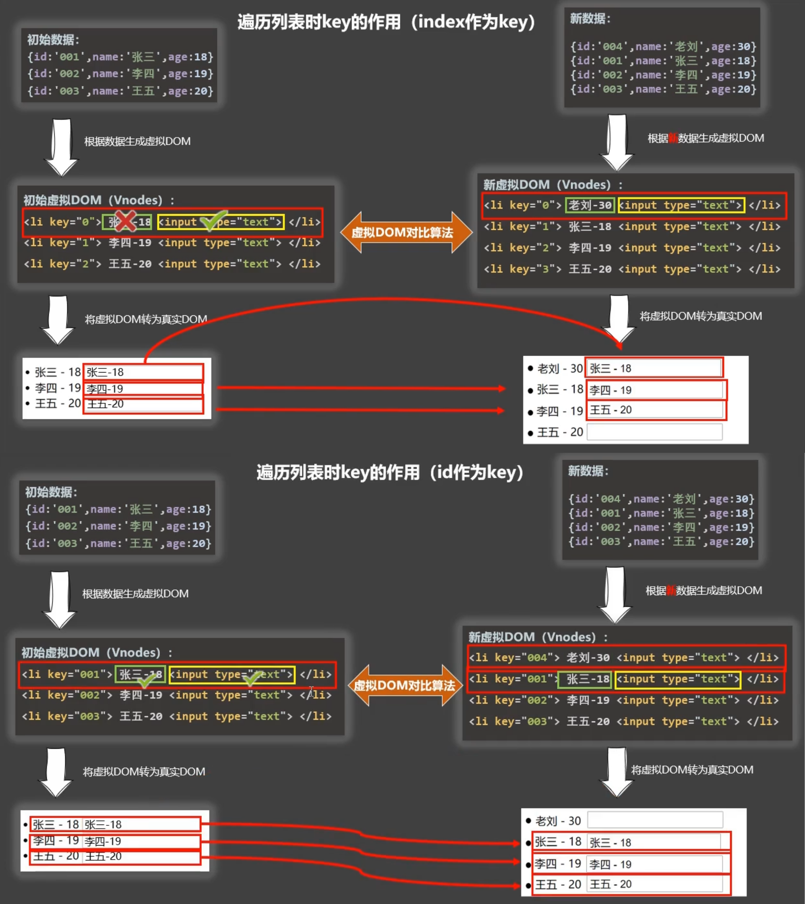

## 相关概念

### 命令式与声明式

- 命令式编程
  - 命令式编程关注"how to do"，由开发者完成"how"的过程
  - 在使用原生JS或JQuery开发的过程中，每完成一个操作，都需要通过JS编写一条代码，来给浏览器一个指令
- 声明式编程
  - 声明式编程关注"what to do"，由框架完成"how"的过程
  - 在使用Vue开发的过程中，会在createApp传入的对象中声明需要的内容，如：`template`、`data`、`methods`等

### MVVM模型

- `MVC`和`MVVM`都是一种软件的体系结构

  - `MVC`是`Model-View-Controller`的简称
  - `MVVM`是`Model-View-ViewModel`的简称

- `Vue`的设计受到了`MVVM`的启发，虽然并没有完全遵守`MVVM`的模型，但通常也将其称为一个`MVVM`的框架

- MVVM模型的组成

  - M：模型(Model)

    script中的数据(data、methods等)

  - V：视图(View)

    模板代码(html)

  - VM：视图模型(ViewModel)

    Vue实例

  

### VNode

- `VNode`全称`Virtual Node`，也就是`虚拟节点`

- 无论是组件还是元素，最终在Vue中表示出来的都是一个个`VNode`

- `VNode`本质是一个`JS对象`

  - 示意

    ~~~html
    // 模板中的元素
    
content

    ~~~

    ~~~javascript
    // VNode对象（仅示意）
    {
      type: "div",
      props: {
        class: "title",
        style: {
          "font-size": "30px",
          color: "red"
        }
      },
      children: "content"
    }
    ~~~

- `VNode Tree`(`虚拟DOM`)

  - 如果不只是一个简单的`div`元素，而是一堆元素形成的嵌套关系，那么它们会形成一个`VNode Tree`
  - `VNode Tree`是对`真实DOM Tree`的一层抽象
  - `VNode Tree`中的每个`VNode`对应对应`真实DOM`的属性
  - 每个`VNode`下的`children`依旧是`VNode`，与`真实DOM Tree`一一对应

- 为什么需要`VNode`

  - 提高渲染性能
    - 频繁的`DOM`操作导致浏览器的解析引擎和渲染引擎频繁通信，而且会产生了大量的`页面的重绘与回流`，容易导致页面卡顿
    - `虚拟DOM`是异步更新，不像`真实DOM`那样每次更新都会让浏览器渲染，只在需要时渲染，提高页面渲染性能

  - 同一个`VNode`可以渲染成不同平台的控件，提供跨平台的能力

## 模板语法

### Mustache语法（插值语法）

- `Mustache`语法，直译胡子语法（双大括号类似胡子形象），用于将数据插值显示到模板中，因此又称插值语法
- 插值语法写在标签体中，写法`{{xxx}}`，`xxx`是JS表达式，并且可以直接读取到`data`中的内容

### 指令语法

- 指令语法写在标签中，作为标签属性使用

#### 常用指令

##### v-bind

- 单向绑定
- 用于绑定一个或多个属性值，或者向另一个组件传递`props`
- 缩写：`：`
- 用法：`
`
  - 此处`xxx`会被认为是JS表达式

###### 动态绑定class

- 动态绑定class可以使用对象写法与数组写法

  - 对象写法

    - 使用`v-bind`为元素的`class`属性绑定一个class对象

    - ~~~javascript
      {class1:true, class2:false, class3:true}
      ~~~

    - 对象中的属性名对应类名，通过修改布尔值来决定要不要使用

  - 数组写法

    - 使用`v-bind`为元素的`class`属性绑定一个数组

    - ~~~javascript
      ['class1', classString, isActive ? 'active' : '', {show: isShow}]
      ~~~

    - 数组项可以直接使用字符串指定类名，可以使用变量，可以使用三元运算符，也可以使用class对象

- 动态绑定class可以与普通绑定class同时使用

  ~~~html
  

  ~~~

###### 动态绑定style

- 动态绑定style可以使用对象写法与数组写法

  - 对象写法

    - 使用`v-bind`为元素的`style`属性绑定一个样式对象

    - ~~~javascript
      {color: 'red', fontSize: size + 'px', 'background-color': 'blue'}
      ~~~

  - 数组写法

    - 使用`v-bind`为元素的`style`属性绑定一个数组

    - 每个数组项是样式对象，可以用数组写法将多个样式对象应用到同一个元素上

    - ~~~javascript
      [styleObj1, styleObj2]
      ~~~

- 样式对象中的样式名如果遇到单词组合，可使用`驼峰式命名`(`cammelCase`)，如果使用`短横线分隔命名`(`kebab-case`)，则需要将它用引号括起来

###### 动态绑定属性名

- 如果属性名不固定，可以使用`:[attrName]="xxx"`的格式来定义
  - 注意，此处的`attrName`和`xxx`都是JS表达式，如果属性值不需要动态绑定，则可写为`:[属性名]="'xxx'"`

###### 批量绑定属性

- 如果为一个元素直接使用`v-bind`绑定一个对象，则这个对象中的所有键值对会被拆成为这个元素的各个属性

- 示例

  ~~~vue
  <template>
    ......
    

    ......
  </tamplate>
  
  ~~~

###### 修饰符

- `.camel` 

  - 将短横线命名的属性名转换为驼峰式命名

  - 使用场景

    - html标签不区分大小写，有些特殊标签需要驼峰式命名的属性名，将无法被识别，此时可以使用`.camel`修饰符纠正

    - ~~~html
      <svg :view-box.camel="viewBox"></svg>
      ~~~

- `.prop`/`.attr`

  - 强制绑定为`DOM property`/`DOM attribute`

  - 3.2版本新增修饰符

  - 默认情况下使用`v-bind`会绑定为`DOM attribute`，即绑定为`HTML标签`的属性，维护在`DOM元素`的`attributes`属性中

  - 如果绑定为`DOM property`，则会绑定为`DOM元素`的属性，不会出现在`HTML标签`中

  - `v-bind`指令与`.prop`修饰符同时使用时可以缩写为：`.`

    ~~~html
    

    
    <!-- 等同于 -->
    

    ~~~

##### v-on

- 为元素绑定事件监听
- 可以绑定`函数`，也可以绑定`单行语句`
- 缩写：`@`

###### 基本使用

- 监听鼠标单击事件，绑定`btnClick`函数

  ~~~html
  <button @click="btnClick">click</button>
  ~~~

- 监听鼠标单击事件，绑定多个函数

  ~~~html
  <button @click="btnClick btnClick2">click</button>
  ~~~

- 监听多个事件时，可以传入一个对象

  ~~~html
  <button v-on="{click: btnClick, mousemove: [mouseMove, mouseMove2]}">button</button>
  ~~~

- 为绑定的函数传递参数

  ~~~html
  // 如果方法需要传递参数，那么需要在方法后加小括号
  // 如果传递参数时同时需要接收事件对象，则需要将$event作为形参传入进行占位
  <button @click="btnClick($event, argument)">click</button>
  ~~~

###### 修饰符

- `.stop` 调用`event.stopPropagation()`

- `.prevent` 调用`event.preventDefault()`

- `.captrue` 使用捕获模式（默认为冒泡模式）

- `.self` 只有当事件是由被绑定的元素本身触发时才执行回调

- `.{keyAlias}` 当事件由特定按键触发时才执行回调，也称键盘修饰符

  > - 键盘修饰符连写
  >
  >   - 当系统修饰键以外的按键同时使用时，代表这些按键任一一个都可以触发事件
  >
  >     - `@keydown.z.x` 当按下z或x时，都可以触发事件
  >
  >   - 当系统修饰键和其它按键同时使用时，代表它们需同时按下才能触发事件
  >
  >     - `@keydown.ctrl.z` 当按下ctrl后，再按下z时，触发事件
  >     - `@keyup.ctrl.z` 当同时按下ctrl和z，且z先释放时，触发事件
  >     - `@keydown.ctrl.alt` 当同时按下crtl和alt时，触发事件
  >     - `@keyup.ctrl.alt` 当同时按下crtl和alt以及另一个按键，且另一个按键先被释放时，触发事件

- `.left`/`.right`/`.middle `只当点击鼠标`左键`/`右键`/`中键`时执行回调

- `once` 最多触发一次回调函数

- `.passive` 不查询是否有`preventDefault`阻止该次事件的默认动作

  > - 使用场景
  >   - 每次监听的事件发生，浏览器都会取查询是否有`preventDefault`阻止该次事件的默认动作
  >   - 在监听频繁发生的事件，如滚动事件时，频繁查询是否有阻止默认动作，过于消耗性能
  >   - 在事件监听的`passive`模式下，浏览器不再查询是否阻止默认动作
  >   - `.passive`与`.prevent`不能同时使用，否则浏览器会报错

##### v-if/v-else/v-else-if/v-show

- 条件渲染
- `v-if`/`v-else-if`/`v-else`
  - 当条件为`false`时，该标签及其所有子节点都不会被解析
  - `v-if`/`v-else-if`/`v-else`作为一组标签配合使用时，不能被其它标签中断
  - 将`v-if`指令用在`template`标签上，可控制`template`中的子节点是否会被解析，且`template`标签在解析时不会存在于页面结构上，其子节点独立存在
- `v-show`
  - 当条件为`false`时，该标签及其所有子节点都不会被显示
- `v-if`与`v-show`的区别
  - `v-show`控制的是`CSS`的`display`属性，DOM一直存在，`v-if`控制的是是否将元素渲染到DOM中
  - `v-show`不支持在`template`上使用
  - 在开发中，需要频繁在显示与隐藏之间切换的元素使用`v-show`，反之使用`v-if`

##### v-for

- 列表渲染
- 用于遍历展示一组数据

###### 基本使用

- 遍历数组
  - `v-for="(item, index) in list" :key="xxx"`
    - `list`为要遍历的数组
    - `item`是给每项元素起的一个别名，可以自定义
    - 需指定一个唯一的`key`
    - `in`与`of`在`v-for`中没有区别

- 遍历对象
  - `v-for="(value, key, index) in object"`
- 遍历正整数
  - `v-for="item in number"`
- `v-for`也可以遍历其它可迭代对象(`Iterable`)，如字符串

###### key的作用

- `key`属性主要用在Vue的`虚拟DOM算法`，当状态中的数据发生变化时，Vue会根据`新数据`生成`新的虚拟DOM`，随后Vue进行`新虚拟DOM`与`旧虚拟DOM`的差异比较
- 对比规则：
  1. 如果旧虚拟DOM中找到了与新虚拟DOM相同的key
     - 若虚拟DOM中内容没变，则直接使用之前的真实DOM
     - 若虚拟DOM中内容变了，则生成新的真实DOM，替换掉页面中之前的真实DOM
  2. 如果旧虚拟DOM中未找到与新虚拟DOM相同的key
     - 创建新的虚拟DOM，随后渲染到页面

###### 数组更新监测

- Vue将被侦听的数组的变更方法在原生JS的基础上进行了包裹，这些包裹过的方法有
  - push()
  - pop()
  - shift()
  - unshift()
  - splice()
  - sort()
  - reverse()
- 被Vue管理的数组在调用这些方法时，会做两件事
  1. 调用对应的原生JS方法对数组进行更新
  2. 重新解析模板，实现页面更新

##### v-model

- 双向绑定

- `v-model`指令可以在表单元素上创建双向数据绑定

- 它会根据控件的类型自动选取正确的方法来更新元素

- `v-model`本质上是语法糖，原理是组合使用`v-bind`与`v-on`，通过监听用户的输入事件来更新数据，并在一些极端场景下进行一些特殊处理

  ~~~html
  <input type="text" v-model="searchText">
  // 等价于
  <input type="text" :value="searchText" @input="searchText = $event.target.value">
  ~~~

- 绑定的数据需根据不同的表单类型和场景来设置初始值

###### 不同表单类型的绑定

- `text`/`password`/`textarea`

  - 输入框控件中，`v-model`收集的是`value`属性的值，初始值是空串

  - 示例

    ~~~html
    <label for="account">
      账号：<input id="account" type="text" v-model="account">
    </label>
    <label for="password">
      密码：<input id="password" type="text" v-model="password">
    </label>
    ~~~

- `checkbox`

  - 单个`checkbox`的情况
  - `v-model`收集的是`checked`属性的布尔值
    - 此时`input`的`value`属性不会影响`v-model`的值
- 一组`checkbox`的情况
  
    - 绑定同一个数据的`checkbox`被视为一组
  - `v-model`绑定的是一个被选择的`checkbox`的`value`值组成的数组
    - 被选中的`checkbox`的`value`值会被添加到数组中

- `radio`

  - `radio`中，`v-model`收集的是`value`属性的值
  - 一组`radio`
    - 绑定了同一个数据的`radio`被视为一组
    - 一组中需要给每个`radio`配置不同的`value`值
    - 一组中只有一个`radio`会处于被选中状态
    - 绑定的数据的值与被选中的`radio`的`value`值相同

- `select`

  - 单选的情况
    - `v-model`收集的是被选中的`option`的`value`值
  - 多选的情况
    - `v-model`收集的是被选中的`option`的`value`值组成的数组
  - 如果`option`没有设置`value`，则用`option`标签体中的`textContent`代替

###### 修饰符

- `.lazy`
  - 默认情况下，`v-model`监听的是`input`事件，即每次输入内容后都会将最新的值和绑定的属性进行同步
  - 使用`.lazy`修饰符时，`v-model`监听的是`change`事件，即`text`/`password`/`textarea`类型的表单在修改并失去焦点时才会将最新的值和绑定的属性进行同步
- `.number`
  - 将表单中输入的合法符串转换为数字类型
- `trim`
  - 移除输入内容两端空格

#### 其它指令

##### v-once

- 用于指定元素或组件只渲染一次
  - 当数据发生变化时，`元素`或`组件及其所有子元素`将视为静态内容并且跳过
  - 可用于性能优化
- 不需要传入属性值

##### v-pre

- 用于`跳过元素和它的子元素的编译过程`，不解析`Mustache`标签
- 可用于不需要编译的节点，加快编译速度
- 也可用于需要在页面上显示双括号本身的场景
- 不需要传入属性值

##### v-text

- 用于更新指定元素的`textContent`
- 属性值为要更新的`textContent`
- 不会解析html标签
- 作用同插值语法，且不如插值语法灵活

##### v-html

- 用于更新指定元素的标签体
- 属性值为要更新的标签体内容
- 可以解析html标签

##### v-cloak

- 功能：作为一个特殊的标签属性，在Vue实例创建完毕并接管容器后，会自动将该属性删除
- 使用场景：
  - 当网速慢等原因导致`Vue.js`未被加载时，页面上含有未被解析的插值语法的元素将直接被渲染展示
  - 可使用`v-cloak`属性标记这些元素，使用CSS将它们隐藏
  - 当Vue实例接管容器后，`v-cloak`属性被删除，元素被解析并展示
- 不需要传入属性值

#### Vue3新指令

##### v-memo

- 用法

  - 在元素和组件上都可以使用`v-memo`指令

  - 为`v-memo`的属性值传入一个数组作为依赖数组，每个数组项都为JS表达式
  - 当组件重新渲染时，如果依赖数组中的每个数组项的值都与最后一次渲染时相同，则整个子树的更新将被跳过

- 如果v-memo传入空依赖数组（即`v-memo="[]"`）,则作用与`v-once`指令相同

- 与`v-for`一起使用

  - 当渲染海量`v-for`列表时，使用`v-memo`可用于性能优化，如实现“只有当该项的被选中状态改变时才需要更新”功能
  - `v-memo`不能用在`v-for`内部，要确保两者绑定在同一元素上

## 选项式API(Options API)

- 在Vue2中，通过往配置对象中的`data`，`methods`，`computed`，`watch`等属性中定义数据，以此组织代码，处理页面逻辑，这种方式被称为`选项式API`(` Options API`)

### data

- `data`属性是传入一个函数，且该函数需要返回一个对象
  - 在Vue3中，data数据不可再直接传入一个对象
- `data`中返回的对象会被Vue的响应式系统劫持，之后对该对象的修改或者访问都会在劫持中被处理

### methods

- `methods`属性是一个对象，通常会在这个对象中定义很多方法
  - 这些方法可以被绑定到模板中
  - 在这些方法中，可以使用`this`关键字来直接访问到`data`中返回的对象的属性
  - 如果`methods`中的方法使用了箭头函数，因为箭头函数绑定了父级作用域的上下文，方法中的`this`会指向上层作用域中的`this`，不会指向`组件实例`，无法获取`data`中的数据

### computed

- 计算属性

#### 复杂data的处理方式

- 在一些情况下，需要对`data`中的一个或多个数据进行一些处理后再显示

- 实现方法

  - 在模板中使用表达式

    - 在进行简单运算时可以很方便地实现

    - 但在模板中放入复杂逻辑时会让模板过重和难以维护
    - 多次使用时无法复用

  - 将处理的逻辑抽取到`methods`中

    - 多次使用时，由于计算结果没有缓存，所以每次都会重复调用函数

  - 通过`computed`实现

    - 任何包含响应式数据的复杂逻辑，应使用`computed`
    - `computed`有缓存机制，只有在依赖数据发生改变时才会重新计算，效率相比`methods`实现要更高

#### getter和setter

- 计算属性最终会被挂载到组件实例上，其属性值本身不存在，底层调用了`Object.defineproperty`方法提供的`getter`和`setter`，计算得到一个值

- `getter`执行的情况

  1. 初次读取计算属性时会执行一次
  2. 当依赖的数据发生改变时会再次调用

- 示例

  ~~~javascript
  ......
  data: {
    firstName: 'Graves',
    lastName: 'Zhang'
  },
  computed: {
    fullName: {
      get() {
        return this.fitstName + '-' + this.lastName
      },
      set(value) {
        const arr = value.split('-')
        this.firstName = arr[0]
        this.lastName = arr[1]
      }
    }
  }
  ......
  ~~~

- 当不需要定义`setter`时,可直接将计算属性写成一个函数

  ~~~javascript
  ......
  data: {
    firstName: 'Graves',
    lastName: 'Zhang'
  },
  computed: {
    fullName() {
      return this.fitstName + '-' + this.lastName
    }
  }
  ......

### watch

- 监视属性/侦听器
- 侦听器可以侦听某个数据的变化，变化发生时，会调用回调函数`handler`
- `watch`与`computed`对比
  - `computed`能实现的，`watch`都能实现
  - 反之，`watch`可以处理异步操作，而`computed`中的结果需要同步的return返回值，异步操作中return的返回值无法给到计算属性本身，因此在`computed`中的异步操作没有意义

#### 基本使用

~~~javascript
// 在配置对象中传入watch配置，完整写法
......
data: {
    num1: 1,
    num2: 2,
    a: {
        b: 3
    }
},
computed: {
    sum() {
        return this.num1 + this.num2
    }
},
watch: {
    sum: {
        immediate: true, // 初始化时立即调用一次handler，默认为false
        handler(newValue, oldValue) {
            console.log('sum被修改了', newValue, oldValue)
        }
    },
    'a.b': {
        handler(newValue, oldValue) {
            console.log('a.b被修改了', newValue, oldValue)
        }
    },
    a: {
        deep: true, // 检测a指向的对象的内部值的改变，且检测的对象不会随着a的重新赋值而被改变
        handler(newValue, oldValue) { // 此时的参数是a的值指向的对象
            console.log('a对象中有内容被修改了', newValue, oldValue)
        }
    },
    a: { // 检测a指向的对象是否被改变
        handler(newValue, oldValue) { // 此时的参数是a的值指向的对象
            console.log('a的指向改变了', newValue, oldValue)
        }
    }
}
......
~~~

#### 配置选项

- `handler`

  - 侦听的数据发生变化时被调用的回调函数

  - 当不需要其它配置项时，可使用精简写法

    ~~~javascript
    // 在配置对象中传入watch配置，精简写法
    ......
    data: {
        num: 1,
    },
    watch: {
        num(newValue, oldValue) {
            console.log('num被修改了', newValue, oldValue)
        }
    }
    ......
    ~~~

- `deep`

  - `watch`默认不会侦听对象内部的属性的变化
  - 如果需要深度侦听，可配置`deep: true`
  - 深度侦听需要遍历被侦听对象中的所有嵌套属性，当用于大型结构时非常消耗性能

- `immediate`

  - 如需要在初始化时久立即调用一次`handler`，可配置`immediate: true`
  - 初始化事件在`created`钩子之前，此时`data`、`computed`、`methods`已可用

#### 实现watch的其它方式

- 指定`方法名字符串`
  - 可以使用`methods`中方法名的字符串作为侦听器的值，将其作为`handler`
  - 可以将多个`方法名字符串`或函数作为数组项传入侦听器的值，它们会被逐一调用

- `$watch`

  - 可用在`created`生命周期钩子中

  - 示例

    ~~~javascript
    created() {
      this.$watch('message', (newVal, oldVal) => {
        console.log(newVal, oldVal)
      }, {deep: true, immediate: true})
    }
    ~~~

  - 参数

    - 要侦听的源
    - 侦听的回调函数
    - 其它的配置选项

  - 停止侦听器

    - `$watch()`返回的函数被调用时，可以停止侦听器

      ~~~javascript
      const unwatch = this.$watch('foo', callback)
      ......
      // 当该侦听器不再需要时
      unwatch()
      ~~~

## 组件化开发

### 使用组件

#### 注册组件

- 注册组件的方式分为全局注册和局部注册

##### 全局注册

- `Vue.createApp(App).component('组件名', 组件对象)`
  - 这里的`App`是项目的根组件配置对象
- 全局注册后，可以在`App`组件中直接使用这个全局组件

##### 局部注册

- 在需要用到的组件的配置对象中，通过`components`属性进行注册

  ~~~javascript
  components: {
      组件名1: 组件1，// 当组件名和存放组件的变量名相同时，可采用对象简写形式
      组件名2: 组件2
      ......
  }  
  ~~~

#### 挂载组件

- 在模板中可使用已注册的组件标签
- 自闭合标签或双标签的写法皆可，但如果不在Vue脚手架环境中，自闭合标签无法复用

#### 组件命名

- 定义组件名

  - 在Vue脚手架环境中，推荐使用`PascalCase`（帕斯卡命名法/大驼峰命名法）

  - 在Vue脚手架环境外，由于html标签名仅支持小写字母，因此无法使用`PascalCase`，可使用`kebab-case`

- 组件名不得使用HTML中已有的标签名，如`h2`、`H2`都不可以

- Vue开发者工具中显示的组件名

  - 默认显示注册的组件名的`PascalCase`形式
  - 可以在定义组件时传入的配置对象中，使用`name`配置项，指定组件在开发者工具中呈现的名字

### 单文件组件

- 单文件组件(`single-file components`，`SFC`)，即以`.vue`为后缀，只包含一个组件的文件

- 单文件组件的组成

  ~~~vue
  <template>
      <!--- 模板页面 --->
  </template>
  
  
  
  
  ~~~

- 组件使用方式

  1. 引入组件
  2. 映射成标签
  3. 使用组件标签

- `SFC`的特点

  - 代码的高亮
  - `ES6`、`CommonJS`的模块化能力
  - 组件作用域的`CSS`
  - 可以使用预处理器来构建更加丰富的组件，如`TypeScript`、`Babel`、`Less`、`Sass`等

### Vue脚手架

#### 使用Vue CLI创建项目(webpack)

- `CLI`全称`Command-Line Interface`，即`命令行界面`
- 可以通过`Vue CLI`选择项目的配置并创建项目

- 步骤
  1. 使用包管理工具全局安装`@vue/cli`
  2. 使用命令`vue create xxx`创建项目
  3. 在项目目录下，使用`yarn serve`/`npm run serve`启动项目
- 修改新建项目的默认包管理工具
  - 找到文件`C:\Users\{用户名}\.vuerc`，修改packageManager的值

- 一些初始化设置

  - `vue.config.js`

    ~~~javascript
    const { defineConfig } = require('@vue/cli-service')
    module.exports = defineConfig({
      transpileDependencies: true,
      lintOnSave: false, // 关闭eslint
      configureWebpack: { // webpack相关配置
        alias: { // 配置别名，在这里配置的别名在vscode中不会出现路径提示
          "components": "@/components"
        }
      }
    })
    ~~~

  - `jsconfig.json`

    ~~~json
    {
      "compilerOptions": {
        "target": "es5",
        "module": "esnext",
        "baseUrl": "./",
        "moduleResolution": "node",
        "paths": { // 路径提示
          "@/*": [
            "src/*"
          ],
          "components/*": [
            "src/components/*"
          ]
        },
        "lib": [
          "esnext",
          "dom",
          "dom.iterable",
          "scripthost"
        ]
      }
    }
    ~~~

#### 使用create-vue创建项目(vite)

- 除了使用`vue-cli`(`webpack`)，还可用`create-vue`(`vite`)创建`Vue3`工程

- `vite`的优势

  - 开发环境中，无需打包操作，可快速冷启动
  - 轻量快速的热重载(HMR)
  - 真正的按需编译，不需要等待整个应用编译完成

- 使用`vite`创建vue3.0工程的几种方式

  ~~~shell
  ## 使用npm创建工程
  npm init vite-app <项目名称>
  ## 使用Vue官方提供的项目脚手架工具创建工程(create-vue)
  npm init vue@latest
  
  ## 使用yarn创建工程
  yarn create vite
  ## 使用Vue官方提供的项目脚手架工具创建工程(create-vue)
  yarn create vue
  ~~~

### 组件间通信

#### 父子组件通信

##### props(父传子)

- 什么是`props`
  - `props`是可以在组件上注册的一些自定义的`attribute`
  - 在父组件中给子组件的自定义`attribute`赋值，子组件通过`attribute`的名称获取到对应的值
- `props`存放位置：组件的`prototype`以及组件实例对象的`_props`属性中，可在模板语法中直接使用
- `props`的大小写命名
  - `HTML`中的`attribute`名是大小写不敏感的，浏览器会把所有大写字符解释为小写字符
  - 因此在模板中传递`props`时，`prop`名需要写成`kebab-case`，而在接收`prop`时可以使用`camelCase`
- 单向数据流原则
  - 所有的`props`都遵循着`单向绑定`的原则
  - `props`因父组件的更新而变化，自然地将新的状态向下流往子组件
  - 不应该在子组件中更改一个`prop`，否则`Vue`会在控制台抛出警告
  - 单向数据流是为了避免子组件意外修改父组件的状态的情况
  - 如果确实需要由子组件触发状态修改，则需要将修改事件传递给父组件，由父组件实现修改

###### 基本使用

- 在组件标签中传递数据

  - 以`Demo`组件为例
    - `<Demo name="xxx" age="xxx"/>`
  - 默认传递的数据类型为`Srting`类型，如果需要传递其它类型的数据，可以使用`v-bind`指令，将属性值绑定为表达式
    - `<Demo name="xxx" :age="xxx" :setName="xxx"/>`
    - 此处`name`属性值为字符串`'xxx'`，`age`属性值和`setName`属性值绑定了表达式`xxx`，可以传递其它数据类型，如`Number`和`函数表达式`

- 在子组件配置对象的`props`属性中注册`props`

  - 只指定名称

    ~~~javascript
    props: ['name', 'age', 'setName', 'obj']
    ~~~

  - 指定名称和数据类型

    ~~~javascript
    props: {
        name: String, // 如果设置为null或undefined则表示会通过任何类型的验证
        age: [ Number, String ], // 可指定多个可能的属性
        setName: Function,
        obj: Object
    }
    ~~~

  - 指定名称、数据类型、必要性、默认值

    ~~~javascript
    props: {
        name: {
            type: String,
            required: true
        },
        age: {
            type: [ Number, String ],
            default: 18
        },
        setName: Function,
        obj: {
            type: Object,
            default() {
                return { message: 'Hello' } // 对象或数组的默认值必须由一个工厂函数返回
            }
        }
    }
    ~~~

  - 可选的`type`类型

    - `String`
    - `Number`
    - `Boolean`
    - `Array`
    - `Object`
    - `Data`
    - `Function`
    - `Symbol`

##### 透传Attributes（父传子）

- 传递给一个子组件的`没有被该组件声明为props或emits`的`attribute`或`v-on事件监听器`
- 常见的例子有：`class`、`style`、`id`

###### 单根节点的Attributes继承

- 当子组件只有一个根元素时，所接受的`透传Attributes`会自动被添加到根元素上
- 当`class`、`style`作为`透传Attributes`时，如果子组件的根元素已经有了`class`或`style`，它们会与继承的值合并
- 当`事件监听器`作为`透传Attributes`时，如果子组件的根元素已经绑定了`监听器`，那么原`监听器`与继承的`监听器`都会被触发

###### 多根节点的Attributes继承

- 当子组件有多个根元素时，`透传Attributes`不会被自动继承

- 需要使用`$attrs`进行显示绑定，否则会抛出警告

  - 在子组件中为元素绑定指定的`透传Attribute`

    ~~~html
    <template>
        <main :class="$attrs.class">......</main>
        <main>...</main>
    </template>
    ~~~

  - 在子组件中为元素绑定所有`透传Attribute`

    ~~~html
    <template>
        <main v-bind="$attrs">......</main>
        <main>...</main>
    </template>
    ~~~

- 在`this.$attrs`中可访问组件的所有`透传Attributes`

###### 禁用Attributes继承与$attrs属性

- 如果不希望组件自动继承`透传Attributes`，则可在组件配置项中设置`inheritAttrs:false`
- 禁用`Attributes继承`后，仍可在`this.$attrs`中访问`透传Attributes`，并手动绑定给其它元素
- 注意点
  - 与`props`不同，`透传Attributes`的属性名在JS中保留了和模板中一致的大小写，因此例如`foo-bar`这样命名的`透传Attributes`需要通过`$attrs['foo-bar']`这样的形式访问
  - 如`@click`这样的监听器，在`$attrs`中被暴露为一个函数`$attrs.onClick`

##### 组件事件/自定义事件（子传父）

###### 基本使用

- 父组件中

  - 在子组件`<Demo/>`标签中监听组件事件`someEvent`

    ~~~html
    <Demo @some-event="callback" />
    ~~~

  - 当监听到`someEvent`事件被触发时，绑定的回调`callback`执行

  - 事件名的命名与`prop`中一样，模板中使用`kabab-case`，JS中可使用`camleCase`，会自动转换

- 子组件中

  - 在配置对象中通过`emits`属性来声明要触发的组件事件

    - 数组语法

      ~~~javascript
      emits：[`someEvent`, `someEvent2`]
      ~~~

    - 对象语法，用于事件校验，一般用于封装库时使用，在业务逻辑中直接使用的情况较少

      ~~~javascript
      emites: {
          someEvent: null, // 值为null时，表示不进行事件校验
          someEvent2(count){ // 将需要进行校验的事件配置项定义成函数，并接收传递给自定义事件回调的传参
              if (count <= 10 ) {
                 return true 
              }
              return false
          } // 当返回值为true时表明事件合法，如果不合法则会在控制台跳出警告
      }
      ~~~

  - 通过`this.$emit('事件名', ...传参)`触发组件事件

    - 第一个参数为事件名字符串
    - 之后的参数为要传递给父组件中组件事件绑定的回调的参数

##### 插槽slot(父传子)

###### 插槽(slot)的作用

- 场景：一个组件需要在不同的地方复用，但它们之间有些元素存在差别
- 可以将共同的元素和内容在组件内进行封装
- 将有差异的元素使用`slot`作为占位，让使用这些组件的父组件决定`slot`中要渲染什么内容
- 插槽的使用过程其实就是`抽取共性`、`预留不同`，使得组件更加灵活和具有可复用性

###### 基本使用

- 子组件中
  - `<slot>`元素是一个`插槽出口`(`slot outlet`)，标示了父组件提供的`插槽内容`(`slot content`)将在哪里被渲染
  
- 父组件中

  - `插槽内容`在父组件中定义

  - 例如`Demo`组件是具有`slot`的子组件，在父组件的模板中，将其组件标签表示为双标签，双标签之间内容就是`插槽内容`

    ~~~html
    <Demo>{{ slotContent }}<Demo />
    ~~~

  - `插槽内容`可以是任意合法的`模板内容`，不局限于文本，还可以传入元素，甚至组件

  - `插槽内容`无法访问子组件的数据，`Vue模板`中的表达式只能访问其定义时所处的作用域（即`渲染作用域`概念）

- 插槽默认内容

  - 在父组件没有提供任何内容的情况下，`<slot>`标签之间的内容会作为插槽默认内容

    ~~~html
    <slot>插槽默认内容</slot>
    ~~~

###### 具名插槽

- 子组件中

  - 当一个组件中包含多个`插槽出口`时，需要通过`<slot>`元素的`name`属性来给各个插槽分配唯一的ID，以确定每一处要渲染的内容

  - 设置了`name`属性的插槽被称为`具名插槽`(`named slots`)

  - 没有设置`name`的插槽会被隐式地命名为`default`

  - 示例

    ~~~html
    // Demo组件中的模板内容
    

        <slot name="left"></slot>
        <slot></slot>
        <slot name="right"></slot>
    

    ~~~

- 父组件中

  - 为`插槽内容`中的`<template>`元素设置`v-slot`指令，并将目标插槽的`name`传给该指令

  - `v-slot`指令可简写为`#`

  - 示例

    ~~~html
    // 父组件中的模板内容
    <Demo>
        <template v-slot:left>
            
插槽内容1

        </template>
    
        <!-- 所有位于顶级的非 <template> 节点都被隐式地视为默认插槽的内容 -->
        
插槽内容2

    
        <template #right>
            
插槽内容3

        </template>
    </Demo>
    ~~~

  - 动态插槽名

    - 可以通过`v-slot:[dynamicSlotName]`/`#[dynamicSlotName]`的形式，使用组件中的数据为卡槽动态命名

###### 作用域插槽

- 作用
  - 场景：`插槽内容`想要同时使用父组件域内和子组件域内的数据
  - 根据`渲染作用域`，`插槽内容`在父组件中定义，无法访问子组件域内的数据
  - 使用`作用域插槽`可以让子组件在渲染时将一部分数据提供给插槽

- 基本使用
  - 子组件中
    - 像对组件传递`props`那样，在`插槽出口`上传递`attributes`
    - 注意`插槽出口`上`name`是`Vue`特别保留的`attribute`，不会作为`插槽props`传递给插槽
  - 父组件中
    - `插槽props`可以作为`v-slot`指令的值被访问到
    - 接收`插槽props`的不同写法
      - 如果是具名插槽，则形式为`v-slot:name="slotProps"`/`#name="slotProps"`
      - 如果是默认插槽，则形式为`v-slot:default="slotProps"`/`#default="slotProps"`/`v-slot="slotProps"`
    - `v-slot`指令的位置
      - 如果只有一个默认插槽，则可直接在组件标签上使用`v-slot`指令
      - 如果混用了具名插槽与默认插槽，则需要为默认插槽也使用显式的`<template>`标签，并在`<template>`标签上使用`v-slot`指令
    - `v-slot`指令的值接收到的是一个`插槽props对象`，传递的`attributes`保存在该对象中，并可以使用解构赋值的方式接收：`v-slot="{ prop1, prop2 }"`
- 作用域插槽的具体使用场景
  - 一些组件可能只包含了逻辑而不需要自己渲染内容，视图输出通过`作用域插槽`全权交给使用它的父组件，这种类型的组件被称为`无渲染组件`
  - 大部分能用`无渲染组件`实现的功能都可以通过`组合式API`(`Composition API`)以另一种更高效的方式实现，并且还不会带来额外组件嵌套的开销

##### 组件的v-model(父子组件互传)

- `v-model`可以在组件上实现双向绑定

###### 基本使用

- 组件标签上

  ~~~html
  <Demo v-model="message" />
  // 等价于
  <Demo
    :modelValue="message"
    @update:modelValue="newValue => message = newValue"
  />
  ~~~

- 组件内的实现

  - 要进行的操作

    - 接收绑定的数据：读取作为`prop`传递进来的`modelValue`

    - 修改绑定的数据：使用`$emit`触发`update:modelValue`事件，参数为要替换的内容

  - 通过直接在标签上实现

    ~~~html
    <!-- Demo.vue -->
    
    
    <template>
      <input
        :value="modelValue"
        @input="$emit('update:modelValue', $event.target.value)"
      />
    </template>
    ~~~

  - 通过`computed`实现

    ~~~html
    <!-- Demo.vue -->
    
    
    <template>
      <input v-model="value" />
    </template>
    ~~~

###### 绑定多个属性

- 默认情况下，`v-model`在组件上都是使用`modelValue`作为`prop`，并以`updata:modelValue`作为对应的组件事件

- 可以通过给`v-model`指定一个参数来更改这些名字

  ~~~html
  <Demo v-model:title="message" />
  ~~~

- 通过给`v-model`指定不同的参数，可以绑定多个属性

  ~~~html
  <Demo v-model="message" v-model:title="title" />
  ~~~

#### Provide 和 Inject（依赖注入）

##### 作用

- 用于在一些深度嵌套的组件中，祖先组件想给它的任意后代组件传递数据的场景
- 祖先组件有一个`provide`选项来提供数据
- 后代组件有一个`injdect`选项来获取数据
- 可以将依赖注入看作是一种`long range props`，并且
  - 祖先组件不需要知道哪些后代组件使用它`provide`的`property`
  - 后代组件不需要知道`inject`的`property`来自哪里

##### 基本使用

- 祖先组件中

  - 通过`provide`选项传递数据

    ~~~javascript
    provide: {
       message: "Hello"
    }
    ~~~

  - 如果需要传递来自data的数据，则需要通过`组件实例对象`来获取，为了将`provide`中的`this`指向`组件实例对象`，需要将`provide`写为函数

    ~~~javascript
    provide() {
        return {
            message: this.message
        }
    }
    ~~~

  - 通过`provide`传递的数据本身并不是响应式的，原数据被修改后，后代组件接受到的数据不会自动同步，需要结合`computed`函数来实现响应式数据

    ~~~javascript
    provide() {
        return {
            message: computed(() => this.message)
        }
    } // 注意computed函数返回的响应式对象被注入到后代组件后不会自动解包，需通过message.value取出数据
    ~~~

- 后代组件中

  - 通过`inject`选项以数组的形式接收数据

    ~~~javascript
    inject: ['message']
    ~~~

#### 全局事件总线

- `Vue3`移除了组件实例中的`$on`、`$off`、`$once`方法，如果要继续实现全局事件总线功能，需要通过第三方库
- `Vue3`官方推荐了一些第三方库，如`mitt`、`tiny-emitter`

### 组件生命周期

#### 生命周期流程

.png)

- 流程顺序

  - `beforeCreate`

  - 创建组件实例

  - `created` （重要）

    > - 发送网络请求
    > - 绑定事件监听
    > - 使用this.$watch进行数据监听

  - template模板编译

  - `beforeMount`

  - 挂载到虚拟DOM ——> 生成真实DOM

  - `mounted`（重要）

    > - 操作DOM

  - 发生数据修改时

    - `beforeUpdate`
    - 根据最新数据生成新的VNode，生成新的虚拟DOM，生成真实DOM
    - `updated`

  - 卸载组件时(v-if="false")

    - `beforeUnmount`

    - 将挂载的VNode从虚拟DOM中移除

    - `unmounted`（相对重要）

      > - 回收操作，如取消事件监听等

    - 将组件实例销毁

#### 生命周期函数

- 生命周期函数是一些特殊名称的钩子函数（回调函数），在某个时间会被`Vue`源码内部进行回调
- 可以在生命周期函数中根据需求编写一些逻辑代码
- 生命周期函数中的`this`指向`Vue实例对象`或`组件实例对象`

### refs

- 用于在模板中注册元素或子组件的引用，来获取DOM或组件实例
- 注册`ref`
  - 为模板中的元素或组件标签绑定一个`ref`属性，属性值为注册名称
  - 如果用于普通DOM元素，引用的是元素本身
  - 如果用于组件，引用的是组件实例
- 获取`refs`
  - 被注册的`ref`被保存在组件实例的`this.$refs`中
- `$refs`中的组件实例的使用
  - 父组件可以通过用`ref`获取的子组件实例调用子组件的方法
  - `this.$refs`是非响应式的，因此不能在模板中使用它进行数据绑定
  - 获取组件实例中的模板
    - 如果是单根组件，可使用`this.$refs.xxx.$el`获取根元素
    - 如果是多根组件，使用`this.$refs.xxx.$el`拿到的是模板中的第一个`node节点`，会是一个空白的文本节点`#text`
  - 组件实例的一些其它属性
    - `$parent` 获取父组件
    - `$root` 获取根组件

### 动态组件(了解)

- 通过在模板中使用`<component>`标签，设置其`is`属性，以实现动态组件功能
- `is`的属性值为`全局注册或局部注册的组件`
- 动态组件也可以传递`props`和绑定监听事件
- 由于组件是通过变量引用而不是基于字符串组件名注册的，`<component>`标签上`is`绑定的内容不是`字符串组件名`，而是存储组件的`变量`（）

### keep-alive

- 使用动态组件或路由组件时，当组件被切换掉时会被销毁，切换回来时再次重新创建组件

- 如果希望一直保持组件的状态，可以使用`<keep-alive>`标签包裹（Vue脚手架中可写为`<keepAlive>`）

- 默认情况下`<keep-alive>`会缓存该处展示的所有组件

- `<keep-alive>`的一些属性

  - `incluce`

    - 只有名称匹配的组件会被缓存

    - 在`3.2.34`以下版本中，组件必须要手动设置`name`选项才能被匹配，之后的版本，单文件组件会自动根据文件名生成对应的`name`选项

    - 属性值可以使用`字符串`、`正则表达式`、`数组`

      ~~~html
      <!-- 逗号分隔字符串 -->
      <keep-alive include="a, b">
          <component :is="view"></component>
      </keep-alive>
      
      <!-- 正则表达式 (使用v-bind) -->
      <keep-alive :include="/a|b/">
          <component :is="view"></component>
      </keep-alive>
      
      <!-- 数组 （使用v-bind） -->
      <keep-alive include="['a', 'b']">
          <component :is="view"></component>
      </keep-alive>
      ~~~

  - `exclude`

    - 只任何名称匹配的组件都不会被缓存
    - 使用方式同`include`

  - `max`

    - 最多可以缓存的组件实例的数量
    - 如果超过这个数字，则最久没有被访问的缓存实例将被销毁

- 缓存组件的生命周期函数

  - `activated`
    - 从缓存中被重新插入`DOM`中时调用
    - 首次挂载时也会调用
  - `deactivated`
    - 从`DOM`上移除并进入缓存时调用
    -  组件卸载时也会调用

### 异步组件(了解)

- 分包处理
  - 默认情况下`webpack`在打包时会将组件模块打包到一起，比如一个`app.js`文件
  - 项目过大时，`app.js`文件过大，会造成首屏渲染速度变慢
  - 所以对于一些不需要立即使用的组件，可以单独进行拆分
  - 拆分出来的代码会在需要时从服务器加载

- `Vue`中实现异步组件

  - 通过异步方式加载某些组件，使得可以对这些组件进行分包处理
  - Vue提供了一个函数：`defineAsyncComponent`，能接收两种类型的参数
    - 一个工厂函数，该工厂函数需要返回一个`Promise`对象
    - 一个对象，对异步函数进行配置

- 写法

  - 工厂函数写法

    ~~~javascript
    import { defineAsyncComponent } from 'vue'
    const AsyncDemo = defineAsyncComponent(() => import("./Demo.vue")) // import(url)返回的是一个Promise对象
    export default {
        components: {
            Demo: AsyncDemo
        }
    }
    ~~~

  - 对象写法（了解）

    ~~~javascript
    const AsyncDemo = defineAsyncComponent({
        // 工厂函数
        loader: () => import("./Demo.vue")
        // 加载过程中显示的组件
        loadingComponent: Loading
        // 加载失败时显示的组件
        errorComponent: Error,
        // 在显示loadingComponent之前的延时，默认值200，单位ms
        delay: 2000,
        // 定义组件是否可挂起，默认为true
        suspensible: true
    })
    ~~~
  
- 分包处理的更好实现方法：路由懒加载

### Mixin(了解)

- 使用场景：多个组件之间存在相同的代码逻辑，希望对相同的代码逻辑进行抽取
- 使用方法
  - 定义`Mixin`对象，其中可以包含任何`组件选项`(`Options API`)
  - 指定组件中混入
    - 在需要使用该`Mixin`的组件中引入该`Mixin`对象，将其变量名放入`mixins`选项的数组中
  - 全局混入
    - `createApp(App).mixin(Mixin对象)`
    - 全局混入的选项将会影响所有组件
- 合并规则
  - 如果`Mixin`对象中的选项和组件配置对象中的选项发送了冲突，将会按照规则进行合并
    - `data`函数的返回值对象
      - 返回值对象默认情况下会进行合并
      - 如果返回值对象的属性发生了冲突，则会保留组件自身的数据
    - 生命周期钩子函数
      - 生命周期的钩子函数会被合并到数组中，都会被调用
    - 值为对象的选项
      - 合并为一个对象
      - 如果对象的`key`相同，那么会取组件配置对象的键值对

## 组合式API(Composition API)

### 选项式API的弊端 

- 当实现某一功能时，这个功能对应的代码逻辑会被拆分到各个属性中
- 当组件变得更大、更复杂时，逻辑关注点的列表就会增长，同一个功能的逻辑就会被拆分的很分散，组件变得难以阅读
- 处理单个逻辑关注点时需要不断地跳到相应的代码块中，使得代码难以维护

### 组合式API与setup函数

- 官网介绍：[组合式 API 常见问答 | Vue.js (vuejs.org)](https://cn.vuejs.org/guide/extras/composition-api-faq.html)
- 有人把`Vue Composition API`简称为`VCA`
- `setup`函数是在组件中使用`组合式API`的入口
- `setup`函数中的`this`在脚手架环境（默认开启了严格模式，否则指向`window`）中指向`undefined`

#### setup函数的参数

- `props`
  - 可以在`选项式API`的`props`选项中定义`props`，将定义的`props`放入到`props`对象中
  - `props`对象作为参数传递到`setup`函数中，所以可以直接通过参数来使用
  - 在模板中依然可以正常使用`props`中的属性
- `context`
  - 也称之为是一个`SetupContext`
  - 包含三个属性
    - `atrrs`
      - 所有的非`prop`的`attribute`
    - `slots`
      - 父组件传递过来的插槽
      - 在以渲染函数返回时会有作用
    - `emit`
      - 同`选项式API`中的`this.$emit`

#### setup函数的返回值

- 可让`setup`函数返回一个对象，对象中的数据可以在模板中被使用
- `setup`函数的返回值本身是非响应式的

### 响应式API

#### 核心

##### reactive()

- `reactive`函数可以为在`setup`中定义的`复杂类型数据`提供响应式的特性
- `reactive`函数会返回一个`响应式代理`
  
  - 注意：如果这个`响应式代理`被解构赋值，或使用点语法将其属性值赋值给变量，取出来的值都是非响应式的
  
- 基本使用示例

  ~~~vue
  <template>
    

      <h2>message:{{ state.message }}</h2>
      <button @click="changeMessage">click</button>
    

  </template>
  
  
  ~~~

##### ref()

- `ref`函数可以为在`setup`中定义的`基本类型数据`或`复杂数据类型`提供响应式的特性

- `ref`函数会返回一个可变的响应式对象，该对象作为一个响应式的引用维护着它内部的值(`value`)，这也是`ref`的名字来源

  - `ref`函数返回的对象，在`setup`函数中使用时，需取出它的`value`值进行操作

  - 在模板中使用时，`Vue`会将其进行解包，可以直接使用其对象名
    - 自动解包存在一些bug，在当前版本(`vue 3.2.13`)中仍存在：
    
      如果将`ref`返回的对象(此处命名`num`)直接作为一个属性放入一个对象(此处命名为`obj`)中，并在模板中的标签用事件绑定了语句，在语句中操作`obj.num`时解包会失败，需使用`obj.num.value`

- 基本使用示例

  ~~~vue
  <template>
    

      <h2>count:{{ num }}</h2>
      <button @click="increase">+1</button>
      <button @click="num--">-1</button>
    

  </template>
  
  
  ~~~

- `ref`与`reactive`函数的区别与关系
  - 可接受的数据类型不同
    - `reactive`只能接收复杂数据类型
    - `ref`可以接收基本数据类型，也可以接收复杂数据类型
  - 返回值的数据类型不同
    - `ref`的返回值的数据类型为`Reflmpl`，而`Reflmpl._value`是一个`reactive`代理的原始对象
    - `reactive`的返回值的数据类型为`Proxy`
  - `ref`的本质是通过`reactive`创建的
    - `ref(10)`相当于`reactive({value: 10})`

##### readonly()

- 接受一个对象(普通对象或`reactive`返回对象或`ref`返回对象)，返回一个原始对象的`只读代理`
- 返回的代理对象是一个`Proxy`，它的`set`捕捉器被劫持，并且不能对其进行修改
- 如果修改`原来的对象`，则会同步给`只读代理`
- 使用场景：强制实现`props`的`单向数据流原则`，将`只读代理`作为`prop`传递给其它组件组件时，不能被其它组件直接修改

##### computed()

- 如果接收一个`getter`函数，则返回一个只读的`ref`，该`ref`通过`.value`暴露`getter`函数的返回值

- 如果接收一个带有`get`和`set`函数的对象，则返回一个可写的`ref`

- 示例

  ~~~javascript
  // 创建一个只读的计算属性ref
  
  const count = ref(1)
  const plusOne = computed(() => count.value + 1)
  
  console.log(plusOne.value) // 2
  
  plusOne.value++ // 错误
  
  
  // 创建一个可写的计算属性ref
  
  const count = ref(1)
  const plusOne = computed({
    get: () => count.value + 1,
    set: (val) => {
      count.value = val - 1
    }
  })
  
  plusOne.value = 1
  console.log(count.value) // 0
  ~~~

##### watch()

- 侦听一个或多个响应式数据源，并在数据源变化时调用所给的回调函数

- `watch()`的返回值是一个函数，调用该函数可以停止侦听

- `watch(数据源, 回调函数, 配置对象)`

- 参数

  - 数据源，来源可以是以下几种
    - 一个函数，返回一个值
    - 一个`ref`
    - 一个响应式对象
    - ...或是由以上类型的值组成的数组
  - 回调函数
    - 接收三个参数
      - 新值
      - 旧值
      - 用于注册副作用清理的回调函数
        - 该回调会在副作用下一次重新执行前调用，可以用来清除无效的副作用，例如等待中的异步请求
    - 当侦听多个来源时，回调函数接收两个数组，分别对应来源数组中的新值和旧值
  - 配置对象，支持以下选项
    - `immediate`
      - 在侦听器创建时立即触发回调。第一次调用时旧值是`undefined`
    - `deep`
      - 如果源是对象，强制深度遍历，以便在深层级变更时触发回调
    - `flush`
      - 调整回调函数的刷新时机
      - 可选值
        - `'pre'`
          - 回调会在依赖更新前被调用
        - `'post'`（默认值）
          - 回调会在依赖更新后且`DOM`更新后被调用
        - `'sync'`
          - 回调会在依赖更新后立即调用
    - `onTrack`/`onTrigger`
      - 调试用的辅助函数
      - `onTrack`会在依赖项被追踪时调用
      - `onTrigger`会在依赖项的改变导致副作用时调用

- 示例

  - 侦听一个数据源

    ~~~javascript
    const num = ref(0)
    
    watch(num, (newVal, oldVal) => {
        console.log(newValue, oldValue)
    },{
        immediate: true,
        deep:false
    })
    
    const plusOne = () => {
        num.value++
    }
    ~~~

  - 侦听多个数据源

    ~~~javascript
    const num1 = ref(0)
    const num2 = ref(0)
    
    watch([num1, num2], (newVal, oldVal) => {
        console.log(newValue, oldValue)
    })
    ~~~

##### watchEffect()

- 传入一个函数并立即执行，同时响应式地追踪其依赖，并在依赖更改时重新执行这个函数

- `watchEffect()`的返回值是一个函数，调用该函数可以停止侦听

- 示例

  ~~~javascript
  const num = ref(0)
  const obj = reactive({
    a: 1,
    b: 2
  })
  
  const stopWatch = watchEffect(() => {
    console.log(num.value, obj.a) // num.value和obj.a的变化都会触发这个回调函数
  })
  
  const plusNum = () => {
      num.value++
      if (age.value > 20) {
          stopWatch()
      }
  }
  ~~~

#### 工具函数

##### isProxy()

- 检查一个对象是否是由`reactive()`、`readonly()`、`shallowReaction()`或`shallowReadonly()`创建的`Proxy`

##### isReactive()

- 检查一个对象是否是由`reactive()`或`shallowReaction()`创建的`响应式代理`
- 如果该代理是由`readonly()`创建，但包裹了由`reactive()`创建的另一个代理，则也会返回`true`

##### isReadonly()

- 检查对象是否是由`readonly()`或`shallowReadonly()`创建的`只读代理`

##### toRef()

- 基于`响应式对象`(`reactived()`创建的对象)上的一个属性，创建一个对应的`ref`
- 使用方式：`toRef(源对象, '对象上的属性名')`
- 如果指定的属性不存在，也会返回一个可用的`ref`，其`value`为`undefined`

##### toRefs()

- 传入一个`响应式对象`(`reactive()`创建的对象)，返回一个`普通对象`，这个`普通对象`的每个属性指向源对象相应属性的`ref`，并且每一个`ref`都是由`toRef()`创建的
- 不同于`toRef()`，`toRefs()`无法为还不存在的属性创建`ref`
- 使用场景：`reactive()`创建的对象，经过`toRefs()`转换后，解构赋值得到的内部属性将是`ref`响应式的

##### unref()

- 如果传入的是一个`ref`，则返回其`value`，否则返回参数本身
- 等同于`val = isRef(Val) ? val.value : val`

##### isRef()

- 检查一个值是否为`ref`

#### 进阶

##### toRaw

- 根据一个`Vue`创建的代理返回其原始对象
- 可用于调试，不建议保留对原始对象的持久引用

##### shallowReactive

- `reactive()`的浅层作用形式
- 只有对象的根级别属性是响应式的
- 深层的还是原生对象

##### shallowReadonly

- `readonly()`的浅层作用形式
- 只有对象的根层级的属性变为了只读
- 深层还是可读写的

##### shallowRef()

- `ref()`的浅层作用形式

- 只有对`.value`的访问是响应式的

- `.value`如果指向一个对象，内部的属性指向原生对象

- 示例

  ~~~javascript
  const state = shallowRef({ count: 1 })
  
  // 不会触发更改
  state.value.count = 2
  
  // 会触发更改
  state.value = { count: 2 }
  ~~~

##### triggerRef()

- 手动触发和`shallowRef`相关联的副作用

- 在对`浅层ref`引用的`value`进行深度变更后使用，传入`浅层ref`，可手动触发

- 示例

  ~~~javascript
  const shallow = shallowRef({
    greet: 'Hello, world'
  })
  
  // 触发该副作用第一次应该会打印 "Hello, world"
  watchEffect(() => {
    console.log(shallow.value.greet)
  })
  
  // 这次变更不应触发副作用，因为这个 ref 是浅层的
  shallow.value.greet = 'Hello, universe'
  
  // 打印 "Hello, universe"
  triggerRef(shallow)
  ~~~

### 生命周期钩子

- `setup`中的生命周期钩子需要从`vue`中引入

- 将要执行的代码放入函数中，作为参数传对应入生命周期钩子

  ~~~javascript
  onMounted(() => {
      console.log('onMounted')
  })
  ~~~

- 同一个生命周期钩子可以多次使用

- `setup`中没有对应`beforeCreated`和`created`的生命周期钩子，原先在这两个生命周期钩子中进行的操作可以直接在`setup`函数中编写

- 常用生命周期钩子

  - `onMounted()`

  - `onUpdated()`

  - `onUnmounted()`

  - `onBeforeMount()`

  - `onBeforeUpdate()`

  - `onBeforeUnmount()`

  - `onActivated()`

  - `onDeactivated()`

### 一些特性在setup中的使用方式

#### ref模板注册

- 在模板中注册了`ref引用`之后，使用`组合式API`时要获得该引用，需声明一个同名的`ref`

- 示例

  ~~~vue
  
  
  <template>
    <Child ref="child" />
  </template>
  ~~~

#### 依赖注入

##### provide()

- 在祖先组件中通过`provide(name, value)`来提供数据

- 参数
  - 要提供的`property`名称，参数类型为字符串
  - 要提供的`property`的值，可以使用`ref`和`reactive`
  
- 应用层`Provide`

  - 除了在组件中，还可以在`main.js`中为整个应用层面提供依赖

    ~~~javascript
    ...
    app.provide('message', 'hello')
    ...
    ~~~

  - 在应用层面提供的依赖，可以在该`app`内的所有组件中注入

##### inject()

- 在后代组件中通过`inject(name, defaultValue)`来注入需要的内容
- 参数
  - 要注入的`property`的名称，参数类型为字符串
  - 默认值，可选

### 逻辑复用

#### 组合式函数

- [组合式函数 | Vue.js (vuejs.org)](https://cn.vuejs.org/guide/reusability/composables.html)

- 在`Vue`应用的概念中，`组合式函数`(`Composables`)是一个利用`Vue`的`组合式API`来封装一个复用`有状态逻辑`的函数

- 案例

  - `useTitle`

    ~~~javascript
    import { ref, watchEffect } from 'vue'
    
    export default function useTitle(titleValue) {
    
      const title = ref(titleValue)
    
      watchEffect(() => {
        document.title = title.value
      })
    
      return title
    
    }
    
    // 暴露了一个函数，返回值为一个ref
    // 给函数传入要修改的标题名作为参数，即可修改标题名
    // 修改返回值的 .value 的值，可再次修改标题
    ~~~

### \
  ~~~

- `defineProps`和`defineEmits`都是只能在`
  ~~~

  - 当父组件通过模板引用的方式获取到当前组件的实例，获取到的实例会像这样 `{ a: number, b: number }`，`ref`会和在普通实例中一样被自动解包

## 其他特性

### 自定义指令

- 某些情况下，需要对DOM元素进行一些底层操作时，需要用到自定义指令

- 自定义指令分为两种

  - 自定义局部指令
    - 组件通过`directives`选项，只能在当前组件中使用
  - 自定义全局指令
    - app的`directive`方法，可以在任意组件中使用

- 自定义指令的实现

  - 例：当某个元素挂载完成后可以自动获取焦点

    - 自定义局部指令实现

      - 选项式API的写法

        ~~~vue
        
        
        <template>
          

            <h2>自定义指令</h2>
            <input type="text" v-focus>
          

        </template>
        ~~~

      -  组合式API的写法

        ~~~vue
        
        
        <template>
          

            <h2>自定义指令</h2>
            <input type="text" v-focus>
          

        </template>
        ~~~

    - 自定义全局指令实现

      - `/src/main.js`

        ~~~javascript
        ...
        
        const app = createApp(App)
        
        app.directive('focus', {
            mounted(el) {
                el.focus()
            }
        })
        
        app.mount('#app')
        ~~~
        
      - 封装管理全局指令
      
        - `/src/main.js`
      
          ~~~javascript
          ...
          
          import useDirectives from './directives'
          
          const app = createApp(App)
          
          useDirectives(app)
          
          app.mount('#app')
          ~~~
      
        - `src/directives/index.js`
      
          ~~~javascript
          import foo from "./foo"
          import fmTime from "./fm-time"
          
          export default function useDirectives(app) {
            foo(app)
          }
          ~~~
      
        - `src/directives/foo.js`
      
          ~~~javascript
          export default function foo(app) {
            app.directive('foo', {
            ......
            })
          }
          ~~~
      
    
  - 自定义指令中的生命周期（指令钩子）
  
    ~~~javascript
    const myDirective = {
      // 在绑定元素的 attribute 前，或事件监听器应用前调用
      created(el, binding, vnode, prevVnode) {},
      // 在元素被插入到 DOM 前调用
      beforeMount(el, binding, vnode, prevVnode) {},
      // 在绑定元素的父组件及他自己的所有子节点都挂载完成后调用
      mounted(el, binding, vnode, prevVnode) {},
      // 绑定元素的父组件更新前调用
      beforeUpdate(el, binding, vnode, prevVnode) {},
      // 在绑定元素的父组件及他自己的所有子节点都更新后调用
      updated(el, binding, vnode, prevVnode) {},
      // 绑定元素的父组件卸载前调用
      beforeUnmount(el, binding, vnode, prevVnode) {},
      // 绑定元素的父组件卸载后调用
      unmounted(el, binding, vnode, prevVnode) {}
    }
    ~~~
    
    - 参数
  
      - `el`
  
        - 指令绑定到的元素
  
      - `binding`
  
        - 一个对象，包含以下属性
  
          - `value`
          - 传递给指令的值
            - 例如在 `v-my-directive="1 + 1"` 中，值是 `2`
    
          - `oldValue`
          - 之前的值
            - 仅在 `beforeUpdate` 和 `updated` 中可用
          - `arg`
            - 传递给指令的参数 (如果有的话)
            - 例如在 `v-my-directive:foo` 中，参数是 `"foo"`
          - `modifiers`
            - 一个包含修饰符的对象 (如果有的话)
            - 例如在 `v-my-directive.foo.bar` 中，修饰符对象是 `{ foo: true, bar: true }`
          - `instance`
            - 使用该指令的组件实例
          - `dir`
            - 指令的定义对象（定义该指令时用的对象）
    
      - `vnode`
  
        - 代表绑定元素的底层 VNode
  
      - `prevNode`
  
        - 之前的渲染中代表指令所绑定元素的 VNode
      - 仅在 `beforeUpdate` 和 `updated` 钩子中可用

### Teleport

- `<Teleport>`是一个内置组件，它可以将一个组件内部的一部分模板“传送”到该组件的DOM结构外层位置去

#### 基本用法

- 可能遇见的场景

  - 一个组件模板的一部分在逻辑上从属于该组件，但从整个应用视图的角度来看，它在DOM中应该被渲染在整个`Vue`应用外部的其他地方
  - 最常见的例子是全屏的模态框(modal box)

- 示例

  ~~~vue
  <button @click="open = true">Open Modal</button>
  
  <Teleport to="body">
    

      
Hello from the modal!

      <button @click="open = false">Close</button>
    

  </Teleport>
  ~~~

  - `<Teleport>`接收一个`to`属性来指定传送的位置，`to`的值可以是一个`CSS选择器字符串`，也可以是一个`DOM元素对象`，意为告诉`Vue`把以下模板片段传送到`body`标签下

#### 搭配组件使用

- `<Teleport>`只改变了渲染的DOM结构，它不会影响组件间的逻辑关系
- 如果`<Teleport>`包含了一个组件，那么该组件始终和这个使用了`<Teleport>`的组件保持逻辑上的父子关系，传入的`props`和触发的事件也会照常工作

#### 禁用Teleport

- 某些场景下可能需要视情况禁用`<Teleport>`

- 比如某个组件，在桌面端想当作浮层来渲染，而在移动端则当作行内组件时，可以通过对`<Teleport>`动态地传入一个`disabled`属性来处理这两种不同的情况

  ~~~vue
  <Teleport :disabled="isMoblie">
      ...
  </Teleport>
  ~~~

  - 这里的`isMoblie`状态可以根据`CSS media query`的不同结果动态地更新

#### 多个Teleport共享目标

- 一个可重用的模态框组件可能同时存在多个实例
- 对于此类场景，多个`<Teleport>`组件可以将其内容挂载在同一个目标元素上，而顺序就是简单的顺次追加，后挂载的将排在目标元素下更后面的位置上

### 异步组件与Suspense

- 注意：目前(2023-04-19)`Suspense`显示的是一个实验性的特性，API随时可能会修改

- `Suspense`是一个内置的全局组件，该组件有两个插槽

  - `default`
    - `default`中可以放异步组件，如果异步组件已成功加载并可以显示，则显示`default`中的内容
  - `fallback`
    - 如果`default`中的内容无法显示，则会显示`fallback`中的内容

  ~~~vue
  <suspense>
      <template #default>
          <async-home></async-home>
      </template>
      <template #fallback>
          <loading/>
      </template>
  </suspense>
  ~~~

### 全局属性

- `app.config.globalProperties`是一个用于注册全局属性的对象

- 全局属性可以被`app`内所有组件实例访问

- 用法：

  - ~~~javascript
    app.config.globalProperties.msg = 'hello'
    ~~~

  - 这使得`msg`在`app`中的任意组件模板上都可用，并且可以通过任意组件实例的`this`访问到

- 如果全局属性与组件自己的属性冲突，组件自己的属性具有更高优先级

- 如果在`组合式API`中，推荐使用`app.provide()`实现全局属性

### 插件(Plugins)

- 插件(`Plugins`)是一种能为`Vue`添加全局功能的工具代码

- 插件可以完成的功能没有限制，但是插件发挥作用的常见场景主要包括以下几种：

  - 通过`app.component()`和`app.directive()`注册一个到多个全局组件或自定义指令
  - 通过`app.provide()`使一个资源可被注入进整个`app`
  - 添加全局方法或`property`，通过把它们添加到`config.globalProperties`上实现

- 组件编写方式

  - 对象类型的写法

    ~~~javascript
    export default {
        install: (app, options) => {
            ...
        }
    }
    ~~~

    - 对象中必须包含一个`install`函数，该函数会在安装插件时执行

  - 函数类型的写法

    ~~~javascript
    export default function(app, options) {
        ...
    }
    ~~~

    - 该函数会在安装插件时执行

### vue中的渲染方式

- 在`vue`中有不同的方式可以渲染页面
  - `template`
    - 由`vue-loader`转化
  - `h()函数`
    - 不需要转化
  - `jsx`
    - 需使用`Babel`中的插件转化

#### h()函数

- `h()`函数是一个用于创建`VNode`的函数，等同于`createVNode()`

- `h()`函数的基本使用

  - `h()`函数可接收3个参数，以此返回`VNode`
    - `tag`
      - { `String` | `Object` | `Function` }
      - 可以是`HTML标签名字符串`、`一个组件`、`一个异步组件`、`一个函数式组件`

    - `props`
      - { `Object` }
      - 一个对象，包含标签的属性

    - `children`
      - { `String` | `Array` | `Object` }
      - 子`VNodes`

  - 如果不需要`props`，可以将`children`作为第二个参数传入，但为了避免产生歧义，可以将`null`作为`props`传入

- `h()`函数可以在不同风格API中使用

  - `render函数`选项中

    ~~~vue
    
    ~~~

  - `setup`中

    - `setup函数`选项中

      ~~~vue
      
      ~~~

      - 在上面的代码中，`setup函数`并没有直接返回`h()函数`创建的`VNode`，而是将其放在一个工厂函数中返回
        - 因为`setup函数`的返回值本身并不是响应式的，如果直接返回了`VNode`，那组件渲染的内容将一直保持不变
        - 如果将生成的`VNode`放入了一个工厂函数中，每次组件重新渲染时，工厂函数都会被执行，返回一个新的`VNode`，使得组件能够动态渲染内容

    - `setup`语法糖中

      ~~~vue
      
      
      <template>
        <render />
      </template>
      ~~~

#### jsx的Babel配置

- `webpack`环境下

  - 安装插件

    `npm install @vue/babel-plugin-jsx -D`

  - 在`babel.config.js`中配置插件

    ~~~javascript
    module.exports = {
        presets: [
            '@vue/cli-plugin-babel/preset'
        ],
        plugins: [
            '@vue/babel-plugin-jsx'
        ]
    }
    ~~~

- `Vite`环境下

  - 安装插件

    `npm install @vitejs/plugin-vue-jsx -D`

- `vue`中编写`jsx`

  ~~~vue
  
  ~~~

### 过渡动画

- `Vue`中提供了一些内置组件和对应的API来实现过渡动画效果

- `Trasition`是一个内置组件，无需注册

  - 它可以将进入和离开的过渡效果应用到它默认插槽中的元素或组件上

  - 过渡效果可以由以下的条件之一触发

    - 由`v-if`或`v-show`触发的切换
    - 由特殊元素`<component>`切换的动态组件
    - 改变特殊的`key`属性

  - 基本使用示例

    ~~~vue
    <template>
        <button @click="show = !show">Toggle</button>
        <Transition>
            
hello

        </Transition>
    </template>
    
    
    ~~~

- `Trasition`内置组件原理：在插入、更新或移除DOM元素时，在合适的时候给元素添加样式类名

  - 过渡类名
    - `v-enter-from`：进入动画的起始状态。在元素插入之前添加，在元素插入完成后的下一帧移除。
    - `v-enter-active`：进入动画的生效状态。应用于整个进入动画阶段。在元素被插入之前添加，在过渡或动画完成之后移除。这个 class 可以被用来定义进入动画的持续时间、延迟与速度曲线类型。
    - `v-enter-to`：进入动画的结束状态。在元素插入完成后的下一帧被添加 (也就是 `v-enter-from` 被移除的同时)，在过渡或动画完成之后移除。
    - `v-leave-from`：离开动画的起始状态。在离开过渡效果被触发时立即添加，在一帧后被移除。
    - `v-leave-active`：离开动画的生效状态。应用于整个离开动画阶段。在离开过渡效果被触发时立即添加，在过渡或动画完成之后移除。这个 class 可以被用来定义离开动画的持续时间、延迟与速度曲线类型。
    - `v-leave-to`：离开动画的结束状态。在一个离开动画被触发后的下一帧被添加 (也就是 `v-leave-from` 被移除的同时)，在过渡或动画完成之后移除。

- 为过渡效果命名

  - 可以为`Trasition`组件传入一个`name`属性来声明一个过渡效果名
  - 对于一个有`name`属性的`Trasition`，对其起作用的过渡类名会以`name`的值替代`v`作为前缀

- 使用`CSS`的`animation`实现过渡

  - 对于大多数css动画，可以简单地在`*-enter-active`和`*-leave-active`类下声明

    ~~~vue
    
    
    <template>
    	<button @click="show = !show">Toggle</button>
      <Transition name="bounce">
        

          Hello here is some bouncy text!
        

      </Transition>
    </template>
    
    
    ~~~

- 自定义过渡类名

  - 可以向`<Trasition>`传递以下属性来指定自定义的过渡类名
    - `enter-from-class`
    - `enter-active-class`
    - `enter-to-class`
    - `leave-from-class`
    - `leave-active-class`
    - `leave-to-class`
  - 传入的值会覆盖相应阶段的默认类名，可用于配合第三方`CSS`动画库，如`Animate.css`

- `<Trasition>`的其他属性

  - `type`（不常用）

    - 可选值
      - `animation`
      - `transition`
    - 强制指定`vue`监听`transitionend`事件还是`animationend`事件
    - 如果不指定，则`Vue`会自动识别类型并设置监听

  - `duration`（不常用）

    - 强行指定过渡的持续时间

    - 例

      - 同时设置进入和离开的时间

        ~~~vue
        <transition :duration="1000">
            ...
        </transition>
        ~~~

      - 分别设置进入和离开的时间

        ~~~vue
        <transition :duration="{enter: 800, leave: 1000}">
            ...
        </transition>
        ~~~

  - `mode`

    - 过渡模式
    - 默认情况下，两个元素进行切换显示时，动画会同时发生，使用`mode`属性可以指定动画发生的顺序
    - 可选值
      - `in-out`
        - 新元素先进行过渡，完成之后当前元素过渡离开
      - `out-in`
        - 当前元素先进行过渡，完成之后新元素过渡进入

  - `appear`

    - 如果想在某个节点初次渲染时应用一个过渡效果，可以添加`appear`属性

- `Transition`也可以用于动态组件之间的切换

  ~~~vue
  <Transition name="fade" mode="out-in">
    <component :is="activeComponent"></component>
  </Transition>
  ~~~

- `TrasitionGroup`内置组件

  - `<TrasitionGroup>`用于对`v-for`列表中的元素或组件的插入、移除和顺序改变添加动画效果
  
  - `<TrasitionGroup>`支持和`<Trasition>`基本相同的属性、过渡类名，但有以下几点区别
    - 默认情况下，它不会为插槽内容渲染一个容器元素，但可以通过`tag`属性来指定一个元素作为容器元素来渲染
    - 过渡模式(`mode`属性)不可用
    - 列表中的每个元素都必须有一个独一无二的`key`属性
    - 过渡类名应用在列表内的元素上，而不是容器元素上
    - 可以通过为`*-move`(`*`替换为前缀名)类名指定样式，使得当列表某一项被插入或移除时，周围的元素的变化也能被过渡
    
  - 示例
  
    ~~~vue
    <!--
    通过内建的 <TransitionGroup> 实现“FLIP”列表过渡效果。
    https://aerotwist.com/blog/flip-your-animations/
    -->
    
    
    
    <template>
      <button @click="insert">insert at random index</button>
      <button @click="reset">reset</button>
      <button @click="shuffle">shuffle</button>
    
      <TransitionGroup tag="ul" name="fade" class="container">
        

          {{ item }}
          <button @click="remove(item)">x</button>
        

      </TransitionGroup>
    </template>
    
    
    ~~~
