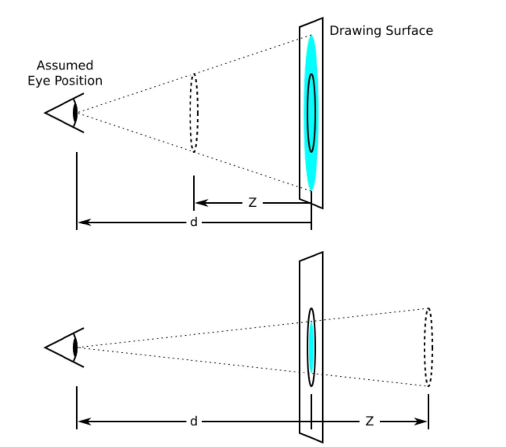
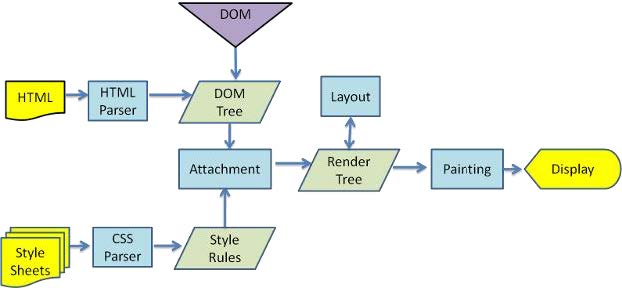

## 坐标系

- `transform` 属性实际转换的是元素的坐标系，使得元素随着坐标系转换

- `CSS` 中每个元素都有一个坐标系
  - 元素的初始坐标系的原点位于元素的左上角
  - 用 `transform` 属性变换的元素会受 `transform-origin` 属性影响，该属性用于指定变换的坐标原点
  - `transform-origin` 属性的默认值为 `50% 50% 0`，因此默认情况下，应用了 `transform` 属性的元素的坐标原点会移动到元素的中心
  - 如果使用 `transform` 属性旋转或倾斜了坐标系，则后续的变换都会基于新的的坐标系，因此 `transform` 中不同的 `transform function` 的顺序会影响最终变换结果
- 初始坐标系的 `x`、`y`、`z` 轴的方向
  - `x` 轴为从左往右
  - `y` 轴为从上往下
  - `z` 轴为从屏幕内侧往屏幕外侧
- 当使用 `rotate` 时，如沿着某一轴旋转，则视为将该轴方向面向用户时，正角度即为顺时针，负角度即为逆时针

### `transform`

- `transform` 属性允许在二维或三维空间中旋转、缩放、倾斜或平移给定元素
- `transform` 属性接收的值为各种 `transform function`，常见的有：
  - `translate(x, y)`
    - 平移
  - `scale(x, y)`
    - 缩放
  - `rotate(angle)`
    - 旋转
  - `skew(angle, angle)`
    - 倾斜

### `transform-origin`

- `transform-origin` 用于指定使用 `transform` 时的坐标系原点
- 属性值必须是 `<length>`、`<percentage>` 类型，或 `left`、`center`、`right`、`top`、`bottom` 关键字中的一个
  - `<length>` 类型表示从左上角开始计算，偏移的距离
  - `<percentage>` 类型表示从左上角开始计算，偏移相对元素本身的百分比大小
  - `left` 等同于 `0 50%`
  - `center` 等同于 `50% 50%`
  - `right` 等同于 `100% 50%`
  - `top` 等同于 `50% 0`
  - `bottom` 等同于 `50% 100%`
- 默认值为 `50% 50% 0`
- 最多接收三个值，分别表示元素的坐标原点在 `x`、`y`、`z` 轴方向的偏移
  - 也可以只接收一个值或两个值的情况，省略的值取默认值

## `3D` 变换

### `perspective`

- `perspective` 属性用于开启透视

  - 该属性定义观察者与 `z=0` 的平面的距离，使具有 `3D` 变换的元素产生透视效果

  - 值可以是 `<length>` 类型或 `none`

    - `none` 是默认值，即没有开启透视效果
    - `<length>` 类型表示观察者与 `z=0` 的平面的距离，即下图中的 `d`

    

  - `perspective` 属性可以给容器元素设置，使得其子元素都具有透视效果，坐标原点为容器元素的 `transform-origin`

  - 也可以为元素的 `transform` 样式属性中使用 `perspective(n)` 使得当前元素具有透视效果（注意 `transform` 函数的生效有先后顺序），坐标原点为该元素的  `transform-origin`

### `backface-visibility`

- `backface-visibility` 属性用于指定元素背面朝向观察者时是否可见
- 可选值
  - `visible`
  - `hidden`

### 常见 `3D` 变换函数

- `translate3d(x, y, z)`
  - 平移
  - 也可分别使用 `translateX(x)`、`translateY(y)`、`translateZ(z)` 单独设置不同方向的平移
  - 其中，如果使用了 `translate3d` 或 `translateZ`，则会开启 `3D` 变换的视觉效果，开启 `3D` 形变后浏览器会创建一个合成层，以便能够进行硬件加速和更高效的绘制和合成，其余 `3D` 变换函数也是如此
- `scale3d(x, y, z)`
  - 缩放
  - 也可分别使用 `scaleX(x)、scaleY(y)、scaleZ(z)` 单独设置不同方向的缩放
- `rotate3d(x, y, z, angle)`
  - 旋转
  - `x、y、z` 用于定义旋转轴在 `3D` 空间中的方向，可以是任意浮点数
  - `angle` 表示旋转的角度，正数为顺时针，负数为逆时针
  - 如 `rotate3d(1, 1, 1, 45deg)` 表示一个元素沿着向量 `(1, 1, 1)` 方向旋转`45` 度
  - 也可分别使用 `rotateX(deg)、rotateY(deg)、rotateZ(deg)` 单独设置不同方向的旋转角度

### 创建 `3D` 空间

- `transform-style`
  - 用于设置容器元素的子元素如何在 `3D` 空间中呈现
  - 值可以是：
    - `flat`
      - 表示所有子元素在 `2D` 平面呈现
      - 即使子元素应用了 `3D` 变换，它们都会被渲染在各自的空间中，最终渲染到 `2D` 平面中，互相之间只会受层叠顺序影响
    - `preserve-3d`
      - 表示所有子元素在 `3D` 空间中呈现
      - 其子元素们会在同一个 `3D` 空间中渲染，它们的 `3D` 变换效果会互相影响

## 动画

- `CSS3` 中可以使用 `@keyframes` 规则创建动画，使用 `animation` 执行动画

- `@keyframes`

  - 基本语法

    ~~~css
    @keyframes animationname {
      keyframes-selector {css-styles;}
    }
    ~~~

  - `animationname`

    - 动画的名称

  - `keyframes-selector`

    - 描述动画的阶段
    - 常见的有 `from`（等同于 `0%`）、`to`（等同于 `100%`）
    - 或者可以使用在 `0%` 到 `100%` 之间的任何百分比

  - `css-styles`

    - 当前阶段应用的 `CSS` 样式

- `animation`

  - 是一个简写属性，分别用于设置六个动画属性：
    - `animation-name`
      - 指定 `@keyframes` 定义的动画名称
    - `animation-duration`
      - 指定动画完成一个周期所花费的秒数或毫秒数
      - 可以带单位，`s` 或 `ms`
      - 默认为 `0`，即动画会瞬间变成结束状态
    - `animation-timing-function`
      - 描述动画的速率曲线
      - 常见的值有
        - `linear`
          - 等于 `cubic-bezier(0,0,1,1)`
          - 默认值
        - `ease`
          - 等于 `cubic-bezier(0.25,0.1,0.25,1)`
        - `ease-in`
          - 等于 `cubic-bezier(0.42,0,1,1)`
        - `ease-out`
          - 等于 `cubic-bezier(0,0,0.58,1)`
        - `ease-in-out`
          - 等于 `cubic-bezier(0.42,0,0.58,1)`
        - `cubic-bezier(x1, y1, x2, y2)` 函数
          - 生成一个贝塞尔曲线作为动画的速度曲线
          - 四个参数分别是控制贝塞尔曲线的两个控制点的 `x` 和 `y` 的坐标
          - [cubic-bezier.com](http://cubic-bezier.com/)
      - `animation-delay`
        - 动画延迟的时间，单位可以指定秒或毫秒
        - 默认为 `0`
      - `animation-iteration-count`
        - 指定动画的播放次数
        - 设置为数字以指定
        - 设置为 `infinite` 则表示无限循环
      - `animation-direction`
        - 动画播放方向
        - 常见的值有
          - `normal`
            - 动画从头到尾播放，然后回到开始
            - 默认值
          - `reverse`
            - 动画从尾到头播放，然后回到尾部
          - `alternate`
            - 动画先从头到尾播放
            - 如果有下一次，则再从尾到头播放
          - `alternate-reverse`
            - 动画先从尾到头播放
            - 如果有下一次，则再从头到尾播放
  - 省略写法
    - 其中 `animate-name` 是必须定义的
    - 其余属性可以省略并使用默认值
    - 如果出现第一个时间值，则会被认为是 `animation-duration`，如果出现第二个时间值，则会被认为是 `animation-delay`

## 浏览器渲染流程

1. 解析 `HTML`
   - 浏览器会将接收到的 `HTML` 文档解析为 `DOM Tree`
2. 解析 `CSS`
   - 包括内联样式、外部 `CSS` 样式以及 `JS` 中的 `CSS`
   - 解析的结果是一个 `CSSOM Tree`（`CSS` 对象模型树）
3. 构建 `Render Tree`
   - 浏览器将 `DOM Tree` 和 `CSSOM Tree` 结合构建 `Render Tree`
   - `Render Tree` 中每个节点包含元素的视觉信息
   - `DOM Tree` 中的一些元素可能不会出现在 `Render Tree` 中（比如设置了 `display: none` 的元素，`HTML` 中的 `head` 标签等）
4. 布局（`Layout`）
   - `Render Tree` 构建完成后，浏览器就会开始进行 `Layout`
   - `Layout` 阶段，浏览器会确定 `Render Tree` 中的每个节点在页面上的确切位置和大小，其成果通常被称为**盒模型**（`Box Model`），它定义了元素在网页布局中所占据空间的方式
   - 当页面渲染完成后，如果页面中元素的位置、大小发生变化而影响了其它元素，则需要重新计算布局，这个过程被称为**回流**或**重排**（`Reflow`）
5. 绘制（`Paint`）
   - 布局完成后，浏览器开始可见元素转换为实际像素绘制在屏幕上
   - 默认的标准流是在同一渲染层（也称为合成层）上绘制，一些特殊的属性会创建新的渲染层绘制
   - 当页面渲染完成后，如果页面中元素发生了一些不影响布局的样式变化，则需要重新绘制，这个过程被称为**重绘**（`Repaint`），且回流必会导致重绘
6. 合成（`Composite`）
   - 绘制完成后，如果一些特殊属性创建了新的渲染层，则会进入合成阶段
   - 浏览器会将所有的渲染层按照顺序合成到一起，生成最终的屏幕图像
   - 该阶段通常由 `GPU` 进行处理，因此具有更高的性能，但是会消耗更高的内存和 `GPU` 资源

