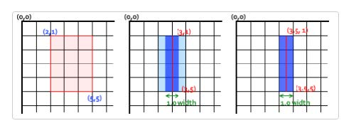
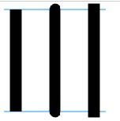
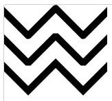
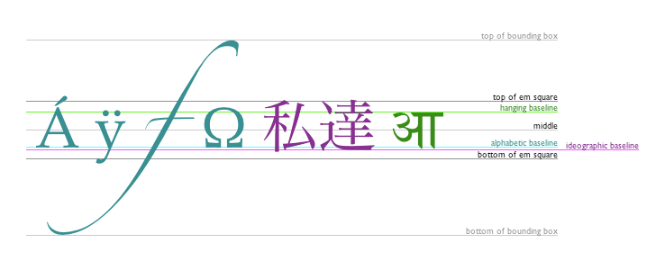

## 简介

- `Canvas` 是一种 `HTML5` 元素
- `Canvas` 提供了一个绘图区域以及很多 `JavaScript` 绘图 `API`，使得可以使用 `JavaScript` 在 `Canvas` 上进行图形绘制

- `Canvas` 上绘制的图形是由像素构成的，并能以 `png` 或 `jpg` 格式保存结果图像
- `Canvas` 主要用于绘制 `2D` 图像，也可以使用 `Canvas` 提供的 `WebGL API` 来绘制 `3D` 图形

## `<canvas>` 标签

- `<canvas>` 标签只有 `width` 和 `height` 两个属性，单位默认为 `px`，如果没有设置，则初始化的宽度为 `300px`，高度为 `150px`
- `<canvas>` 是双标签元素，必须要有结束标签

## `API`

- 通过 `canvas` 元素的 `DOM` 对象(以下称为 `canvasEl`)获取 `canvas` 提供的 `API`
- `getContext()`

  - 从 `canvasEl` 中获取

  - 用于获取对 `Canvas` 的上下文引用
  - 该方法接收一个字符串参数，用于确定要获取的上下文类型，常用的值有：
    - `'2d'`
      - 用于返回一个 `CanvasRenderingContext2D` 对象，表示二维渲染上下文
    - `'webgl'` 或 `'experimental-webgl'`
      - 用于返回一个 `WebGLRenderingContext` 对象，表示三维渲染上下文
  - 返回一个渲染上下文 `CanvasRenderingContext2D`
    - 渲染上下文提供了绘图的指令

## `Grid`

- `Canvas` 中的 `Grid` 指的是 `Canvas` 元素的二维网格系统，它是一个坐标系统
- `Grid` 的一些基本特性
  - 坐标原点 `(0,0)` 默认位于 `Canvas` 元素的左上角
  - 坐标原点可以移动，移动后所有变换都将基于新的坐标系
  - `x` 轴方向是从左往右，`y` 轴方向是从上往下
  - `Grid` 中的一个单元默认相当于一个像素，例如在一个 `800 像素 * 600 像素` 的 `Canvas` 上，有 `800` 个可用的 `x` 坐标和 `600` 个可用的 `y` 坐标

## 路径

- 路径（`Path`）是许多点连相连形成的一系列的线段和曲线，可以用来创建各种形状
- 路径可以由许多子路径构成
- 路径列表是一系列路径命令的集合，这些命令一起描述了如何绘制图形
- `CanvasRenderingContext2D` 提供了一些绘制路径的方法
  - `beginPath()`
    - 用来创建一个新的路径列表
    - 一旦调用，后续的路径绘制方法（如 `moveTo` 和 `lineTo`）都将在这个新路径上进行绘制，直到再次调用 `beginPath` 创建另一个新的路径列表，而之前的路径列表将被清空
  - `moveTo(x, y)`
    - 用来将路径的起点移动到指定的位置
    - 使用 `moveTo` 能够绘制一些不连续的路径
    - 如果在 `beginPath` 调用后不调用 `moveTo`，而直接调用 `lineTo` 或 `arc`，那么会默认将路径起点移动到下一条命令（ `lineTo` 或 `arc`）中的起始点
    - 在 `lineTo` 或 `arc` 调用后，则只能使用 `moveTo` 来改变之后子路径的起始点，否则上一条子路径的终点和下一条子路径的起点将被一条线段相连，形成一条连续的路径
  - `lineTo(x, y)`
    - 用来从当前位置绘制一条线段到指定的位置
    - `x`、`y` 用来指定直线结束的点
  - `arc(x, y, radius, startAngle, endAngle, anticlockwise)`
    - 用来在路径中添加一个弧线或圆形
    - 接收参数
      - `x`、`y`
        - 圆弧的圆心坐标
      - `radius`
        - 圆弧的半径
      - `startAngle`、`endAngle`
        - 圆弧的起始角度和结束角度，单位是弧度
        - `0` 弧度指的是 `3` 点钟方向，顺时针方向为正向
      - `anticlockwise`
        - 接收一个布尔值
        - 如果为 `true`，那么圆弧会逆时针方向绘制
        - 默认为 `false`
  - `rect(x, y, width, height)`
    - 用于在路径中添加一个矩形
    - 接收的参数等同于 `fillRect` 等方法
    - 与 `lineTo` 和 `arc` 不同，调用 `rect` 时，会自动调用 `moveTo` 将路径起始点设置到 `rect` 的左上角
  - `closePath()`
    - 用来闭合路径
    - 调用后会创建一条从当前位置到路径起点的直线，从而闭合路径
    - 在一个闭合路径中，路径方向的右侧会被认为是内部，路径方向的左侧会被认为是外部，在闭合路径嵌套的情形下，内部路径的方向将影响 `fill()` 和 `clip()` 的生效区域
  - `stroke()`
    - 用来给当前路径描边
  - `fill()`
    - 用来填充路径内部区域内部生成实心的图形
    - 调用 `fill` 时，如果路径没有闭合，则会自动调用 `closePath`
  - `clip()`
    - 用于创建剪切路径（`clipping path`）
    - 调用后当前路径就会被应用为剪切路径，之后绘制的内容只有在剪切区域内部才会被显示

## 矩形绘制

- `CanvasRenderingContext2D` 提供了一些绘制矩形的方法
  - `fillRect(x, y, width, height)`
    - 绘制一个填充的矩形
  - `strokeRect(x, y, width, height)`
    - 绘制一个矩形的边框
  - `clearRect(x, y, width, height)`
    - 清除指定的矩形区域，使其完全透明
- 这些方法接收相同的参数
  - `x`、`y`
    - 矩形的左上角的坐标
  - `width`、`height`
    - 矩形的尺寸

## 色彩

- `CanvasRenderingContext2D` 提供了一些控制色彩的属性
  - `fillStyle`
    - 图形的填充颜色
  - `strokeStyle`
    - 图形的轮廓颜色
- 将 `CSS` 颜色属性字符串赋值给以上属性可以改变图形的色彩，且该新值会称为新绘制的图形的默认值
- 默认色彩是纯黑

## 透明度

- 使用 `rgba` 色彩值可以控制色彩透明度
- 还可以使用 `CanvasRenderingContext2D` 提供的 `globalAlpha` 属性设置全局透明度
- 将 `0.0 ~ 1.0` 之间的数值赋值给 `globalAlpha` 属性，可以修改当前的全局透明度，默认值为 `1.0`，即完全不透明

## 线型

- `CanvasRenderingContext2D` 提供了一些控制线型的属性
  
  - `lineWidth`
    - 用于设置线条宽度
    
    - 默认值为 `1.0`
    
    - 如下图所示，当 `lineWidth` 为 `1.0` 时，绘制一条 `(3.5,1)` 到 `(3.5,5)` 的直线，渲染的结果相较于绘制一条 `(3,1)` 到 `(3,5)` 的直线要准确
    
      
    
  - `lineCap`
  
    - 用于设置线条末端样式
  
    - 可接收以下三种值
  
      - `'butt'` 截断，默认值
      - `'round'` 圆形
      - `'square'` 方形
  
    - 三种 `lineCap` 示意
  
      
  
  - `lineJoin`
  
    - 用于设置线条相交的方式
  
    - 可以接收以下三种值
  
      - `'round'` 圆角
      - `'bevel'` 斜角
      - `'miter'` 斜接
  
    - 三种 `lineJoin` 示意
  
      
  
  - `miterLimit`
  
    - 用于当 `lineJoin` 是 `'miter'` 时，设置斜接长度与线条宽度所允许的最大比例
    - 如果超出这个比例，那么焦点会以 `'bevel'` 的方式来显示
    - 默认值为 `10.0`
  
  - `setLineDash(segments)`
  
    - 该方法用于设置线条为虚线
    - 接收一个数组，数组中的数值表示交替的线条和间隙的长度
      - 如接收 `[5, 15]`，则表示虚线中每一段线条长度为 `5`，间隙长度为 `15`
  
  - `lineDashOffset`
  
    - 用于设置虚线模式下的起始偏移量，向前偏移
    - 如将 `5` 赋值给 `lineDashOffset`，则代表虚线的初始偏移量为 `5`
    - 默认为 `0`

## 文本绘制

- `CanvasRenderingContext2D` 提供了一些绘制文本的方法

  - `fillText(text, x, y[, maxWidth])`
    - 用于绘制填充文本
  - `strokeText(text, x, y[, maxWidth])`
    - 用于绘制描边文本

- `CanvasRenderingContext2D` 提供了设置文本样式的属性，需要在调用绘制方法前设置

  - `font`

    - 用于设置文本的样式
    - 接收 `CSS` 的 `font` 属性字符串
    - 默认值是 `'10px sans-serif'`

  - `textAlign`

    - 用于设置文本的水平对齐方式
    - 可选值有
      - `'start'`（默认值）
      - `'end'`
      - `'left'`
      - `'right'`
      - `'center'`

  - `textBaseline`

    - 用于设置文本的垂直对齐方式

    - 可选值有

      - `'alphabetic'`（默认值）
        - 文本基线位置与拉丁字母字符的基线对齐
      - `'ideographic'`
        - 文本基线位置与中文字符的基线对齐
      - `'top'`
        - 文本基线与字符顶部对齐
      - `'hanging'`
        - 文本基线与字符的 `hangding baseline` 对齐
      - `'middle'`
        - 文本基线与字符的中线对齐
      - `'bottom'`
        - 文本基线与字符的底部对齐

    - 基线示意

      

  - `direction`

    - 用于设置文本方向
    - 可选值有
      - `'inherit'`（默认值）
        - 继承 `Canvas` 的父元素的文本方向设置
      - `'ltr'`
        - 从左到右
      - `'rtl'`
        - 从右到左

## 绘制图片

- `CanvasRenderingContext2D` 提供了一些绘制图片的方法
  - `drawImage()`
    - 有三种接收参数的方式
      - `drawImage(image, dx, dy)`
      - `drawImage(image, dx, dy, dWidth, dHeight)`
      - `drawImage(image, sx, sy, sWidth, sHeight, dx, dy, dWidth, dHeight)`
    - 参数的含义
      - `image`
        - 要绘制的图像
        - 可以是 `HTMLImageElement`、`HTMLCanvasElement`、`HTMLVideoElement` 或 `ImageBitmap` 对象
      - `dx`、`dy`、`dWidth`、`dHeight`
        - `d` 代表 `destination`，即目标图像
        - 表示目标图像放置在 `Canvas` 上的坐标和大小
      - `sx`、`sy`、`sWidth`、`sHeight`
        - `s` 代表 `source`，即源图像
        - 表示从源图像上截取的坐标和大小
        - 用于裁剪源图像

## 绘画状态

- `Canvas` 的绘画状态是当前绘画时所产生的样式和形变的一个快照，样式和形变主要包括：
  - 填充和描边样式（`fillStyle` 和 `strokeStyle`）
  - 线条样式（`lineWidth`、`lineCap`、`lineJoin`）
  - 字体样式（`font`、`textAlign`、`textBaseline`）
  - 全局透明度（`globalAlpha`）
  - 全局复合操作（`globalCompositionOperation`）
  - 裁剪路径（`clipping path`）
  - 转换矩阵（`translate`、`rotate`、`scale` 等）

### 保存、复原状态

- 可以使用 `save()` 和 `restore()` 方法来保存和恢复这些绘画状态
  - `save()` 方法会将当前的绘画状态推入一个栈中
  - `restore()` 方法用于从栈中弹出栈顶的绘画状态，并设置为当前 `Canvas` 的绘画状态，如果栈为空则不会有任何效果

### 变形（`Transformation`）

- `CanvasRenderingContext2D` 提供了四种形变的方法
  - `translate(x, y)`
    - 移动 `Canvas` 和它的坐标原点到一个新的位置
    - `x`、`y` 是分别要将坐标原点沿 `x`、`y` 轴移动的距离
  - `rotate(angle)`
    - 以原点为中心旋转 `Canvas`，`angle` 的单位是弧度
  - `scale(x, y)`
    - 扩大或缩小 `Canvas` 中的图形
    - `x`、`y` 分别是图形在 `x` 轴和 `y` 轴的缩放因子
  - `transform(a, b, c, d, e, f)`
    - 定义一个变形矩阵，通过修改变形矩阵来让图形发生形变
    - 如果重复调用，则会在原来的矩阵基础上再次变形
    - 参数说明
      - `a` 代表 `scaleX`，水平缩放
      - `b` 代表 `skewY`，垂直倾斜
      - `c` 代表 `skewX`，水平倾斜
      - `d` 代表 `scaleY`，垂直倾斜
      - `e` 代表 `translateX`，水平移动
      - `f` 代表 `translateY`，垂直移动
    - 在计算机图形学中，变形矩阵是用来应用仿射变换的一中概念
  - `setTransform(a, b, c, d, e, f)`
    - 定义变形矩阵，参数同 `transform`
    - 如果重复调用，则会重置变形矩阵后再变形
  
- `Canvas` 中的变形本质是在改变 `Canvas` 的坐标系，而影响后续的绘图操作，因此要将希望应用的变形方法先调用，再绘制对应的图形

## 动画

- 在 `Canvas` 中执行动画，需要对画布上的所有图形逐帧重绘
- 为了实现动画，需要一些可以定时执行重绘的方法，比如
  - `serInterval`、`setTimeout`（不推荐）
    - `setInterval` 和 `setTimeout` 定时器并不精准
    - 它们的回调函数会被放到宏任务中执行等待，如果微任务中有一直未处理完成的任务，那么回调函数可能不会在指定时间内触发回调
  - `requestAnimationFrame` 方法
    - 浏览器提供的 `requestAnimationFrame` 方法被设计用来创建高效率的 `JavaScript` 动画
    - 接收一个回调函数作为参数
      - 这个回调函数会在屏幕下一次刷新（比如 `60Hz` 刷新率的屏幕，一秒就会执行 `60` 次该回调函数）之前被执行
      - 浏览器会传递 `DOMHighResTimeStamp` 作为参数给该回调函数
        - `DOMHighResTimeStamp` 是一个由 `High Resolution Time API` 提供的数据类型，表示一个以毫秒为单位的时间值
        - 精度可以达到微秒级（`1ms` 的百万分之一）
        - 在 `requestAnimationFrame` 的上下文中，传递给回调函数的 `DOMHighResTimeStamp` 参数表示的是从文档开始加载到执行该回调函数时的经过时间
        - 该时间戳类似于调用 `performance.now()` 得到的返回值
        - 可以使用这个时间戳来计算动画的进度
    - 执行后会返回一个请求 `ID`
      - 它是一个非零整数，是当前动画帧请求的唯一标识
      - 可以传递此 `ID` 给 `cancelAnimationFrame` 方法以取消动画帧请求

- 如何绘制动画中的某一帧
  - 定义一个绘制函数，在函数中定义绘制的代码
  - 必要时需清空上一帧中不需要的部分，可以借助 `clearRect` 方法
  - 开始绘制之前先使用 `save` 方法保存 `Canvas` 状态
  - 绘制这一帧的图形，可以根据函数接收的时间戳或其它变量决定这一帧的内容
  - 使用 `restore` 方法恢复 `Canvas` 状态
  - 将当前函数作为参数传入 `requestAnimationFrame` 方法调用

- 动画案例，时钟

  ~~~javascript
  const canvasEl = document.querySelector('canvas')
  const ctx = canvasEl.getContext('2d')
  
  // 缩放因子
  const scaleFactor = 1
  canvasEl.width = canvasEl.height = 300 * scaleFactor
  // Π
  const PI = Math.PI
  // 边框圆角
  const cornerRadius = 0.15 * canvasEl.width
  // 内圆半径
  const clockRadius = 135 * scaleFactor
  // 刻度线长度
  const scaleMarkLength1 = clockRadius / 20
  const scaleMarkLength2 = clockRadius / 20
  const scaleMarkLength3 = clockRadius / 40
  // 指针尺寸
  const hoursHandLength = 70 * scaleFactor
  const hoursHandWidth = 8 * scaleFactor
  const minuesHandLength = 110 * scaleFactor
  const minutesHandWidth = 6 * scaleFactor
  const secondsHandLength = 120 * scaleFactor
  const secondsHandWidth = 3 * scaleFactor
  // 字体
  const fontSize = 30 * scaleFactor
  
  /**
   * rotaCopy 旋转赋值
   * @param {*} fn
   *  - 要赋值的绘制函数
   * @param {*} deg
   *  - 旋转的角度，单位为弧度
   * @param {*} n
   *  - 旋转的次数
   * @param  {*} offset
   *  - 偏移角度
   * @param  {...any} args
   *  - 剩余参数
   */
  function rotaCopy(fn, deg, n, offset, ...args) {
    ctx.save()
    ctx.rotate(offset)
    for (let i = 0; i < n; i++) {
      ctx.rotate(deg)
      fn(...args)
    }
    ctx.restore()
  }
  
  function drawFrame() {
    ctx.save()
  
    // 绘制四分之一的外框，传入 0-3 之间的数让其旋转
    function drawQuarterFrame(n) {
      ctx.save()
  
      ctx.beginPath()
      ctx.translate(-150 * scaleFactor, -150 * scaleFactor)
      ctx.arc(cornerRadius, cornerRadius, cornerRadius, -PI, -PI / 2)
      ctx.lineTo(150 * scaleFactor, 0)
      ctx.lineTo(150 * scaleFactor, 150 * scaleFactor)
      ctx.lineTo(0, 150 * scaleFactor)
      ctx.lineTo(0, cornerRadius)
      ctx.fill()
  
      ctx.restore()
    }
  
    rotaCopy(drawQuarterFrame, PI / 2, 4)
  
  
    // 时钟显示区域
    ctx.beginPath()
    ctx.arc(0, 0, clockRadius, 0, 2 * PI)
    ctx.fillStyle = '#fff'
    ctx.fill()
  
    ctx.restore()
  }
  
  function drawPlate() {
    ctx.save()
  
    function drawBasicScaleMark(scaleMarkLength) {
      ctx.save()
      ctx.beginPath()
      ctx.moveTo(clockRadius, 0)
      ctx.lineWidth = 2 * scaleFactor
      ctx.lineTo(clockRadius - scaleMarkLength, 0)
      ctx.stroke()
      ctx.restore()
    }
  
    function drawScaleMarks1() {
      ctx.save()
      drawBasicScaleMark(scaleMarkLength1)
      rotaCopy(drawScaleMarks2, PI / 2 / 3, 2, 0)
      rotaCopy(drawScaleMarks3, PI / 2 / 3 / 5, 4, 0)
      ctx.restore()
    }
  
    function drawScaleMarks2() {
      ctx.save()
      drawBasicScaleMark(scaleMarkLength2)
      rotaCopy(drawScaleMarks3, PI / 2 / 3 / 5, 4, 0)
      ctx.restore()
    }
  
    function drawScaleMarks3() {
      ctx.save()
      drawBasicScaleMark(scaleMarkLength3)
      ctx.restore()
    }
  
    rotaCopy(drawScaleMarks1, PI / 2, 4, 0)
  
    ctx.restore()
  }
  
  function drawNumbers() {
    ctx.save()
  
    for (let i = 1; i <= 12; i++) {
      ctx.save()
      ctx.rotate(PI / 6 * (i - 3))
      ctx.translate(clockRadius - 25 * scaleFactor, 0)
      ctx.rotate(-PI / 6 * (i - 3))
      ctx.fillText(i, 0, 0 * scaleFactor)
      ctx.restore()
    }
  
    ctx.restore()
  }
  
  function drawClockHands() {
    const timestamp = Date.now() / 1000
    const seconds = timestamp % 60
    const minutes = timestamp / 60 % 60
    const hours = new Date().getHours()
    const hoursValue = (hours + minutes / 60)
    ctx.save()
    drawClockHand(hoursHandLength, hoursHandWidth, hoursValue * 5)
    drawClockHand(minuesHandLength, minutesHandWidth, minutes)
    drawClockHand(secondsHandLength, secondsHandWidth, seconds, 'rgb(255,70,0)')
    ctx.restore()
  }
  
  /**
   * drawClockHand 绘制指针
   * @param {*} length
   *  - 指针长度
   * @param {*} width
   *  - 指针宽度
   * @param {*} value
   *  - 指针数值
   */
  function drawClockHand(length, width, value, color) {
    ctx.save()
    if (color) {
      ctx.strokeStyle = color
    }
    ctx.rotate(-PI / 2 + value * PI / 30)
    ctx.lineWidth = width
    ctx.lineCap = 'round'
    ctx.beginPath()
    ctx.moveTo(0, 0)
    ctx.lineTo(length, 0)
    ctx.stroke()
    ctx.restore()
  }
  
  function draw() {
    ctx.save()
    ctx.font = fontSize + 'px san-serif'
    ctx.textAlign = 'center'
    ctx.textBaseline = 'middle'
  
    ctx.translate(150 * scaleFactor, 150 * scaleFactor)
    drawFrame()
    drawPlate()
    drawNumbers()
    drawClockHands()
  
    ctx.restore()
    requestAnimationFrame(draw)
  }
  
  requestAnimationFrame(draw)
  ~~~
