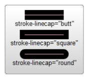
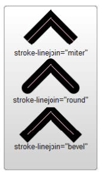

## 简介

- `SVG` 全称 `Scalable Vector Graphics`，即**可缩放矢量图形**
- `SVG` 是一种基于 `XML` 格式的矢量图，主要用于定义二维图形，支持交互和动画
- `SVG` 特点
  - 优点
    - 可以无损缩放
    - 可以结合 `JS`、`CSS`、`SMIL` 等语言进行操作，也可以进行动画处理
    - 轻量级，也可压缩
    - 由于基于 `XML`，只需文本编辑器就可以编辑 `SVG` 图像
    - 可以为 `SVG` 加上标题和描述，使其可以被搜素引擎索引
  - 缺陷
    - 不擅长绘制高细节图片
    - 图像复杂时，渲染就会变得很慢
- 绘制 `SVG` 矢量图的几种方式
  - 在单独的 `svg` 文件中绘制
  - 使用 `Adobe Illustrator` 等矢量绘图工具绘制矢量图，导出为 `svg` 文件
  - 在 `HTML` 文件中使用 `svg` 元素
  - 使用 `JavaScript` 代码生成 `svg` 矢量图

## `SVG` 创建与使用

### `XML` 声明方式

- `SVG` 是一个 `XML` 文件格式，编写 `XML` 文档时，通常推荐编写 `XML` 声明

- `XML` 声明一般位于 `XML` 文档的开始，并定义了 `XML` 文档的版本、字符编码和独立性，例：

  ~~~xml
  <?xml version="1.0" encoding="UTF-8" standalone="no"?>
  ~~~

  - `version` 用于指定版本，是必填项
  - `encoding` 用于指定 `XML` 文档的编码格式，默认是 `UTF-8`
  - `standalone` 用于指定当前 `XML` 文档是否依赖于外部标记声明
    - 默认是 `no`，表示该 `XML` 文档依赖外部标记声明
    - 如果是 `yes`，表示该 `XML` 文档是独立的，没有依赖外部定义

- `DTD`（`Document Type Definition`）即文档类型声明，定义了 `XML` 文档的结构。它描述了 `XML` 文档中允许哪些元素以及元素的顺序、嵌套关系等

  - `XML` 的 `DTD` 声明

    - 内部 `DTD` 声明

      ~~~xml
      <?xml version="1.0"?>
      <!DOCTYPE note [
      <!ELEMENT note (to,from,heading,body)>
      <!ELEMENT to (#PCDATA)>
      <!ELEMENT from (#PCDATA)>
      <!ELEMENT heading (#PCDATA)>
      <!ELEMENT body (#PCDATA)>
      ]>
      <note>
        <to>John</to>
        <from>Jane</from>
        <heading>Reminder</heading>
        <body>Don't forget the meeting!</body>
      </note>
      ~~~

      - 其中 `<!DOCTYPE note [ ... ]>` 部分的内容就是一个 `DTD`
      - `DTD` 定义了一个名为 `note` 的元素，该元素内包含 `to`、`from`、`heading`、`body` 四个子元素，这些子元素都只包含 #`PCDATA`（ `Parsable Character Data`，可解析的字符数据）

    - 外部 `DTD` 声明

      - 可以通过 `SYSTEM` 关键字声明一个外部的 `DTD` 文件，可以使用相对路径、绝对路径，也可以使用网络地址

        ~~~xml-dtd
        <!DOCTYPE note SYSTEM "./Note.dtd">
        ~~~

        ~~~xml-dtd
        <!DOCTYPE note SYSTEM "http://www.example.com/Note.dtd">
        ~~~

      - 可以通过 `PUBLIC` 关键字来引用一公共的 `DTD`，需要一个公共标识符（用来识别 DTD）和一个系统标识符（用来定位 `DTD`），比如早期的 `SVG` 文件可以这样声明

        ~~~xml-dtd
        <!DOCTYPE svg PUBLIC "-//W3C//DTD SVG 1.1//EN" "http://www.w3.org/Graphics/SVG/1.1/DTD/svg11.dtd">
        ~~~

- `SVG` 声明

  - 通常 `SVG 1.1` 及之后的版本不需要进行 `DTD` 声明，浏览器和其它 `SVG` 解析器通常已经内置了对 `SVG` 语法的理解，只需要在 `SVG` 元素中定义一个 `XML` 命名空间声明 `"http://www.w3.org/2000/svg"`

    ~~~xml
    <svg xmlns="http://www.w3.org/2000/svg">
        <!-- SVG content goes here -->
    </svg>
    ~~~

  - `xmlns` 属性用于定义命名空间

  - `"http://www.w3.org/2000/svg"` 这个命名空间是由 `W3C` 定义的，用于专门标识 `SVG` 元素

  - 当同时使用了 `SVG` 和其它标记语言时，命名空间就可以避免它们之间元素名称的冲突

- `SVG` 文档结构

  - `SVG 1.1` 文档结构

    ~~~xml
    <?xml version="1.0" standalone="no"?>
    <!DOCTYPE svg PUBLIC "-//W3C//DTD SVG 1.1//EN" 
      "http://www.w3.org/Graphics/SVG/1.1/DTD/svg11.dtd">
    <svg width="5cm" height="4cm" version="1.1" baseProfile="full"
         xmlns="http://www.w3.org/2000/svg"
         xmlns:xlink="http://www.w3.org/1999/xlink"
         >
      <desc>A rectangle</desc>
      <rect x="0.5cm" y="0.5cm" width="2cm" height="1cm"/>
    </svg>
    ~~~

  - `SVG 2.0` 文档结构

    ~~~xml
    <?xml version="1.0" standalone="no"?>
    <!-- SVG 2.0 中废弃了 version 属性和 baseProfile 属性 -->
    <svg width="5cm" height="4cm" 
         xmlns="http://www.w3.org/2000/svg">
      <desc>A rectangle</desc>
      <rect x="0.5cm" y="0.5cm" width="2cm" height="1cm"/>
    </svg>
    ~~~

- 不同环境下的 `SVG` 命名空间处理

  - `HTML5` 

    - 可以在 `HTML5` 中直接嵌入 `SVG` 图形，浏览器会默认为 `svg` 标签及其子元素加上 `SVG` 命名空间

  - `JavaScript`

    - 在 `JS` 中创建 `SVG` 时，需手动为 `svg` 元素及其子元素添加命名空间，因此需要使用 `document.createElementNS(ns, elName)` 方法来创建它们

    - 如果使用 `document.createElment(elName)` 创建 `svg` 元素，并将其插入 `DOM` 中时，一些浏览器会尝试将其转换为正确的 `SVG` 元素，但有些浏览器将无法将其识别为 `SVG` 元素

    - 创建 `SVG` 常用的 `DOM2 API`

      - `createElementNS(ns, elName)`
        - 创建命名空间元素
      - `setAttributeNS(ns, attrname, value)`
        - 为命名空间元素添加属性
      - `getAttributeNS(ns, attrname)`
        - 获取命名空间元素上的属性
      - `hasAttributeNS(ns, attrname)`
        - 判断命名空间元素上是否存在某个属性
      - `removeAttributeNS(ns, attrname)`
        - 删除命名空间元素上的某个属性

    - 使用 `JS` 创建 `SVG` 示例

      ~~~javascript
      const svgNS = 'http://www.w3.org/2000/svg'
      const svg = document.createElementNS(svgNS, 'svg')
      /*
       - 在 SVG 2.0 规范中，为了简化 SVG，大部分属性（包括所有 SVG 1.1 属性）变成了无需命名空间的属性
       - 因为在 XML 1.1 命名空间规范中建议，不带前缀的属性的命名空间的名称是没有值的，这时命名空间的值必须使用 null 值
      */
      svg.setAttributeNS(null, 'width', '200')
      svg.setAttributeNS(null, 'height', '200')
      
      /*
       - 在 SVG 1.1 中，存在一些特殊的属性（如 href），需要使用 XLink 命名空间
      */
      const xlinkNS = 'http://w3.org/1999/xlink'
      const image = document.createElementNS(svgNS, 'image')
      image.setAttributeNS(xlinkNS, 'xlink:href', 'foo.png')
      ~~~

### `HTML5` 中引入 `SVG`

- 有多种方式可以在 `HTML5` 中引入 `SVG`

- 在 `img` 元素中引入 `svg` 文件

  ~~~html
  
  ~~~

  - 不支持交互

- 在 `CSS` 中将 `svg` 文件作为背景图片添加给元素

  ~~~css
  .box{
    background-image: url(./foo.svg)
  }
  ~~~

  - 不支持交互

- 直接在 `html` 中嵌入 `svg` 代码

  - 支持交互

- 在 `object` 元素上引入

  ~~~html
  <object data="./foo.svg" type="image/svg+xml"></object>
  ~~~

- 在 `iframe` 元素上引入

  ~~~html
  <iframe src="./foo.svg"></iframe>
  ~~~

- 在 `embed` 元素上引入

  ~~~html
  <embed data="./foo.svg" type="image/svg+xml" />

## `SVG` 绘制

### 视口

- 视口（`viewport`）
  - 视口是 `SVG` 可见的区域，也可以说是 `SVG` 图像的画布
  - 可以使用 `<svg>` 元素的 `width` 和 `height` 属性指定视口的大小
  - 一旦设置了最外层 `SVG` 元素的宽度和高度，浏览器就会建立初始**视口坐标系**和初始**用户坐标系**

### 坐标系

- `SVG` 的坐标系统类似于 `Canvas`

- 默认宽为 `300px`，高为 `150px`

- 坐标系统中没有明确指定单位时默认以像素为单位

- `x` 轴方向为从左往右，`y` 轴方向为从上往下

- 初始原点位于左上角

- 如果 `SVG` 中的某个元素用了变形，那么该元素内部会建立一个新的坐标系统，该元素默认后续所有变化都是基于新创建的坐标系统  

- 视口坐标系

  - 视口坐标系是与 `SVG` 容器相关的坐标系统
  - 视口坐标系的原点在 `SVG` 元素的左上角
  - 初始视口坐标系中的一个单位等于视口中的一个像素

- 用户坐标系

  - 也称为**当前坐标系**或**正在使用的用户空间**

  - 用户坐标系是在 `SVG` 内部定义图形时使用的坐标系统

  - 起始用户坐标系和起始视口坐标系的原点和单位大小都相同

  - 可以使用 `viewBox` 属性修改初始用户坐标

    - 当通过 `viewBox` 属性修改用户坐标系时，实际上是在创建一个从视口坐标系到用户坐标系的映射

    - `viewBox` 的值定义了用户坐标系中的一个矩形区域，该区域将被映射到 `SVG` 的视口中

    - `viewBox` 属性值的格式为 `<min-x> <min-y> <width> <height>`

      - `min-x`、`min-y`
        - 矩形区域的左上角在用户坐标系中的坐标
      - `width、height`
        - 矩形区域的大小

    - 例

      ~~~svg
      <svg width="200px" height="200px" viewBox="0 0 50 50">
          <circle cx="25" cy="25" r="25" />
      </svg>
      ~~~

      - 在 `svg` 元素的内容中，以 `(0,0)` 点为左上角，宽高 `50px` 的矩形区域将被绘制到 `viewBox` 区域，`viewBox` 区域将被放大以填充整个视口
      - 此时用户坐标系上的单位大小变成了视口坐标系单位大小的 `4` 倍

    - `viewBox` 映射时，如果宽高比与 `viewport` 的宽高比不同，那么其缩放方式将取决于 `svg` 元素的 `preserveAspectRatio` 属性 
      
      - `preserveAspectRatio` 属性的一些可选值
        - `'none'`
          - 强制拉伸图形以填充整个视口
          - 如果 `viewBox` 的长宽比与视口长宽比不匹配时，则会改变 `viewBox` 的宽高比
        - 用以描述对齐方式的值
          - 格式为 `xAYB`
          - ``A` 和 `B` 分别指代在 `x` 轴和 `y` 轴的对齐方式，可选值有
            - `Min` 表示按该轴最小值对齐
            - `Max` 表示按该轴最大值对齐
            - `Mid` 表示按该轴在中间对齐
          - 比如，`xMinYMax` 表示 `viewBox` 的 `x` 坐标的最小值会与视口的 `x` 坐标最小值对齐，`y` 坐标的最大值会与视口的 `y` 坐标最大值对齐
        - 用以描述 `viewBox` 的长宽比与视口长宽比不匹配时，在保持宽高比的情况下如何调整大小的值
          - `'meet'`
            - 表示 `viewBox` 的所有内容都会在画布上显示
            - 宽高比不同时，视口的某些区域会留白
          - `slice`
            - 表示 `viewBox` 会将整个视口区域占满
            - 宽高比不同时，会将 `viewBox` 超出视口的内容裁剪
      - `preserveAspectRatio` 属性值的可选值中，用以描述对齐方式的值可以和 `meet` 或 `slice` 一起使用，比如 `'xMidYMid meet'` （这是默认值）表示 `viewBox` 居中于视口显示，如果宽高比不同，则 `viewBox` 不会占满整个视口

### 绘制基本形状

#### 绘制矩形

- 使用 `rect` 元素绘制矩形
- `rect` 元素有 `6` 个基本属性
  - `x`、`y`
    - 矩形左上角的坐标
  - `width`、`height`
    - 矩形的宽高
  - `rx、ry`
    - 矩形圆角在 `x` 轴、`y` 轴方向的半径

#### 绘制圆形

- 使用 `circle` 元素绘制圆形
- `circle` 元素有 `3` 个基本属性
  - `r`
    - 圆的半径
  - `cx`、`cy`
    - 圆心的坐标

#### 绘制椭圆

- 使用 `ellipse` 元素绘制椭圆
- `ellipse` 元素是 `circle` 元素更通用的形式，可以分别缩放圆的 `x` 轴和 `y` 轴方向的半径
- `ellipse` 元素有 `4` 个基本属性
  - `rx、ry`
    - 椭圆的 `x` 轴、`y` 轴方向半径
  - `cx`、`cy`
    - 椭圆中心位置的坐标

#### 绘制直线 

- 使用 `line` 元素绘制直线
- 直线需要描边才能显示
- `line` 元素有 `4` 个基本属性
  - `x1`、`y1`
    - 起点坐标
  - `x2`、`y2`
    - 终点坐标

#### 绘制多线段

- 使用 `polyline` 元素绘制多线段
- 默认会将内部填充为黑色（即使没有闭合也会）
- 默认没有描边
- 折线的所有点的位置都放在 `points` 属性中
  - 每个点必须包含 `2` 个数字，分别表示 `x` 坐标和 `y` 坐标
  - 每个数字之间可以使用空格、逗号、换行符分隔开，可以混用
  - 比如点 `(0,0)`、`(1,1)`、`(2,2)` 组成的多段线可以表示为以下几种形式
    - `"0 0, 1 1, 2 2"`
    - `"0, 0, 1, 1, 2, 2"`
    - `"0 0 1 1 2 2"`

#### 绘制多边形

- 使用 `polygon` 元素绘制多边形
- `polyline` 也是由连接一组 `points` 的线段组成，但是它的路径在最后一个点时会自动跳回第一个点
- 默认会将内部填充为黑色
- 多边形的所有点的位置都放在 `points` 属性中

#### 绘制路径

- 使用 `path` 元素绘制路径
- 默认会填充黑色，但默认不会闭合
- `path` 元素使用属性 `d`（含义为 `description`）设置路径点的位置
  - 属性 `d` 的值使用一个 `命令 + 参数` 的序列，每一个命令都用一个关键字母来表示
  - 每一类命令都有两种表示方式
    - 如果使用大写字母，则表示采用绝对定位
    - 如果使用小写字母，则表示上一个点的相对定位
  - `d` 属性支持的命令
    - 移动当前位置
      - `M` 或 `m`
        - 表示 `Move to`
        - 需要两个参数，表示新位置的 `x` 和 `y` 坐标
        - 示例
          - `M 10 10` 表示移动到绝对位置 `(10,10)`
          - `m 10 10` 表示从当前位置分别向 `x`、`y` 轴方向移动 `10` 单位
    - 关闭路径
      - `Z` 或 `z`
      - 表示 `Cloth path`
      - 返回到当前子路径的开始点，形成一个闭合路径
      - 不需要参数
    - 直线命令
      - `L` 或 `l`
        - 表示 `Line to`
        - 需要两个参数，表示直线的终点位置的 `x` 和 `y` 坐标
      - `H` 或 `h`
        - 表示 `Horizontal line to`
        - 需要一个参数，表示直线终点的 `x` 坐标
      - `V` 或 `v`
        - 表示 `Vertical line to`
        - 需要一个参数，表示直线终点的 `y` 坐标
    - 曲线命令 [贝塞尔曲线 - 知乎 (zhihu.com)](https://zhuanlan.zhihu.com/p/366797450)
      - `C` 或 `c`
        - 表示 `Cubic Bezier curve to`，即三次贝塞尔曲线
        - 从当前位置画一条贝塞尔曲线到曲线终点位置
        - 需要六个参数
          - 前两个代表第一个控制点
          - 中间两个代表第二个控制点
          - 最后两个代表曲线的终点
      - `S` 或 `s`
        - 表示 `Smooth cubic Bezier curve to`，即平滑的三次贝塞尔曲线
        - 如果上一条命令是 `C` 或 `S `，那么将在此基础上创建一条平滑的三次贝塞尔曲线到曲线终点位置，其第一个控制点会自动被设置
        - 如果上一条命令不是 `C` 或 `S`，那么创建的三次贝塞尔曲线，其第一个控制点和前一个命令的结束点相同
        - 需要四个参数
          - 前两个代表第二个控制点
          - 后两个代表曲线的终点
      - `Q` 或 `q`
        - 表示 `Quadratic Bezier curve to`，即二次贝塞尔曲线
        - 从当前位置画一条贝塞尔曲线到曲线终点位置
        - 需要四个参数
          - 前两个代表控制点
          - 后两个代表曲线的终点
      - `T` 或 `t`
        - 表示 `Smooth quadratic Bezier curve to`，即平滑的二次贝塞尔曲线
        - 如果上一条命令是 `Q` 或 `T `，那么将在此基础上创建一条平滑的二次贝塞尔曲线到曲线终点位置，其控制点会自动被设置
        - 如果上一条命令不是 `Q` 或 `T`，那么创建的三次贝塞尔曲线，其控制点和前一个命令的结束点相同
        - 需要两个参数，用来代表曲线的终点
      - `A` 或 `a`
        - 表示 `Arc to`
        - 从当前位置为起始画一条弧线到终点位置
        - 需要七个参数，按顺序为
          - `x` 轴方向半径
          - `y` 轴方向半径
          - `x` 轴旋转角度
          - 选择大弧还是小弧（取值 `1` 为大弧，取值 `0` 为小弧）
          - 是否顺时针（取值 `1` 为顺时针，取值 `0` 为逆时针）
          - 弧线终点 `x` 坐标
          - 弧线终点 `y` 坐标

#### 插入图片

- 使用 `image` 元素插入图片
- 基本属性
  - `x`、`y`
    - 图片坐标位置
    - 默认都是 `0`
  - `width、height`
    - 图片显示的大小
    - 默认为图片本身的大小
  - `href`
    - 图像文件的 `URL`
  - `xlink:href`
    - `XML 1.1` 及之前的 `href` 属性，可以和 `href` 同时设置，用于兼容不同的版本

#### 绘制文字

- 使用 `text` 元素绘制文字

- 基本属性
  - `x、y`
    - 文本坐标位置
  - `text-anchor`
    - 文本相对于文本坐标的对齐方式
    - 可选值有
      - `start`（默认值）
        - 文本左下角与文本坐标对齐
      - `middle`
        - 文本中下方与文本坐标对齐
      - `end`
        - 文本右下角与文本坐标对齐
      - `inherit`
  - `dominant-baseline`
    - 文本基线对齐方式
    - 可选值有
      - `auto`（默认值）
      - `middle`
      - `hanging`

- 字体属性，类似于 `CSS` 中的字体属性

  - `font-family`、`font-style`、`font-weight`、`font-size` 等

- 相关元素

  - `tspan` 元素

    - `tspan` 元素用于在 `text` 元素内创建一个子文本区域

    - 可以对 `tspan` 中的这部分文本应用不同的样式或位置属性

    - 示例

      ~~~svg
      <svg width="200" height="200">
        <text x="10" y="50" font-family="Verdana" font-size="20">
          I love 
          <tspan fill="red">SVG!</tspan>
        </text>
      </svg>
      ~~~

  - `textPath` 元素

    - `textPath` 元素允许将文本放置在预定义的路径上

    - 属性

      - `href` 或 `xlink:href`
        - 用于指定 `textPath` 元素引用的路径元素
        - 路径元素的 `id` 应与该属性值匹配
      - `startOffset`
        - 指定文本开始的位置
        - 默认为 `0`
        - 可以是一个百分比，也可以是一个绝对长度值

    - 示例

      ~~~svg
      <svg width="500" height="500">
        <!-- 定义路径 -->
        <path id="myPath" d="M 20 20 Q 200 100 400 20" fill="transparent" stroke="black"/>
      
        <!-- 使用textPath元素将文本放置在路径上 -->
        <text font-size="20">
          <textPath href="#myPath" startOffset="40%">
            This text follows a curve.
          </textPath>
        </text>
      </svg>
      ~~~

### 元素的组合

- 可以使用 `g` 元素将多个元素组合在一起

- `g` 代表 `group`，表示一种可以将多个 `SVG` 元素编组的容器

- 添加到 `g` 元素上的变换和大部分属性都会被应用到其所有的子元素上

- 属性

  - 通用属性
    - `id`
      - 为元素提供唯一标识符
    - `class`
      - 为元素指定一个或多个类名
    - `style`
      - 用于应用 `CSS` 样式
    - `transform`
      - 用于对元素进行变换
  - 事件属性
    - 如 `onchange`、`onclick`、`ondbclick`、`ondrag` 等

- 示例

  ~~~svg
  <svg>
    <g id="myGroup" class="myClass" style="opacity: 0.5;" transform="translate(100, 100)">
      <circle cx="50" cy="50" r="40" stroke="black" stroke-width="3" fill="red" />
      <rect x="100" y="100" width="50" height="50" stroke="blue" fill="yellow" />
    </g>
  </svg>
  ~~~

### 图形元素的复用

- 可以将需要复用的元素定义在 `defs` 元素或 `symbol` 元素中，之后通过 `use` 元素引用

- `defs` 元素

  - `defs` 元素的含义是 `definitions`
  - `defs` 元素中定义的元素不会在 `SVG` 中直接显示，只有被引用时才会显示
  - 常用于包含那些不应直接显示的定义，如渐变、滤镜效果、裁剪路径等，可以将它们应用于其它元素来显示
  - 使用时通常不需要添加任何属性

- `symbol` 元素

  - `symbol` 元素也是用于定义可复用元素
  - `symbol` 元素中定义的元素不会在 `SVG` 中直接显示，只有被引用时才会显示
  - 常用于定义一个可完整复用的 `SVG` 图形对象
  - 属性
    - `id`
      - 为当前 `symbol` 元素提供一个唯一的标识符，可以通过 `use` 元素引用它
    - `viewBox`
      - 定义当前 `symbol` 元素的 `viewBox`
    - `preserveAspectRatio`
      - 定义在宽高比不变情况下如何缩放和放置 `viewBox`，同 `svg` 元素的 `preserveAspectRatio` 属性
    - `x`、`y`、`width`、`height`
      - 定义 `symbol` 元素在 `SVG` 中的位置和尺寸
      - 由于 `symbol` 元素本身不会被渲染，因此这些属性通常不会在 `symbol` 元素上使用，而是使用 `use` 元素引用 `symbol` 时，在 `use` 元素上指定这些属性
      - 之所以 `symbol` 元素可以接收这些属性，是因为 `symbol` 元素被归类为一个 `SVG` 画布，和 `svg`、`image`、`marker` 等元素意义，这些 `SVG` 画布元素都可以接收这几个属性
    - `class`、`style`

- `use` 元素

  - `use` 元素从 `SVG` 文档中获取节点，并将获取到的节点深度克隆到 `use` 元素所在的位置
  - 可以给 `use` 元素应用 `CSS` 样式，但是不保证能被克隆的节点继承到
  - 属性
    - `href` 或 `xlink:href`
      - 需要复用的元素的 `URL` 或 `ID`
      - 支持跨 `SVG` 引用
        - 根据此特性可以制作精灵图
        - 将需要的图形分别放入不同 `symbol` 中，将这些 `symbol` 放入一个 `svg` 元素中，设置该 `svg` 元素的样式为 `display: none`，该 `svg` 就是一张精灵图
        - 在 `HTML` 中需要使用到精灵图中的图形的地方，插入一个 `svg` 标签，在这里使用 `use` 标签引用需要的图形的 `symbol`
    - `x`、`y`
      - 复用元素的坐标位置
      - 默认都为 `0`
    - `width`、`height`
      - 复用的元素的大小
      - 在引入 `svg` 元素或 `symbol` 元素时才会起作用
      - 默认为 `0`

- 示例

  ~~~svg
  <svg width="200" height="200" xmlns="http://www.w3.org/2000/svg">
    <defs>
      <!-- 在 defs 中定义一个渐变 -->
      <linearGradient id="myGradient">
        <stop offset="0%" stop-color="blue"/>
        <stop offset="100%" stop-color="red"/>
      </linearGradient>
    </defs>
    
    <!-- 使用 symbol 定义可复用的图形 -->
    <symbol id="mySymbol" viewBox="0 0 50 50">
      <!-- 使用 defs 中定义的渐变 -->
      <circle cx="25" cy="25" r="20" fill="url(#myGradient)" />
    </symbol>
  
    <!-- 使用 symbol -->
    <use href="#mySymbol" x="10" y="10" width="50" height="50" />
    <use href="#mySymbol" x="100" y="100" width="50" height="50" />
  </svg>
  ~~~

### 填充和描边

- 如果想给 `SVG` 中的元素使用填充和描边，有两种方式可以实现

- 第一种方式是直接使用元素属性

  - `color`

    - 这个属性可以为 `fill` 和 `stroke` 提供一个基础的颜色值，可将 `'currentColor'` 作为 `fill` 和 `stroke` 的值来引用它

  - `fill` 相关属性

    - `fill`
      - 指定填充的颜色或样式
      - 支持的值有
        - 颜色名关键字
        - 十六进制值
        - `rgb`
        - `rgba`
        - 渐变（通过引用一个 `linearGradient` 或 `radialGradient` 元素的 `id`）
        - 图案（通过引用 `pattern` 元素的 `id`）
        - `'none'`
        - `'currentColor'`
    - `fill-opacity`
      - 填充色的不透明度
      - 取值范围为 `0-1`
    - `fill-rule`
      - 指定如何填充一个形状
      - 可用值
        - `nonzero`（默认值）
          - 使用**非零缠绕规则**（`non-zero winding rule`）来确定点是否在形状的内部
          - 非零缠绕规则的具体操作如下：
            1. 从待判断的点向任意方向画一条射线
            2. 计数这条射线与形状边界的交点
               - 对于每一个交点，如果边界线段从射线的上方穿过到下方，则计数加 `1`
               - 如果从射线的下方穿过到上方，计数减 `1`
            3. 如果最后的总计数是 `0`，那么认为这个点在图形外部，否则认为点在图形内部
        - `evenodd`
          - 使用**奇偶填充规则**（`even-odd rule`）来确定点是否在形状的内部
          - 奇偶填充规则的具体操作如下：
            1. 从待判断的点向任意方向画一条射线
            2. 计数这条射线与形状边界的交点数量
            3. 如果交点数量是奇数，那么认为这个点在图形内部；如果是偶数，那么认为这个点在图形外部
      - 对于在路径自交叉或者路径形成环路的图形上，这两种规则可能会产生不同的结果

  - `stroke` 相关属性

    - `stroke`

      - 定义元素边框的颜色或样式
      - 支持的值同 `fill` 属性

    - `stroke-width`

      - 描边的宽度
      - 描边是以路径为中心线绘制的
      - 默认为 `1`

    - `stroke-opacity`

      - 定义描边的不透明度
      - 取值范围 `0-1`

    - `stroke-linecap`

      - 定义描边端点的形状

      - 可选值

        - `butt` 表示额外装饰
        - `round` 表示半圆形端点
        - `square` 表示正方形端点

      - 图示

        

    - `stroke-linejoin`

      - 定义描边线段连接处的形状

      - 可选值

        - `miter` 表示斜接
        - `round` 表示圆角
        - `bevel` 表示斜切

      - 图示

        

    - `stroke-miterlimit`

      - 当 `stroke-linejoin` 为 `miter` 时，该属性定义了描边斜接的最大长度，如果超出，则该交接处会变为 `bevel`

    - `stroke-dasharray`

      - 定义了描边的虚线模式

      - 值由一系列数字组成，中间用空格或逗号分隔

        - 第一个数字表示第一个短划线的长度
        - 第二个数字表示第一个间隔的长度
        - 第三个数字表示第二个短划线的长度
        - 第四个数字表示第二个间隔的长度

        - 以此类推
        - 无论提供了多少数字，这些数字都会被复制并连接到自身的末尾，从而延续下去

    - `stroke-dashoffset`

      - 指定在 `dasharray` 模式下路径的偏移量
      - 值为一个数字，可以是正值，也可以是负值

- 第二种方式是使用 `CSS` 样式指定

  - `SVG` 中的 `CSS` 样式的几种定义方式

    - 内联写在元素的 `style` 属性中

    - 在 `SVG` 内的 `style` 标签中定义样式规则（可以放在 `defs` 中）

      ~~~svg
      <svg width="200" height="200" xmlns="http://www.w3.org/2000/svg">
          
          <circle cx="50" cy="50" r="40" class="myClass" />
          <!-- 其他 SVG 内容 -->
      </svg>

    - 在外部 `css` 文件中定义，并通过 `link` 标签引入

      ~~~svg
      <svg width="200" height="200" xmlns="http://www.w3.org/2000/svg">
          <defs>
              <link href="styles.css" type="text/css" rel="stylesheet" xmlns="http://www.w3.org/1999/xhtml"/>
          </defs>
          <circle cx="50" cy="50" r="40" class="myCircle" />
      </svg>
      ~~~

    - 如果 `SVG` 直接写在 `HTML5` 中，则可以在 `HTML` 的 `style` 标签内定义 `SVG` 的 `CSS` 样式

      ~~~html
      <!DOCTYPE html>
      <html>
      <head>
          
      </head>
      <body>
          <svg width="200" height="200">
              <circle cx="50" cy="50" r="40" />
          </svg>
      </body>
      </html>
      ~~~

  - `SVG` 的 `CSS` 与 `HTML` 的 `CSS` 类似，但也有一些区别

    - `SVG` 中的 `stroke` 和 `fill` 属性表示描边和填充，而 `HTML` 中使用 `border` 和 `background` 来表示

  - `SVG` 规范中将属性区分为 `Presentation Attributes` 和 `Attributes` 属性

    - 其中 `Presentation Attributes` 在 `CSS` 中和元素中都可以使用
      - `fill` 和 `stroke` 相关的属性都属于 `Presentation Attributes`
    - `Attributes` 只能在元素中使用

### 路径裁剪

- 使用 `clipPath` 元素来实现路径裁剪 

- `clipPath` 定义了一个裁剪路径，当一个元素使用 `clip-path` 属性引用该剪切路径的 `id` 时，该元素只有剪切路径内的部分才会显示

- 属性

  - `id`
    - 定义唯一标识符
    - 应用剪切路径的元素引用它的方式为 `clip-path="url(#id)"`
  - `clip-rule`
    - 定义哪些部分是剪切路径的内部
    - 可选值
      - `nonzero`（默认值）
        - 非零缠绕规则
      - `evenodd`
        - 奇偶填充规则

- 示例

  ~~~svg
  <svg width="200" height="200">
      <clipPath id="myClip" clip-rule="evenodd">
          <path d="M10 10 H180 V180 H10 Z M30 30 H160 V160 H30 Z" />
      </clipPath>
      <image href="foo.jpg" width="200" height="200" clip-path="url(#myClip)" />
  </svg>
  ~~~

### 渐变

- 在 `SVG` 中，可以使用两种类型的渐变：**线性渐变**（`linearGradient`）和**径向渐变**（`radialGradient`）
- 定义方式
  - 渐变元素适合定义在 `defs` 内，以便复用
  - 需要为渐变元素指定 `id` 属性，用于被要应用渐变的元素的 `fill` 或 `stroke` 属性引用
  - 渐变元素内部需要编写 `stop` 元素作为结点
    - `stop` 元素用于指定在特定的位置上应用什么颜色
    - `stop` 元素的属性，都属于 `Presentation Attributes`
      - `offset`
        - 定义结点的位置，即在渐变中该颜色应该出现的位置
        - 它的值可以是百分比，或者介于 `0` 和 `1` 之间的小数
        - `0%` 或 `0` 表示渐变的开始，`100%` 或 `1` 表示渐变的结束
      - `stop-color`
        - 定义结点的颜色
        - 它可以是任何有效的 `CSS` 颜色值
      - `stop-opacity`
        - 定义颜色结点的不透明度
        - 它的值是介于 `0` 和 `1` 之间的小数
- 渐变元素的属性
  - `linearGradient` 元素的方向控制属性
    - `x1`、`y1`、`x2`、`y2`
      - 定义渐变向量的起点和终点
      - 默认值是 `x1="0" y1="0" x2="1" y2="0"`，即一个沿 `x` 轴正方向的渐变
  - `radialGradient` 元素的方向控制属性
    - `cx、cy`
      - 渐变的中心点
    - `r`
      - 渐变的半径
    - `fx`、`fy`
      - 渐变焦点，即渐变的起点
      - 默认情况下渐变焦点等同于渐变的中心点，这样会创建一个从中心向外均匀扩散的渐变
      - 如果指定与中心点不同的渐变焦点，则会创建一个偏离中心的渐变
  - 渐变元素共有属性
    - `id`
      - 指定唯一标识符
      - 用于在 `fill` 或 `stroke` 属性中引用这个渐变
    - `gradientUnits`
      - 定义坐标系统
      - 可选值
        - `userSpaceOnUse`（默认值）
          - 渐变的坐标会相对于当前用户坐标系统进行定义
          - 无论应用渐变的元素大小如何，渐变的尺寸和位置都会保持不变
        - `objectBoundingBox`
          - 渐变的坐标相对于使用渐变的元素的边界框定义
          -  渐变的大小和位置将会相对于该元素进行缩放
          - 其中坐标 `0` 代表对象的一边的起点，坐标 `1` 代表对象的另一边的终点
          - 无论应用渐变的对象尺寸如何变化，渐变会自动调整以适应对象的尺寸而覆盖整个对象
      - `gradientTransform`
        - 定义应用于渐变的变换矩阵
        - 可用值是一个或多个 `SVG` 变换函数
      - `spreadMethod`
        - 定义了当渐变结束后，渐变颜色如何被绘制到剩余的区域
        - 可选值
          - `pad`（默认值）
            - 最外侧的 `stop` 元素的颜色会继续填充剩下的区域
          - `reflect`
            - 渐变会在 `stop` 元素结束后反向重复，从而创建镜像效果
          - `repeat`
            - 渐变会在 `stop` 元素结束后继续重复，从而创建循环效果

### 模糊效果

- 可以使用 `CSS` 或 `SVG` 元素实现模糊效果

- `CSS` 实现

  - `filter` 属性

    - `filter` 属性将直接应用于元素内容本身

    - 例

      ~~~html
      
      <body>
        

          
        

      </body>
      ~~~

      - `img` 元素会被应用模糊效果

  - `backdrop-filter`

    - `backdrop-filter` 属性会应用于元素背后的所有元素，但不会应用于元素本身

    - 为了看到效果，需要使元素部分透明

    - 例

      ~~~html
      
      <body>
        

          
          

        

      </body>
      ~~~

      - 类名为 `bg-cover` 后面的元素会被应用模糊效果

- `SVG` 元素实现

  - `SVG` 中的 `filter` 元素和 `feGaussianBlur` 元素可实现模糊效果
  - 由于在性能和兼容性方面，`CSS` 中的 `filter` 属性通常比 `SVG` 中的 `filter` 和 `feGaussianBlur` 元素更优，因此不推荐使用后者

### 形变

- 任何一个 `SVG` 属性可以使用 `transform` 属性来定义元素及其子元素的形变

- 如果一个 `SVG` 元素应用了 `transform`，则会在该元素内部建立一个新的坐标系统

- 从 `SVG2` 开始，`transform` 被定义为 `Presentation Attribute`，即可以用作 `CSS` 属性，但是它作为 `CSS` 属性和作为 `SVG` 元素属性时存在一些语法差异：

  - 变换原点

    - `CSS` 中

      - 变换原点的默认值是元素的中心点
      - 可以使用 `transform-origin` 属性改变它，`transform-origin` 的默认值是 `50% 50%` 或 `center center`

    - `SVG` 元素属性中

      - 变换原点默认是 `(0,0)`

      - 如果想在改变变换原点，必须在 `transform` 属性中明确指定它

      - 比如想让元素围绕中心旋转，需要计算出元素中心的坐标，然后再 `rotate` 函数中使用这些坐标

        ~~~svg
        <rect x="50" y="50" width="100" height="100" transform="rotate(45,100,100)" />
        ~~~

  - 单位

    - `CSS` 中
      - `transform` 中的角度可以使用 `deg`、`grad`、`rad`、`turn` 单位，长度可以用 `px`、`em`、`rem` 等单位
    - `SVG` 元素属性中
      - `transform` 中的角度只能使用 `deg`，长度使用用户坐标系中的单位
      - 不需要指定单位，直接使用数值

  - `3d` 变换

    - `CSS` 中的 `transform` 支持 `3D` 变换，`SVG` 元素属性的 `transform` 只支持 `2D` 变换

- `SVG` 中元素的 `transform` 属性支持的函数
  - `translate(x[, y])`
    - 平移
    - 如果只传入一个值，则第二个值默认为 `0`
  - `rotate(z[, cx, cy])`
    - 旋转元素
    - 第一个参数是旋转角度
    - 后两个参数是旋转中心的坐标，默认为 `0`
  - `scale(x[, y])`
    - 缩放
    - 如果只传入一个值，则默认两个值都为该值
  - `skew(x, y)`
    - 倾斜
    - 接收的参数表示倾斜的角度
  - `matrix(a, b, c, d, e, f)`
    - 通过变换矩阵实现上述效果的组合

## `SVG` 对象

- 可以使用 `JavaScript` 的 `DOM` `API` 获取 `SVG` 对象，如 `document.querySelector` 等方法，当匹配到 `SVG` 元素时，获取到的就是 `SVG` 对象
- `SVG` 对象有一些专有方法，常用的有
  - `getTotallength()`
    - 返回路径或形状的总长度
    - 通常用于 `path`、`line`、`polyline`、`polygon`、`circle` 等 `SVG` 元素
  - `getPointAtLength(distance)`
    - 返回一个给定距离开始处的点的对象
    - 该对象有两个属性，`x` 和 `y`，分别表示点的坐标
  - `getBox()`
    - 返回一个 `SVGRect` 对象
    - 该对象有四个属性：`x`、`y`、`width`、`height`，用于表示元素的边界框
    - 这个边界框包括元素的线条和标记，但不包括阴影和滤镜效果等

## `SVG` 动画

- `SVG` 有多种方式实现动画
  - 使用 `JavaScript` 实现
  - 使用 `CSS` 样式实现
  - 使用 `SMIL` 实现

### `SMIL` 实现

- `SMIL`，全称 `Synchronized Multimedia Integration Language`，表示同步多媒体继承语言，是 `W3C` 推荐的可扩展标记语言，用于描述多媒体演示
  - `SMIL` 是使用 `XML` 编写的，与 `HTML` 有相似之处
  - `SMIL` 允许开发多媒体项目，如文本、图像、视频、音频等

- `SVG` 中存在一些动画元素，它们都是基于 `SMIL` 实现的
- `SVG` 动画元素可以嵌套在要应用动画的元素标签内，也可以使用 `href` 属性引用要应用动画的元素的 `#id`

- 以下为 `SVG` 中的 `SMIL` 动画元素

#### `set`

- `set` 元素用于在规定的时长后，将 `SVG` 元素的指定属性修改为某个值

- 它只会修改 `SVG` 元素的属性值，而不会产生过渡效果

- 常用属性：

  - `attributeName`
    - 指示将要更改的目标元素的属性（也可以是 `CSS` 属性）名称
  - `to`
    - 属性被改变的最终值
  - `begin`
    - 定义动画开始时间，可指定单位为 `s` 或 `ms`
    - 默认值是 `'indefinite'`，表示动画不会开始
    - 动画一旦开始，属性修改就会生效
  - `dur`
    - 动画的持续时间
    - 可用值和默认值同 `begin`
    - `set` 在动画持续时间内不会发生变化，但可以控制动画结束的时间，以完成接下来的操作
  - `fill`
    - 动画完成后做何种操作
    - 可选值
      - `remove`（默认值）
        - 动画结束后移除所有动画效果
      - `freeze`
        - 动画结束后保留所有动画效果

- 示例

  ~~~svg
  <svg width="120" height="120">
    <circle cx="60" cy="60" r="50" fill="blue">
      <set attributeName="fill" to="red" begin="2s" dur="5s" fill="freeze"/>
    </circle>
  </svg>
  ~~~

#### `animate`

- `animate` 元素用于在规定的时长内，将 `SVG` 元素的指定属性修改为某个值，且为其应用过渡效果

- 常用属性

  - `attributeName`

    - 指示将要更改的目标元素的属性（也可以是 `CSS` 属性）名称

  - `href`

    - 如果不将 `animationMotion` 放在要应用动画的元素中，可以使用 `href` 属性引用要应用动画的元素的 `#id`

  - `from`、`to`

    - 动画期间被修改的属性的初始值和结束值
    - `from` 属性若省略，则默认是目标元素对于属性原本的值

  - `begin`、`dur`

    - 动画开始的时间和持续时间

  - `fill`

    - 动画结束后做何种操作
    - 可选值
      - `remove`（默认值）
        - 动画结束后移除所有动画效果
      - `freeze`
        - 动画结束后保留所有动画效果

  - `repeatCount`

    - 动画重复的次数
    - 默认值是 `1`
    - 可以是小数
    - 取值为 `'indefinite'` 时表示动画无限循环

  - `repeatDur`

    - 动画重复的总时长
    - 可以指定单位 `s` 或 `ms`
    - 如果是 `indefinite`，则表示无限循环
    - 和 `repeatCount` 的关联
      - 如果指定了 `repeatDur`，而没有指定 `repeatCount`，当动画会在 `repeatDur` 指定的时间内重复播放
      - 如果指定了 `repeatCount`，而没有指定 `repeatDur`，当动画会在 播放完指定的次数后结束
      - 如果同时指定了 `repeatDur` 和 `repeatCount`，则动画播放到满足其中一个条件时便会结束
      - 如果都没有指定，那么动画会播放一次

  - `values`

    - 定义一个动画过渡中使用的多个值的序列，值之间用分号隔开

    - 如果使用了 `values` 属性，则会忽略 `from`、`to` 属性

    - 例

      ~~~svg
      <svg width="100" height="100">
        <rect width="100" height="100" fill="red">
          <animate attributeName="fill" begin="0s" dur="6s" values="red;green;blue;red" repeatCount="indefinite"/>
        </rect>
      </svg>
      ~~~

      - 表示动画将会从红色开始，变为绿色，再变蓝色，最后回到红色

    - `values` 属性通常与 `keyTimes` 属性一起使用，后者定义了每个值在动画周期中的何时出现

    - 如果没有指定 `keyTimes`，那么 `values` 序列中的值将被均匀分配在整个动画周期内

  - `keyTimes`

    - 当使用 `values` 属性定义了多个动画值时，`keyTimes` 可以用来指定每个值生效的具体时间
    - 值为一个数字序列，取值范围 `0`（动画开始） 到 `1`（动画结束），个数与 `values` 的序列对应，值之间用分号隔开

  - `calcMode`

    - 定义如何计算动画中间值的插值模式
    - 可选值
      - `discrete`
        - 无平滑过渡
        - 直接从一个关键帧跳到下一个关键帧
      - `linear`（默认值）
        - 在关键帧之间线性插值，平滑过渡
      - `paced`
        - 尝试保持动画操作的均匀速率
        - 仅适用于可计算的值（如长度）
      - `spline`
        - 使用贝塞尔曲线来自定义动画过渡曲线
        - 需配合 `keySplines` 属性使用

  - `keySplines`

    - 当 `calcMode` 的值为 `spline` 时，可使用 `keySplines` 指定关键帧之间的速度曲线

    - 值为使用分号分隔的一系列贝塞尔曲线控制点，用来定义两个关键帧之间的速度曲线，比如由三个关键帧，就需要两组贝塞尔曲线

    - 这里定义的贝塞尔曲线的第一个点和最后一个点总是 `(0,0)` 和 `(1,1)`，用来表示动画的开始和结束，中间的两个控制点由 `keySplines` 属性提供，表示为 `x1 y1 x2 y2`

    - 示例

      ~~~svg
      <svg width="100" height="100">
        <circle cx="50" cy="50" r="20" fill="red">
          <animate attributeName="r" values="20;50;20" keyTimes="0;0.5;1" keySplines="0.1 0.7 0.6 0.9;0.4 0.2 0.5 0.8" calcMode="spline" dur="3s" repeatCount="indefinite" />
        </circle>
      </svg>
      ~~~

#### `animateTransform`

- `animateTransform` 元素用于在指定的时间段内对 `SVG` 元素应用一种或多种变换操作

- 主要属性

  - `attributeName`
    - 应始终设置为 `transform`，因为正在动画化的是一个变换操作
  - `type`
    - 定义要应用的变换类型
    - 支持的值有
      - `translate`
      - `scale`
      - `rotate`
      - `skewX`
      - `skewY`
  - `values`
    - 定义应用于变换的值的序列
    - 如果设置了则会无视 `from`、`to` 属性
    - 值的含义取决于 `type` 属性
  - `from`、`to`
    - 指定动画开始和结束时用于变换的值
  - `begin`、`dur`
    - 定义动画的开始时间和持续时间
  - `fill`
    - 定义动画结束后的操作，`remove` 或 `freeze`
  - `repeatCount`
    - 动画执行次数
  - `additive`
    - 决定新的动画效果是追加到现有动画上，还是替换现有动画
    - 可选值
      - `replace`（默认值）
        - 如果存在现有动画，将替代它
      - `sum`
        - 将新动画追加到现有动画上
  - `href`

- 示例

  ~~~svg
  <svg width="300" height="300">
    <rect x="50" y="50" width="200" height="200" fill="lightblue">
      <animateTransform attributeName="transform" type="rotate" begin="0s" dur="4s" values="0 150 150;360 150 150" repeatCount="indefinite" />
      <animateTransform attributeName="transform" type="scale" begin="0s" dur="2s" values="1;0.5;1" repeatCount="indefinite" additive="sum" />
    </rect>
  </svg>
  ~~~

#### `animationMotion`

- `animationMotion` 元素用于实现元素沿着路径移动的动画效果

- 指定路径的方式

  - 使用 `animationMotion ` 的 `path` 属性定义路径，值等同 `path` 元素的 `d` 属性
  - 在 `animationMotion` 元素内嵌套一个 `path` 元素定义路径
  - 在 `animationMotion` 元素内嵌套一个 `mpath` 元素，使用它的 `href` 属性引用已有路径的 `id` 以复用路径

- 常用属性

  - `path`
    - 定义路径
  - `mpath`
    - 引用路径
  - `rotate`
    - 定义元素在沿着路径移动时是否应旋转以匹配路径方向
    - 可选值
      - `auto`
        - 元素会自动旋转以匹配其运动路径的方向
        - 即元素顶部将始终朝着路径方向
      - `auto-reverse`
        - 元素会自动旋转以匹配其运动路径的方向，但是旋转的方向会被反转
        - 即元素顶部将始终朝着路径反方向
      - 数字值
        - 单位为度，这将使得元素在运动过程中保持固定的旋转角度
        - `0` 是 `rotate` 属性的默认值
  - `begin`、`dur`、`fill`、`repeatCount`、`href`
  - `from`、`to`、`values`
    - 定义元素不同时间的坐标，用以代替路径来控制元素移动

- 示例

  ~~~svg
  <svg width="500" height="500">
    <circle cx="0" cy="0" r="40" fill="orange" stroke="black" stroke-width="2">
      <animateMotion dur="2s" repeatCount="indefinite" rotate="auto">
        <mpath href="#motionPath" />
      </animateMotion>
    </circle>
    <path id="motionPath" d="M 0 0 Q 100 200 200 50 T 400 200" fill="none" stroke="black" stroke-width="2" />
  </svg>
  ~~~

### `Snap.svg` 实现

- `Snap.svg` 是一个用于处理 `SVG` 的 `JavaScript` 库
- `Snap` 可用于创建 `SVG` 动画、创建现有 `SVG` 内容，生成 `SVG` 内容
- `Snap` 可以直接与现有的 `SVG` 一起工作，意味着不是由 `Snap` 生成的 `SVG` 内容也可以用 `Snap` 来处理

#### 常用 `API`

##### 画布相关

- `Snap(width, height)` / `Snap(selector)`

  - `Snap` 方法用于创建新的 `SVG` 画布，或选择已存在的 `SVG` 画布

  - 如果是新建一个 `SVG` 画布，那么一旦被创建，就会被 `appendChild` 到 `Body` 元素中，后续可以手动操作 `DOM` 以将其放置到其它位置

  - 返回一个 `Snap` 对象，通过该对象的 `node` 属性可以访问对应的 `SVG` 元素

  - 示例

    - 创建一个 `800 x 600` 大小的 `SVG` 画布

      ~~~javascript
      const s = Snap(800, 600)
      ~~~

    - 获取 `id` 为 `mysvg` 的 `SVG` 元素

      ~~~javascript
      const s = Snap("#mySvg")
      ~~~

- `s.paper`

  - 每个 `Snap` 对象及它们创建的 `Snap` 图形对象都附带一个 `paper` 属性
  - `paper` 属性本质上是一个指向最初的 `Snap` 画布对象的引用
  - 这样可以通过 `Snap` 图形对象访问到最初的 `Snap` 画布对象本身

##### 创建图形相关

- `paper.circle(cx, cy, r)`
  - 接收参数
    - `cx`、`cy` 表示圆心坐标
    - `r` 表示圆的半径
  - 该方法会在 `paper` 上创建一个圆形
  - 返回一个 `Snap` 图形对象，代表新创建的圆形
- `paper.rect(x, y, width, height)`
  - 创建一个矩形
  - 返回一个 `Snap` 图形对象，代表新创建的矩形
- `paper.path(d)`
  - 创建一个路径
  - 返回一个 `Snap` 图形对象，代表新创建的路径

##### 元素相关

- `s.node`
  - 每个 `Snap` 对象及它们创建的 `Snap` 图形对象都有一个 `node` 属性
  - `node` 属性是对该 `Snap` 对象代表的 `SVG` 元素的引用
- `s.attr()`
  - 每个 `Snap` 对象及它们创建的 `Snap` 图形对象都有一个 `attr` 方法
  - 该方法可以接收一个对象参数，调用后可修改元素属性
  - 通过该方法修改的 `Presentation Attribute`，会被作为样式计算属性设置给对应元素（可以通过 `window.getComputedStyle(el)` 获取），也会出现在元素的 `DOM Attributes` 中
  - 通过该方法修改的 `Non-Presentation Attribute`，会作为元素的 `DOM Attribute`（可以通过 `el.getAttribute('attrName')` 获取）
  - 使用 `attr` 方法设置形变
    - 使用 `attr` 方法设置 `transform` 属性时，属性值应该提供一个字符串，字符串中包含一个或多个变换命令及其参数，变换命令包括：
      - `t`：平移（`translate`）
      - `s`：缩放（`scale`）
      - `r`：旋转（`rotate`）
      - `m`：矩阵（`matrix`）
    - 可以将多个变换命令组合在一起，如 `"t100,200 r45"`
- `s.select(selector)`
  - `Snap` 对象的 `select` 方法可以选择 `SVG` 中的元素
  - 该方法接收一个 `CSS` 选择器作为参数，并返回匹配该选择器的第一个元素
  - 另有 `selectAll(selector)` 方法，会返回匹配到的所有元素组成的列表

##### 动画相关

- `mina`

  - `mina` 是 `Snap.svg` 提供的一个模块

  - `mina` 提供了一组用于定义和控制动画速率的函数（缓动函数）

  - `mina` 提供的缓动函数

    - `linear`
    - `easein`
    - `easeout`
    - `easeinout`
    - `backin`
    - `backout`
    - `elastic`
    - `bounce`

  - 除了预设的缓动函数，还可以使用 `mina.custom()` 创建自定义缓动函数，例

    ~~~javascript
    // 定义一个自定义的缓动函数
    const customEasing = function(n) {
      // 这里使用一个简单的二次方程式作为例子
      // 实际上你可以使用任何数学函数来控制动画
      return Math.pow(n, 2)
    }
    
    // 使用 mina.custom() 来创建一个基于自定义缓动函数的 mina 对象
    const customMina = mina.custom(customEasing)
    
    // 现在可以在动画中使用这个自定义的 mina 对象了
    const s = Snap(800, 600)
    const circle = s.circle(150, 150, 100)
    
    // 使用 animate 方法并应用自定义的缓动
    circle.animate({ r: 50 }, 1000, customMina, function() {
      console.log("动画完成!")
    })
    ~~~

- `Snap.animate(from, to, updater, duration[, easing][, callback])`

  - `Snap.animate` 方法用于创建 `SVG` 元素的属性之间的过渡动画
  - 接收参数
    - `from`、`to`
      - 动画开始时的值与动画结束时的值
    - `updater`
      - 一个函数，用于更新动画每一帧的状态
      - 该函数接收动画的当前的值作为唯一参数
      - `from` 和 `to` 只是定义动画的开始值和结束值，具体动画的实现在该函数中处理
    - `duration`
      - 动画持续时间，单位为 `ms`
    - `easing`（可选）
      - 缓动函数
      - 可以使用 `mina` 提供的缓动函数，默认是 `mina.linear`
    - `callback`（可选）
      - 在动画结束时会调用的回调函数
      - 如果想控制动画的播放次数，也可借助 `callback` 实现，可在动画结束后继续调用 `Snap.animate`

- `s.animate(attrs, duration[, easing][, callback])`

  - `snap` 对象的 `animate` 方法可用于为对应的 `svg` 元素创建动画效果
  - 接收参数
    - `attrs`
      - 一个对象，指定动画结束时元素的属性
      - 与 `svg.attrs` 方法接收的参数相同
    - `duration`
      - 动画持续时间，单位为 `ms`
    - `easing`（可选）
      - 缓动函数
      - 可以使用 `mina` 提供的缓动函数，默认是 `mina.linear`
    - `callback`（可选）
      - 在动画结束时会调用的回调函数

- 也可以使用浏览器提供的 `requestAnimationFrame` 方法实现动画

  - 示例：实现元素沿路径移动

    ~~~javascript
    const s = Snap(800, 600)
    const rect = s.rect(0, 0, 20, 10)
    rect.attr({ fill: 'red' })
    const pathStr = "M100,100C200,200,300,0,400,100"
    const path = s.path(pathStr)
    path.attr({ fill: 'none', stroke: '#000' })
    const pathLength = Snap.path.getTotalLength(pathStr)
    
    // 帧动画函数
    let id
    function animateAlongPath(time) {
      console.log(id)
    
      let progress = time / 2000
      if (progress >= 1) {
        cancelAnimationFrame(id)
      }
    
      const point = Snap.path.getPointAtLength(pathStr, progress * pathLength)
      rect.attr({ x: point.x, y: point.y, transform: `t -10,-5 r ${point.alpha},${point.x + 10},${point.y + 5}` })
    
      if (progress < 1) {
        id = requestAnimationFrame(function (time) {
          animateAlongPath(time)
        })
      }
    }
    
    // 启动动画
    id = requestAnimationFrame(animateAlongPath)
    ~~~
    

##### 路径相关

- `path.getPointAtLength(distance)` / `Snap.path.getPointAtLength(path, distance)`
  - 使用 `Snap` 创建的 `path` 对象可以调用 `getPointAtLength` 方法，接收一个路径长度，获取该路径在该长度出的点信息
  - 如果是原生的 `path` 元素，则可以将其传入 `Snap.path.getPointAtLength(path, distance)` 获取同样的点信息
  - 返回一个包含以下属性的对象
    - `x、y`
      - 该点的坐标
    - `alpha`
      - 表示路径在该点的切线方向与水平方向的角度（单位为度）
      - 这个值可以用于让一个元素沿着路径移动，并使其朝向与路径的切线方向一致
- `path.getTotalLength()`
  - 等同于 `path.node.getTotalLength()`，即元素 `path` 元素的 `getTotalLength` 方法

##### `transform` 相关

- 除了使用 `svg` 对象的 `attr` 方法设置 `transform` 属性，还可以直接使用它们的 `transform` 方法设置形变
- `transform` 方法接收对应的命令字符串（见 `attr` 设置形变）调用以设置形变，返回当前 `svg` 对象本身，方便进行链式调用

- `transform` 如果不接受参数调用，则会返回一个描述当前变形状态的对象，包含以下内容
  - `string`: 一个变形字符串，它是变形的 `SVG` 表示形式
  - `global`: 一个全局变形矩阵，表示元素相对于整个 `SVG` 画布的变形
  - `local`: 一个局部变形矩阵，表示元素相对于其自己最初的位置和形状的变形
  - `diff`: 如果有的话，这是一个矩阵，表示从局部到全局变形状态的差异
  - `globalMatrix`: 一个 `Snap.Matrix` 对象，代表全局变形矩阵
  - `localMatrix`: 一个 `Snap.Matrix` 对象，代表局部变形矩阵
  - `toString`: 一个函数，当调用时，它会返回 `string` 属性的内容

### `GSAP` 实现

- `GSAP` 全称 `GreenSock Animation Platform`，即 `GreenSock` 动画平台
- `GSAP` 是一个 `JavaScript` 动画库，适用于任何想要动画的场景，不仅限于 `SVG`
- `GSAP` 的核心是一个高速的属性操纵器，可以以极高的准确性更新值
- [GSAP 中文教程 中文文档 ｜官方文档 官方教程翻译 ｜好奇代码出品](https://gsap.framer.wiki/stated)
- [GSAP 3 Cheat Sheet](https://gsap.com/community/cheatsheet/)

##### 补间动画（`Tween`）

- 相关 `API`
  - `gsap.to(target, vars)`
    - 为目标创建从**当前状态**到**指定完成状态**的补间动画
    - 接收参数
      - `target`
        - 想要动画化的对象
        - 可以是一个 `DOM` 元素，一个包含 `DOM` 元素的数组，或一个 `CSS` 选择器
        - 如果是 `CSS` 选择器，那么它会匹配到所有符合的元素放入数组中作为 `target`
      - `vars`
        - 一个用于定义变化属性和值的对象
    - `gsap.to()` 创建的动画在被调用时立即开始播放
    - 返回一个 `tween` 对象
  - `gasp.from(target, vars)`
    - 为目标创建从**指定初始状态**到**当前状态**的补间动画，返回一个 `Tween` 对象
  - `gsap.fromTo(target, fromVars, toVars)`
    - 为目标创建从**指定初始状态**到**指定完成状态**的补间动画，返回一个 `Tween` 对象
  - `gsap.set(target, vars)`
    - 立即将目标设置为指定状态，不会进行任何动画过渡，返回一个 `Tween` 对象
    - 常见用途是为动画的开始状态设置一些特定的值
- `tween` 对象表示一个补间动画，它包含了很多控制补间动画的方法，如
  - `play()`
    - 播放动画（如果处于反向播放时，会恢复正向播放）
  - `pause()`
    - 暂停动画
  - `resume()`
    - 从动画当前位置恢复播放（如果暂停前处于反向播放，则会继续反向播放）
  - `restart()`
    - 重新播放动画
  - `reverse()`
    - 反向变化
  - `seak(0.5)`
    - 切换到整个动画时长 `0.5s` 时间点的状态
  - `porgress(0.5)`
    - 切换到整个动画时长 `1/2` 进度的状态
  - `timeScale(0.5)`
    - 以 `0.5` 倍速播放
  - `kill()`
    - 终止当前动画，且无法恢复

- `vars` 参数包含的属性常用的有

  - 动画相关属性

    - `duration`
      - 动画持续时长
      - 单位为秒
    - `onComplete`
      - 动画完成时触发的事件回调
    - `repeat`
      - 动画额外重复的次数
      - 默认是 `0`
      - 如果是 `1` 则表示重复一次，即播放 `2` 次
      - 如果是 `-1` 或任何负数则表示无限循环
    - `repeatDelay`
      - 每次重复之间的延迟
      - 单位为秒
      - 默认是 `0`
    - `delay`
      - 动画开始前的延长时间
      - 单位是秒
      - 默认是 `0`
    - `yoyo`
      - 接收布尔值，默认为 `false`
      - 如果为 `true`，那么动画若重复执行则会间隔地正向和反向执行，像悠悠球一样
      - 注意
        - 在补间动画中，如果使用了 `stagger`，那么整个动画序列会作为一个整体而反向播放（后发起的动画会先反向），动画时长将是动画序列的总时长而不是 `duration` 属性的值
        - 如果想让每个元素的动画独立执行反向动画，需要在 `TimeLine` 中实现 
    - `stagger`
      - 当 `target` 是一组元素时，`stagger` 用于控制元素们交错开启的延迟时间
      - 可以接收一个数字，表示每间隔多少秒就启动一个元素的动画
      - 也可以接收一个配置对象来给出更多的控制，对象属性有
        - `each`
          - 每两个动画之间的延迟时间，和直接接收一个数字效果相同
        - `amount`
          - 这组动画的总延迟时间，会覆盖 `each` 的效果
          - 表示从第一个动画开始直到最后一个动画开始的总时间，不包括单个动画的持续时间
        - `from`
          - 指定最开始发起动画的元素
          - 可以接收一个数字，表示元素的序列
          - 也可以接收字符串，如 `'center'`、`'start'`、`'end'`
            - 如果指定了 `'center'`，且元素数量是偶数，那么中心位置的两个元素会同时第一个发起动画，随后两侧的元素依次两两发起动画
        - `grid`
          - 如果 `target` 中的元素以网格排列时，可以指定网格的排列方式
          - 可以使用一个二元数组，来定义网格的行与列
            - 比如 `[2, 3]` 表示元素组成了一个 `2` 行 `3` 列的网格
          - 也可以设置为 `'auto'`，这样会自动根据元素的排布指定网格
      - `ease`
        - 动画过渡速率曲线，即缓动
        - 常用取值
          - `'none'`
            - 线性，即 `linear`
          - 以下的每一种缓动，后面都可以加 `.in` （进入）、`.out`（退出）、`.inOut`（进入退出）扩展
            - 默认是 `.out`，而 `.in` 则是它的镜像
          - 幂次缓动
            - `'power1'`、`'power2'`、`'power3'`、`'power4'`
            - 默认是 `'power1.out'`
            - 数字代表不同的幂次
            - 例如
              - `'power1.in'` 表示动画会逐渐加速，动画进度（`p`）和时间（`t`）的关系是一次幂的线性关系，类似于 `p=kt`（`k` 是系数）
              - `'power2.in'` 表示动画会逐渐加速，动画进度（`p`）和时间（`t`）的关系是一次幂的线性关系，类似于 `p=kt^2`
              - `'power2.out'` 表示动画会逐渐减速，动画进度（`p`）和时间（`t`）的关系类似于 `p=p-kt^2`
              - `'power2.inOut'` 表示动画会加速后再减速
                - 前半段动画进度（`p`）和时间（`t`）的关系类似于 `p=kt^2`
                - 后半段动画进度（`p`）和时间（`t`）的关系类似于 `p=p-kt^2`
          - 更具表现力的缓动（以下描述都为 `.out` 时）
            - `'elastic'`
              - 到达目标值后先超出范围，再在目标值两侧多次减小幅度的反弹，最后停在目标值
            - `'back'`
              - 到达目标值后超出范围一次，再缓缓回到目标值
            - `'bounce'`
              - 到达目标值后回弹，再多次减小幅度地回弹回到目标值
            - `steps(n)`
              - 阶段性动画
              - 将动画等分为 `n` 步，用于非流畅的动画

  - `CSS` 相关属性

    - 常用 `transform` 相关属性对照 `CSS`

      | `Vars` 中     | 等同于 `CSS transform` 中 |
      | ------------- | ------------------------- |
      | x: 100        | translateX(100px)         |
      | y: 100        | translateY(100px)         |
      | xPercent: 50  | translateX(50%)           |
      | yPercent: 50  | translateY(50%)           |
      | ratation: 360 | rotate(360deg)            |
      | scale: 2      | scale(2,2)                |
      | scaleX: 2     | scaleX(2)                 |
      | scaleY: 2     | scaleY(2)                 |

      - 默认情况下，`GSAP` 使用 `px` 和 `degree` 作为变化的默认单位，也可以使用其它的单位，比如 `vm`，`radian` 或通过 `js` 来计算的值以及一些相对的单位

        ~~~javascript
        x: 200 // 长度的默认单位是 px（或 SVG 单位）
        x: '+=200' // 表示一个相对值，在元素当前的基础上再移动 200px
        x: '40vw' // 可以用字符串表示其它 CSS 中的单位
        x: () => window.innerWidth / 2 // 使用函数，其返回值会应用于该属性值
        
        ratation: 360 // 角度的单位默认是 degree
        rotation: '1.25rad' // 可以用字符串表示弧度
        ~~~

    - `transformOrigin`

      - 等同于 `CSS` 属性 `transform-origin`
      - 接收字符串属性

    - `opacity`

      - 修改一个对象的 `opacity` 样式属性

    - `GSAP` 几乎可以实现任何 `CSS` 属性，但是考虑到性能问题，只推荐使用 `transform` 和 `opacity` 相关属性

  - `SVG` 元素相关属性

    - `attr`
      - 指定一个 `attr` 对象
      - 该对象会更新 `SVG` 元素的属性

  - 其它属性

    - `GSAP` 并不只能变化 `DOM` 属性，实际上可以改变 `target` 对象上的任意不冲突的属性，只要将其放入 `vars` 中即可

##### 动画时间线（`TimeLine`）

- 时间线能用来创建易于调整的动画序列
- 可以将补间动画添加到时间线，默认情况下，它们会按添加到时间线的顺序一个接一个地播放
- 相关 `API`
  - `gsap.timeline([config])`
    - 返回一个 `timeline` 对象，以下简称 `tl`
    - 可接收一个配置对象，允许对新建的 `tl` 设定一些特性
      - 配置对象中除了 `default` 配置项外，其余配置项都是对整个时间线的动画序列生效的
      - 配置对象的属性与 `Tween` 中的 `vars` 参数中的属性很相似
      - 常见的配置项有
        - `repeat`
          - 时间线额外重复的次数
        - `repeatDelay`
          - 每次重复之间的延迟
        - `yoyo`
          - 如果为 `true`，则开启悠悠球效果
        - `paused`
          - 如果为 `true`，时间线会开始于暂停状态
        - `onComplete`
          - 时间线结束时触发的回调函数
        - `defaults`
          - 设定默认特性的对象
          - 会被应用到时间线中的所有补间动画中
          - 例：`{duration: 1, ease: 'power2.inOut'}`
  - `tl` 也拥有和 `tween` 对象相同的控制动画播放的方法，如
    - `push()`
    - `resume()`
    - `reverse()`
    - `seek(seconds)`
    - `progress(percentage)`
    - `timeScale(multiplier)`
    - `kill()`
  - 添加动画相关
    - `tl.to(target, vars[, positionParameter])`
      - 在时间线中添加一个 `to` 补间动画
      - 接收参数
        - `target`
        - `vars`
        - `positionParamter`（可选）
          - 用于指定加入到 `timeline` 的新动画的插入位置
          - 常见的表示方式有
            - 数字类型的值
              - 表示从当前时间线起点开始的指定秒数后加入新动画
            - `'+=n'` / `'-=n'`
              - 表示相对于**当前时间线的终点**加入新动画
              - 例如
                - `'+=1d'`
                  - 表示相对于当前时间线终点 `1s` 后加入新动画
                - `'-=50%'`
                  - 假设新动画的时长为 `1s`
                  - 表示相对于当前时间线终点 `1*50%` 秒，即 `0.5s` 前加入新动画
              - 如果使用 `-=n` 使得新动画的开始时间早于当前时间线，当前时间线的起始位置不会变化，新动画早于当前时间线的部分会被省略，动画开始时这个动画会瞬间被切换为时间线起始时对应状态（时间线的起始位置永远不会变，任何类似的情况都是这么处理）
            - `'<n'`
              - 表示相对于**前一个加入的动画开始的时间点**加入新动画
              - 例如
                - `'<1'`
                  - 表示相对于前一个加入的动画开始的时间点的 `1s` 后加入新动画
                - `'<-1'`
                  - 表示相对于前一个加入的动画开始的时间点的 `1s` 前加入新动画
                - `'<50%'`
                  - 假设新动画的时长为 `1s`
                  - 表示相对于前一个加入的动画开始的时间点的 `1*50%` 秒，即 `0.5s` 后加入新动画
            - `'>n'`
              - 表示相对于**前一个加入的动画结束的时间点**加入新动画
            - `'myLabel+=1'`
              - 表示相对于自定义 `label` 的时间点加入新动画
              - 其中 `myLable` 是一个自定义标签名，表示一个时间点
              - 见 `tl.addLabel(name, position)`
      - 返回 `tl` 本身，使其可以进行链式调用
    - `tl.from(target, vars[, positionParameter])`
      - 在时间线中添加一个 `from` 补间动画
    - `tl.fromTo(target, fromVars, toVars[, positionParameter])`
      - 在时间线中添加一个 `fromTo` 补间动画
    - `tl.set(target, vars[, positionParameter])`
      - 在时间线中添加一个 `set`
  - `tl.addLabel(name, position)`
    - 在当前时间线上创建一个标签
    - 接收函数
      - `name`
        - 添加的标签名
      - `position`（可选）
        - 添加标签的位置
        - 可用值和 `tl.to()` 接收的 `positionParamter` 参数相同
        - 如果省略该值，则标签会被添加到当前时间线的末尾

##### 动画事件

- 在创建 `tween` 时使用的 `vars` 参数中，以及创建 `timeline` 传入的配置对象中，可以配置动画事件回调

- 单独的补间动画以及时间线都有动画事件

- 常见的动画事件

  - `onComplete`
    - 动画结束时触发
  - `onStart`
    - 动画开始时触发
  - `onUpdate`
    - 动画运行时，每一帧都会触发
  - `onRepeat`
    - 动画每次重复时触发
  - `onReverseComplete`
    - 动画反向执行到初始状态时触发
    - 注意，只有调用了动画的 `reverse()` 方法才是反向执行，`from` 动画不算反向执行

