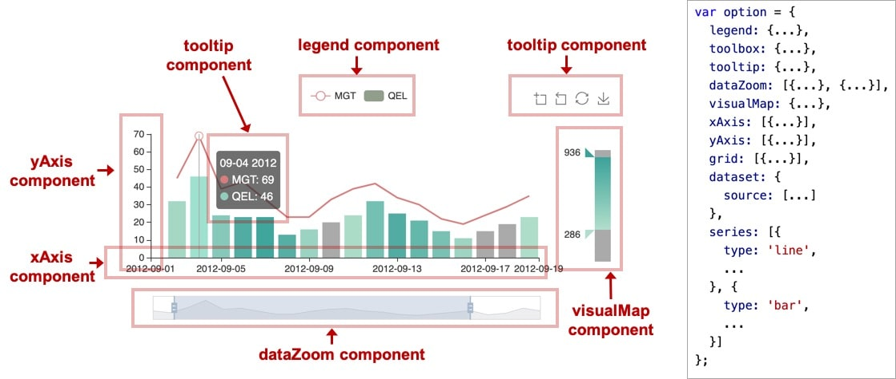

ECharts

## ECharts相关

### 浏览器绘图方式

- canvas 点阵图
  - 缩放失真，适合图形数量非常大的图表
- svg 矢量图
  - 缩放不失真，适合图形数量较少的图表
  - ECharts属于svg

### 依赖项

- ECharts底层依赖ZRender，一个轻量级的二维绘制库

## ECharts的绘图步骤

1. 建立DOM容器
2. 引入ECharts
3. 实例化ECharts
4. 建立图表配置项
5. 显示图表

~~~html
<!DOCTYPE html>
<html>

<head>
  <meta charset="utf-8" />
  <title>ECharts</title>
  <!-- 引入刚刚下载的 ECharts 文件 -->
  
</head>

<body>
  <!-- 为 ECharts 准备一个定义了宽高的 DOM -->
  

  
</body>

</html>
~~~

## 常用组件

- echarts中的各种内容，被抽象为“组件”

- 下图的`option`中声明了各个组件（包括系列）

  

### title 标题

- 包含主标题和副标题

- 属性

  - `text` 主标题

  - `subtext` 副标题

  - `left`/`right`/`top`/`bottom` 位置
    
    > - `title`组件离容器 左侧/右侧/顶部/底部 的距离
    >
    > - 值可以是像 `20` 这样的具体像素值，可以是像 `'20%'` 这样相对于容器高宽的百分比
    >
    > - `left`/`top`的值也可以是 `'left'`, `'center'`, `'right'`/ `'top'`, `'middle'`, `'bottom'`。
    
  - `textStyle` 主标题样式

  - `subtextStyle` 副标题样式

  - `show` 
  
    > - 是否显示标题组件，值为布尔值

### legend 图例

- 展示了不同系列(`series`)的标记(`symbol`)、颜色和名字

  可以通过点击图例控制哪些系列不显示

- 属性

  - `data` 

    >- 图例的数据数组
    >
    >- `legend`插件会自动根据对应`series`的图形标记(`symbol`)来绘制自己的颜色和标记
    >
    >- 数组项
    >
    > - 数组项通常为一个字符串，每一项代表一个`series`的`name`（如果是饼图，也可以是饼图单个数据的 `name`）
    > - 空字符串`''`或`\n`(换行字符串)用于图例的换行
    >
    >- 如果`data`没有被指定，则会从当前`series`中自动获取
    >
    >- 如果要单独设置某一项的样式，可将该项写成配置项对象
    >
    > ~~~javascript
    > data: [{
    >     // name属性对应系列的name
    >     name: '系列1',
    >     // 强制设置图形为圆。
    >     icon: 'circle',
    >     // 设置文本为红色
    >     textStyle: {
    >         color: 'red'
    >     }
    > }]
    > ~~~

  - `type` 
  
    > - 图例类型
    > - 可选值
    >   - `plain` 普通图例，默认值
    >   - `scroll` 滚动翻页图例，当图例数量较多时可以使用
  
  - `left`/`right`/`top`/`bottom` 位置

### tooltip 提示框

- 提示框组件可以设置在多种地方

  - 设置在全局，即`tooltip`
  - 设置在坐标系中，即`grid.tooltip`、`polar.tooltip`、`single.tooltip`
  - 设置在系列中，即`series.tooltip`
  - 设置在系列的每个数据项中，即`series.data.tooltip`

- 属性

  - `show`

    > - 是否显示提示框组件
    > - 包括提示框浮层和`axisPointer`

  - `showContent`

    > - 是否显示提示框浮层
    > - 默认为`true`
    > - 当只需`tooltip`触发事件或显示`axisPointer`而不需要显示内容时可设置为`false`

  - `alwaysShowContent`

    > - 是否永远显示提示框内容
    > - 默认为`false`，当移出可触发提示框区域后一定时间后会隐藏提示框

  - `hideDelay`

    > - 浮层隐藏的延迟
    > - 单位为ms

  - `trigger` 触发类型

    > - 可选值
    >
    >   - `'item'`
    >
    >     数据项图形触发，主要在散点图，饼图等物类目轴的图表中使用
    >
    >   - `'axis'`
    >
    >     坐标轴触发，主要在柱状图，折线图等会使用类目轴的图表中使用。
    >
    >   - `'none'`
    >
    >     什么都不触发

  - `triggerOn` 触发条件

    > - 可选值
    >
    >   - `'mousemove'`
    >
    >     鼠标移动时触发
    >
    >   - `'click'`
    >
    >     鼠标点击时触发
    >
    >   - `'mousemove|click'`
    >
    >     同时鼠标移动和点击时触发
    >
    >   - `'none'`
    >
    >     > 不在 `'mousemove'` 或 `'click'` 时触发，用户可以通过 [action.tooltip.showTip](https://echarts.apache.org/zh/api.html#action.tooltip.showTip) 和 [action.tooltip.hideTip](https://echarts.apache.org/zh/api.html#action.tooltip.hideTip) 来手动触发和隐藏。也可以通过 [axisPointer.handle](https://echarts.apache.org/zh/option.html#xAxis.axisPointer.handle) 来触发或隐藏
    
  - 

### toolbox 工具栏

- 内置有`导出图片`，`数据视图`，`动态类型切换`，`数据区域缩放`，` 配置项还原`等工具

- 属性

  - `show` 

  - `left`/`right`/`top`/`bottom` 位置

  - `orient` 工具栏icon的布局朝向

    > - 可选值
    >   - `'horizontal'`
    >   - `'vertical'`

  - `itemSize` 工具栏icon的大小，默认为15

  - `itemGap` 工具栏icon每项之间的间隔，默认为8

  - `showTitle` 是否在鼠标hover时显示每个工具icon的标题，默认为true

  - `featrue` 各工具配置项

    > - 内置工具
    >
    >   - `dataZoom` 数据区域缩放
    >
    >     > - 每个工具都有的通用属性，之后省略
    >     >
    >     >   - `show`
    >     >
    >     >   - `title` 标题文本
    >     >
    >     >     > toolbox.feature.dataZoom.title.zoom = '区域缩放'
    >     >     >
    >     >     > toolbox.feature.dataZoom.title.back = '区域缩放还原'
    >     >     >
    >     >     > 以上为`dataZoom`中缩放与还原功能的默认标题
    >     >
    >     >   - `icon` 图标
    >     >
    >     >   - `iconStyle` 图标样式
    >     >
    >     >     - `color` 图形颜色
    >     >
    >     >     - `borderColor` 图形描边颜色
    >     >     - `borderWidth` 描边线宽
    >     >     - `borderType` 描边类型
    >     >
    >     >   - `emphasis` 鼠标hover时的配置项
    >     >
    >     >     - `iconStyle` 鼠标hover时的图标样式
    >
    >     - `xAxisIndex`/`yAxisIndex`
    >
    >       > - 指定哪些`xAxis`/`yAxis`被控制
    >       > - 默认为控制所有的x/y轴
    >       > - 如果设置为`false`则不控制任何x/y轴
    >       > - 如果设置为`3`则控制`axisIndex`为3的x/y轴
    >       > - 如果设置为`[0, 3]`则控制`axisIndex`为0和3的x/y轴
    >
    >     - `brushStyle` 刷选框样式
    >
    >       - `color`
    >       - `borderColor`
    >       - `borderWidth`
    >       - `borderType`
    >
    >   - `dataView` 数据视图
    >
    >     - `readOnly` 是否只读
    >
    >       > - 布尔值，默认为false
    >
    >     - `backgroundColor` 数据视图浮层背景色
    >
    >     - `textareaColor` 数据视图浮层文本输入区背景色
    >
    >     - `textareaBorderColor` 数据视图浮层文本输入区边框颜色
    >
    >     - `textColor` 文本颜色
    >
    >     - `buttonColor` 按钮颜色
    >
    >     - `buttonTextColor` 按钮文本颜色
    >
    >   - `magicType` 动态类型切换
    >
    >     - `type` 启用的动态类型
    >
    >       > - 用数组表示，可选数组项有
    >       >   - `'line'` 切换为折线图
    >       >   - `'bar'` 切换为柱状图
    >       >   - `'stack'` 在堆叠模式/平铺模式之间切换（在某些版本中为切换到堆叠模式）
    >       >   - `'tiled'` 切换为平铺模式（在某些版本中存在）
    >   
    >   - `restore` 配置项还原
    >   
    >   - `saveAsImage` 保存为图片
    >   
    >     - `type` 保存的图片格式
    >   
    >       > - 如果`renderer`的类型在初始化图表时被设为`'canvas'`(默认)，则支持`'png'`(默认)和`'jpg'`
    >       > - 如果`renderer`的类型在初始化图表时被设为`'svg'`(默认)，则只支持`'svg'`
    >   
    >     - `name` 保存的文件名称
    >   
    >       > - 如不设置，则默认使用`title.text`作为名称

### grid 网格

- 单个`grid`内最多可以放置上下两个X轴，左右两个Y轴

- 可以在`grid`上绘制`折线图`，`柱状图`，`散点图`(`气泡图`)

- 在`ECharts 2.x`里单个 echarts 实例中最多只能存在一个`grid`组件，在`ECharts 3`中可以存在任意个`grid`组件

- 属性

  - `show`

  - `left`/`right`/`top`/`bottom` 

  - `width`/`height`

    > - grid组件的宽度/高度
    > - 默认值为'auto'，即自适应

### xAxis/yAxis X轴/Y轴

- 直角坐标系`grid`中的X轴/Y轴

- 属性

  - `show`

  - `position`

    >- X轴/Y轴的位置
    >- `xAxis.position`的可选值
    >  - `'top'`
    >  - `'bottom'`
    >- `yAxis.position`的可选值
    >  - `'left'`
    >  - `'right'`
    >- 注意：如果`xAxis.axisLine.onZero`/ `yAxis.axisLine.onZero`为`true`，则对应轴的`position`无法生效

  - `type`

    >- 坐标轴类型
    >
    >- 可选值
    >
    >  - `'value'` 
    >
    >    > - 数值轴
    >    > - 适用于连续数据
    >
    >  - `'category'`
    >
    >    > - 类目轴
    >    > - 适用于离散的类目数据
    >    > - 类目数据可以从`series.data`或`dataset.source`中取，或通过`xAxis.data`/`yAxis.data`设置
    >
    >  - `'time'`
    >
    >    > - 时间轴
    >    > - 适用于连续的时序数据
    >    > - 时间轴带有时间的格式化
    >
    >  - `'log'`
    >
    >    > - 对数轴
    >    > - 适用于对数数据

  - `name` 坐标轴名称

  - `nameLocation`

    > - 坐标轴名称显示位置
    > - 可选值
    >   - `'start'`
    >   - `'middle'`/`'center'`
    >   - `'end'`

  - `data`

    > - 类目数据
    >
    > - 在类目轴中有效
    >
    > - 以x轴为例，如果没有设置`xAxis.type`，但是设置了`xAxis.data`，则当前轴会被认为是类目轴
    >
    > - 如果设置了当前轴为类目轴，但没有设置`xAxis.data`，则`xAxis.data`的内容会自动从`series.data`中获取
    >
    > - 示例
    >
    >   ~~~javascript
    >   // 所有类目名称列表
    >   data: ['周一', '周二', '周三', '周四', '周五', '周六', '周日']
    >   // 每一项也可以是具体的配置项，此时取配置项中的 `value` 为类目名
    >   data: [{
    >       value: '周一',
    >       // 突出周一
    >       textStyle: {
    >           fontSize: 20,
    >           color: 'red'
    >       }
    >   }, '周二', '周三', '周四', '周五', '周六', '周日']
    >   ~~~

  - `axisPointer`

    > - 坐标轴指示器
    >
    > - 属性
    >
    >   - `show`
    >
    >     > - 默认为`false`
    >     > - 如果 [tooltip.trigger](https://echarts.apache.org/zh/option.html#tooltip.trigger) 设置为 `'axis'` 或者 [tooltip.axisPointer.type](https://echarts.apache.org/zh/option.html#tooltip.axisPointer.type) 设置为 `'cross'`，则自动显示 axisPointer。坐标系会自动选择显示显示哪个轴的 axisPointer，也可以使用 [tooltip.axisPointer.axis](https://echarts.apache.org/zh/option.html#tooltip.axisPointer.axis) 改变这种选择
    >
    >   - `type`
    >
    >     > - 指示器类型
    >     > - 可选值
    >     >   - `'line'`
    >     >   - `'shadow'`
    >     >   - `'none'`
    >
    >   - `snap`
    >
    >     > - 坐标轴指示器是否自动吸附到点上
    >     > - 取值为布尔值，默认为自动判断
    >     > - 这个功能在数值轴和时间轴上比较有意义，可以自动寻找细小的数值点

  - `splitNumber`

    > - 坐标轴的分割段数
    > - 在类目轴中无效
    > - 设置的值只是预估值，最后实际显示的段数会更根据坐标轴的易读性进行调整

  - `interval`

    > - 强制设置坐标轴的分割间隔
    > - 在类目轴中无效
    > - 在时间轴中需要传时间戳
    > - 在对数轴中需要传指数值

  - `minInterval`

    > - 自动计算的坐标轴最小间隔大小
    > - 例如设置为`1`，可保证坐标轴分割刻度显示成整数

  - `maxInterval`

    > - 自动计算的坐标轴最大间隔大小
    > - 例如在时间轴中，可设置为`3600 * 24 * 1000`，保证坐标轴分割刻度最大为一天

  - `boundaryGap`

    > - 坐标轴两边留白策略
    > - 类目轴和非类目轴的设置和表现不一样
    > - 类目轴中设置为布尔值
    >   - 默认为`true`，此时刻度只是作为分割线，标签和数据点会在两个刻度之间的带(band)中间
    >   - 为`false`时，第一个刻度和另一个轴重合，标签和数据点居中于刻度
    > - 非类目轴设置为一个两个值的数组，分别表示数据最小值和最大值的延伸范围，可以直接设置数值或者相对的百分比，在设置`min`，`max`后无效

  - `min`/`max` 坐标轴刻度最小值/最大值

  - `axisLine`

    > - 坐标轴轴线
    >
    > - 属性
    >
    >   - `show`
    >
    >   - `symbol`
    >
    >     > - 轴线两端的标志
    >     > - 值类型
    >     >   - 字符串，两端都使用相同标志
    >     >   - 数组，两个数组项分别表示两端的标志
    >     > - 可选值
    >     >   - `'circle'`
    >     >   - `'rect'`
    >     >   - `'roundRect'`
    >     >   - `'triangle'`
    >     >   - `'diamond'`
    >     >   - `'pin'`
    >     >   - `'arrow'`
    >     >   - `'none'`

### polar 极坐标系

- 可以用于散点图和折线图

- 包含一个`radiusAxis`和一个`angelAxis`

- 属性

  - `center`

    > - 极坐标系的圆心坐标
    >
    > - 值为有两个数组项的数组，第一项是横坐标，第二项是纵坐标，支持像素和百分比
    >
    >   ~~~javascript
    >   // 设置成绝对的像素值
    >   center: [400, 300]
    >   // 设置成相对的百分比
    >   center: ['50%', '50%']
    >   ~~~

  - `radius`

    > - 极坐标系的半径
    >
    > - 值类型
    >
    >   - `number`
    >
    >     > - 直接指定外半径尺寸
    >
    >   - `string`
    >
    >     > - 例如`'20%'`,表示外半径为可视区尺寸（容器高宽中较小一项）的20%长度
    >
    >   - `Array.<number|string>`
    >
    >     > - 数组第一项是内半径，第二项是外半径

### radiusAxis 径向轴

- 极坐标系`polar`中的径向轴
- 属性
  - `type`
  - `name`
  - `nameLocation`
  - `splitNumber`
  - `minInterval`
  - `maxInterval`
  - `interval`
  - `axisLine`
  - `axisPointer`
  - `data`
  - `min`/`max`

### angleAxis 角度轴

- 极坐标系`polar`中的角度轴

- 属性

  - `type`

  - `name`

  - `nameLocation`

  - `splitNumber`

  - `minInterval`

  - `maxInterval`

  - `interval`

  - `axisLine`

  - `axisPointer`

  - `data`

  - `min`/`max`

  - `clockwise`

    > - 刻度增长是否按照顺时针，默认为`true`

### radar 雷达图坐标系

- 只适用于雷达图

- 每一个轴（`indicator`指示器）都是一个单独的维度

- 属性

  - `indicator`

    > - 雷达图的指示器
    >
    > - 用来指定雷达图中的多个变量（维度）
    >
    > - 示例
    >
    >   ~~~javascript
    >   indicator: [
    >      { name: '销售（sales）', max: 6500},
    >      { name: '管理（Administration）', max: 16000, color: 'red'}, // 标签设置为红色
    >      { name: '信息技术（Information Techology）', max: 30000},
    >      { name: '客服（Customer Support）', max: 38000},
    >      { name: '研发（Development）', max: 52000},
    >      { name: '市场（Marketing）', max: 25000}
    >   ]
    >   ~~~
    >
    > - 属性
    >
    >   - `name` 指示器名称
    >   - `max` 指示器的最大值，可选，建议设置
    >   - `min` 指示器的最小值，可选，默认为0
    >   - `color` 标签特定的颜色

## 系列(series)

- `ECharts`中的系列是指：一组数据以及它们映射成的图

- `series`是一种特殊的组件，有时会出现“组件和系列”这样的描述，这种语境下的“组件”是指除`series`外的其它组件

- `series`中数组项对象的通用属性

  - `type`

    > - 列表类型
    > - 常用有`'line'`、`'bar'`、`'pie'`等

  - `name`

    > - 系列名称
    > - 用于`tooltip`的显示，`legend`的图例筛选，在`setOption`更新数据和配置项时用于指定对应的系列

  - `xAxisIndex`/`yAxisIndex`

    > - 使用的直角坐标系轴线的序号，在单个图表实例中存在多个x轴/y轴的时候使用

  - `polarIndex`

    > - 使用的极坐标系的序号，在单个图表实例中存在多个极坐标系的时候有用

  - `symbol`

    > - 标记的图形
    > - 可选值
    >   - `'emptyCircle'`
    >   - `'rect'`
    >   - `'roundRect'`
    >   - `'triangle'`
    >   - `'diamond'`
    >   - `'none'`

  - `symbolSize`

    > - 标记的大小
    > - 可以设置为诸如`10`这样单一的数字
    > - 可以用数组分开表示宽和高，如`[20, 10]`，表示宽为`20`，高为`10`

  - `stack`

    > - 在同个类目轴上的`series`配置相同的`stack`的值时，则会堆叠放置

  - `stackStrategy`

    > - 堆积数值的策略
    > - 前提是`stack`属性已被设置
    > - 可选值
    >   - `'samesing'` 只在要堆叠的值与当前累积的堆叠值具有相同的正负符号时才堆叠
    >   - `'all'` 堆叠所有的值，不管当前累积的堆叠值的正负符号是什么
    >   - `'positive'` 只堆积正值
    >   - `'negative'` 只堆积负值

  - `cursor`

    > - 鼠标悬浮在图形元素上时的样式，可选值同`CSS`的`cursor`

  - `label`

    > - 图形上的文本标签
    >
    > - 可用于说明图形的一些数据信息，比如值，名称等
    >
    > - 属性
    >
    >   - `show`
    >
    >   - `position`
    >
    >     > - 可选值(`line`、`bar`)
    >     >
    >     >   - `'top'`
    >     >
    >     >   - `'left' `
    >     >
    >     >   - `'right'`
    >     >
    >     >   - `'bottom' `
    >     >
    >     >   - `'inside' `
    >     >
    >     >   - `'insideLeft' `
    >     >
    >     >   - `'insideRight '`
    >     >
    >     >   - `'insideTop'`
    >     >
    >     >   - `'insideBottom'`
    >     >
    >     >   - `'insideTopLeft' `
    >     >
    >     >   - `'insideBottomLeft' `
    >     >
    >     >   - `'insideTopRight'`
    >     >
    >     >   - `'insideBottomRight' `
    >     >
    >     >   - `'outside'`
    >     >
    >     >   - 也可以使用一个数组表示相对的百分比，或者绝对像素值表示标签相对于图形包围盒左上角的位置
    >     >
    >     >     >- 绝对的像素值  `position: [10, 10]`  
    >     >     >
    >     >     >- 相对的百分比  `position: ['50%', '50%']`
    >     >
    >     > - 可选值(`pie`)
    >     >
    >     >   - `'outside'`
    >     >   - `'inside'`/`'inner'`
    >     >   - `'center'`
    >
    >   - `formatter`
    >
    >     > - 标签内容格式器
    >     >
    >     > - 支持`字符串模板`和`回调函数`两种形式，字符串模板与回调函数返回的字符串军支持用`\n`换行
    >     >
    >     > - `字符串模板`变量
    >     >
    >     >   - `{a}` 系列名
    >     >
    >     >   - `{b}` 数据名
    >     >
    >     >   - `{c}` 数据值
    >     >
    >     >   - `{@xxx}` 
    >     >
    >     >     > - 数据中名为`'xxx'`的维度的值
    >     >     > - 如`{@product}`表示名为`'product'`的维度的值
    >     >
    >     >   - `{@[n]}`
    >     >
    >     >     > - 数据中维度`n`的值
    >     >     > - 如`{@[3]}`表示维度3的值，从0开始计数
    >     >
    >     >   - 示例：`formatter: '{b}: {c}'`

  - `labelLine`

    > - 标签的视觉引导线配置
    > - 属性
    >   - `show`
    >   - `showAbove` 是否显示在图形上方
    >   - `length2` 视觉引导线的第二段的长度

  - `data`

    > - 系列中的数据内容数组
    >
    > - 数组项通常为具体的数据项
    >
    > - 如果系列没有指定`data`，且`option`有`dataset`,则会使用第一个`dataset`
    >
    > - 可以使用`series.datasetIndex`指定其它的`dataset`
    >
    > - 通常来说，数据用一个二维数组表示，如下，每一列被称为一个`维度`
    >
    >   ~~~javascript
    >   series: [{
    >       data: [
    >           // 维度X   维度Y   其他维度 ...
    >           [  3.4,    4.5,   15,   43],
    >           [  4.2,    2.3,   20,   91],
    >           [  10.8,   9.5,   30,   18],
    >           [  7.2,    8.8,   18,   57] 
    >       ]
    >   }]
    >   ~~~
    >
    > - 在`直角坐标系`(`grid`)中，`维度X`和`维度Y`会默认对应于`xAxis`和`yAxis`
    >
    > - 在`极坐标系`(`polar`)中，`维度X`和`维度Y`会默认对应于`radiusAxis`和`angleAxis`
    >
    > - 当只有一个轴为类目轴时，数据可以简化用一个一维数组表示
    >
    >    ~~~javascript
    >    xAxis: {
    >        data: ['a', 'b', 'm', 'n']
    >    },
    >    series: [{
    >        // 与 xAxis.data 一一对应
    >        data: [23,  44,  55,  19]
    >        // 它其实是下面这种形式的简化：
    >        // data: [[0, 23], [1, 44], [2, 55], [3, 19]]
    >    }]
    >    ~~~

  - `markPoint`

    > - 标记点
    >
    > - 属性
    >
    >   - `data`
    >
    >     > - 标注的数据数组
    >     >
    >     > - 每个数组项是一个对象
    >     >
    >     > - 指定标注位置的几种方式，如果多种属性同时存在，优先级按以下顺序
    >     >
    >     >   1. 使用`x`, `y`属性
    >     >   2. 使用`coord`属性
    >     >   3. 使用`type`属性
    >     >
    >     > - 数组项对象的属性
    >     >
    >     >   - `name` 
    >     >
    >     >     > - 标注名称
    >     >
    >     >   - `value`
    >     >
    >     >     > - 标注值
    >     >     > - 当使用`type`指定标注位置时不需要设置
    >     >
    >     >   - `type`
    >     >
    >     >     > - 标注类型
    >     >     > - 可选值
    >     >     >   - `'min'`
    >     >     >   - `'max'`
    >     >     >   - `'average'`
    >     >
    >     >   - `coord`
    >     >
    >     >     > - 标注的坐标
    >     >     > - 值为数组，数组项可以是序号，也可以是对应的类目名字符串
    >     >     > - 格式视系列的坐标系而定，可以是直角坐标系[x, y]，也可以是极坐标系的[radius, angle]
    >     >
    >     >   - `x`/`y`
    >     >
    >     >     > - 相对容器的屏幕`x`/`y`坐标
    >     >
    >     >   - `symbol`
    >     >
    >     >     > - 当前标记的图形
    >     >     > - 可选值
    >     >     >   - `'circle'`
    >     >     >   - `'rect'`
    >     >     >   - `'roundRect'`
    >     >     >   - `'triangle'`
    >     >     >   - `'diamond'`
    >     >     >   - `'pin'`
    >     >     >   - `'arrow'`
    >     >     >   - `'none'`
    >
    >   - `symbol`
    >
    >     > - 同一设置标记的图形
    >     > - 可选值同`markPoint.data.symbol`

  - `markLine`

    > - 标线
    >
    > - 属性
    >
    >   - `name`
    >
    >   - `type`
    >
    >   - `symbol`
    >
    >   - `label`
    >
    >     > - 标线的文本
    >     >
    >     > - 属性
    >     >
    >     >   - `show`
    >     >
    >     >   - `position`
    >     >
    >     >     > - 可选值
    >     >     >   - `'start'`
    >     >     >   - `'middle'`
    >     >     >   - `'end'`
    >     >
    >     >   - `distance`
    >     >
    >     >     > - 标签于线之间的间距
    >     >     > - 如果是数组，第一项为横向间距，第二项为纵向间距
    >     >     > - 如果是数字，则表示横向纵向使用相同的间距

- `series`数组对象的`type`为`'bar'`时的属性

  - `showEmptyCircle`

    > - 是否在无数据时显示一个占位圆
    > - 默认为`true`

  - `emptyCircleStyle`

    > - 属性
    >   - `color`
    >   - `borderColor`

  - `center`

    > - 饼图的圆心坐标
    > - 同`polar.center`

  - `radius`

    > - 饼图的半径
    > - 同`polar.radius`

  - `data`

    > - 系列中的数据内容数组
    >
    > - 数组项可以为单个数值，如
    >
    >   ~~~javascript
    >   [12, 34, 56, 10, 23]
    >   ~~~
    >
    > - 如需指定每个数据项的名称，则数组项写为对象
    >
    >   ~~~javascript
    >   [{
    >       // 数据项的名称
    >       name: '数据1',
    >       // 数据项值8
    >       value: 10
    >   }, {
    >       name: '数据2',
    >       value: 20
    >   }]
    >   ~~~
    >
    > - 需要对个别内容指定进行个性化定义时
    >
    >   ~~~javascript
    >   [{
    >       name: '数据1',
    >       value: 10
    >   }, {
    >       // 数据项名称
    >       name: '数据2',
    >       value : 56,
    >       //自定义特殊 tooltip，仅对该数据项有效
    >       tooltip:{},
    >       //自定义特殊itemStyle，仅对该item有效
    >       itemStyle:{}
    >   }]
    >   ~~~

- `series`数组对象的`type`为`'radar'`时的属性

  - data

    > - 雷达图的数据是多变量（维度）的，如下示例
    >
    >   ~~~javascript
    >   data : [
    >       {
    >           value : [4300, 10000, 28000, 35000, 50000, 19000],
    >           name : '预算分配（Allocated Budget）'
    >       },
    >       {
    >           value : [5000, 14000, 28000, 31000, 42000, 21000],
    >           name : '实际开销（Actual Spending）'
    >       }
    >   ]
    >   ~~~
    >
    > - 其中`value`项数组是具体的数据，每个值与`radar.indicator`一一对应
    >
    > - 数据项对象的属性
    >
    >   - `name`
    >   - `value`
    >   - `itemStyle`  拐点标志样式
    >   - `lineStyle` 线条样式
    >   - `areaStyle` 区域填充样式
    >   - `emphasis` 高亮状态配置