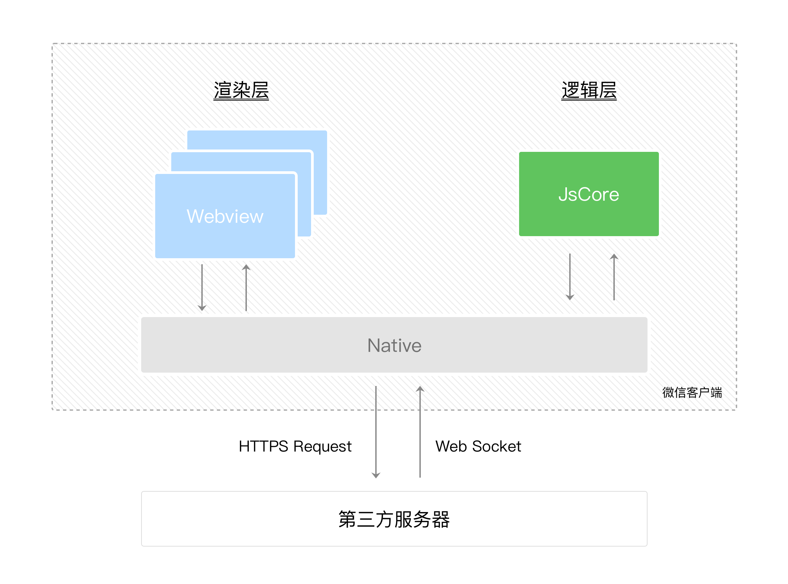
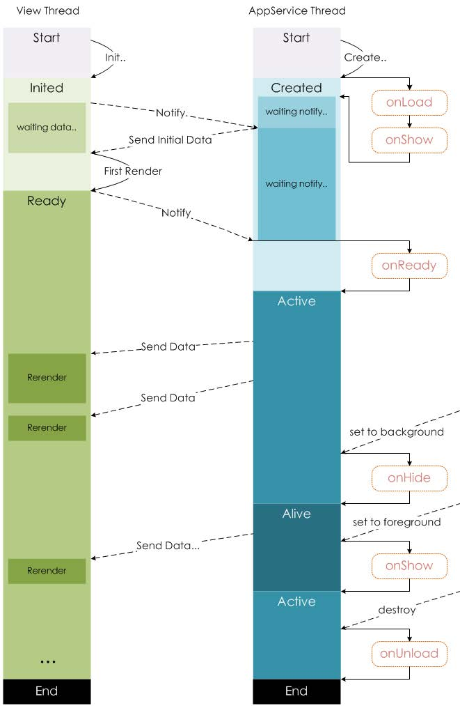
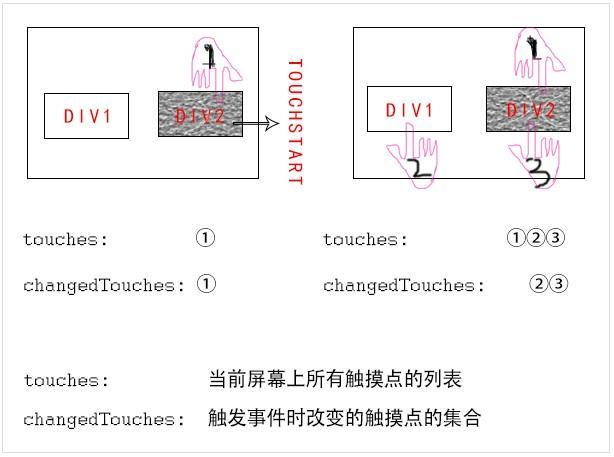

## 原生小程序

- 小程序的核心技术(微信小程序)
  1. 页面布局：`WXML`
  2. 页面样式：`WXSS`
  3. 页面脚本：`JavaScript`+`WXS`(`WeixinScript`)

## 小程序宿主环境

- 宿主环境即微信客户端给小程序提供的环境

- 以下将采用`Native`指代微信客户端

- 渲染层与逻辑层

  - 小程序的运行分为渲染层和逻辑层

    - `WXML`模板和`WXSS` 样式工作在渲染层
    - `JS`脚本工作在逻辑层

  - 小程序的渲染层与逻辑层分别由2个线程管理

    - 渲染层的界面使用了`WebView`进行渲染
      - 小程序的每个界面都会存在一个`WebView`线程对其渲染
    - 逻辑层采用`JsCore`线程运行`JS`脚本

  - 这两个线程的通信会经由`Native`做中转，逻辑层发送网络请求也经由`Native`转发

  - 小程序的通信模型

    

## 小程序的配置文件

- 小程序的很多开发需求被规定在了配置文件中
  - 有利于开发效率
  - 保证开发出来的小程序的某些风格式比较一致的

- 常见的配置文件
  - `project.config.json`
    - 项目配置文件
    - 包含项目名称、appid等
    - [项目配置文件 | 微信开放文档 (qq.com)](https://developers.weixin.qq.com/miniprogram/dev/devtools/projectconfig.html)
  - `project.private.config.json`
    - 私有项目配置文件，内容同项目配置文件
    - 主要用于个人测试
    - 使用`git`时可以将其写到`.gitignore`避免版本管理的冲突
  - `sitemap.json`
    - 小程序搜索相关
    - [小程序页面接入效果优化建议 | 微信开放文档 (qq.com)](https://developers.weixin.qq.com/miniprogram/dev/framework/sitemap.html)
  - `app.json`
    - 全局app配置
  - `*.json`
    - 页面配置

### 全局app配置

- [全局配置 | 微信开放文档 (qq.com)](https://developers.weixin.qq.com/miniprogram/dev/reference/configuration/app.html)
- 重要配置项
  - `pages`
    - 页面路径列表
    - 类型：`String[]`
    - 必需项
    - 用于指定小程序由哪些页面组成，每一项都对应一个页面的路径(含文件名)信息
    - 小程序中所有的页面都是必须在`pages`中进行注册的
  - `window`
    - 全局的默认窗口展示
    - 类型：`Object`
    - 可选项
  - `tabBar`
    - 底部 tab栏的展示
    - 类型：`Object`
    - 可选项

### 页面page配置

- [页面配置 | 微信开放文档 (qq.com)](https://developers.weixin.qq.com/miniprogram/dev/reference/configuration/page.html)
- 页面中配置项在当前页面会覆盖`app.json`的`window`中相同的配置项
- 重要配置项
  - `usingComponents`
    - 注册页面中使用的组件
  - `enablePullDownRefresh`
    - 是否允许下拉刷新操作
  - `onReachBottomDistance`
    - 页面上拉触底事件触发时距页面底部距离

## App函数

- 每个小程序都需要在`app.js`中调用`App函数`以注册小程序
- [App(Object object) | 微信开放文档 (qq.com)](https://developers.weixin.qq.com/miniprogram/dev/reference/api/App.html)
- 注册APP时，一般会做什么
  - 判断小程序的进入场景
  - 因为`App()`实例只有一个，并且是全局共享的（单例对象），因此可以存放一些简单的共享数据
  - 监听生命周期函数，执行对应业务逻辑

### 小程序场景值

- [场景值 | 微信开放文档 (qq.com)](https://developers.weixin.qq.com/miniprogram/dev/reference/scene-list.html)
- 在`onLaunch`和`onShow`生命周期回调函数中，会接收一个`options`对象作为参数，其中的`scene`属性即场景值

### 定义全局App的数据

- 开发者可以添加任意的函数或数据变量到`App()`的`Object`参数中

- 定义全局数据

  ~~~javascript
  App({
      ...
      globalData: {
          foo: ""
      }
  })
  ~~~

- 在其他页面中访问

  ~~~javascript
  Page({
      onLoad() {
          const app = getApp()
          console.log(app.globalData.foo)
      }
  })
  ~~~

- 注意，这里的全局数据不是响应式的，通常只用来共享一些固定的数据

### 使用App的生命周期函数

- 在`App`的生命周期函数中，可完成应用程序启动后的初始化操作，如
  - 登录操作
  - 读取本地数据（类似于`token`），保存在全局方便使用
  - 请求整个应用程序需要的数据

## Page函数

- 每一个小程序页面都有一个对应的js文件，没其中调用`Page函数`以注册页面

- [Page(Object object) | 微信开放文档 (qq.com)](https://developers.weixin.qq.com/miniprogram/dev/reference/api/Page.html)

- 注册Page页面时，一般会做什么

  - 在生命周期函数中发送网络请求，从服务器获取数据
    - 在`onLoad`生命周期回调中
  - 初始化一些数据，以方便被wxml引用展示
    - 在`data`属性中
  - 监听wxml中的事件，绑定对应的事件函数
    - 回调函数直接写在`Page函数`的参数对象中
  - 其他一些监听（如页面滚动，上拉刷新，下拉加载更多等）

- `Page`的生命周期

  

## 一些内置组件的属性

### button组件

- `plain`属性
  - 按钮镂空，背景色透明
  
- `open-type`属性

  - 微信开放能力

  - 一些合法值

    - `share`

      - 触发用户转发

      - [转发 | 微信开放文档 (qq.com)](https://developers.weixin.qq.com/miniprogram/dev/framework/open-ability/share.html#使用指引)

### image组件

- `mode`属性
  - 图片裁剪、缩放的模式

### scroll-view组件

- 注意，使用x方向滚动时，需要设置scroll-view的样式为` white-space: nowrap;`

### 组件共同属性

[基础组件 | 微信开放文档 (qq.com)](https://developers.weixin.qq.com/miniprogram/dev/framework/view/component.html)

- `id`
  - `String`
  - 组件的唯一标识
- `class`
  - `String`
  - 类名
- `style`
  - `String`
  - 可以动态设置的内联样式
- `hidden`
  - `Boolean`
  - 组件是否显示
- `data-*`
  - 自定义属性
  - 当组件上触发事件时，可以在事件处理函数中获取（`event.currentTarget.dataset`）
- `bind*`/`catch*`
  - 绑定事件
  - `bind*`是冒泡阶段绑定事件
  - `catch*`是捕获阶段绑定事件

## WXSS

[WXSS | 微信开放文档 (qq.com)](https://developers.weixin.qq.com/miniprogram/dev/framework/view/wxss.html)

- `rpx`(`responsive pexel`)尺寸单位
  - 可以根据屏幕宽度进行自适应，规定屏幕宽为`750rpx`
  - `iphone6`的物理分辨率为`750 * 1334`，逻辑分辨率为`375 * 667`，在`iphone6`上，`rpx`与其物理分辨率一一对应，因此推荐使用`iphone6`作为视觉稿的标准

## WXML

- 基本格式
  - 类似于`HTML`代码，可以写成单标签，也可以写成双标签
  - 标签必须严格的闭合，否则会导致编译错误
  - 大小写敏感
  - 标签体和标签属性都支持`Mustache`语法
- 条件渲染
  - `wx:if`
  - `wx:elif`
  - `wx:else`
- 列表渲染
  - 在组件中使用`wx:for`指令来遍历一个数组(字符串/数字)
  - 默认情况下，变量名`index`保存当前遍历数据的下标，变量名`item`保存当前遍历的项
    - 使用`wx:for-index`可以指定数组当前下标的变量名
    - 使用`wx:for-item`可以指定数组当前元素的变量名
  - 使用`wx:key`指令为列表渲染中的每一项指定一个唯一的`key`
    - 如果遍历的`item`是一个对象，且其拥有某个`property`的值是列表中唯一的字符串或数字（其不能动态改变），则该`property`的属性名的字符串可以作为`wx:key`绑定的值
    - 保留关键字`*this`，代表列表循环中的`item`本身，需要`item`本身是一个唯一的字符串或数字
- `block`标签
  - `<block/>`并不是一个组件，仅仅是一个包装元素，不会在页面中做任何渲染，只接受控制属性（`wx:if`或`wx:for`）
  - 可将需要条件渲染或列表渲染的内容使用`<block/>`进行包裹，将`wx:if`或`wx:for`放在`<block/>`上

## WXS

- `WSX`是小程序的一套脚本语言
- 为什么要设计`WXS`语言
  - `WXML`运行于渲染层，`Page`和`Component`运行于逻辑层，两者之间通过`Native`进行通信，频繁通信会消耗过多性能
  - 在`WXML`中不能直接调用`Page`或`Component`中定义的函数
  - `WXS`可以在渲染层中写部分逻辑，在渲染层单独处理部分频繁改变的数据
- `WXS`使用的限制和特点
  - `WXS`不依赖于运行时的基础库版本，可以在所有版本的小程序中运行
  - `WXS`的运行环境和和其他`JavaScript`代码是隔离的，`WXS`中不能调用其他`JS`文件中定义的函数，也不能调用小程序提供的`API`
  - 由于运行环境的差异，在`iOS`设备上小程序内的`WXS`会比`JavaScript`代码快2~20倍，在`android`设备上二者运行效率无差异
  - `WXS`不支持`ES6`及以上的语法
  - `WXS`不支持调用`wx`提供的系统API
  
- `<wxs>`标签
  - `wxs`可以写在`wxml`中的`<wxs>`标签体中，也可以写在`.wxs`文件中，并通过`<wsx>`标签的`src`属性引入
  - `<wxs>`标签的属性
    - `module`
      - 当前`<wxs>`标签的模块名，必填字段
      - 在单个`wxml`文件内，建议其值唯一，不同文件之间的`wxs`模块名不会相互覆盖
      - 属性值命名规则
        - 首字符必须是：字母（`a-zA-Z`），下划线（`_`）
        - 剩余字符可以是：字母（`a-zA-Z`），下划线（`_`）， 数字（`0-9`）
    - `src`
      - 引用`.wxs`文件的相对路径，当存在标签体时则不会生效

- `WXS`模块
  - 每一个`.wxs`文件和`<wxs>`标签都是一个单独的模块
  - 每个模块都有自己独立的作用域
    - 在一个模块里定义的变量与函数，默认为私有的，对其他模块不可见
    - 一个模块要想对外暴露其内部的私有变量与函数，只能通过`CJS`模块化语法实现
  - `wxs`模块均为单例，其第一次被引用时，会自动初始化为单例对象
    - 多个页面，多个地方，多次引用，使用的都是同一个`wxs`模块对象
    - 如果一个`wxs`模块在定义后，一直没有被引用，则该模块不会被解析与运行

## 小程序中的事件

[事件 | 微信开放文档 (qq.com)](https://developers.weixin.qq.com/miniprogram/dev/framework/view/wxml/event.html)

- 什么是事件
  - 将用户在视图层的行为反馈到逻辑层进行处理(JS事件)
  - 事件可以绑定在组件上，当达到触发事件，就会执行逻辑层中对应的事件处理函数(JS事件)
  - 事件对象可以携带额外信息，如`id`，`dataset`，`touches`

### 事件的基本使用

#### 使用Page中定义函数响应事件

- 在组件中绑定一个事件处理函数

  ~~~html
  <view id="tapTest" data-hi="Weixin" mark:hi="WX"  bindtap="tapName">tap</view>
  ~~~

- 在对应`Page`定义中写上事件处理函数，参数为`event`

  ~~~javascript
  Page({
      tapName: function(event) {
          console.log(event)
      }
  })
  ~~~

- log出来的信息大致如下

  ~~~json
  {
    "type":"tap", // 事件类型
    "timeStamp":895, // 事件生成时的时间戳
     "Mark": { // 事件标记数据
       "hi": "WX"  
     },
    "target": { // 触发事件的源组件的一些属性集合
      "id": "tapTest",
      "dataset":  {
        "hi":"Weixin"
      }
    },
    "currentTarget": { // 事件绑定的组件的一些属性集合
      "id": "tapTest",
      "dataset": {
        "hi":"Weixin"
      }
    },
    "detail": { // 自定义事件所携带的数据，不同事件会携带不同数据
      "x":53,
      "y":14
    },
    "touches":[{ // 触摸事件，当前停留在屏幕中的触摸点信息的数组
      "identifier":0,
      "pageX":53,
      "pageY":14,
      "clientX":53,
      "clientY":14
    }],
    "changedTouches":[{ // 触摸事件，当前变化的触摸点信息的数组
      "identifier":0,
      "pageX":53,
      "pageY":14,
      "clientX":53,
      "clientY":14
    }]
  }
  ~~~

  - `touches`与`changeTouches`

    

#### 使用WXS函数响应事件

- 从基础库`2.4.4`开始，支持使用`WXS`函数绑定事件

- 基本使用

  - 在组件中绑定和注册事件处理的`WXS`函数

    ~~~html
    <wxs module="wxs" src="./test.wxs" />
    <view id="tapTest" data-hi="Weixin" bindtap="{{wxs.tapName}}">tap</view>
    ~~~

    - 绑定的`WXS`函数必须写在`Mustache`语法中

  - `test.wxs`文件实现`tapName`函数

    ~~~js
    function tapName(event, ownerInstance) {
        console.log('tap Weixin', JSON.stringify(event))
    }
    module.exports = {
        tapName: tapName
    }
    ~~~

    - `WXS`事件函数接受两个参数，在原有的event的基础上加了`event.instance`对象，第二个参数是`ownerInstance`，和`event.instance`一样是一个`ComponentDescriptor`对象
    - `ownerInstance`包含了一些方法，可以设置组件的样式和class，具体见文档

- [WXS响应事件 | 微信开放文档 (qq.com)](https://developers.weixin.qq.com/miniprogram/dev/framework/view/interactive-animation.html)

### 事件绑定的指令

- 事件绑定的指令绑定的内容是一个字符串（JS事件）
  - 该字符串指定`Page`中的事件处理函数名
  - 可以使用`Mustache`语法将其和`this.data`中的数据绑定
  - 如果绑定的数据是一个空字符串，则这个绑定会失效，可以利用这个特性来暂时禁用一些事件
- 自基础库版本`1.5.0`起，在大多数组件和自定义组件中，`bind`后可以紧跟一个冒号，其含义不变，如`bind:tap`，基础库版本`2.8.1`起，在所有组件中开始提供这个支持、
- `bind`/`catch`
  - 在冒泡阶段监听事件
  - `catch`会阻止事件的冒泡
- `mut-bind`
  - 一个`mut-bind`触发后，如果事件冒泡到其他节点上，其他节点上的`mut-bind`绑定函数不会被触发，但`bind`绑定函数和`catch`绑定函数依旧会被触发
- `capture-bind`/`capture-catch`
  - 在捕获阶段监听事件
  - `capture-catch`会中断捕获阶段，并取消冒泡阶段（即捕获阶段被中断，且在冒泡阶段监听的同名事件也不会被触发）

### 事件分类

- 事件分为冒泡事件和非冒泡事件

  - 冒泡事件
    - 当一个组件上的事件被触发后，该事件会向父节点传递
  - 非冒泡事件
    - 当一个组件上的事件被触发后，该事件不会向父节点传递

- `WXML`的冒泡事件

  | 类型               | 触发条件                                                     |
  | :----------------- | :----------------------------------------------------------- |
  | touchstart         | 手指触摸动作开始                                             |
  | touchmove          | 手指触摸后移动                                               |
  | touchcancel        | 手指触摸动作被打断，如来电提醒，弹窗                         |
  | touchend           | 手指触摸动作结束                                             |
  | tap                | 手指触摸后马上离开                                           |
  | longpress          | 手指触摸后，超过350ms再离开，如果指定了事件回调函数并触发了这个事件，tap事件将不被触发 |
  | longtap            | 手指触摸后，超过350ms再离开（推荐使用`longpress`事件代替）   |
  | transitionend      | 会在 `WXSS transition` 或 `wx.createAnimation` 动画结束后触发 |
  | animationstart     | 会在一个 `WXSS animation` 动画开始时触发                     |
  | animationiteration | 会在一个 `WXSS animation` 一次迭代结束时触发                 |
  | animationend       | 会在一个 `WXSS animation` 动画完成时触发                     |
  | touchforcechange   | 在支持 `3D Touch` 的 `iPhone` 设备，重按时会触发             |

  - 除此之外的其他组件自定义事件在文档中如无声明都是非冒泡事件，详见文档中的各个组件

### 给事件传递数据

- 方式一：使用自定义属性，将数据传递到事件函数的`event`参数的`currentTarget.dataset`属性中
- 方式二：使用`mark`
  - `mark`和`dataset`很相似，主要区别在于
    - `mark`会包含从触发事件的节点到根节点上所有的`mark:`属性值
    - `dataset`仅包含一个节点的`data-`属性值
  - 注意事项
    - 如果存在同名的`mark`，父节点的`mark`会被子节点覆盖
    - 在自定义组件中接收事件时，`mark`不包含自定义组件外的节点的`mark`
    - 不同于`dataset`，节点的`mark`不会做连字符和大小写转换

## 小程序组件化开发

### 基本使用

- 创建自定义组件

  - 类似于页面，一个自定义组件由`json`，`wxml`，`wxss`，`js`4个文件组成

  - 要编写一个自定义组件，首先需要在 `json` 文件中进行自定义组件声明

    ~~~json
    {
      "component": true
    }
    ~~~

  - 在自定义组件的`js`文件中，需要使用 `Component()` 来注册组件，并提供组件的属性定义、内部数据和自定义方法

    ~~~javascript
    Component({
      properties: {
        // 这里定义了innerText属性，属性值可以在组件使用时指定
        innerText: {
          type: String,
          value: 'default value',
        }
      },
      data: {
        // 这里是一些组件内部数据
        someData: {}
      },
      methods: {
        // 这里是一个自定义方法
        customMethod: function(){}
      }
    })
    ~~~

    - 组件的属性值和内部数据将被用于组件`wxml`的渲染，其中，属性值是可由组件外部传入的
    - 更多细节参见[Component构造器](https://developers.weixin.qq.com/miniprogram/dev/framework/custom-component/component.html)，[Component(Object object) | 微信开放文档 (qq.com)](https://developers.weixin.qq.com/miniprogram/dev/reference/api/Component.html)

  - 注意事项

    - 组件`wxss`中不应使用ID选择器、属性选择器和标签名选择器
    - 因为`wxml`节点标签名只能是小写字母、中划线和下划线的组合，所以自定义组件的标签名也只能包含这些字符
    - 自定义组件和页面所在项目根目录名不能以`wx-`为前缀，否则会报错

- 使用自定义组件

  - 声明组件

    - 在要使用组件的页面或组件的`json`文件中，使用`usingComponents`字段声明某个组件

    - 如果在`app.json`中使用`usingComponents`字段声明某个组件，则是全局注册

    - `usingComponents`字段中需要提供每个自定义组件的标签名和对应的自定义组件文件路径

      ~~~json
      {
        "usingComponents": {
          "component-tag-name": "path/to/the/custom/component"
        }
      }
      ~~~

### 组件样式细节

[组件模板和样式 | 微信开放文档 (qq.com)](https://developers.weixin.qq.com/miniprogram/dev/framework/custom-component/wxml-wxss.html#组件样式隔离)

- **组件内样式**对**外部样式**的影响
  - 组件内的`class`样式，只对组件内的节点生效，对于引用组件的`Page`页面不生效
  
- **外部样式**对**组件内样式**的影响
  
  - 外部使用`class`样式，只对外部`wxml`的`class`生效，对组件内不生效
  - 外部使用`ID选择器`，`属性选择器`，不会对组件内产生影响
  - 外部使用`标签名选择器`，会对组件内产生影响
  - 继承样式，如`font`、`color`，会从组件外继承到组件内
  
- 非预期情况

  - 组件和引用组件的页面不能使用id选择器（`#a`）、属性选择器（`[a]`）和标签名选择器，请改用class选择器

  - 组件和引用组件的页面中使用后代选择器（`.a .b`）在一些极端情况下会有非预期的表现，如遇，请避免使用

  - 子元素选择器（`.a>.b`）只能用于 `view` 组件与其子节点之间，用于其他组件可能导致非预期的情况

  - ~~~css
    #a { } /* 在组件中不能使用 */
    [a] { } /* 在组件中不能使用 */
    button { } /* 在组件中不能使用 */
    .a > .b { } /* 除非 .a 是 view 组件节点，否则不一定会生效 */
    ~~~

- 指定组件所在节点的默认样式

  - `:host`选择器

    ~~~css
    /* 组件 custom-component.wxss */
    :host {
      color: yellow;
    }
    ~~~

    ~~~html
    <!-- 页面的 WXML -->
    <custom-component>这段文本是黄色的</custom-component>
    ~~~

- 组件样式隔离
  - 在`Component()`函数的配置对象中，传入`options.styleIsolate`属性
  - `styleIsolation`有三个可选值
    - `isolate`
      - 表示启用样式隔离，在自定义组件内外，使用`class`指定的样式将不会相互影响（一般情况下的默认值）
    - `apply-shared`
      - 表示页面`wxss`样式将影响到自定义组件，但自定义组件`wxss`中指定的样式不会影响页面
    - `shared`
      - 表示页面`wxss`样式将影响到自定义组件，自定义组件`wxss`中指定的样式也会影响页面和其他设置了`apply-shared`或`shared`的自定义组件（这个选项在插件中不可用）

### 组件间通信

- 组件间通信方式
  - 父传子
    - `properties`（模板数据绑定）
      - 用于传递数据
    - `slot`（插槽）
      - 用于传递`wxml`结构
    - `externalClasses`（外部样式类）
      - 用于传递样式
  - 子传父
    - 自定义事件
      - 可以传递任意数据
    - 获取组件实例

#### 模板数据绑定

- 通过数据绑定，可以向子组件的属性传递动态数据

  ~~~html
  <view>
      <component-tag-name prop-a="{{dataFieldA}}" prop-b="{{dataFieldB}}" />
  </view>
  ~~~

  ~~~javascript
  Component({
  
    properties: {
      propA: { // 属性名
        type: String, // 属性接受的类型
        value: '' // 属性默认值
      },
      propB: String // 简化的定义方式
    },
    
    ......
  
  })
  ~~~

  - `type`可选值
    - `String`
    - `Number`
    - `Boolean`
    - `Object`
    - `Array`
    - `null` （表示不限制类型）

- 在以上例子中，组件的属性`propA`和`propB`将收到页面传递的数据，页面可以通过`setData()`来改变绑定的数据字段

- 注意

  - 这样的数据绑定只能传递`JSON`兼容数据
  - 自基础库版本`2.0.9`开始，还可以在数据中包含函数，但这些函数不能在`WXML`中直接调用，只能传递给子组件

#### 组件的slot

- 默认情况下，一个组件的`wxml`中只能有一个`slot`，需要使用多`slot`时，可以在组件`js`中声明启用

  ~~~json
  Component({
    options: {
      multipleSlots: true // 在组件定义时的选项中启用多slot支持
    },
    properties: { /* ... */ },
    methods: { /* ... */ }
  })
  ~~~

- 此时，可以在这个组件的`wxml`中使用多个`slot`，以不同`name`来区分

  ~~~html
  <!-- 组件模板 -->
  <view class="wrapper">
    <slot name="before"></slot>
    <view>这里是组件的内部细节</view>
    <slot name="after"></slot>
  </view>
  ~~~

- 使用时，用`slot`属性来将节点插入到不同的`slot`上

  ~~~html
  <!-- 引用组件的页面模板 -->
  <view>
    <component-tag-name>
      <!-- 这部分内容将被放置在组件 <slot name="before"> 的位置上 -->
      <view slot="before">这里是插入到组件slot name="before"中的内容</view>
      <!-- 这部分内容将被放置在组件 <slot name="after"> 的位置上 -->
      <view slot="after">这里是插入到组件slot name="after"中的内容</view>
    </component-tag-name>
  </view>
  ~~~

#### 外部样式类

- 如果组件希望接受外部传入的样式类，可以在`Component`中`externalClasses`定义段定义若干个外部样式类

  ~~~javascript
  /* 组件 custom-component.js */
  Component({
    externalClasses: ['my-class']
  })
  ~~~

  ~~~html
  <!-- 组件 custom-component.wxml -->
  <text class="my-class">这段文本的颜色由组件外的 class 决定</text>
  ~~~

  ~~~html
  <!-- 页面的 WXML -->
  <custom-component my-class="red-text" />
  <custom-component my-class="large-text" />
  <!-- 以下写法需要基础库版本 2.7.1 以上，可以指定多个对应的 class  -->
  <custom-component my-class="red-text large-text" />
  ~~~

  ~~~css
  /* 页面的wxss */
  .red-text {
    color: red;
  }
  .large-text {
    font-size: 1.5em;
  }
  ~~~

#### 自定义事件

- 自定义组件可以触发任意的事件，引用组件的页面可以监听这些事件

- 监听自定义组件的事件

  - 监听自定义组件事件的方法与监听基础组件事件的方法完全一致

    ~~~html
    <!-- 当自定义组件触发“myevent”事件时，调用“onMyEvent”方法 -->
    <component-tag-name bindmyevent="onMyEvent" />
    ~~~

    ~~~javascript
    Page({
      onMyEvent: function(e){
        e.detail // 自定义组件触发事件时提供的detail对象
      }
    })
    ~~~

- 自定义组件触发触发事件

  - 自定义组件触发事件时，需要使用`triggerEvent`方法，指定`事件名`、`detail对象`和`事件选项`

    ~~~html
    <!-- 在自定义组件中 -->
    <button bindtap="onTap">点击这个按钮将触发“myevent”事件</button>
    ~~~

    ~~~javascript
    Component({
      properties: {},
      methods: {
        onTap: function(){
          var myEventDetail = {} // detail对象，提供给事件监听函数
          var myEventOption = {} // 触发事件的选项
          this.triggerEvent('myevent', myEventDetail, myEventOption)
        }
      }
    })
    ~~~

  - 事件选项包括

    | 选项名       | 类型    | 默认值 | 描述                                                         |
    | ------------ | ------- | ------ | ------------------------------------------------------------ |
    | bubbles      | Boolean | false  | 事件是否冒泡                                                 |
    | composed     | Boolean | false  | 事件是否可以穿越组件边界，为false时，事件将只能在引用组件的节点树上触发，不进入其他任何组件内部 |
    | captruePhase | Boolean | false  | 事件是否拥有捕获阶段                                         |

#### 获取组件实例

- 可在父组件里调用`this.selectComponent`，获取子组件的实例对象

- 调用时需要传入一个匹配选择器`selector`，如：`this.selectComponent(".my-component")`

- 示例

  ~~~javascript
  // 父组件
  Page({
    data: {},
    getChildComponent: function () {
      const child = this.selectComponent('.my-component');
      console.log(child)
    }
  })
  ~~~

  - 在上例中，父组件将会获取`class`为`my-component`的子组件实例对象，即子组件的`this`

### behaviors

- [behaviors | 微信开放文档 (qq.com)](https://developers.weixin.qq.com/miniprogram/dev/framework/custom-component/behaviors.html)

- `behaviors`是用于组件间代码共享的特性，类似于`Vue`中的`mixins`

  - 每个`behavior`可以包含一组属性、数据、生命周期函数和方法
  - 组件引用它时，它的属性、数据和方法会被合并到组件中，生命周期函数也会在对应时机被调用
  - 每个组件可以引用多个`behavior`，`behavior`也可以引用其它`behavior`

- 创建`behavior`

  ~~~javascript
  // my-behavior.js
  module.exports = Behavior({
    behaviors: [],
    properties: {
      myBehaviorProperty: {
        type: String
      }
    },
    data: {
      myBehaviorData: {}
    },
    attached: function(){},
    methods: {
      myBehaviorMethod: function(){}
    }
  })
  ~~~

- 在组件中使用`behaviors`

  - 组件引用时，在`behaviors`定义段中将它们逐个列出即可

### 组件生命周期

- 最重要的生命周期是`created`，`attached`，`detached`，包含一个组件实例生命流程的最主要时间点
  - 组件实例刚刚被创建好时， `created` 生命周期被触发。此时，组件数据 `this.data` 就是在 `Component` 构造器中定义的数据 `data` 。 **此时还不能调用 `setData` 。** 通常情况下，这个生命周期只应该用于给组件 `this` 添加一些自定义属性字段。
  - 在组件完全初始化完毕、进入页面节点树后， `attached` 生命周期被触发。此时， `this.data` 已被初始化为组件的当前值。这个生命周期很有用，绝大多数初始化工作可以在这个时机进行。
  - 在组件离开页面节点树后， `detached` 生命周期被触发。退出一个页面时，如果组件还在页面节点树中，则 `detached` 会被触发。

#### 定义生命周期方法

- 自小程序基础库版本`2.2.3`起，组件的的生命周期可以在 `lifetimes` 字段内进行声明（这是推荐的方式，其优先级最高）

- 可用的全部生命周期如下表所示

  | 生命周期 | 参数           | 描述                                     |
  | :------- | :------------- | :--------------------------------------- |
  | created  | 无             | 在组件实例刚刚被创建时执行               |
  | attached | 无             | 在组件实例进入页面节点树时执行           |
  | ready    | 无             | 在组件在视图层布局完成后执行             |
  | moved    | 无             | 在组件实例被移动到节点树另一个位置时执行 |
  | detached | 无             | 在组件实例被从页面节点树移除时执行       |
  | error    | `Object Error` | 每当组件方法抛出错误时执行               |

#### 组件所在页面的生命周期

- 还有一些特殊的生命周期，它们并非与组件有很强的关联，但有时组件需要获知，以便组件内部处理。这样的生命周期称为“组件所在页面的生命周期”，在 `pageLifetimes` 定义段中定义。其中可用的生命周期包括：

  | 生命周期  | 参数          | 描述                           |
  | :-------- | :------------ | :----------------------------- |
  | show      | 无            | 组件所在的页面被展示时执行     |
  | hide      | 无            | 组件所在的页面被隐藏时执行     |
  | resize    | `Object Size` | 组件所在的页面尺寸变化时执行   |
  | routeDone | 无            | 组件所在页面路由动画完成时执行 |

  - 注意：自定义`tabBar`的`pageLifetime`不会触发

#### 数据监听器

[数据监听器 | 微信开放文档 (qq.com)](https://developers.weixin.qq.com/miniprogram/dev/framework/custom-component/observer.html)

### Component构造器

.jpg)

.jpg)

## 系统API

### 网络请求

- `wx.request(Object object)`
  - [wx.request | 微信开放文档 (qq.com)](https://developers.weixin.qq.com/miniprogram/dev/api/network/request/wx.request.html)
  - 重要属性
    - `url`
      - 接口地址
    - `data`
      - 请求参数
    - `method`
      - 请求方式
    - `success`
      - 接口调用成功的回调函数
    - `fail`
      - 接口调用失败的回调函数

- 服务器域名配置
  - [网络 | 微信开放文档 (qq.com)](https://developers.weixin.qq.com/miniprogram/dev/framework/ability/network.html)

### 展示弹窗

- `wx.showToast(Object object)`
  - 显示消息提示框
- `wx.showModal(Object object)`
  - 显示模态对话框
- `wx.showLoading(Object object)`
  - 显示 loading 提示框
  - 需主动调用`wx.hideLoading`才能关闭提示框
- `wx.showActionSheet(Object object)`
  - 显示操作菜单

### 获取信息

- `wx.getUserProfile(Object object)`
  - 获取用户信息
- `wx.getSystemInfo(Object object)`
  - 获取系统信息
- `wx.getLocation(Object object)`
  - 获取当前的地理位置、速度
  - 需要在`app.json`中进行声明，否则将无法正常使用该接口
    - [地理位置接口新增与相关流程调整 | 微信开放社区 (qq.com)](https://developers.weixin.qq.com/community/develop/doc/000a02f2c5026891650e7f40351c01)
    - [全局配置 | 微信开放文档 (qq.com)](https://developers.weixin.qq.com/miniprogram/dev/reference/configuration/app.html#permission)

### Storage存储

- 同步操作`Storage`
  - `wx.setStorageSync(string key, any data)`
  - `wx.getStorageSync(string key)`
  - `wx.removeStorageSync(string key)`
  - `wx.clearStorageSync()`
- 异步操作`Storage`
  - `wx.setStorage(Object object)`
  - `wx.getStorage(Object object)`
  - `wx.removeStorage(Object object)`
  - `wx.clearStorageSync(Object object)`

### 页面跳转

- 页面跳转有两种方式

  - `navigator`组件
  - `wx`的`API`

- 用于页面跳转的`API`

  - `wx.switchTab(Object object)`
    - 跳转到`tabBar`页面，并关闭其他所有非`tabBar`页面
  - `wx.reLaunch(Object object)`
    - 关闭所有页面，打开到应用内的某个页面
  - `wx.redirectTo(Object object)`
    - 关闭当前页面，跳转到应用内的某个页面，但是不允许跳转到`tabbar`页面
  - `wx.navigateTo(Object object)`
    - 保留当前页面，跳转到应用内的某个页面。但是不能跳到`tabbar`页面
    - 使用`wx.navigateBack`可以返回到原页面
  - `wx.navigateBack(Object object)`
    - 关闭当前页面，返回上一页面或多级页面
    - 可通过 [getCurrentPages()](https://developers.weixin.qq.com/miniprogram/dev/reference/api/getCurrentPages.html) 获取当前的页面栈，决定需要返回几层

- 页面传递数据的方式

  - 早期使用的方式

    - 向要跳转的页面传递数据
      - 向要跳转的`URL`中传入`query`字段
      - 在要跳转的页面的生命周期函数中使用`options`参数接收数据
    - 页面回退时传递数据
      - 在回退操作前，使用`getCurrentPages()`获取当前的页面栈数组，从中取出上一个页面的实例对象，调用它的`setData()`以修改数据
      - 如果是针对点击小程序界面右上角返回键的回退操作，则可在`onUnload`生命周期函数中写上述逻辑

  - 自基础库`2.7.3`开始，可使用`EventChannel`进行通信

    - [页面间通信 | 微信开放文档 (qq.com)](https://developers.weixin.qq.com/miniprogram/dev/reference/api/Page.html#页面间通信)

    - `EventChannel`可用于监听和触发自定义事件

      - 如何获取`EventChannel`

        - 被打开的页面可以通过`this.getOpenerEventChannel()`方法来获得一个`EventChannel`对象
        - `wx.navigateTo`的`success`回调中也包含一个`EventChannel`对象

      - 监听与触发自定义事件

        - 监听

          - 使用`eventChannel`
            - `eventChannel.on(事件名字符串, 事件回调函数)`

          - 在`wx.navigateTo()`的参数对象的`events`对象中指定自定义事件，其中属性名对应事件名
          - 事件回调函数接收传递来的参数对象

        - 触发

          - `eventChannel.emit(事件名字符串, 传递的参数对象)`

- `navigator`组件
  - [navigator | 微信开放文档 (qq.com)](https://developers.weixin.qq.com/miniprogram/dev/component/navigator.html)

### 用户登录

- 相关API

  - `wx.login(Object object)`
    - [wx.login(Object object) | 微信开放文档 (qq.com)](https://developers.weixin.qq.com/miniprogram/dev/api/open-api/login/wx.login.html)

- 登录流程示意

  ~~~javascript
  Page({
    ...
    onLoad() {
      // 获取本地的token
      const token = wx.getStorageSync('token')
      // 判断token是否过期
      if (token /* || token未过期的条件 */) {
        console.log('用户已登录')
      } else {
        this.handelLogin()
      }
    },
    // 执行登录的函数
    handelLogin() {
      wx.login({
        success: (res) => {
          // 从微信服务器获取 code
          const code = res.code
          // 将 code 发送到后端服务器
          wx.request({
            url: '/* ... */',
            data: {
              code,
            },
            method: "post",
            success: (res) => {
              // 从后端获取 token
              const token = res.data.token
              wx.setStorageSync('token', token)
            }
          })
        }
      })  
    },
    // 检测token是否过期的函数
    checkToken(token) {
      wx.request({
        url:'/* ... */',
        header: {
          token
        },
        sucess: (res) => {
          // 将服务器返回的token是否过期的信息传递给开头的条件判断中，建议将wx.request封装成Promise
        }
      })
    }
    
  })
  ~~~

### 操作界面上的节点

- `wx.createSelectorQuery()`
  - 用于获取界面上的节点信息
  - [wx.createSelectorQuery() | 微信开放文档 (qq.com)](https://developers.weixin.qq.com/miniprogram/dev/api/wxml/wx.createSelectorQuery.html)
  - 返回一个`SelectorQuery`
    - [SelectorQuery | 微信开放文档 (qq.com)](https://developers.weixin.qq.com/miniprogram/dev/api/wxml/SelectorQuery.html)

