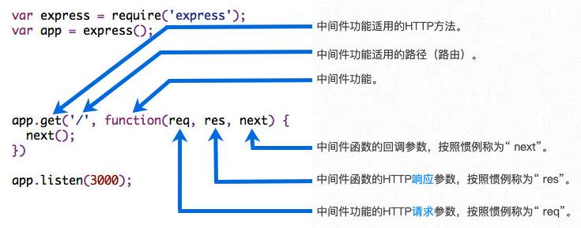

# Express

## Express 安装

- 方式一：使用 `express-generator`

  - 安装 `express-generator`

    ~~~bash
    npm install -g express-generator
    ~~~

  - 创建项目

    ~~~bash
    express express-demo
    ~~~

  - 安装依赖

    ~~~bash
    npm install
    ~~~

  - 启动项目

    ~~~bash
    node bin/www
    ~~~

- 方式二：从零搭建

  - 创建项目

    ~~~bash
    npm init
    ~~~
  
  - 安装 `express`
  
    ~~~bash
    npm install express
    ~~~

## Express 的基本使用

- 使用示例

  ~~~javascript
  const express = require('express')
  
  const app = express()
  
  app.get('/home', (req, res) => {
    res.end('首页的数据')
  })
  
  app.post('/login', (req, res) => {
    res.end('登录成功')
  })
  
  app.listen(8080, () => {
    console.log('服务器启动成功')
  })
  ~~~

## Express 中间件

- `Express` 应用程序本质上是一系列中间件函数的调用

### 什么是中间件

- 中间件的本质是传递给 `express` 的一个回调函数
- 这个回调函数接受三个参数
  - `request` 对象
  - `response` 对象
  - `next` 方法
    - 在 `express` 中定义的用于执行下一个中间件的函数
    - 如果调用 `next` 方法时传入了参数，则将传递给下一个错误中间件，传入的参数将作传递给错误中间件的 `err` 参数
- 

- 中间件可以做的事
  - 执行任何代码
  - 更改 `request` 和 `response` 对象
  - 结束`请求-响应`周期（返回数据）
  - 调用栈中的下一个中间件
    - 如果当前中间件功能没有结束`请求-响应`周期，则必须调用 `next()` 将控制权传递给下一个中间件功能，否则请求将被挂起

### 注册中间件

- `express` 中可以注册中间件的方式
  
  - ` app.use([path,] callback [, callback...])` / ` router.use([path], [function, ...] function)`
    - `use` 方法注册的中间件，当传入 `path` 时，会匹配相应路径的所有请求
    - 如果不传入 `path`，则会匹配所有请求
  -  `app[METHOD](path, callback [, callback ...])` / `router[METHOD](path, [callback, ...] callback)`
    - `METHOD` 指的是常见的请求方式
    - `METHOD` 方式本质是 `use` 的特殊情况
  
- 服务器收到请求时，会匹配第一个符合要求的中间件并执行，如果在中间件中使用了 `next()`，则执行完后会匹配下一个符合要求的中间件
  
- 一次可以注册多个中间件，下面两段代码片段等同

  ~~~javascript
  const express = require('express')
  
  const app = express()
  
  app.use('/test', (req, res,next) => {
    console.log('中间件1')
    next()
  })
  
  app.use('/test', (req, res, next) => {
    console.log('中间件2')
    next()
  })
  
  app.use('/test', (req, res, next) => {
    console.log('中间件3')
    res.end('返回结果')
  })
  
  app.listen(8080, () => {
    console.log('服务器启动成功')
  })
  ~~~

  ~~~javascript
  const express = require('express')
  
  const app = express()
  
  app.use('/test', (req, res, next) => {
    console.log('中间件1')
    next()
  }, (req, res, next) => {
    console.log('中间件2')
    next()
  }, (req, res, next) => {
    console.log('中间件3')
    res.end('返回结果')
  }
  )
  
  app.listen(8080, () => {
    console.log('服务器启动成功')
  })

### 内置中间件

- `express` 有内置一些现成的中间件可以直接注册使用

  - `express.static()`
    - 使得客户端可以直接访问服务器上的静态资源
    - [express() - Express 中文文档 (nodejs.cn)](https://nodejs.cn/express/4x/api/express/#static)
  - `express.json()`
    - 使用 `JSON` 有效负载解析传入请求
    - [express() - Express 中文文档 (nodejs.cn)](https://nodejs.cn/express/4x/api/express/#json)
  - `express.urlencoded()`
    - 使用 `URL` 编码的负载解析传入的请求
    - [express() - Express 中文文档 (nodejs.cn)](https://nodejs.cn/express/4x/api/express/#urlencoded)

- 解析 `JSON` 与 `urlencoded` 示例

  ~~~javascript
  app.use(express.json()) // express.json() 中间件会在接受完请求体后，将请求体数据放入  req.body，并调用 next()
  app.use(express.urlencoded({ extended: true }))
  // 解析 urlencoded 时，默认使用 node 内置的 querystring 模块
  // 如果传入 { extended：true }，则使用 qs 库来解析
  
  app.post('/login', (req, res, next) => {
    console.log(req.body)
    res.end('登录成功')
  })
  ~~~

- 提供静态资源示例

  ~~~javascript
  const express = require('express')
  const path = require('path')
  const app = express()
  
  // `express.static` 中间件指向 "public" 文件夹
  app.use(express.static(path.join(__dirname, 'build')))
  
  app.listen(8080, () => {
    console.log('服务器启动成功')
  })
  ~~~

### 常用第三方中间件

- `morgan`

  - 用于记录请求日志

  - 使用示例

    ~~~bash
    npm i morgan
    ~~~

    ~~~javascript
    const fs = require('fs')
    const express = require('express')
    const morgan = require('morgan')
    
    const app = express()
    
    const loggerWriterStream = fs.createWriteStream('./logs/access.log', {
      flags: 'a+'
    })
    
    app.use(morgan('combined', { stream: loggerWriterStream }))
    
    app.post('/login', (req, res, next) => {
      res.end('登录成功')
    })
    
    app.listen(8080, () => {
      console.log('服务器启动成功')
    })
    ~~~

- `multer`

  - 用于解析 `multipart/form-data` 格式的请求体，可以解析并存储请求体中的文件

  - 解析 `form-data` 中的文件示例

    ~~~bash
    npm i multer
    ~~~

    ~~~javascript
    const express = require('express')
    const multer = require('multer')
    const path = require('path')
    
    const app = express()
    
    const upload = multer({
      dest: path.resolve(__dirname, "./uploads"), // 获取文件后的存放路径，配置了 storage 则会被覆盖
      storage: multer.diskStorage({ // 文件存储相关
        destination(req, file, cb) { // 用于指定存放路径，和 dest 选项一样，如果使用了 storege 选项则会覆盖 dest
          cb(null, path.resolve(__dirname, "./uploads"))
        },
        filename(req, file, callback) { // 指定文件名称
          cb(null, Date.now() + '_' + path.extname(file.originalname))
        }
      })
    })
    
    // 接受单张照片上传
    app.post('/avatar', upload.single('avatar'), (req, res) => {
      console.log(req.file) // 文件信息在 req.file 中
      res.end('上传头像成功')
    })
    
    // 接受多张照片上传
    app.post('/photos', upload.array('photos'), (req, res) => {
      console.log(req.files) // 文件信息在 req.files 中
      res.end('上传多张照片成功')
    })
    
    app.listen(8080, () => {
      console.log('服务器启动成功')
    })
    ~~~
  
  - 解析 `form-data` 中的其它数据示例（较少使用）
  
    ~~~javascript
    const express = require('express')
    const multer = require('multer')
    
    const app = express()
    
    const formData = multer()
    
    app.post('/login', formData.any(), (req, res) => {
      console.log(req.body)
      console.log(Object.getPrototypeOf(req.body))
      res.end('登录成功')
    })
    
    app.listen(8080, () => {
      console.log('服务器启动成功')
    })
    
    console.log()
    ~~~
  

### request 对象与 response 对象

- `request` 对象中默认能解析的参数

  - `express` 中能默认解析的客户端请求参数格式

    - `GET` 请求中的 `query` 参数
    - `GET` 请求中的 `params` 参数

  - 示例

    ~~~javascript
    const express = require('express')
    
    const app = express()
    
    // 获取 query 参数
    app.get('/test1', (req, res) => {
      console.log(req.query) // req.query 已被解析为 JS 对象
      res.end('获取到 query 参数 ' + JSON.stringify(req.query))
    })
    
    // 获取 params 参数
    app.get('/test2/:id', (req, res) => {
      console.log(req.params.id) // req.params 中存储 params 参数
      res.end('获取到 params 参数 id = ' + req.params.id)
    })
    
    app.listen(8080, () => {
      console.log('服务器启动成功')
    })
    ~~~

- `response` 对象中常用的响应数据的方式

  - `end()`
    - 同原生 `http` 模块中的 `response.end()` 
  - `json()`
    - `response.json()` 中可以传入很多的类型：`object`、`array`、`string`、`boolean`、`numbner`、`null` 等
    - 传入的类型会被转换成 `json` 格式返回
  - `status()`
    - 用于设置状态码

## Express 路由

- 可以使用 `express.Router` 来创建一个路由处理程序

  - 一个 `Router` 实例拥有完整的中间件和路由系统

  - 因此，它也被称为 `mini-app`

  - 使用示例

    ~~~javascript
    const express = require('express')
    const app = express()
    const userRouter = express.Router()
    
    // 使用 userRouter 进行用户相关的处理
    userRouter.get('/', (req, res) => {
      res.end('用户列表')
    })
    userRouter.post('/', (req, res) => {
      res.end('创建用户')
    })
    userRouter.delete('/:id', (req, res) => {
      res.end('删除用户')
    })
    userRouter.patch('/:id', (req, res) => {
      res.end('修改用户')
    })
    
    // 让 userRouter 生效，所有 /users 路径下的请求都会被 userRouter 进行匹配
    app.use('/users', userRouter)
    
    app.listen(8080, () => {
      console.log('服务器启动成功')
    })
    ~~~

## 错误处理

- 不同的处理方案

  - 方案一：返回 `HTTP` 错误状态码

    ~~~javascript
    res.status(401)
    res.json('未授权访问的信息')
    ~~~

  - 方案二：`HTTP` 状态码 `200`，在返回的信息中包含错误信息

    ~~~javascript
    res.json({
      code:-1001, // 此处 code 非 HTTP 状态码，而是根据项目自定义的
      message: "未授权访问的信息，请检测token"
    })
    ~~~

- 错误中间件

  - 用于捕捉项目中异常错误的中间件

  - 必须有四个形参：`err`, `req`, `res`, `next`，无论是否使用到

  - 错误中间件，必须注册在所有路由之后

  - 示例

    ~~~javascript
    // 在路由中间件中，在对应条件下使用 next(err) 将错误码传递给错误中间件
    
    // 在所有路由最后注册错误中间件
    app.use((err, req, res, next) => {
      let message = '未知的错误信息'
    
      switch (err) {
        case -1001:
          message = '没有输入用户名密码'
          break
        case -1002:
          message = '输入的用户名和密码错误'
          break
      }
    
      res.json({ code, message })
    })
    ~~~

    

  