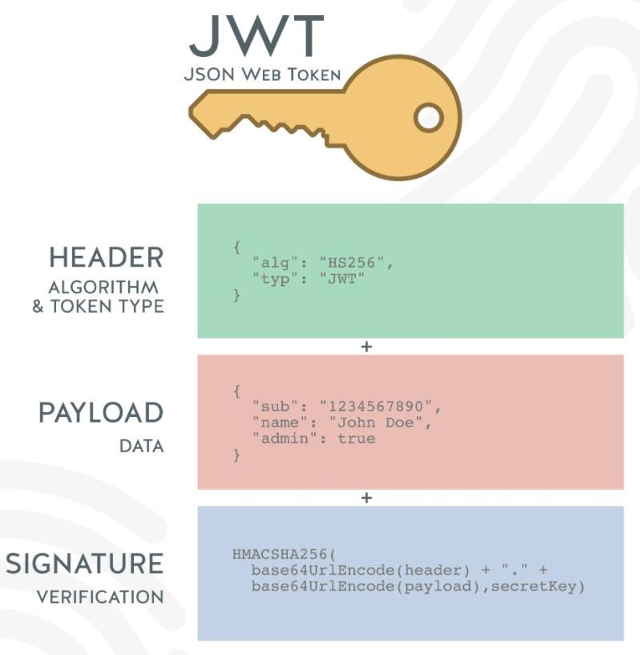

## .env 文件

- `.env` 文件中可以存储项目中的常量

- 使用方式

  - 在项目根目录下新建 `.env` 文件

  - 文件内容示例

    ~~~env
    SERVER_PORT=8000
    HOST=localhost
    ~~~

  - 如何获取 `.env` 文件中的常量

    - 安装 `dotenv` 库

    - 在一个 `js` 文件中导出 `.env` 中的常量

      ~~~javascript
      const dotenv = require('dotenv')
      
      // 将 .env 中的常量写入 process.env 环境变量中
      dotenv.config()
      
      // 使用解构赋值的方式导出 process.env 中的属性
      module.exports = {
        SERVER_PORT
      } = process.env
      ~~~

## 配置别名

- 让 `VSCode` 识别别名

  - 在项目根目录下新建 `jsconfig.json ` 定义别名

    ~~~json
    {
      "compilerOptions": {
        "baseUrl": "./",
        "paths": {
          "@/*": [
            "src/*"
          ]
        }
      }
    }
    ~~~

- 让 `Node.js` 识别别名

  - 安装 `module-alias` 库

  - 在 `package.json` 中添加 `_moduleAliases` 字段并定义别名

    ~~~json
    {
      // ...
      "_moduleAliases": {
        "@": "src"
      },
      // ...
    }
    ~~~

  - 在项目入口文件处顶部添加以下代码

    ~~~javascript
    require('module-alias/register');
    ~~~

## 调试相关

- 为避免调试时频繁跳转进入 `node_modules` 中的代码文件，可在 `.vscode/launch.json` 中配置如下代码，参考 `configurations.skipFiles` 字段，数组中添加值 `"${workspaceFolder}/node_modules/**/*.js"`

  ~~~json
  {
    "version": "0.2.0",
    "configurations": [
      {
        "type": "node",
        "request": "launch",
        "name": "启动程序",
        "skipFiles": [
          "<node_internals>/**",
          "${workspaceFolder}/node_modules/**/*.js"
        ],
        "program": "${workspaceFolder}/src/main.js"
      }
    ]
  }
  ~~~

## 测试 mysql2 是否与数据库连接成功

- 方式一

  ~~~javascript
  const mysql = require('mysql2')
  
  const pool = mysql.createPool({
    host: 'localhost',
    port: 3306,
    database: 'coderhub',
    user: 'root',
    password: 'root',
    connectionLimit: 5
  })
  
  pool.getConnection((err, connection) => {
    if (err) {
      console.log('连接失败', err)
      return
    }
    connection.connect(err => {
      if (err) {
        console.log('连接失败', err)
        return
      }
      console.log('数据库连接成功')
      // 释放连接回连接池
      connection.release()
    })
  })
  
  const connection = pool.promise()
  
  module.exports = connection
  ~~~

- 方式二

  ~~~javascript
  const mysql = require('mysql2/promise')
  
  const pool = mysql.createPool({
    host: 'localhost',
    port: 3306,
    database: 'coderhub',
    user: 'root',
    password: 'root',
    connectionLimit: 1
  })
  
   ; (async () => {
      try {
        const connection = await pool.getConnection()
        await connection.connect()
        // 释放连接回连接池
        connection.release()
        console.log('数据库连接成功')
      } catch (error) {
        console.log('连接失败', error)
      }
    })()
  
  module.exports = pool
  ~~~

## 架构设计

- `MVC`（`Model-View-Controller`）模式是一种用于设计软件应用程序的架构设计模式，将应用程序的数据、显示和处理分离，以便更容易进行维护和扩展。

  在这种模式中：

  1. `Model`（模型）：表示数据和业务逻辑，用于处理应用程序中的数据和规则。在 `Node.js` 中，这个层次通常指的是数据库模型和数据访问对象，用于与数据库进行交互。
  2. `View`（视图）：承载呈现给用户的数据展示，即用户界面。在 `Web` 应用程序中，视图层通常指的是 `HTML` 模板文件和客户端脚本。
  3. `Controller`（控制器）：接收用户输入，处理对应的业务逻辑，并调用模型和视图层进行操作。在 `Node.js` 中，控制器层负责处理用户请求并响应，通常与 `router` 层和 `service` 层配合使用。`router` 层负责根据请求 `URL` 和 `HTTP` 动词将请求路由到相应的控制器，`service` 层则负责处理具体的业务逻辑。

- `Node` 服务器的功能主要属于 `MVC` 模式的 `Controller` 层，可继续分为 `Router` 层、`Controller` 层、`Service` 层
  - `Router`
    - 主要负责将客户端请求路由至相应的 `Controller`
    - 在 `MVC` 架构中起到连接 `View` 层与 `Controller` 层的作用
  - `Controller`
    - 负责处理用户请求和响应
    - `Router` 层将请求分发到相应的 `Controller` 后，`Controller` 调用 `Service` 提供的函数或服务来完成具体的业务操作，根据业务逻辑的结果返回响应给客户端
  - `Service`
    - 核心的业务逻辑抽离到 `Service` 中，包括与数据库的交互、业务规则和其它第三方的 `API` 调用等，这些逻辑被封装成可复用的服务或函数，提供给 `Controller` 调用
    - 在 `MVC` 架构中起到连接 `Controller` 层与 `Model` 层的作用
  - `Middleware`
    - 另外，可以在 `Router` 和 `Controller` 之间使用 `Middleware` 层，负责在传递请求或返回响应时对数据进行处理
    - 例如身份认证、请求日志、限流、异常处理等

## 登录凭证

- `http` 是一个无状态的协议
  - `http` 的每次请求对于 `web` 服务器来说都是一个单独的请求，与之前的请求没有关系
  - 因此，需要给客户端一个登录凭证，以表示该客户端处于已登录状态

### Cookie

- `Cookies` 是一种`小型文本文件`，是服务器为了辨别用户身份而存储在用户本地终端（`Client Side`）上的数据
- 浏览器会在特定情况下自动携带上 `cookie` 来发送请求
- 根据存储的位置不同，`Cookie` 可以分为`内存 Cookie` 和`硬盘 Cookie`
  - 区别
    - 内存 `Cookie`
      - 由浏览器维护，保存在内存中，浏览器关闭时 `Cookie` 就会消失
      - 又称为`会话 Cookie`
    - 硬盘 `Cookie`
      - 保存在硬盘中，有一个过期时间，当用户手动清理或过期后才会被清理
      - 又称为`持久性 Cookie`
  - 如何判断
    - 如果没有设置过期时间，或过期时间小于等于 `0` 的是内存 `Cookie`
    - 如果有设置过期时间，且过期时间不小于等于 `0` 的是硬盘 `Cookie`

#### 设置 Cookie

- `Cookie` 的常见属性
  - 可以通过设置 `expires` 或 `max-age` 以设置过期时间
    - `expires`
      - 设置的类型是 `Date.toUTCString()`
    - `max-age`
      - 设置的是秒数
  - `Cookie` 的作用域（允许 `Cookie` 发送给哪些 `URL`）
    - `Domain`
      - 指定哪些主机可以接收 `Cookie`
      - 默认是 `origin`，不包含子域名
      - 如果指定 `Domain`，则包含子域名
        - 如设置 `Domain=mozilla.org`，则 `Cookie` 也包含在子域名中，如 `developer.mozilla.org`
    - `Path`
      - 指定主机下哪些路径可以接收 `Cookie`
      - 例如，设置 `Path=/docs`，则以下地址都会匹配
        - `/docs`
        - `/docs/Web`
        - `/docs/Web/HTTP`

- 客户端中手动修改 `Cookie`（使用 `JS` 原生设置）

  ~~~javascript
  // 为 document.cookie 赋值只会替换其中的键值对，不会整个替换所有的 cookie
  document.cookie = "name=zzc"
  document.cookie = "age=18"
  // 86400 秒，即 24 小时后过期
  document.cookie = "name=zzc;age=18;max-age=86400"
  // 读取客户端的 Cookie
  console.log(document.cookie)
  ~~~

- 服务器中将 `Cookie` 发送给客户端（使用 `Koa` 设置）

  ~~~javascript
  // 设置 Cookie
  testRouter.get('/test', (ctx, next) => {
    ctx.cookies.set('name', 'zzc', {
      maxAge: 1000 * 60 * 60 * 24 * 7
    })
    ctx.body = 'Cookie 设置成功' // 请求了该路径的客户端会自动获得 Cookie
  })
  
  // 获取 Cookie
  testRouter.get('/demo', (ctx, nent) => {
    const value = ctx.cookies.get('name')
    ctx.body = '获取 Cookie 成功' + value
  })
  ~~~

### Session

- `Session` 是一种服务器的状态管理技术
  - `Session` 为每个用户创建一个唯一的会话 `ID`，通常通过生成一个随机的字符串
  - 此会话 `ID` 可以存储在 `Cookie` 或 `URL` 参数中，以便在用户的不同请求之间传递给服务器
  - 服务器将会话数据（如用户信息、设置等）与会话 `ID` 关联并存储在服务器内存或持久化存储中
  - 当用户访问应用程序时，通过提供会话 `ID`，服务器可以识别和跟踪用户状态
- `Cookie` 只能在客户端存储数据，`Session` 可以在服务端存储数据
  - `Session` 在服务端存储的数据通常认为比在客户端存储的 `Cookie` 更安全，因为它不容易受到篡改或被恶意用户访问
  - 通常二者会结合使用

#### 设置 Session

- 在 `Koa` 中，可以借助于 `koa-session` 来实现基于 `Cookie` 的 `Session` 认证。以下示例是将 `Session` 存在客户端的 `Cookie` 中的，也可以配置 `koa-session` 以将会话数据存储在其他存储介质上，例如 `Redis`、`MongoDB` 或内存。

  ~~~bash
  npm i koa-session
  ~~~

  ~~~javascript
  const koaSession = require('koa-session')
  
  // 配置 koa-session
  const session = koaSession({
    key: 'sessionid', // cookie 中 Session 的键名
    maxAge: 1000 * 60 * 60 * 24 * 7, // 过期时间
    httpOnly: true, // 不允许通过 JS 获取 cookie
    rolling: true, // 每次响应时，刷新 Session 的有效期
    renew: true, // 当 Session 快过期时自动更新
    signed: true, // 是否使用 signed 签名认证，防止数据被篡改，默认为 true
    cookie: {
      path: '/foo', // 设置路径
      domain: 'foo.com' // 设置域名
    }
  }, app)
  app.keys = ['foo1', 'foo2'] // 加盐操作，设置密钥数组
  app.use(session)
  
  // 设置 Session
  testRouter.get('/test', (ctx, next) => {
    ctx.session.user = {
      id: 1,
      name: 'zzc'
    }
    ctx.body = 'Session 设置成功' // 请求了该路径的客户端会自动获得包含 session_id 的 cookie 
  })
  
  // 获取 Session
  testRouter.get('/foo', (ctx, next) => {
    const value = ctx.session.user
    ctx.body = '获取 Session 成功' + value
  })
  ~~~

### Token

- `Cookie` 和 `Session` 的缺点
  - `Cookie` 会被附加在每个 `HTTP` 请求中，无论是否需要用到，无形中增加了流量
  - `Cookie` 是明文传递的，存在安全性问题
  - `Cookie` 的大小限制是 `4KB`，无法满足复杂需求
  - `Cookie` 对于浏览器外的客户端兼容性不高
    - 对于浏览器外的其它客户端，如 `IOS`、 `Android`，必须手动保存 `Cookie`
  - 对于分布式系统和服务器集群中，要保证其它系统也可以正确地解析 `Session` 较为麻烦

- `Token`
  - 可以翻译为令牌
  - 在验证了用户登录成功的情况下，给用户颁发一个令牌
  - 这个令牌作为后续用户访问一些接口或者资源的凭证
- `Token`（`JWT`） 和 `Session`（基于 `Cookie`） 的比较
  - 对于服务器来说， `Token` （以下 `Token` 都指代 `JWT`） 相比于基于 `Cookie` 的 `Session`（以下简称客户端 `Session`）更接近无状态
    - `Token` 和客户端 `Session` 都将用户状态存储在客户端，服务端存储密钥、解密和验证逻辑
      - 客户端 `Session` 会将会话设置（如过期时间）保存在客户端和服务器，而 `Token` 可以将会话设置保存在 `Token` 本身的有效荷载中
        - P.S.：客户端 `Session` 也会在客户端保存一些会话设置信息，比如可以在浏览器的包含 `Token` 的 `Cookie` 中查看过期时间，但是实际以服务器中的设置为准
      - 客户端 `Session` 是将用户状态存储在 `Cookie` 中，服务器在解析时还需解析一次 `Cookie`，所以需要在服务器保存对应的解析方法，而 `Token` 的状态包含在 `Token` 本身中，更方便解析。
  - 数据加密
    - 两种方式都可以对数据进行加密处理
    - 如果采用非对称加密，客户端 `Session`  需要手动对 `Cookie` 中的数据进行加密和解密，而 `JWT` 库內建了签名和验证机制，更易于使用

#### JWT(JSON Web Token)

- `JWT` 是一种常见的 `Token` 类型，它是一种基于 `JSON` 格式编码的 `Token`

- `JWT` 由三部分组成

  

  - `header`

    - 包含两部分内容
      - `alg`
        - 采用的加密方法
        - 默认使用 `HMAC SHA256` (`HS256`)，采用同一个密钥进行加密解密，即对称加密
      - `typ`
        - `JWT`，固定值，表示使用 `JWT` 类型的 `Token`
    - 会通过 `base64Url` 算法进行编码

  - `payload`

    - 携带的数据
    - 比如可以存放用户的 `id` 和 `name`
    - 默认会携带 `iat`（`issued at`），令牌的签发时间
    - 可以设置过期时间 `exp`（`expiration time`）

    - 会通过 `base64Url` 算法进行编码

  - `signature`

    - 设置一个 `secretKey`
    - 将前两个的结果和 `secretKey` 合并后进行 `HMAC SHA256` 算法编码
      - `HMACSHA256(base64Url(header)+"."+base64Url(payload),secretKey)`
    - 如果 `secretKey` 暴露是一件非常危险的事，可以用 `secretKey` 模拟颁发 `Token`，也可以解密 `Token`

##### jsonwebtoken 基本使用

- 工作流程
  1. 用户通过提供用户名和密码等凭证在客户端（如浏览器或移动应用）登录
  2. 服务器验证这些凭证并在成功验证后生成一个 `JWT`
  3. 服务器将生成的 `JWT` 发送回客户端
  4. 客户端将接收到的 `JWT` 存储在其本地存储（如浏览器的 `localStorage` 或 `sessionStorage`，或移动应用的设备存储）中。将 `JWT` 作为授权信息随后续请求附带发送，通常是作为 `HTTP` 头部的一个字段，例如 `Authorization: Bearer {token}`。
  5. 当客户端向服务器发起请求时，服务器会验证该请求附带的 `JWT`。如果 `JWT` 是有效的，服务器便会允许客户端访问所请求的资源。

- 借助 `jsonwebtoken` 库在 `Koa` 中使用 `JWT` 示例

  ~~~bash
  npm i jsonwebtoken
  ~~~

  ~~~javascript
  const jwt = requrie('jsonwebtoken')
  
  const secretkey = 'foo' // 仅为示例
  
  testRouter.get('/test', (ctx, next) => {
    const payload = {
      id: 1,
      name: 'zzc',
      iat: Math.floor(Date.now() /1000), // 签发时间，默认已携带，仅示例
      exp: Math.floor(Date.now() /1000) + 60 * 60 * 24 * 7, // 签发时间，也可在 jwt.sign() 的第三个参数对象中配置
    }
    const token = jwt.sign(payload, secretkey, {
      expiresIn: 60 * 60 * 24 * 7, // 单位是秒
      algorithm: 'HS256' // 指定加密算法，默认为 'HS256'
    })
    ctx.body = token
  })
  
  testRouter.get('/demo', (ctx, next) => {
    try {
      const authorization = ctx.headers.authorization
      const token = authorization.replace('Bearer ', '')
      const result = jwt.verify(token, secretkey) // 使用 secretkey 验证 Token 是否有效，这是对称加密，返回 Token 解密后的信息
      ctx.body = result
    } catch (err) {
      // 如果验证失败，则捕获异常
      ctx.body = err.message
    }
  })
  ~~~

##### 非对称加密

- 对称加密（`HS256`，`HMAC-SHA256`）的密钥可以发布令牌，也可以验证令牌，因此密钥暴露会很危险

- 非对称加密有两个密钥

  - 私钥（`private key`）用于发布令牌
  - 公钥（`public key`）用于验证令牌

- `JWT` 支持的非对称加密算法

  - `RS256`，表示 `RSA` 签名的 `SHA-256` 算法
  - `RS256`，表示 `Elliptic Curve Digital Signature Algorithm` (`ECDSA`) 使用 `SHA-256` 哈希算法

- 生成一对私钥和公钥

  - `RS256`

    - 使用终端上的 `openssl` 创建

      - `Mac` 直接使用 `terminal` 终端

      - `Windows` 默认的 `cmd` 终端不能直接使用，建议使用 `git bash` 终端

        ~~~bash
        openssl # 回车
        
        > genrsa -out private.key 2048 # 生成一个 2048 位的私钥
        > rsa -in private.key -pubout -out public.key # 根据私钥生成公钥
        ~~~

    - 使用 `node-rsa` 库

      ~~~bash
      npm i node-rsa
      ~~~

      ~~~javascript
      const NodeRSA = require('node-rsa')
      
      function generateRsaKeyPair(bits) {
        const key = new NodeRSA()
        key.generateKeyPair()
        const publicKey = key.exportKey('public')
        const privateKey = key.exportKey('private')
        return { publicKey, privateKey }
      }
      
      const { publicKey, privateKey } = generateRsaKeyPair（2048）
      ~~~

  - `ES256`

    - 终端创建

      ~~~bash
      openssl # 回车
      
      # 使用 prime256v1 椭圆曲线生成 EC（Elliptic Curve）私钥
      > ecparam -genkey -name prime256v1 -out ec_private_key.pem
      
      # 从先前生成的私钥中导出公钥
      ec -in ec_private_key.pem -pubout -out ec_public_key.pem
      ~~~

    - 使用 `Node` 的 `crypto` 模块

      ~~~javascript
      const crypto = require('crypto');
      
      function generateES256KeyPair() {
        const keyPair = crypto.generateKeyPairSync('ec', {
          namedCurve: 'prime256v1',
        })
      
        const privateKeyPEM = keyPair.privateKey.export({
          type: 'pkcs8',
          format: 'pem',
        })
      
        const publicKeyPEM = keyPair.publicKey.export({
          type: 'spki',
          format: 'pem',
        })
      
        return { privateKeyPEM, publicKeyPEM }
      }
      
      
      const { privateKey, publicKey } = generateES256KeyPair()
      ~~~

    - 使用 `elliptic` 库

      ~~~javascript
      const elliptic = require('elliptic')
      const EC = elliptic.ec
      
      // 创建一个曲线实例
      const ec = new EC('p256') // `p256` 是 NIST P-256 曲线，对应于 ES256 算法
      
      // 生成密钥对
      const keyPair = ec.genKeyPair()
      
      // 获取公钥和私钥
      const publicKey = keyPair.getPublic('hex')
      const privateKey = keyPair.getPrivate('hex')
      ~~~

- 使用公钥和私钥签发和验证签名

  ~~~javascript
  const jwt = requrie('jsonwebtoken')
  const fs = require('fs')
  
  // 读取生成的私钥和公钥，使用时可以直接用 Buffer 格式的密钥
  const privateKey = fs.readFileSync('src/keys/private.key')
  const publicKey = fs.readFileSync('src/keys/public.key')
  
  testRouter.get('/test', (ctx, next) => {
    const payload = {
      id: 1,
      name: 'zzc'
    }
    // 使用私钥颁发 Token
    const token = jwt.sign(payload, privateKey, {
      expiresIn: 60 * 60 * 24 * 7,
      algorithm: 'RS256' // 指定加密算法为 RS256
    })
    ctx.body = token
  })
  
  testRouter.get('/demo', (ctx, next) => {
    try {
      const authorization = ctx.headers.authorization
      const token = authorization.replace('Bearer ', '')
      // 使用公钥验证 Token
      const result = jwt.verify(token, publicKey, {
        algorithms: ['RS256'] // 指定解密算法，可以指定多个算法尝试
      }) 
      ctx.body = result
    } catch (err) {
      // 如果验证失败，则捕获异常
      ctx.body = err.message
    }
  })
  ~~~
