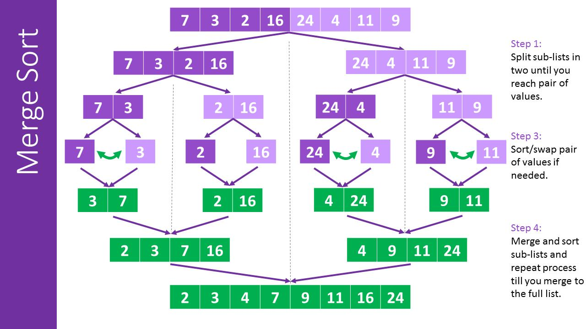

# 冒泡排序（Bubble Sort）

步骤

- 两两比较相邻的元素并根据大小交换它们的位置，比如从前往后比较，将较大的交换到后面；
- 经过上一部的操作后，最大值会被移动到最后，之后将除去这个最大值的剩余数列再进行上面的操作，重复下去直到排序完成；

由于最大/最小的元素会经由交换慢慢“浮”到数列的尾端，因此称为“冒泡排序”。

# 选择排序（Selection Sort）

步骤

- 在未排序数列中找到最大/最小元素，将其存放到数列的起始位置；
- 对剩余未排序部分持续进行上面操作。

# 插入排序（Insertion Sort）

步骤

- 假设第一个数据是已经排序好的，接着取出下一个数据，在已经排序好的数据中从后往前扫描，找到它应该在的位置后插入；
- 重复上面操作。

适用于数列前部存在部分有序数据的情况。

# 归并排序（Merge Sort）

归并排序是一种基于分治思想的排序算法。

其基本思路可以分为三个步骤：

1. 分解：使用递归算法来实现分解过程，具体实现中可以分为：
   - 如果待排序数组长度为 1，认为这个数组已经有序，直接返回；
   - 将待排序数组分为两个长度相等的子数组，分别对这两个子数组进行【递】分解，直到子数组的长度为 1。
2. 合并：合并过程中比较每个子数组的元素并将它们有序地合并成一个新的数组：
   - 可以使用两个指针 i 和 j 分别指向两个子数组中的元素，按顺序放入到一个新的有序数组中；
   - 【归】合并新的有序数组，直到合成最终的排序后的数组。

性能：

- 归并排序的平均时间复杂度是 `O(nlogn)`，最好情况是在待排序数组已经有序时，为 `O(logn)`。

图解：

# 快速排序（Quick Sort）

有时也被称为**划分交换排序（partition-exchange sort）**。

快速排序是一种基于分治思想的排序算法，实现思路是：

- 取出一个基准元素（pivot），将数列剩余部分分为左右两部分份，左部分的元素都小于基准元素，右部分的元素都大于基准元素；
- 将左右两部分的数列分别【递】分解，重复上面的操作；
- 直到左右部分元素个数都小于等于 1 时，进行【归】。

性能

- 快速排序的平均时间复杂度是 `O(nlogn)`，在最坏情况是当每次选中的基准元素总是该数列中的最大值或最小值时，为 `O(n^2)`。使用三数取中法（即选择数列左端、中间、右端中的中间值作为中位数）或随机选择基准元素可以避免作用于有序数列时发生最坏情况。
- 快速排序是一个原地排序算法，不需要额外的数组空间。