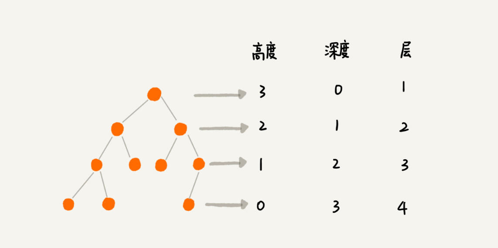

### 线性结构（Linear List）

- 线性结构是由 `n`（`n ≥ 0`）个数据元素（结点）：`a[0], a[1], ... , a[n-1]` 组成的有限序列
- 其中：
  - 数据元素的个数 `n` 定义为表的长度：`"list".length`
    - `"list".length = 0` 时称为空表
  - 将非空的线性表（`n ≥ 1`）记作：(`a[0], a[1], ... , a[n-1]`)
  - 数据元素 `a[i]`（`0 ≤ i ≤ n-1`）只是一个抽象符号，其具体含义在不同情况下可以不同
- 常用的线性结构
  - 数组结构（`Array`）
  - 链表结构（`Linkedlist`）
  - 栈结构（`Stack`）
  - 队列结构（`Queue`）

#### 数组结构（Array）

- 几乎每种编程语言都会提供的一种原生数据结构（语言自带的数据结构）

- 可以借助数组结构来实现其它的数据及结构，比如栈（`Stack`）、队列（`Queue`）、堆（`Heap`）

- 通常数组的内存是连续的，所以数组在知道下标值的情况下，访问效率是最高的

- 然而在数组的非尾部位置插入元素，或在头部移除元素时，后面的元素都需要进行位移，效率较低

- 创建数组时通常需要申请一段连续的内存空间，在大多数编程语言中，这块内存空间的大小是固定的，当当前数组不能满足容量需求时，需要扩容

  - 一般情况下是申请一个更大的数组，比如 `2` 倍d啊小，再将原数组中的元素复制过去
  
  

#### 链表结构（Linked List）

- 链表是一种常见的用于存储数据的线性结构
- 链表的实现机制不同于数组
- 链表中的每个元素由一个存储元素本身的节点和一个指向下一个元素的引用（在一些语言中称为指针或链接）组成
- 链表中的元素在内存中不必是连续的空间
- 链表相较于数组
  - 优点
    - 灵活的内存动态管理
    - 在插入和删除元素时，时间复杂度可以达到 `O(1)`
  - 缺点
    - 无法直接访问任意某个位置的元素，需要从第一个元素（`head`）开始访问

- 链表的封装

  ~~~typescript
  // 链表中的节点
  class ListNode<T> {
    next: ListNode<T> | null = null
    constructor(public value: T) { }
  }
  
  // 链表
  class LinkedList<T> {
    private size: number = 0
    public head: ListNode<T> | null = null
    
    get length() {
      return this.size
    }
    // ......
  }
  ~~~

#### 栈结构（Stack）

- 栈结构是一种比较常见的**受限的线性结构**

- 栈结构示意图

  

- 栈结构特性
  - 后进先出（`Last In First Out`）
  - 栈结构的限制是仅允许在**表的一端**进行插入和删除计算，这一端被称为**栈顶**，相对地，另一端称为**栈底**
  - `LIFO`（`Last In First Out`）表示后进入的元素，第一个弹出栈空间
  - 向一个栈插入新元素称为**进栈**、**入栈**或**压栈**，它是把新元素放到栈顶元素的上面，使之成为新的栈顶元素
  - 从一个栈删除元素又称为**出栈**或**退栈**，它是把栈顶元素删除掉，使相邻的元素成为新的栈顶元素
  
- 栈结构的常见操作
  - `push(element)`
    - 添加一个新元素到栈顶位置
  - `pop()`
    - 移除栈顶的元素，同时返回被移除的元素
  - `peek()`
    - 返回栈顶的元素
    - 不会对栈做任何修改
  - `isEmpty()`
    - 检测栈中是否有元素
  - `size()`
    - 返回栈里的元素个数

- 栈结构的实现
  
  - 定义栈接口
  
    ~~~typescript
    interface IStack<T> {
      push(element: T): number
      pop(): T | undefined
      peek(): T | undefined
      isEmpty(): boolean
      get size(): number
      clear(): void
    }
    ~~~
  
  - 基于数组实现
  
    ~~~typescript
    class ArrayStack<T> implements Istack<T> {
    
      constructor(private data: T[] = []) { }
    
      push(element: T) {
        return this.data.push(element)
      }
    
      pop() {
        return this.data.pop()
      }
    
      peek(): T | undefined {
        return this.data[this.data.length - 1]
      }
    
      isEmpty() {
        return this.data.length === 0
      }
    
      get size() {
        return this.data.length
      }
    
      clear() {
        this.data.length = 0
    
      }
    }
    ~~~
  
- 栈结构的应用

  - 将数值转换为二进制数值的字符串

    ~~~typescript
    function toBin(n: number | string): string {
      if (typeof n === 'string') {
        n = Number(n)
      }
      const stack = new ArrayStack<number>()
      while (n > 0) {
        stack.push(n % 2)
        n = Math.floor(n / 2)
      }
      let bin = ''
      while (stack.isEmpty() === false) {
        bin += stack.pop()
      }
      return bin
    }
    ~~~

  - 有效的括号
  
    - [20. 有效的括号 - 力扣（LeetCode）](https://leetcode.cn/problems/valid-parentheses/)
  
    - 此处没有使用封装好的 `ArrayStack`，而是直接使用原生数组实现了栈的功能
  
      ~~~typescript
      function isValid(s: string): boolean {
          const stack: string[] = [],
              map = {
                  "(": ")",
                  "[": "]",
                  "{": "}",
              }
          for (const x of s) {
              if (x in map) {
                  stack.push(x)
                  continue
              }
              if (map[stack.pop()] !== x) return false
          }
          return !stack.length
      }
      ~~~

#### 队列结构（Queue）

- 队列结构是一种比较常见的**受限的线性结构**

- 队列结构示意图

  

- 队列结构的特性

  - 先进先出（`First In First Out`）

  - 队列结构只允许在队列的前端（`front`）进行删除操作，只允许在在队列的后端（`rear`）进行插入操作

- 队列结构的实现

  - 定义列表接口

    ~~~typescript
    interface IQueue<T = any> {
      enqueue(element: T): number
      dequeue(): T | undefined
      peek(): T | undefined
      isEmpty(): boolean
      get size(): number
    }
    ~~~

  - 基于数组实现

    ~~~typescript
    class ArrayQueue<T = any> implements IQueue<T>{
    
      constructor(private data: T[] = []) { }
    
      enqueue(element: T) {
        return this.data.push(element)
      }
    
      dequeue() {
        return this.data.shift()
      }
    
      peek() {
        return this.data[0] as T | undefined
      }
    
      isEmpty() {
        return this.data.length === 0
      }
    
      get size() {
        return this.data.length
      }
      
    }
    ~~~

#### 数组与链表的复杂度对比

- 对比表

  | Data Structure | Access | Search | Insertion | Deletion |
  | -------------- | ------ | ------ | --------- | -------- |
  | Array          | O(1)   | O(n)   | O(n)      | O(n)     |
  | Linked List    | O(n)   | O(n)   | O(1)      | O(1)     |

- 数组是一种连续的存储结构，通过下标可以直接访问数组中的任意元素

  - 时间复杂度
    - 随机访问时，直接使用下标访问的时间复杂度为 `O(1)`
    - 搜索时，如果使用顺序算法，时间复杂度为 `O(n)`，但可以使用其它算法优化时间复杂度
    - 插入和删除元素时，时间复杂度为 `O(n)`
  - 空间复杂度
    - 数组需要连续的存储空间，空间复杂度为 `O(n)`

- 链表是一种链式存储结构，通过指针链接起来的节点组成，访问链表中的元素需要从头节点开始遍历

  - 时间复杂度
    - 随机访问时，时间复杂度为 `O(n)`
    - 搜索时，时间复杂度为 `O(n)`
    - 插入和删除元素时，直接改变节点的指针即可，时间复杂度为 `O(1)`
      - 注意：此处增删改查的时间复杂度是分开计算的，但是实际操作时，插入和删除元素前一定需要搜索，因此总的时间复杂度并不是 `O(1)`
  - 空间复杂度
    - 链表需要为每个节点分配存储空间，空间复杂度为 `O(n)`

- 选择使用数组还是链表需要根据具体应用场景来决定

  - 如果数据量不大，且需要频繁随机访问元素，使用数组可能更好
  - 如果数据量大，或者需要频繁插入和删除元素，使用链表可能更好

### 哈希表（Hash Table）

- 哈希表，又称散列表，是一种通过直接寻址快速查找和插入删除元素的数据结构
- 哈希表的底层结构就是数组，它存储数据的方式是使用键值对，`key` 通过哈希函数变换为 `HashCode`，`HashCode` 作为数组的下标，将对应的值存储在数组中
- 哈希表中的一些概念
  - 哈希化
    - 将大数字转换成数组范围内下标的过程，称之为哈希化
  - 哈希函数
    - 通常会将单词转换成大数字，大数字在进行哈希化的代码实现放在一个函数中，这个函数称为哈希函数
  - 哈希表
    - 最终数据插入数组中，对包括这个数组的整个结构的封装，称之为哈希表
- 冲突
  - 不同的 `key` 哈希化后的值可能相同，使得多个关键字映射到同一索引位置
  - 为解决冲突常见情况有两种方案
    - 链地址法/开链法（`Chaining`）
      - 链地址法是在每个索引中保存一个链表（或一个数组或其它数据结构）
      - 当冲突发生时，将冲突的元素添加到当前索引位置的链表中（首段或末端都可）
      - 查询时，先根据哈希化后的下标值找到对应的值，再取出链表，依次查询寻找的数据
    - 开放地址法/开放寻址法（`Open Addressing`）
      - 开放寻址法是当冲突发生时，从冲突位置开始，按照一定的方式查找新的存储位置
- 哈希化的效率
  - 如果没有发生冲突，存取哈希表的时间复杂度能达到 `O(1)`
  - 如果发生冲突，存取的效率依赖后来的探测长度
  - 平均探测长度以及平均存取时间，取决于装填因子，随着装填因子变大，探测长度也越来越长
- 装填因子（`load factor`）
  - 装填因子表示当前哈希表中已经包含的数据项和整个哈希表长度的比值
  - 装填因子 = 总数据项 / 哈希表长度
  - 开放地址法的装填因子最大是 `1`，因为它必须寻找到空白的单元才能将元素放入
  - 链地址法的装填因子可以大于 `1` ，因为它可以无线的延伸下去，但是效率会变低

#### 哈希函数

- 好的哈希函数应该具备的优点

  - 快速的计算
    - 快速获取到对应的 `hashCode` 非常重要
  - 均匀的分布
    - 无论链地址法还是开放地址法，当多个元素映射到同一个位置的时候，都会影响效率，因此要尽可能将元素映射到不同的位置

- 快速计算-霍纳法则（`Horner's method`）

  - 霍纳法则是一种高效的算法，主要用于求解单变量的高阶多项式

  - 这种方法完全避免了直接计算高次乘法的需求，并大大简化了计算过程

  - 基本形式

    - 假设有一个多项式：

      **P(x) = anxn + an-1n-1 + ... + a1x + a0**

    - 可以按照霍纳法则重新书写为：

      **P(x) = ((...(((anx + an-1)x + an-2)x + an-3)...)x + a1)x + a0**

    - 转变后，将乘法次数从 `n(n + 1) / 2` 次降低为了 `n` 次，而加法次数仍是 `n` 次，没有改变

- 均匀分布

  - 在需要使用常量的地方尽量使用质数
    - 指数和其他数相乘的结果相比于其他数字更容易产生唯一性的结果，减少哈希冲突
    - 如 `Java` 中的 `N` 次幂的底数选择的是 `31`，是经过长期观察分布结果得出的
    - 需要使用质数的地方，比如：
      - 哈希表的长度
      - `N` 次幂的底数

#### 哈希表的实现（链地址法）

- 示意图

  

- 哈希函数实现

  - 设计一个哈希函数

    - 代称
      - 设 `key` 的序号是 `0-n`，最大序号是 **n**
      - **a~n~** 是 `key` 的序号为 `n` 的字符的 `unicode` 码
      - **x** 是一个质数，作为 `N` 次幂的底数
    - 该哈希函数的算法是：
      - **anx0 + an-11 + ... + a1xn-1 + a0xn**
    - 按照霍纳法则表示为
      - **((...(((a0x + a1)x + a2)x + a3)...)x + an-1)x + an**
    - 选取一个 **x** 作为常量，将 **key** 中的各个字符的 `unicode` 码带入进行计算，计算的结果在使用哈希表的长度进行取模，得到的模数就是最后的哈希值

  - 代码实现

    ~~~typescript
    /**
     *
     * @param key 要转换的 key
     * @param max 数组的最大长度
     * @returns 索引值
     */
    function hashFunc(key: string, max: number): number {
      let hashCode = 0
      const length = key.length
      for (let i = 0; i < length; i++) {
        hashCode = 31 * hashCode + key.charCodeAt(i)
      }
      return hashCode % max
    }
    ~~~

- 创建哈希表
  - 哈希表的结构
    - `storage`
      - 是一个数组，每个 `index` 中存放一个 `bucket`
    - `bucket`
      - 可以是数组也可以是链表
      - 其中的每一项存放 `key` 和 `value`，最好用元组的形式
  
  - 记录哈希表的状态
    - `count`
      - 表示当前已经存在了多少条数据
    - `limit`
      - 标记 `storage` 中一共有多少个 `index`
  
  - 扩容和缩容的实现
  
    - 什么时候扩容
      - 当装填因子较大时（如` Java` 中是大于 `0.75` 时），效率会明显变低，需要扩容
    - 如何扩容或缩容
      - 扩容或缩容时，哈希表的 `limit` 改变，原本的 `key` 传入哈希函数得到的 `index` 也会改变，因此所有数据项都需要重新调用哈希函数来获取到不同的位置
  
  - 包含 `get`，`put`，`delete`，`resize` 的代码实现
  
    ~~~typescript
    class HashTable<T = any> {
      // 创建一个数组，用来存放链地址法中的链（数组）
      private storage: [string, T][][] = []
      // 定义数组长度限制
      private limit = 7
      // 记录已存放元素的个数
      private count = 0
    
      private hashFunc(key: string, max: number): number {
        let hashCode = 0
        const length = key.length
        for (let i = 0; i < length; i++) {
          hashCode = 31 * hashCode + key.charCodeAt(i)
        }
        return hashCode % max
      }
    
      put(key: string, value: T) {
        // 根据 key 获取对应的 storage 的索引值
        const index = this.hashFunc(key, this.limit)
        // 根据索引值取出 bucket
        let bucket = this.storage[index]
        // 如果该索引处还不存在 bucket，则创建一个
        if (!bucket) {
          bucket = []
          this.storage[index] = bucket
        }
        // 如果存在 bucket，则查看要写入的 key 是否已存在
        let isUpdate = false
        // 如果已存在则覆盖
        for (const tuple of bucket) {
          const tupleKey = tuple[0]
          if (tupleKey === key) {
            tuple[1] = value
            isUpdate = true
            return value
          }
        }
        // 如果不存在则新增
        if (!isUpdate) {
          bucket.push([key, value])
          this.count++
          // 如果填充因子已达到了 0.75，则 resize
          if (this.count > this.limit * 0.75) {
            this.resize(this.limit * 2)
            return value
          }
        }
      }
    
      get(key: string) {
        const index = this.hashFunc(key, this.limit)
        let bucket = this.storage[index]
        // 如果该索引处不存在 bucket，则该 key 一定不存在
        if (!bucket) return undefined
        // 如果存在 bucket，则继续查找 bucket 内是否存在该 key
        for (const tuple of bucket) {
          if (tuple[0] === key) return tuple[1]
        }
        return undefined
      }
    
      delete(key: string) {
        const index = this.hashFunc(key, this.limit)
        let bucket = this.storage[index]
        if (!bucket) return undefined
        for (let i in bucket) {
          const tuple = bucket[i]
          if (tuple[0] === key) {
            bucket.splice(Number(i), 1)
            this.count--
            if (this.limit > 7 && this.count < this.limit * 0.25) {
              this.resize(Math.floor(this.limit / 2))
            }
            return tuple[1]
          }
        }
        return undefined
      }
    
      private resize(newLimit: number) {
        // 保存旧数组中的数据
        const oldStorage = this.storage
        // 重置属性
        this.limit = newLimit
        this.count = 0
        this.storage = []
        // 遍历原来数组中的所有数据
        oldStorage.forEach(bucket => {
          if (!bucket) return
          bucket.forEach(tuple => {
            this.put(tuple[0], tuple[1])
          })
        })
      }
    }
    ~~~
  
  - 优化自动扩容
  
    - 让自动扩容后的 `limit` 变成一个质数
  
    - 代码实现
  
      ~~~typescript
      class HashTable<T> {
        // ...
        private isPrime(n: number) {
          const sqrt = Math.sqrt(n)
          for (let i = 2; i <= sqrt; i++) {
            if (n % i === 0) return false
          }
          return true
        }
      
        private getNextPrime(n: number) {
          let prime = Math.floor(n)
          while (!this.isPrime(prime)) {
            prime++
          }
          return prime
        }
        // ...
      }
      ~~~
  
      - 在需要 `resize` 的条件中使用 `this.getNextPrime` 方法将最后的 `limit` 变为质数

### 树结构（Tree）

#### 树结构术语

- 树结构大部分术语都与真实世界的树相关，或者和家庭关系相关（如父节点和子节点）

- 树是 `n`（`n ≥ 0`） 个节点构成的有限集合

  - 当 `n = 0` 时，称为**空树**（`Empty tree` / `Null tree`）

- 对于任一非空树，它具备以下性质

  - 树中有一个称为**根**（`Root`）的特殊节点，用 `r` 表示
  - 其余节点可分为 `m`（`m > 0`）个互不相交的有限集 `T1, T2, ..., Tm`，其中每个集合本身又是一棵树，称为原来树的**子树**（`Subtree`）

- 其他术语

  - 节点的度（`Degree`）

    - 节点的子树个数

  - 叶节点（`Leaf`）

    - 度为 `0` 的节点，也称为叶子节点

  - 父节点（`Parent`）

  - 子节点（`Child`）

  - 兄弟节点（`Sibling`）

    - 具有同一父节点的各节点彼此是兄弟节点

  - 路径（`Path`）和路径长度（`Path length`）

    - 路径是从一个节点到另一个节点的有序点序列，这些节点通过边连接
      - 也可以说，路径是沿着树形结构从一个节点到另一个节点的顺序遍历

    - 路径中的边是连续且无重复的
    - 路径长度指的是构成路径的边的数量

  - 高度（`Height`）

    - 树中的节点到其叶子节点的路径的长度（也可定义为 `路径长度 + 1`）
    - 叶子节点的高度定义为 `0`（也可定义为 `1`）

  - 深度（`Depth`）

    - 某一节点到根节点的路径长度（也可定义为 `路径长度 + 1`）
    - 根节点的深度定义为 `0`（也可定义为 `1`）

  - 节点的层次（`Level`）

    - 根节点在 `1` 层，其它任一节的层数是其父节点的层数加 `1`

  - 高度、深度、层次的区别

    

    - 层次从 `1` 开始
    - 高度与深度没有固定的定义，可以定义从 `1` 开始，也可以定义从 `0` 开始，在使用高度/深度概念时需先确定定义

#### 二叉树（binary trees）

- 二叉树概念

  - 如果树中的每个节点最多只能有两个子节点，这样的树就是二叉树

  - 所有的树本质上都可以使用二叉树模拟出来

  - 二叉树可以为空，若不为空，则它由根节点和称为左子树（`Left subtree`）和右子树（`Right subtree`）的两个不相交的二叉树组成

  - 二叉树可能的形态

    

- 二叉树特性

  - 一个二叉树第 `i`（`i ≥ 1`）层的最大节点数为 **2i-1**

  - 深度为 `k`（定义根节点深度为 `1`，`k ≥ 1`）的二叉树的最大节点总数为 **2k-1**

  - 对于任何非空二叉树 `T`，若 `n(0)` 表示叶节点的个数，`n(2)` 表示度为 `2` 的节点个数，那么两者满足关系 `n(0) = n(2) + 1`

- 完美二叉树（`Perfect Binary Tree`）

  - 也称为满二叉树（`Full Binary Tree`）

  - 在二叉树中，除了最下一层的叶节点外，每层节点都有 `2` 个子节点，就构成了满二叉树

- 完全二叉树（`Complete Binary Tree`）

  - 必须满足以下条件：
    - 除了二叉树最后一层外，其它各层的节点数都达到最大个数
    - 最后一层从左向右的叶节点连续存在，只缺右侧若干节点
  - 完美二叉树是特殊的完全二叉树

- 二叉树的存储

  - 数组存储

    - 数组只能存储完全二叉树

      .jpg)

    - 对于非完全二叉树，需要将其转换成完全二叉树才能存储，造成空间浪费

      .jpg)

  - 链表存储

    - 每个节点封装成一个 `Node`，`Node` 中包含存储的数据、左节点的引用、右节点的引用

      

##### 二叉搜索树（BST，Binary Search Tree）

- 也称二叉排序树或二叉查找树，是一种特殊的二叉树结构
- 二叉搜索树可以为空，否则需满足以下特性：
  - 每个节点的值都大于（或等于）其左子树中的所有节点的值。
  - 每个节点的值都小于（或等于）其右子树中的所有节点的值。
  - 左、右子树本身也是二叉搜索树
- 二叉搜索树的特性使得查找效率非常高
  - 这种方式就是二分查找的思想
  - 查找所需的最大次数等于二叉搜索树的深度
  - 插入节点时，也利用类似的方法，一层层比较大小，找到新节点合适的位置

###### 实现一个二叉搜索树

- 二叉搜索树中的常见操作

  - 插入操作
    - `insert(value)`
      - 向树中插入一个新数据
  - 查找操作
    - `search(value)`
      - 查找一个数据，存在则返回 `true`，否则返回 `false`
    - `min()` / `max()`
      - 返回树中的最小数据/最大数据
  - 遍历操作
    - `inOrderTraverse()`
      - 中序遍历
    - `preOrderTraverse()`
      - 先序遍历
    - `postOrderTraverse()`
      - 后序遍历
    - `levelOrderTraverse()`
      - 层序遍历
  - 删除操作
    - `remove(value)`
      - 从树中移除某个数据

- 遍历操作的实现

  - 先序遍历

    - 先访问根节点

    - 再访问左子树

    - 最后访问右子树

    - 示意图

      

  - 中序遍历

    - 先访问左子树

    - 再访问根节点

    - 最后访问右子树

    - 示意图

      

  - 后续遍历

    - 先访问左子树

    - 再访问右子树

    - 最后访问根节点

    - 示意图

      

  - 层序遍历

    - 从上向下逐层遍历 

    - 通常会借助队列来实现

    - 示意图

      

- 删除节点的实现
  - 删除节点时首先要找到要删除的节点，找到后有三种情况
    - 该节点是叶子节点
    - 该节点有一个子节点
    - 该节点有两个子节点
  - 如果要删除的节点是 `current`
    - 叶子节点的情况
      - 检测 `current` 是否就是 `root`，如果是则将 `root` 设为 `null`
      - 如果不是，则将其父节点对它的引用设为 `null`
    - 有一个子节点的情况
      - 检测 `current` 是否就是 `root`，如果是则将子节点赋值给 `root`
      - 如果不是，则将其父节点对它的引用设为它的子节点
    - 有两个子节点的情况
      - 需要在 `current` 下的所有节点中找到一个指最接近 `current` 的，以替换 `current` 的位置
      - 最接近的只能是以下两个之一
        - 前驱（`Predecessor`）
          - `current` 的左子树的最大值
        - 后继（`Successor`）
          - `current` 的右子树的最小值
      - 选择前驱或者后继来接替原本 `current` 的位置，将前驱或后继的父节点对其的引用改为 `null`，将 `current` 的左右子树赋值给该前驱或后继
  
- 代码实现

  ~~~typescript
  class TreeNode<T = number>{
    l: TreeNode<T> | null = null
    r: TreeNode<T> | null = null
    parent?: TreeNode<T> | null
    isLeft?: boolean
    constructor(public val: T) { }
    isGreaterThan(node: TreeNode<T>) {
      if (this.val > node.val) return true
      return false
    }
  }
  
  class BSTree<T = number>{
    root: TreeNode<T> | null = null
  
    insert(val: T) {
      const newNode = new TreeNode<T>(val)
      if (!this.root) {
        this.root = newNode
      } else {
        this.insertInto(this.root, newNode)
      }
      return val
    }
  
    private insertInto(node: TreeNode<T>, newNode: TreeNode<T>) {
      // 递归方式
      // const condition = newNode.isGreaterThan(node)
      // let next = condition ? node.r : node.l
      // if (next) {
      //   this.insertInto(next, newNode)
      // } else {
      //   if (condition) {
      //     node.r = newNode
      //   } else {
      //     node.l = newNode
      //   }
      // }
  
      // 循环方式
      let next = newNode.isGreaterThan(node) ? node.r : node.l
      while (next) {
        node = next
        next = newNode.isGreaterThan(node) ? node.r : node.l
      }
      if (newNode.isGreaterThan(node)) {
        node.r = newNode
      } else {
        node.l = newNode
      }
    }
  
    // 先序遍历
    preOrderTraverse() {
      this.preOrderTraverseNode(this.root)
    }
    private preOrderTraverseNode(node: TreeNode<T> | null) {
      // 递归方式
      // if (node) {
      //   console.log(node.val)
      //   this.preOrderTraverseNode(node.l)
      //   this.preOrderTraverseNode(node.r)
      // }
  
      // 迭代方式
      const stack: (TreeNode<T> | null)[] = []
      stack.push(node)
      while (stack.length > 0) {
        const current = stack.pop()
        if (current) {
          console.log(current.val)
  
          if (current.r) {
            stack.push(current.r)
          }
          if (current.l) {
            stack.push(current.l)
          }
        }
      }
    }
  
    // 中序遍历
    inOrderTraverse() {
      this.inOrderTraverseNode(this.root)
    }
    private inOrderTraverseNode(node: TreeNode<T> | null) {
      // 递归方式
      // if (node) {
      //   this.preOrderTraverseNode(node.l)
      //   console.log(node.val)
      //   this.preOrderTraverseNode(node.r)
      // }
  
      // 迭代方式
      let stack: (TreeNode<T> | null)[] = []
      let current: (TreeNode<T> | null) = node
      while (current || stack.length > 0) {
        while (current) {
          stack.push(current)
          current = current.l
        }
        current = stack.pop()!
        console.log(current.val)
        current = current.r
      }
    }
  
    // 后续遍历
    postOrderTraverse() {
      this.postOrderTraverseNode(this.root)
    }
    private postOrderTraverseNode(node: TreeNode<T> | null) {
      // 递归方式
      // if (node) {
      //   this.postOrderTraverseNode(node.l)
      //   this.postOrderTraverseNode(node.r)
      //   console.log(node.val)
      // }
  
      // 迭代方式
      let stack: (TreeNode<T> | null)[] = []
      let current: (TreeNode<T> | null) = node
      let lastVisitedNode: (TreeNode<T> | null) = node
      while (current || stack.length > 0) {
        while (current) {
          stack.push(current)
          current = current.l
        }
        current = stack[stack.length - 1]!
        if (!current.r || current.r === lastVisitedNode) {
          console.log(current.val)
          lastVisitedNode = current
          stack.pop()
          current = null
        } else {
          current = current.r
        }
      }
    }
  
    levelOrderTraverse() {
      if (!this.root) return
      const queue: TreeNode<T>[] = []
      queue.push(this.root)
      while (queue.length > 0) {
        let current = queue.shift()!
        console.log(current.val)
        if (current.l) queue.push(current.l)
        if (current.r) queue.push(current.r)
      }
    }
  
    min() {
      let current = this.root
      if (!current) return null
      while (current.l) {
        current = current.l
      }
      return current
    }
  
    max() {
      let current = this.root
      if (!current) return null
      while (current.r) {
        current = current.r
      }
      return current
    }
  
    search(val: T) {
      let current = this.root
      if (!current) return false
      while (current) {
        if (val === current.val) {
          return true
        }
        if (val > current.val) {
          current = current.r
        } else {
          current = current.l
        }
      }
      return false
    }
  
    locateNode(val: T) {
      let current = this.root
      let parent: TreeNode<T> | null = null
      let isLeft = false
      while (current) {
        if (val === current.val) {
          current.parent = parent
          current.isLeft = isLeft
          return current
        }
        parent = current
        if (val > current.val) {
          current = current.r
          isLeft = false
        } else {
          current = current.l
          isLeft = true
        }
      }
      return null
    }
  
    remove(val: T) {
      const current = this.locateNode(val)
      const delNode = current
  
      // 节点不存在的情况
      if (!current) return false
  
      // 节点是叶子节点的情况
      if (!current.l && !current.r) {
        if (!current.parent) {
          this.root = null
        } else if (current.isLeft) {
          current.parent!.l = null
        } else {
          current.parent!.r = null
        }
      }
  
      // 有一个子节点的情况
      if (!!current.l === !current.r) {
        if (!current.parent) {
          this.root = current.l || current.r
        } else {
          if (current.isLeft) {
            current.parent.l = current.l || current.r
          } else {
            current.parent.r = current.l || current.r
          }
        }
      }
  
      // 有两个子节点的情况
      if (current.l && current.r) {
        let pre = this.getPreOrSuc(current, true)!
        pre = this.locateNode(pre.val)!
        if (pre.isLeft) {
          pre.parent!.l = null
        }else{
          pre.parent!.r = null
        }
  
        if (!current.parent) {
          this.root = pre
        } else if (current.isLeft) {
          current.parent!.l = pre
        } else {
          current.parent!.r = pre
        }
        pre.l = delNode!.l
        pre.r = delNode!.r
        return current
      }
    }
    // 获取前驱/
    getPreOrSuc(node: TreeNode<T> | null, isPre: boolean) {
      const temp1 = isPre ? 'l' : 'r'
      const temp2 = isPre ? 'r' : 'l'
      if (!node) return null
      let current = node
      if (current[temp1]) {
        current = current[temp1]!
        while (current[temp2]) {
          current = current[temp2]!
        }
        return current
      } else {
        return null
      }
    }
    getNear(node: TreeNode<T> | null) {
      if (!node) return null
      const pre = this.getPreOrSuc(node, true)
      const suc = this.getPreOrSuc(node, true)
      if (pre && suc) {
        const preDiff = Math.abs(node.val as number - (pre.val as number))
        const sucDiff = Math.abs(node.val as number - (suc.val as number))
        return (preDiff >= sucDiff) ? suc : pre
      } else if (pre || suc) {
        return pre || suc
      } else {
        return null
      }
    }
  
    // 反转
    reverse() {
      this.reserveNode(this.root)
    }
    reserveNode(node: TreeNode<T> | null) {
      if (!node) return
      const temp = node.l
      node.l = node.r
      node.r = temp
      this.reserveNode(node.l)
      this.reserveNode(node.r)
    }
  }
  ~~~

### 图结构（Graph）

#### 图结构概念

- 什么是图结构
  - 图结构是一种与树结构有一些相似的数据结构
  - **图论**是数学的一个分支，并且在数学概念上，树是图的一种
  - 它以图为研究对象，研究**顶点**和**边**组成的**图形的数学理论和方法**
  - 主要研究的目的是事物之间的关系，顶点代表事物，边代表两个事物之间的关系
  - [图论的起源：柯尼斯堡七桥（一笔画）问题与欧拉路径/回路](https://www.jianshu.com/p/0ace8a157a24)
- 图结构的基本构成
  - 图结构的组成
    - 一组顶点
      - 通常用 `V`（`Vertex`，复数形式为 `Vertices`）表示顶点的集合
    - 一组边
      - 通常用 `E`（`Edge`）表示边
  - 边是顶点和顶点之间的连线
  - 边可以是有向的，也可以是无向的

#### 图结构常见术语

- 图结构示例图

  

- 顶点
  - 表示图中的一个节点
- 边
  - 表示顶点和顶点之间的连线
- 相邻顶点
  - 由一条边连接在一起的顶点称为相邻顶点
- 度
  - 一个顶点的度是相邻顶点的数量
- 路径
  - 路径是顶点 `v1, v2,..., vn` 的一个连续序列
- 简单路径
  - 简单路径要求不包含重复的顶点
  - 例如示意图中的 `0 1 5 9` 是一条简单路径
- 回路
  - 第一个顶点和最后一个顶点相同的路径称为回路
  - 例如示意图中的 `0 1 5 6 3 0` 是一条回路
- 无向图
  - 所有的边都没有方向的图是一张无向图
  - 无向图中，比如 `0 - 1` 之间有边，那么这条边可以保存 `0 -> 1`，也可以保证 `1 -> 0`
- 有向图
  - 有向图表示图中的边是有方向的
- 无权图
  - 无权图中的边没有携带权重
  - 比如示例图中，不能说 `0 - 1` 的边，比 `4 - 9` 的边更远
- 带权图
  - 带权图的边带有一定的权重
  - 这里的权重可以是任意希望表示的数据类型

#### 图在程序中的表示

- 顶点的表示

  - 比如将顶点抽象成 `A B C D`
  - 可以将 `A B C D` 使用一个数组或其它数据结构存储起来

- 边的表示可以有很多方法，常见的有邻接矩阵、邻接表等

  - 邻接矩阵

    - 示意图

      

    - 邻接矩阵让每个节点和数组的索引关联
    - 使用一个二位数组来表示顶点之间的连接
    - 示意图中，二维数组 `[0][2]` 的值为 `1`， 表示 `A - C` 之间有边
    - 示意图解析
      - 二维数组中，`0` 表示没有连线，`1` 表示有连线
      - 通过二维数组，可以很快找到一个顶点和哪些顶点有连线
        - 比如 `A` 顶点，只需遍历第一行即可
      - 顶点到自己的连线，如 `A - A`，`B - B`，通常用 `0` 表示
    - 邻接矩阵的问题
      - 如果图是一个稀疏图（边很少的图），那么矩阵中存在大量的 `0`，这将浪费很多空间来表示根本不存在的边

  - 邻接表

    - 示意图

      

    - 邻接表由图中**每个顶点**以及**和顶点相邻的顶点列表**组成 

    - 这个列表有很多方式来存储，如数组、链表、字典（哈希表）

    - 示意图解析

      - 比如要表示和 `A` 的边，那么可以通过 `A` 找到对应的列表，再取出其中的内容

    - 邻接表的问题

      - 邻接表计算出度是比较简单的
        - 出度：指向别人的数量
        - 入读：指向自己的数量
      - 邻接表如果要计算有向图的入度，是一个非常麻烦的事情
      - 它必须构造一个逆连接表，才能有效地计算入度

#### 图的遍历

- 图的遍历常用两种算法，它们都需要明确指定第一个被访问的顶点
  - 广度优先搜索（`Breadth-First Search`，简称 `BFS`）
    - 基于队列，入队列的顶点优先被探索
  - 深度优先搜索（`Depth-First Search`，简称 `DFS`）
    - 基于栈或递归，通常将顶点存入栈中，顶点是沿着路径被探索的，存在新的相邻顶点就去访问
  
- 记录顶点是否被访问过
  - 可以使用三种颜色来反映它们的状态
    - 白色
      - 表示该顶点还未被访问
    - 灰色
      - 表示该顶点被访问过，但并未被探索过
    - 黑色
      - 表示该顶点被访问过且被探索过
  - 或者也可以使用 `Set` 来存储被访问过的节点
  
- 遍历的实现

  - 广度优先搜索的实现

    - 思路

      - 广度优先算法会从指定的第一个顶点开始遍历图，先访问其所有的相邻点，就像一次访问图的一层

    - 示意图

      

    - 实现方式

      - 创建一个队列 `Q`
      - 将 `v` 加入队列 `Q`
      - 将 `v` 标注为灰色
      - 如果 `Q` 非空，执行下面的步骤
        - 将 `v` 从 `Q` 中取出
        - 将 `v` 所有的未被访问的邻接点（白色），加入到 `Q` 中
        - 将加入到 `Q` 中的临界点标注为灰色
        - 将 `v` 标注为黑色
  
  - 深度优先搜索的实现
  
    - 思路
  
      - 深度优先搜索算法将会从第一个指定的顶点开始遍历图，一次访问并探索完一条路径，接着原路回退并探索下一条路径
  
    - 示意图
  
      
  
    - 实现方式
  
      - 创建一个栈 `S`
      - 将 `v` 加入栈 `S`
      - 将 `v` 标注为灰色
      - 如果 `S` 非空，执行下面的操作
        - 将 `v` 从 `S` 中取出
        - 将 `v` 所有的未被访问的邻接点（白色），加入到 `S` 中
        - 将加入到 `S` 中的临界点标注为灰色
        - 将 `v` 标注为黑色

#### 图结构的简单代码实现

~~~typescript
class Graph<T> {
  // 存放顶点
  private vertices: T[] = []
  // 存放边
  private adjList: Map<T, T[]> = new Map()

  // 添加顶点
  addVertex(v: T) {
    // 将顶点添加到数组中保存
    this.vertices.push(v)
    // 创建一个邻接表中的数组
    this.adjList.set(v, [])
  }

  // 添加边
  addEdge(v1: T, v2: T) {
    this.adjList.get(v1)?.push(v2)
    this.adjList.get(v2)?.push(v1)
  }

  // 打印所有边
  printEdges() {
    console.log("Edges:")
    this.vertices.forEach(v => {
      console.log(`${v} -> ${this.adjList.get(v)?.join(' ')}`)
    })
  }

  // 广度遍历
  bfs() {
    const queue: T[] = []
    const visited = new Set<T>()
    queue.push(this.vertices[0])
    visited.add(queue[0])
    while (queue.length) {
      const current = queue.shift()!
      const adjoint = this.adjList.get(current)
      if (adjoint) {
        adjoint.forEach(v => {
          if (!visited.has(v)) {
            queue.push(v)
            visited.add(v)
          }
        })
      }
      console.log(current)
    }
  }

  // 深度遍历
  dfs() {
    const stack: T[] = []
    const visited = new Set<T>()
    stack.push(this.vertices[0])
    visited.add(stack[0])
    while (stack.length) {
      const current = stack.pop()!
      const adjoint = this.adjList.get(current)
      if (adjoint) {
        for (let i = adjoint.length - 1; i >= 0; i--) {
          const v = adjoint[i]
          if (!visited.has(v)) {
            stack.push(v)
            visited.add(v)
          }
        }
      }
      console.log(current)
    }
  }
}

const graph = new Graph<string>()
graph.addVertex('A')
graph.addVertex('B')
graph.addVertex('C')
graph.addVertex('D')
graph.addVertex('E')
graph.addVertex('F')
graph.addVertex('G')
graph.addVertex('H')
graph.addVertex('I')
graph.addEdge('A', 'B')
graph.addEdge('A', 'C')
graph.addEdge('A', 'D')
graph.addEdge('B', 'E')
graph.addEdge('B', 'F')
graph.addEdge('C', 'D')
graph.addEdge('C', 'G')
graph.addEdge('D', 'G')
graph.addEdge('D', 'H')
graph.addEdge('E', 'I')
~~~

### 算法复杂度

- **时间复杂度**和**空间复杂度**是在计算机科学中，用来评价算法性能的两个关键指标
- 可以使用大 `O` 表示法来表示**时间复杂度**和**空间复杂度**

##### 大 O 表示法（Big O notation）

- 大 `O` 表示法（`Big O notation`）直译为大 `O` 符号，中文通常翻译为大 `O` 表示法（标记法）
  - 该符号是在德国数论学家**爱德蒙·兰道**的著作中被推广开的，因此有时又称兰道符号（`Landau symbols`）
  - 代表 '`order of ...`'（...阶）的大 `O`，最初是一个大写希腊字母 `Ο` （即 `omicron`），现今用的是大写拉丁字母 `O`

- 如何使用大 `O` 表示法描述函数的增长速度
  - 假设有一个函数 `T(n)=4n^2-2n+2`
  - 如果想用大 `O` 表示法来描述其增长速度，主要关注的是随着 `n` 趋近于无穷大时，哪一部分的影响最大
    - `T(n)` 中，`n^2` 部分决定了函数增长的主要趋势，因为当 `n` 变得非常大时， `-2n` 和 `+2` 部分对总体的影响变得相对微小
    - 在大 `O` 表示法中，通常也会忽略常数部分，在本例中是 `4`，因为在比较算法的效率或增长率时，最主要的是观察 `n` 的变化如何影响计算时间，而不是具体的常数倍数
  - 因此可以使用大 `O` 表示法可以表达为 `T(n)=O(n^2)` 或 `T(n)∈O(n^2)`
    - 这表示 `T(n)` 的增长界限在 `O(n^2)` 之内，即 `T(n)` 的增长速度不会超过 `n^2` 的某个常数倍
    - 这里的 `=` 或 `∈` 并不表示传统的“等于”和“是集合中的一个元素”，而是表示一个函数的增长率被另一个函数所界定

- 大 `O` 表示法在分析算法效率时非常有用
  - 假设解决一个规模为 `n` 的问题所花费的时间可以用函数表示为 `T(n)=4n^2-2n+2`
  - 那么可以说该算法具有 `n^2` 阶（平方价）的时间复杂度，表示为 `O(n^2)`

- 常见的函数阶

  | 符号                 | 名称                                 |
  | :------------------- | ------------------------------------ |
  | O(1)                 | 常数（或常数阶，以下省略）           |
  | O(logn)              | 对数                                 |
  | O(n)                 | 线性，次线性                         |
  | O(nlogn)             | 线性对数，或对数线性、拟线性、超线性 |
  | O(n^2)               | 平方                                 |
  | O(n^c), Integer(c>1) | 多项式，或代数（阶）                 |
  | O(c^n)               | 指数、或几何（阶）                   |

  

  

##### 时间复杂度（Time Complexity）

- 时间复杂度用于描述执行某个算法需要的**计算工作量**（计算步骤或计算时间）
  - 时间复杂度可以使用大 `O` 表示法来表示
  - 一般以函数 `T(n)` 表示

##### 空间复杂度（Space Complexity）

- 空间复杂度用于描述执行某个算法所需要的额外内存空间
  - 时间复杂度可以使用大 `O` 表示法来表示
  - 一般以函数 `S(n)` 表示
- 空间复杂度的计算方法与时间复杂度类似，通常需要分析程序中需要额外分配的内存空间，如**数组**、**变量**、**对象**、**递归调用**等
  - 举例
    - 对于一个简单的递归算法来说，每次调用都会在内存中分配新的栈帧，这些栈帧占用了额外的空间，该算法的空间复杂度是 `O(n)`，其中 `n` 是递归深度
    - 对于一个简单的迭代算法来说，在每次迭代中不需要分配额外的空间，因此其空间复杂度为 `O(1)`
- 当空间复杂度很大时，可能会导致内存不足，程序崩溃

