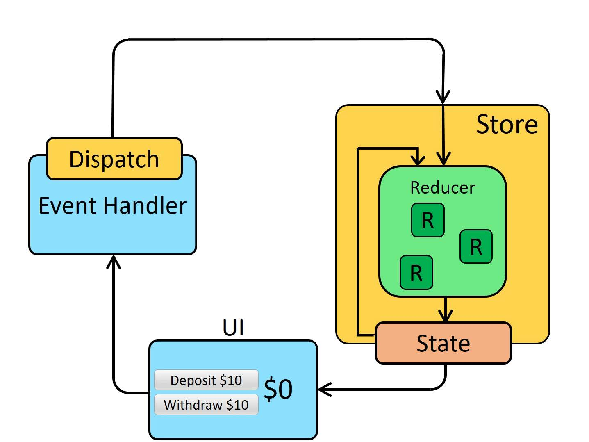

## 文档地址

- [Redux 中文文档 · Redux](https://www.redux.org.cn/)

## 纯函数概念

- 函数式编程中的纯函数概念
- 纯函数的特性
  - 纯函数在给定相同的输入值时，总是产生相同的输出
  - 纯函数不产生副作用，也就是说纯函数不更改任何输出值以外的外部状态
- `Redux` 中的 `reducer` 要求必须是一个纯函数
- `React` 中的组件不一定是纯函数（比如类式组件自带状态，函数式组件可以使用 `Hooks` 管理状态和产生副作用），但是要求像一个纯函数一样，保护自己的 `props` 不在组件中被更改

## `Redux` 原生

### `Redux` 基础

#### `Redux` 三个核心概念

##### Store

- `store` 有以下职责

  - 维持应用的 `state`
  - 提供 `getState()` 方法获取 `state`
  - 提供 `dispatch(action)` 方法更新 `state`
  - 通过 `subscribe(listener)` 注册监听器，并可通过其返回的函数注销监听器

- `Redux` 应用只有一个单一的 `store`，当需要拆分数据处理逻辑时，应使用 `reducer` 组合而不是创建多个 `store`

- 创建 `store`

  - 将根 `reducer` 作为第一个参数传入 `createStore()` 中创建 `store`

    ~~~javascript
    import { createStore } from 'redux'
    import todoApp from './reducers'
    const store = createStore(todoApp)
    ~~~

- 相关 `API`

  - `createStore(reducer[, preloadedState][, enhancer])`
    - 接收参数
      - `reducer`
        - 传入根 `reducer`
        
      - `preloadedState`
        - 可以传入初始的 `State`
        - 这对开发同构应用时非常有用，服务器端 `redux` 应用的 `state` 结构可以与客户端保持一致, 那么客户端可以将从网络接收到的服务端 `state` 直接用于本地数据初始化
        
      - `enhancer`
        - 如果不需要 `preloadedState`，那么 `enhancer` 可以作为第二个参数传入
        
        - 传入一个函数，用于增强 `store` 的能力
        
        - 比如将 `Redux` 提供的 `applyMiddleware` 方法接收中间件调用的返回结果，以应用中间件
        
        - 如果需要应用多个 `enhancer`，则可以使用 `Redux` 提供的 `compose` 方法，将多个 `enhancer` 合并为一个 `enhancer`，例：
        
          ~~~javascript
          const enhancer = compose(
            applyMiddleware(thunk),
            someOtherMiddleware()
          )
          ~~~
    
    - 返回一个 `store`

##### Action

- `action` 是把数据从应用传到 `store` 的有效荷载，它是改变 `store` 数据的**唯一**途径

- 一般通过 `store.dispatch()` 将 `action` 传到 `store`

- `action` 是一个普通对象

  - `action` 内必须使用一个字符串类型的 `type` 字段来表示将要执行的动作

  - `action` 内除 `type` 字段之外，其余结构可自行决定，但应尽量减少在 `action` 中传递的数据

  - `action` 只描述这次更新的 `type` 以及与这次更新相关的数据，并没有描述应用如何更新 `state`（这是 `reducer` 的工作）

  - `action` 示例

    ~~~javascript
    const action1 = {
      type: 'ADD_PERSON',
      info: { name: 'zzc6332', age: 26}
    }
    
    const action2 = {
      type: 'INC_AGE',
      index: 0
    }
    
    const action3 = {
      type: 'CHANGE_NAME',
      payload: { index: 0, newName: 'zzc6332' }
    }
    
    // 对于一个 action 来说，只有 type 字段是固定的格式，其余的结构可以自行决定
    ~~~

- 一些通常做法

  - 将 `action types` 定义为字符串常量
    - 大型应用中，往往会使用单独的模块或文件来定义，且使用单独的模块或文件来存放 `action`
    - 将 `action types` 定义为常量有以下好处
      - 帮助维护命名一致性，因为所有的 `action type` 汇总在同一位置
      - 有时，在开发一个新功能之前想看到所有现存的 `actions`，而团队中可能已经有人添加了所需要的 `action`，可以及时发现这种情况
      - `Action types` 列表在 `Pull Request` 中能查到所有添加，删除，修改的记录。这能帮助团队中的所有人及时追踪新功能的范围与实现
      - 如果在 `import` 一个 `Action` 常量的时候拼写错了，会得到 `undefined` 。在 `dispatch` 这个  `action` 的时候，`Redux` 会立即抛出这个错误，可以马上发现错误
  - `Action Creators`
    - 通过创建 `Action Creator` 函数，调用它以生成 `action` 对象，而不是在 `dispatch` 时内联生成它们
    - 当项目中的需求经常变更时，修改 `Action Creator` 即可同时修改所有生成的 `action`
    - 可以在 `Action Creator` 中定义逻辑，根据对应需求生成不同的 `action`
    - 可以再定义生成 `action creator` 的函数，来快速生成一些简单的 `action creator`
  
- 相关 `API`

  - `bindActionCreators(actionCreators, dispatch)`
    - 接收参数
      - `actionCreators`
        - 可以是一个 `action creator` 函数
        - 也可以是一个 `value` 都是 `action creator` 的对象
      - `dispatch`
        - 即 `store.dispatch` 函数
    - 返回值
      - `actionCreators` 包装后的结果，如果 `actionCreators` 是函数，则结果也是函数，如果 `actionCreators` 是对象，则包装后的结果也是对象，内部的 `value` 是原 `value` 包装后的函数，以下简称结果函数
      - 如果调用结果函数，则相当于使用 `dispatch` 调用 `action creator` 调用后得到的 `action`

##### Reducer

- `reducer` 指定了 `state` 如何被 `action` 更新

- `reducer` 是一个**纯函数**，接收旧的 `state` 和 `action`，返回新的 `state`

- 一个简单 `reducer` 示例

  ~~~javascript
  function todoApp(state = initialState, action) {
    switch (action.type) {
      case SET_VISIBILITY_FILTER:
        return Object.assign({}, state, {
          visibilityFilter: action.filter
        })
      default:
        return state
    }
  }
  ~~~

- 定义 `reducer` 时的注意点

  - 不要在 `reducer` 中修改 `state` 本身（`reducer` 必须是纯函数），使用展开运算符或 `Object.assign` 方法生成新的 `state`
  - 在 `default` 的情况下返回旧的 `state`

- `Redux` 如何运行 `reducer`

  - 首次执行时
    - `Redux` 会为 `reducer` 的 `state` 参数传入 `undefined`（可以为 `state` 设置参数默认值）
    - 会传入一个初始化的 `action`，`type` 为 `'@@redux/INIT'`
  - 分发 `action` 时
    - `store` 中的 `state` 和分发的 `action` 会被传入 `reducer` 中

- 拆分 `reducers`

  - 子 `reducers ` 示例

    ~~~javascript
    function todos(state = [], action) {
      switch (action.type) {
        case ADD_TODO:
          return [
            ...state,
            {
              text: action.text,
              completed: false
            }
          ]
        case TOGGLE_TODO:
          return state.map((todo, index) => {
            if (index === action.index) {
              return Object.assign({}, todo, {
                completed: !todo.completed
              })
            }
            return todo
          })
        default:
          return state
      }
    }
    
    function visibilityFilter(state = SHOW_ALL, action) {
      switch (action.type) {
        case SET_VISIBILITY_FILTER:
          return action.filter
        default:
          return state
      }
    }
    ~~~

    - 注意每个子 `reducer` 只负责管理全局 `state` 中它负责的一部分
    - 每个子 `reducer` 的 `state` 参数都不同，分别对应它管理的那部分 `state` 的数据

  - 合并 `reducer`

    - 在根 `reducer` 中合并子 `reducers`

      ~~~javascript
      function todoApp(state = {}, action) {
        return {
          visibilityFilter: visibilityFilter(state.visibilityFilter, action),
          todos: todos(state.todos, action)
        }
      }
      ~~~

      - 根 `reducer` 直接返回了一个对象作为新的 `state`，这个新 `state` 中的不同字段的值由对应的子 `reducer` 生成 

    - 另外，`Redux` 提供了 `combineReducers()` 工具类来生成根 `reducer`，以下代码和上面代码完全等价

      ~~~javascript
      import { combineReducers } from 'redux'
      
      const todoApp = combineReducers({
        visibilityFilter,
        todos
      })
      ~~~

      - `combineReducers()` 所做的只是生成一个函数，这个函数来调用你的一系列 `reducer`，每个 `reducer` **根据它们的键名来筛选出 `state` 中的一部分数据并处理**，然后这个生成的函数再将所有 `reducer` 的结果合并成一个大的对象
      - `Reducx` 中只有一个 `store`，但是可以拥有多个 `reducer`，同时保持各自负责逻辑块的独立性
      - 传入 `combineReducers()` 中的子 `reducer` 需要满足以下规则
        - 传入的 `action` 未被匹配到时，必须把该 `reducer` 传入的初始`state` 原封不动返回
        - 不能返回 `undefined`，否则 `conbineReducers` 会报错
        - 根据前两条，初始 `state` 不能是 `undefined`

    - 也可以给它们设置成不同的属性名，或调用不同的函数，下面两种合成`reducer` 的方式完全等价

      ~~~javascript
      import { combineReducers } from 'redux'
      
      const reducer = combineReducers({
        a: doSomethingWithA,
        b: processB,
        c: c
      })
      ~~~

      ~~~javascript
      function reducer(state = {}, action) {
        return {
          a: doSomethingWithA(state.a, action),
          b: processB(state.b, action),
          c: c(state.c, action)
        }
      }
      ~~~

#### `Redux` 三大原则

- 单一数据源
  - 整个应用的 `state` 被存储在一颗 `object tree` 中，而这个 `object tree` 只存在于唯一一个 `store` 中
- `state` 是只读的
  - 唯一改变 `state` 的方式就是触发 `action`
- 使用纯函数来执行修改
  - 为了描述 `action` 如何改变 `state`，需要编写纯函数 `reducer`

#### 单向数据流

- **严格的单向数据流**是 `Redux` 的设计核心
- `Redux` 应用中数据的生命周期遵循以下4个步骤
  1. 调用 `store.dispatch(action)`
  2. `store` 调用创建时传入的根 `reducer` 函数
  3. 根 `reducer` 调用多个子 `reducer` 的输出合并成一个单一的 `state` 树
  4. `store` 保存根 `reducer` 返回的完整 `state` 树

### `Redux` 流程图

### `Redux` 中间件

- `Redux` 的中间件可以在发起 `action` 后，到达 `reducer` 之前，扩展一些其它代码，如日志记录、调用异步接口、添加代码调试功能等

- 使用 `redux-thunk` 在 `Redux` 中实现异步操作
  - 实现方式
    - 默认情况下，分发的 `action` 是一个 `JS` 普通对象
    - 如果应用了 `redux-thunk` 中间件，那么就可以将一个函数作为 `action` 分发，由 `redux-thunk` 处理这个函数
    - `redux-thunk` 会将 `dispatch` 方法和 `getState` 方法作为参数传递给 `action` 函数调用
    
  - 基本使用
    - `redux-thunk` 需要另外安装
    
    - 在创建 `store` 时传入 `enhance` 参数
    
      ~~~javascript
      const enhancer = applyMiddleware(thunk)
      const store = createStore（reducer, enhancer)
      ~~~
    
    - 应用了 `redux-thunk` 中间件后，如果派发的 `action` 是一个函数，则 `redux-thunk` 会传入 `dispatch` 方法和 `getState` 方法执行这个函数
    
    - 当需要在 `Redux` 中执行异步操作时，可以将让 `action creator` 返回一个异步函数作为 `action`，在该异步函数中进行异步操作，在异步操作完成后，手动派发一个新的 `action`，例：
    
      ~~~javascript
      // fetchPosts 是一个 action creators，它返回的 action 是一个函数
      function fetchPosts() {
        return async function(dispatch) {
          const response = await fetch('/api/posts')
          const posts = await response.json()
      
          // 在数据已经被获取后，分发正常的 action
          dispatch({ type: 'FETCH_POSTS', payload: posts })
        };
      }
      ~~~
    

## `Redux` 调试工具

- 使用 `Redux` 调试工具，首先需要在浏览器安装 `Redux DevTools` 扩展

- 将 `DevTools` 的功能添加到 `Redux` 中间件中，示例：

  ~~~javascript
  import { createStore, applyMiddleware, compose } from 'redux'
  import rootReducer from './reducers'
  
  const composeEnhancers = window.__REDUX_DEVTOOLS_EXTENSION_COMPOSE__ || compose
  
  // 开启 trace 功能
  // const composeEnhancers = window.__REDUX_DEVTOOLS_EXTENSION_COMPOSE__({trace: true}) || compose
  
  const enhancer = composeEnhancers(applyMiddleware(/* list of middlewares */))
  
  const store = createStore(
    rootReducer,
    /* preloadedState, */ 
    enhancer
  )
  
  export default store
  ~~~

- 注意项目上线时，不要将 `DevTools` 功能留在 `Redux` 中

## `React-Redux`

- `React-Redux` 是一个用于连接 `React` 和 `Redux` 的库，可帮助使用 `React` 组件来订阅 `Redux store` 中的状态变化

- `API`

  - `Provider`
    - 一个 `React` 组件
    - 一般将跟组件嵌套在 `Provider` 中，使得组件层级中的 `connect` 方法能够获得 `Redux store`
    - 接收 `props`
      - `store`
        - 传入 `Redux store` 对象

  - `connect([mapStateToProps][, mapDispatchToProps][, mergeProps][, options])`

    - 用于连接 `React` 组件与 `Redux store`

    - `connect` 函数会自动订阅 `state` 的变化，并将更新的 `state` 作为属性传递给组件

    - 连接操作不会改变原来的组件，而是返回一个新的已与 `Redux store` 连接的组件

    - 参数

      - `mapStateToProps(state[, ownProps])`

        - 如果指定了该参数，组件将会监听 `Redux store` 的变化，一旦发生变化，`mapStateToProps` 就会被调用，并将返回值合并到组件的 `props` 中
        - 该函数接收的参数
          - `state`
            - `Redux store` 当前的状态
          - `ownProps`
            - 组件接收的参数
            - 如果指定了该参数，那么一旦组件 `props` 发生改变，`mapStateToProps` 就会被重新调用
        - 该函数必须返回一个纯对象，该对象会与组件的 `props` 合并
        - 该函数被称为 `selector`

      - `mapDispatchToProps(dispatch[, ownProps])`

        - 如果指定了该参数，则可以将派发 `action` 的方法合并到组件的 `props` 中
        - 如果没有指定该参数，则 `connect` 会将 `dispatch` 注入到组件的 `props` 中
        - 该参数的完整定义方式是接收一个函数，简写情况下可以接收一个对象
          - 是函数的情况
            - 接收参数
              - `dispatch`
                - 就是 `store.dispatch` 方法，用以派发 `action`
              - `ownProps`
                - 同 `mapStateToProps` 中的 `ownProps`
            - 该函数需要返回一个对象
              - 该对象的每一个字段都是一个方法
              - 这些方法会被合并到组件的 `props` 中
          - 是对象的情况
            - 该对象的每一个字段都是一个方法
            - 这些方法会被当作 `Redux action creator`
            - 这些方法被包装后会被合并到 `props` 中，键名与包装前的方法名相同
            - 传入参数调用包装后的的对应方法，相当于：
              - 将参数传入包装前的方法中调用，得到 `action`
              - 使用 `dispatch` 调用该 `action`

      - `mergeProps(stateProps, dispatchProps, ownProps)`

        - 如果指定了这个参数，则可以将 `mapStateToProps` 和 `mapDispatchToProps` 的执行结果（如果 `mapDispatchToProps` 是对象形式，则是对该对象包装后的结果；如果没有指定 `mapDispatchToProps`，则是 `dispatch` 对象）和组件自身的 `props` 传递到这个回调函数中

        - 该回调函数返回的对象将作为 `props` 传递到组件中

        - 实际上这个参数是 `connect` 用来合并以上三者的函数，如果不指定这个参数，那么它的默认形式为

          ~~~javascript
          function mergeProps(stateProps, dispatchProps, ownProps) {
            return Object.assign({}, ownProps, stateProps, dispatchProps);
          }
          ~~~

      - `options`

        - 接收一个对象，用以控制 `connector` 的行为
        - 属性
          - `pure: boolean`
            - 默认为 `true`
            - 如果为 `true`，`connector` 会在组件更新前将执行组件的 `shouldComponentUpdate` 生命周期函数，并且浅对比 `mergeProps` 是否发生改变，以避免不必要的更新
            - 该选项的前提是当前组件是“纯”组件，除了 `props` 和 `Redux store` 的 `state` 外不依赖任何其它输入
          - `withRef: boolean`
            - 默认为 `false`
            - 如果为 `true`，`connector` 会保存一个对被包装的原始组件实例的引用，该引用可以通过 `getWrappedInstance` 方法获得

    - 返回值

      - 返回一个高阶组件
      - 将一个 `React` 组件传入这个高阶组件调用后，得到一个已经注入了 `state` 和 `dispatch` 的 `React` 组件，即包装后的组件
      - 包装后的组件所具有的特性
        - 静态属性
          - `WrappedComponent`
            - 原始组件类
        - 静态方法
          - 原始组件类中原来的静态方法都会提升到包装后的组件中
        - 实例方法
          - `getWrappedInstance`
            - 仅当 `connect()` 函数的第四个参数 `options` 设置了 `{ withRef: true }` 才返回被包装的原始组件实例

    - 使用示例

      - 只注入 `dispatch`，不监听 `store`

        ~~~javascript
        export default connect()(TodoApp)
        ~~~

      - 注入所有 `action creatores`，不监听 `store`

        ~~~javascript
        import * as actionCreators from './actionCreators'
        
        export default connect(null, actionCreators)(TodoApp)
        ~~~

      - 注入 `dispatch` ，监听 `store` 中的所有 `state`

        ~~~javascript
        export default connect(state => state)(TodoApp)
        ~~~

        - 不要这样做，这样会导致每次分发 `action` 都会触发组件重新渲染
        - 最好在多个组件上使用 `connect`，每个组件只监听与它关联的部分的 `state`

      - 注入 `dispatch`，监听相关 `state`

        ~~~javascript
        function mapStateToProps(state) {
          return { todos: state.todos }
        }
        
        export default connect(mapStateToProps)(TodoApp)
        ~~~

      - 注入所有 `action creators`，监听相关 `state`

        ~~~javascript
        import * as actionCreators from './actionCreators'
        
        function mapStateToProps(state) {
          return { todos: state.todos }
        }
        
        export default connect(mapStateToProps, actionCreators)(TodoApp)
        ~~~

      - 将 `action creator` 注入到 `props.actions` 中，监听相关 `state`

        ~~~javascript
        import * as actionCreators from './actionCreators'
        import { bindActionCreators } from 'redux'
        
        function mapStateToProps(state) {
          return { todos: state.todos }
        }
        
        function mapDispatchToProps(dispatch) {
          return { actions: bindActionCreators(actionCreators, dispatch) }
        }
        
        export default connect(mapStateToProps, mapDispatchToProps)(TodoApp)
        ~~~

      - 注入相关 `action creator`，监听相关 `state`

        ~~~javascript
        import { addTodo } from './actionCreators'
        import { bindActionCreators } from 'redux'
        
        function mapStateToProps(state) {
          return { todos: state.todos }
        }
        
        function mapDispatchToProps(dispatch) {
          return bindActionCreators({ addTodo }, dispatch)
        }
        
        export default connect(mapStateToProps, mapDispatchToProps)(TodoApp)
        ~~~

      - 根据组件的 `props` 监听特定的 `state`

        ~~~javascript
        import * as actionCreators from './actionCreators'
        
        function mapStateToProps(state, ownProps) {
          return { todos: state.todos[ownProps.userId] }
        }
        
        export default connect(mapStateToProps)(TodoApp)
        ~~~

  - `Redux Hooks`

    - 从 `react-redux 7.1` 开始，提供了 `Hook` 的方式将 `state` 和 `dispatch` 映射到 `react` 函数式组件中，以替代 `connect` 函数
    - `API`
      - `useSelector`
        - 接收参数
          - `selector`
            - 接收一个 `selector` 函数
            - `selector` 函数接收整个 `state` 作为唯一参数，并且返回需要的 `state` 的部分
          - `equalityFn`（可选）
            - 接收一个函数，该函数告诉 `useSelector` 如何比较新旧的 `state` 是否相等，来决定是否重新渲染组件
            - 如果该函数返回 `true`，那么 `useSelector` 会跳过重新渲染，如果返回 `false`，那么组件会被重新渲染
            - 可以自定义比较的逻辑，也可以引入第三方库的函数，如 `lodash` 提供的 `isEqual` 函数或 `react-redux` 提供的 `shallowEqual` 函数作为 `equalityFn` 函数
            - 如果不传入 `equalityFn`，则 `useSelector` 会默认使用全等（`===`）来判断是否相等
        - 返回 `selector` 中返回的 `state` 的部分
        - 当 `Redux store` 中的 `state` 发生变化时，`useSelector` 会重新运行 `selector` 函数，并通过 `equalityFn` 决定是否要重新渲染组件
      - `useDispatch`
        - 调用后返回一个对 `Redux store` 中的 `dispatch` 方法的引 用

## `Redux Toolkit`

- `Redux Toolkit`（`RTK`）是 `Redux` 官方推荐的一个高效的 `Redux` 开发工具集

- 设计目的

  - `Redux` 核心库是故意设计成非定制化的样子（`unopinionated`），具有很高的灵活度，但因此带来了一些问题
    - 配置 `Redux store` 过于复杂
    - 很多常用工具必须额外安装导入
    - 太多样板代码
  - `Redux Toolkit` 旨在解决以上问题而被设计，可以提供一些良好的默认行为能够开箱即用，在减少决策的同时能够处理最通用的用例

- 安装 `RTK`

  ~~~bash
  npm install @reduxjs/toolkit
  ~~~

### 核心 `API`

#### `configureStore(options)`

- 封装了 `createStore` 以提供简化的配置和良好的默认值

- 它可以自动组合 `slice` 的 `reducer`，可以添加任何 `Redux` 中间件，默认包含 `redux-thunk` 中间件，默认启用 `Redux Tools Extension`

- 接收一个配置对象作为参数，包含的字段有：
  - `reducer`
  
    - 如果接收一个函数，则会作为一个 `root reducer` 解析
    - 如果接收一个对象，则对象中的属性值应当使用 `createReducer` 或 `createSlice` 方法导出的对象
  
  - `middleware`（可选）
    - 用于添加中间件
  
    - 接收一个函数
  
      - 该函数接收 `getDefaultMiddleware` 方法作为参数，该方法调用后可以获取默认的中间件数组
      - 该函数需返回一个新的中间件数组，`configureStore` 会应用这些中间件
  
    - 示例
  
      ~~~javascript
      import { configureStore } from '@reduxjs/toolkit'
      import logger from 'redux-logger'
      
      const store = configureStore({
        reducer: rootReducer,
        middleware: (getDefaultMiddleware) => getDefaultMiddleware().concat(logger),
      })
      ~~~
  
  - `devTools`（可选）
  
    - 决定是否启用 `Redux DevTools`
  
    - 可以设置布尔值，默认为 `true`
  
    - 也可以传入一个配置对象来调整 `@reduxjs/toolkit` 如何与 `Redux DevTools` 扩展进行交互
  
      - 可选属性
  
        - `actionSanitizer`
          - 接收一个函数，该函数将每一个被调度的 `action` 作为参数，然后返回一个新的 `action` 对象
          - 这个函数通常被用来过滤或转换 `store` 中部分或所有 `action` 的详情
        - `stateSanitizer`
          - 接收一个函数，该函数将每次动作调度后的新 `state` 作为参数，然后返回一个新的 `state` 对象
          - 这个函数通常被用来过滤或转换 `store` 中部分或所有的 `state` 细节
  
      - 示例
  
        ~~~javascript
        const store = configureStore({
          reducer: rootReducer,
          devTools: {
            stateSanitizer: (state) => state.data ? {...state, data: '<<LONG_BLOB>>'} : state
          }
        })
        ~~~
  
        - 在这个例子中，如果 `state.data ` 存在，则将其替换为一个简单的字符串，这样就不会在 `DevTools` 中看到可能很长且没有太大帮助的真实数据
  
  - `preloadedState`（可选）
  
    - 用于指定应用初始化时的 `state`
  
  - `enhancer`（可选）
  
    - `store` 增强器，同原生 `Redux` 的 `createStore` 接收的 `enhancer` 参数
    - 大多数情况下不需要使用这个参数，因为 `configureStore` 已经默认设置了应用大部分可能需要的增强器
    - 如果传入了 `enhancer`，则会覆盖 `Redux Toolkit` 默认包含并开启的 `redux-thunk` 和 `DevTools`，如需使用它们则需要手动添加进去

#### `createSlice(options)`

- 用以生成一个切片（`slice`），`slice` 是指将应用的状态分割成多个较小部分，生成的 `slice` 中包含这一部分的 `action creators` 和 `reducers`

- 接收一个配置对象作为参数，包含的字段有：

  - `name`
    - 该字段接收一个字符串，用以定义这个 `slice` 的名称
    - 这个名称也被作为这个 `slice` 生成的 `action type` 的前缀
    - 一般用于在 `Redux DevTools` 中区分不同的 `action`
  - `initialState`
    - 该字段接收任意类型的值，用以指定初始的 `state`
  - `reducers` 
    - 该字段接收一个对象，对象中的键名为 `action` 的名称，键值为处理这种 `action` 的 `reducer` 函数，这里定义的函数与标准的 `Redux reducer` 函数有差别
    - 函数接收 `state` 和 `action` 作为参数，其中 `state` 是当前这个 `slice` 所对应的部分状态，`action` 是有 `{ type, payload }` 结构的对象
    - 函数中，可以直接修改 `state` 并将它返回，而无需返回一个新的对象，这是因为 `createSlice` 中使用了 `immer` 库来处理不可变更新
  - `extraReducers` （可选）
    - 用于给特定的 `action` 添加相应的 `reducer` 函数
    - 常用于处理异步 `action`
    - 该字段完整用法是接收一个 `builder` 函数，该函数会被传入一个 `builder` 对象，
      - `builder` 对象提供一些方法，这些方法调用后均会返回 `builder` 对象本身，因此可以链式调用，这些方法包括：
        - `addCase(actionCreator, reducer)`
          - 用于给特定的 `action` 添加对应的处理函数
          - 接收参数
            - `actionCreator`
              - 可能是一个通过 `createAction` 方法创建的 `action creator`
              - 也可能是一个可以序列化的字符串类型
            - `reducer`
              - 一个对应上述 `action` 的 `reducer` 函数
        - `addMatcher(matcher, reducer)`
          - 用于处理匹配到的 `action`
          - 接收参数
            - `matcher`
              - 一个匹配函数，接受一个 `action` 作为参数并返回一个布尔值
              - 如果返回 `true` 表示此动作将由第二个参数 `reducer` 处理
            - `reducer`
              - 一个对应被匹配到的 `action` 的 `reducer` 函数
        - `addDefaultCase(reducer)`
          - 用于处理除了已经在 `addCase` 和 `addMatcher` 中定义了的 `action types` 以外的所有类型的 `action`
    - 如果只需要使用 `addCase`，那么该字段可以直接接收一个对象
      - 对象中的键名为要处理的 `action` 的 `type`
      - 对象中的键值是用于处理对应 `action` 的 `reducer`
    - 注意：
      - 由于 `createSlice` 返回值的 `pending`、`fulfilled`、`rejected` 字段是一个 `action creator`，其 `toString` 方法被改写为返回其创建的 `action` 的 `type`
      - 因此这些 `action creator` 不但可以作为 `addCase` 方法的第一个参数，也可以以计算属性名称的形式，作为 `extraReducers` 直接接收的对象中的键名
      - 也就是说，`extraReducers` 无论是以接收函数还是对象的形式，都可以使用 `createSlice` 返回值的 `pending`、`fulfilled`、`rejected` 字段来指定要处理的 `action`

- 返回一个对象，包含的字段有：

  - `name`
    - 传入的配置对象中提供的 `name` 字符串
  - `actions`
    - 一个对象，其中每个键都是一个 `action` 的名称，每个值都是一个对应的 `action creator` 函数
    - 可以用这些 `action creator` 来派发与这个 `slice` 相关的 `action`
    - 调用 `action creator` 函数时传入的参数，将作为生成的 `action` 的 `payload` 字段
  - `reducer`
    - `createSlice` 生成的 `reducer` 函数（不包含 `extraReducers`）
    - 当传递给 `configureStore` 时，这个 `reducer` 将处理所有与这个 `slice` 名称匹配的 `actions`

- 使用示例

  ~~~javascript
  import { createSlice } from '@reduxjs/toolkit'
  
  const counterSlice = createSlice({
    name: 'counter',
    initialState: 0,
    reducers: {
      increment: (state, { payload }) => state += payload,
      decrement: (state, { payload }) => state -= payload
    }
  })
  
  console.log(counterSlice.actions) // { increment: Function, decrement: Function }
  
  export const { increment, decrement } = counterSlice.actions
  export default counterSlice.reducer
  ~~~

#### `createAsyncThunk(typePrefix, payloadCreator)`

- 用于创建处理异步逻辑的 `thunk` 函数
- 接收参数
  - `typePrefix`
    - 接收一个字符串，用于生成此 `thunk` 对应的 `action type` 的前缀
    - 这个前缀将被用来创建三个 `action type`，它们的 `type` 分别为
      - `'[prefix]/pending'`
      - `'[prefix]/fulfilled'`
      - `'[prefix]/rejected'`
    - 它通常是一个描述 `action` 行为的字符串，例如 `'users/fetchUser'`
  - `payloadCreator`
    - 接收一个函数
    - 该函数接收两个参数
      - 第一个参数 `arg`，接收的是：
        - 返回的 `thunk action creator` 被调用时传入的参数
      - 第二个参数 `thunkApi`，接收一个对象，包含以下字段：
        - `dispatch`
          - `store` 的 `dispatch` 方法
        - `getState`
          - `store` 的 `getState` 方法
        - `extra`
          - 在设置 `Redux middleware` 时提供的 `extra` 参数
          - 默认情况下是 `undefined`
          - 如果在中间件中添加了额外的值，则可以通过这个字段获取
        - `reqiestId`
          - 一个独特的字符串 `ID`，代表当前这个特定的 `async action` 请求
          - 如果多次 `dispatch` 同一个 `createAsyncThunk` 生成的 `action`，那么每个请求都会有一个独特的 `ID`
        - `signal`
          - 一个 `AbortController.signal` 实例
          - `AbortController` 是一个浏览器 `API`，用于取消正在操作的异步任务，如 `fetch` 请求
        - `rejectWithValue(value)`
          - 一个方法，用来创建一个 `rejected action`
          - `rejected action` 不会作为一个错误处理，并且可用来分发一个带有特定的 `rejected value` 的 `action`
    - 通常会返回一个 `Promise`
      - 一般在这个函数中进行异步操作
      - 返回的 `Promise` 在异步操作完成时 `resolve`，如果异步操作失败则 `reject`
      - `thunk action` 的 `payload` 就是这个 `Promise` `resolve` 的值
    - 一般在这个异步函数中处理异步逻辑，有两种做法：
      1. 处理完异步逻辑后，将异步的结果生成的 `action` 直接分发出去
         - 通过 `createSlice` 接收的配置对象中 `reducers` 字段中的对应 `reducer` 处理分发的 `action`
      2. 处理完异步逻辑后，将异步的结果作为 `Promise` 返回（可将 `payloadCreator` 定义为异步函数，最后返回异步的结果）
         - `createAsyncThunk` 会生成一个 `thunk action creator`，生成的 `thunk action` 派发后，不同的状态 `action` 会根据 `Promise` 的状态而被派发
         - 通过 `createSlice` 接收的配置对象中的 `extraReducers` 字段中的对应 `reducer` 处理不同的状态 ` action`
- 返回一个 `thunk action creator` 函数对象
  - `thunk action creator` 作为对象拥有三个状态字段用以管理 `thunk action` 的状态
    - 状态字段
      - `pending`
        - 用以生成 `pending action`
      - `fulfilled`
        - 用以生成 `fulfilled action`
      - `rejected`
        - 用以生成 `rejected action`
    - 状态字段作为函数是 `action creator`，调用时传入的参数就是 `action` 的 `payload`（这一步在 `Redux Toolkit` 进行，一般不需要使用者调用）
    - 状态字段作为对象有以下字段
      - `type`
        - 生成的状态 `action` 的 `type`
        - 假设 `createAsyncThunk` 接收的 `typePrefix` 参数是 `'users/fetchUser'`，该状态字段为 `pending`， 那么该字段为 `'users/fetchUser/pending'`
      - `match`
        - 一个方法，接受一个 `action` 对象作为参数，如果该 `action` 的类型与当前属性对应的 `action type` 匹配，那么返回 `true`，否则返回 `false`
      - `toString`
        - 状态字段对象重写了 `toString` 方法，调用时会返回其 `type` 对象，因此在使用计算属性传入状态字段时，会将其转换为 `type` 字段中的字符串
  - `thunk action creator` 作为函数调用后可以创建出 `thunk action`
  - `thunk action` 被分发后，`createAsyncThunk` 接收的 `payloadCreator` 被调用，并返回一个 `Promise`，`thunk action` 会根据这个 `Promise` 的状态的改变而分发不同的 `action`
    - 当 `Promise` 状态处于 `pending` 时
      - 派发 `pending action`
    - 如果 `Promise` 状态转变为 `fulfilled`
      - 派发 `fulfilled action`
    - 如果 `Promise` 状态转变为 `rejected`
      - 派发 `rejected action`
  - 在 `createSlice` 接收的配置对象中的 `extraReducers` 字段中，定义处理上述 `actions` 的 `reducer`

### 数据不可变性

- `React` 中的 `state` 和 `Redux` 中的 `state` 都是数据不可变的

- 如果对 `state` 进行浅拷贝再进行修改，可能存在一些问题

  - 如果 `state` 中数据过大，浅拷贝时很消耗性能
  - 浅拷贝后，如果改变了深层属性，依然会改变之前的对象

- 在 `Redux Toolkit` 中，使用了 `immer` 的库来实现数据不可变，大致原理是：

  - `Redux Toolkit` 中的 `reducer` 接收的 `state` 是被代理后的 `draft` 版本（使用了 `ES6` 的 `Proxy` 特性）
  - 当试图访问或修改 `draft state` 的层级的属性时，会被 `Proxy` 拦截，并在真正修改任何属性之前复制一份该属性所在的对象，在新拷贝的对象中进行修改
  - 当完成修改操作后，`immer` 会在原始对象的基础上生成一个新的不可变对象，其中对 `draft state` 进行的任何修改会被采用，而未被修改的部分则仍指向原始对象的旧值

  