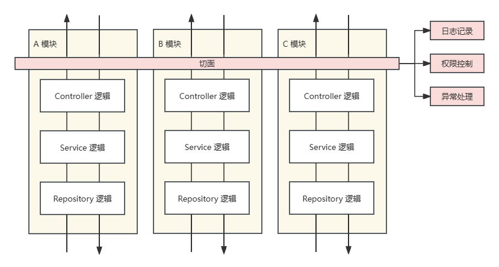
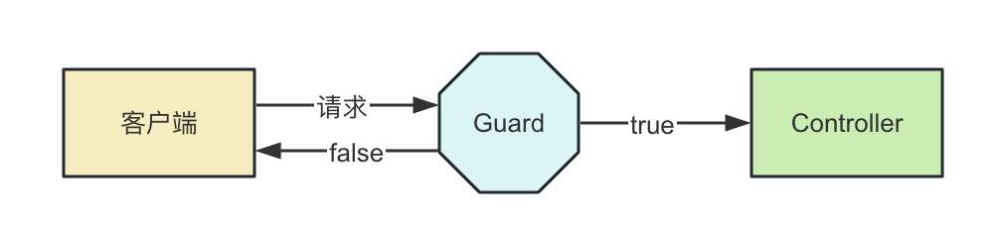
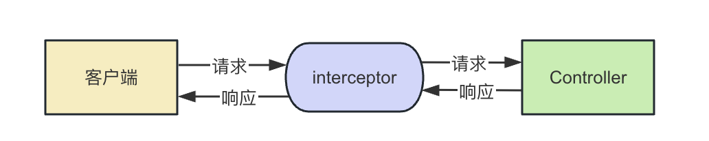

## 什么是 `AOP`

`AOP`（`Aspect Oriented Programming`），翻译为面向切面编程，是一种编程思想，它是对面向对象编程（`OOP`）的补充和完善。

`AOP` 的目标是将哪些与核心业务无关，但又影响着多个类的公共行为抽取出来，封装到一个可重用模块，从而实现代码复用和模块解耦。

例如在 `Nest` 中，一个请求可能会经过 `Controller`、`Service`、`Repository` 等逻辑。如果希望在这个调用链路中加入一些通用逻辑，比如日志记录、权限控制、异常处理等，但又不希望让其侵入到业务逻辑中，那么则可以使用 `AOP` 的方式，如下图所示：

## `Nest` 中实现 `AOP` 的方式

`Nest` 中实现 `AOP` 的方式有很多，包括 `Middleware`、`Guard`、`Pipe`、`Interceptor`、`ExceptionFilter`。

### `Middleware`

`Middleware` 即中间件，应用于路由。`Nest` 中的中间件基本继承了来自于 `Express` 的理念，`Express` 中间件的洋葱模型概念实际上就是 `AOP` 的一种实现。

`Nest` 中的中间件函数通常遵循 `Express` 的中间件签名，接收 `(req, res, next)` 三个参数。如果需要进行严格的参数类型检查时，则要安装 `Express` 的类型定义：

~~~bash
npm install @types/express --save-dev
~~~

`Nest` 中的中间件可以分为全局中间件和路由中间件。

在 `main.ts` 中可以调用 `app.use()` 方法注册全局中间件，如同在 `Express` 中：

~~~typescript
import { NestFactory } from '@nestjs/core';
import { AppModule } from './app.module';
import { NestExpressApplication } from '@nestjs/platform-express';
import { Request, Response, NextFunction } from 'express';

async function bootstrap() {
  const app = await NestFactory.create<NestExpressApplication>(AppModule);
  app.use(function (req: Request, res: Response, next: NextFunction) {
    console.log('请求的 url 是 ' + req.url);
    next();
  });
  await app.listen(3000);
}
bootstrap();
~~~

路由中间件可以由 `nest-cli` 生成：

~~~bash
nest g middleware log --no-spec --flat
~~~

其中 `--no-spec` 代表不生成测试文件， `--flat` 表示平铺，即不生成独立目录。该行命令会在 `src` 目录下生成 `log.middleware.ts` 文件。

默认创建的 `Middleware` 是类的形式：

~~~typescript
import { Injectable, NestMiddleware } from '@nestjs/common';

@Injectable()
export class LogMiddleware implements NestMiddleware {
  use(req: any, res: any, next: () => void) {
    console.log('请求的 url 是 ' + req.url);
    next();
  }
}
~~~

也可以以函数的形式定义中间件，但是这样无法注入其它依赖到中间件中。以下代码和上面的代码效果等同：

~~~typescript
export function logMiddleware(req: any, res: any, next: () => void) {
  console.log('请求的 url 是 ' + req.url);
  next();
}
~~~

可以将路由中间件注册到 `AppModule` 中：

~~~typescript
import { Module, MiddlewareConsumer, NestModule } from '@nestjs/common';
import { AppController } from './app.controller';
import { AppService } from './app.service';
import { logMiddleware } from 'src/log.middleware';
import { PersonModule } from 'src/person/person.module';

@Module({
  imports: [PersonModule],
  controllers: [AppController],
  providers: [AppService],
})
export class AppModule implements NestModule {
  configure(consumer: MiddlewareConsumer) {
    consumer.apply(logMiddleware).forRoutes('*'); // 表示匹配所有路径
  }
}
~~~

`forRoutes()` 方法用于指定中间件匹配的路由。

### `Guard`

`Guard` 即路由守卫，应用于 `Controller` 中的 `Handler`。可以用于在调用目标方法之前判断权限，返回 `true` 或 `false` 来决定是否放行，如下图所示：

可以使用 `nest-cli` 生成 `Guard`：

~~~bash
nest g guard login --no-spec --flat
~~~

该行命令会在 `src` 目录下生成 `login.guard.ts`：

~~~typescript
import { CanActivate, ExecutionContext, Injectable } from '@nestjs/common';
import { Observable } from 'rxjs';

@Injectable()
export class LoginGuard implements CanActivate {
  canActivate(
    context: ExecutionContext,
  ): boolean | Promise<boolean> | Observable<boolean> {
    return true;
  }
}
~~~

`Guard` 需要实现 `CanActivate` 接口，定义 `canActivate` 方法，方法中的 `context` 参数可以接收到请求的信息，返回一个布尔值。如果返回的是 `false`，那么应用了 `Guard` 的方法返回的响应状态码会是 `403`

使用 `@UseGuard()` 装饰器可以在 `Controller` 中使用 `Guard`：

~~~typescript
import { Controller, Get, UseGuards } from '@nestjs/common';
import { AppService } from './app.service';
import { LoginGuard } from './login.guard';

@Controller()
export class AppController {
  constructor(private readonly appService: AppService) {}

  @Get()
  @UseGuards(LoginGuard)
  getHello(): string {
    return this.appService.getHello();
  }
}
~~~

`Guard` 也可以在 `main.ts` 中调用 `app.useGlobalGuaeds()` 全局启用：

~~~typescript
import { NestFactory } from '@nestjs/core';
import { AppModule } from './app.module';
import { NestExpressApplication } from '@nestjs/platform-express';
import { LoginGuard } from './login.guard';

async function bootstrap() {
  const app = await NestFactory.create<NestExpressApplication>(AppModule);
  app.useGlobalGuards(new LoginGuard());
  await app.listen(3000);
}
bootstrap();
~~~

但是以上方式是手动 `new` 了 `LoginGuard` 的实例，使得它不被 `IoC` 容器管理，因此无法在此 `Guard` 中注入其它 `Provider`。

如果需要全局声明 `Guard`，且使其可以被 `IoC` 容器管理，可以在 `app.module.ts` 中这样声明以全局启用：

~~~typescript
import { Module } from '@nestjs/common';
import { AppController } from './app.controller';
import { AppService } from './app.service';
import { APP_GUARD } from '@nestjs/core';
import { LoginGuard } from './login.guard';

@Module({
  imports: [],
  controllers: [AppController],
  providers: [
    AppService,
    {
      provide: APP_GUARD, // 指定用于注册全局 Guard 的 token
      useClass: LoginGuard, // 指定 Guard
    },
  ],
})
export class AppModule {}
~~~

### `Interceptor`

`Interceptor` 即拦截器，应用于 `Controller` 中的 `Handler`。可以在调用目标方法的前后加入一些逻辑，如下图所示：

可以使用 `nest-cli` 生成 `Interceptor`：

~~~bash
nest g interceptor time --no-spec --flat
~~~

该行命令会在 `src` 目录下生成 `time.interceptor.ts`：

~~~typescript
import { CallHandler, ExecutionContext, Injectable, NestInterceptor } from '@nestjs/common';
import { Observable } from 'rxjs';

@Injectable()
export class TimeInterceptor implements NestInterceptor {
  intercept(context: ExecutionContext, next: CallHandler): Observable<any> {
    return next.handle();
  }
}
~~~

`Interceptor` 需要实现 `NestInterceptor` 接口，定义 `intercept` 方法，方法内调用 `next.handle()` 方法就会调用目标 `Controller`，可以在之前和之后加入一些处理逻辑。

`Interceptor` 中的处理逻辑可以是异步的，`Nest` 中通过 `rxjs` 来组织它们：

~~~typescript
import { CallHandler, ExecutionContext, Injectable, NestInterceptor } from '@nestjs/common';
import { Observable, tap } from 'rxjs';

@Injectable()
export class TimeInterceptor implements NestInterceptor {
  intercept(context: ExecutionContext, next: CallHandler): Observable<any> {

    const startTime = Date.now();

    return next.handle().pipe(
      tap(() => {
        console.log('time: ', Date.now() - startTime)
      })
    );
  }
}
~~~

在 `Controller` 中的方法前使用 `@UseInterceptors()` 装饰器应用 `Interceptor`：

~~~typescript
import { Controller, Get, UseInterceptors } from '@nestjs/common';
import { AppService } from './app.service';
import { TimeInterceptor } from './time.interceptor';

@Controller()
export class AppController {
  constructor(private readonly appService: AppService) {}

  @Get()
  @UseInterceptors(TimeInterceptor)
  getHello(): string {
    return this.appService.getHello();
  }
}
~~~

`Interceptor` 可以向上面这样单独作用于 `Controller` 中的 `Handler` 中，也可以作用于整个 `Controller`：

~~~typescript
import { Controller, Get, UseInterceptors } from '@nestjs/common';
import { AppService } from './app.service';
import { TimeInterceptor } from './time.interceptor';

@Controller()
@UseInterceptors(TimeInterceptor)
export class AppController {
  constructor(private readonly appService: AppService) {}

  @Get()
  getHello(): string {
    return this.appService.getHello();
  }
}
~~~

也和 `Guard` 一样支持两种的方式的全局启用：

~~~typescript
import { NestFactory } from '@nestjs/core';
import { AppModule } from './app.module';
import { NestExpressApplication } from '@nestjs/platform-express';
import { TimeInterceptor } from './time.interceptor';

async function bootstrap() {
  const app = await NestFactory.create<NestExpressApplication>(AppModule);
  app.useGlobalInterceptors(new TimeInterceptor());
  await app.listen(3000);
}
bootstrap();
~~~

~~~typescript
import { Module } from '@nestjs/common';
import { AppController } from './app.controller';
import { AppService } from './app.service';
import { APP_INTERCEPTOR } from '@nestjs/core';
import { TimeInterceptor } from './time.interceptor';

@Module({
  imports: [],
  controllers: [AppController],
  providers: [
    AppService,
    {
      provide: APP_INTERCEPTOR, // 指定用于注册全局 Interceptor 的 token
      useClass: TimeInterceptor, // 指定 Interceptor
    },
  ],
})
export class AppModule {}
~~~

### `Pipe`

`Pipe` 用于对路由参数做一些检验和转换。

可以使用 `nest-cli` 生成 `Pipe`：

~~~bash
nest g pipe validate --no-spec --flat
~~~

该行命令会在 `src` 目录下生成 `validate.pipe.ts`：

~~~typescript
import { ArgumentMetadata, Injectable, PipeTransform } from '@nestjs/common';

@Injectable()
export class ValidatePipe implements PipeTransform {
  transform(value: any, metadata: ArgumentMetadata) {
    return value;
  }
}
~~~

`Pipe` 需要实现 `PipeTransform` 接口，定义 `transform` 方法，方法中可以对路由参数值 `value` 进行参数校验，校验不通过可以抛出异常，也可以做转换，返回转换后的值。

比如将 `Pipe` 定义为：

~~~typescript
import { ArgumentMetadata, BadRequestException, Injectable, PipeTransform } from '@nestjs/common';

@Injectable()
export class ValidatePipe implements PipeTransform {
  transform(value: any, metadata: ArgumentMetadata) {

    if(Number.isNaN(parseInt(value))) {
      throw new BadRequestException(`参数${metadata.data}错误`)
    }

    return typeof value === 'number' ? value * 10 : parseInt(value) * 10;
  }
}
~~~

这里的 `value` 就是路由参数，如果它无法被转换为数字，则返回参数错误，否则将其乘 `10` 倍再次传入 `handler`。

在 `AppController` 中添加一个 `Handler`，应用这个 `pipe`:

~~~typescript
import { Controller, Get, Query } from '@nestjs/common';
import { AppService } from './app.service';
import { ValidatePipe } from './validate.pipe';

@Controller()
export class AppController {
  constructor(private readonly appService: AppService) {}

  @Get()
  getHello(): string {
    return this.appService.getHello();
  }

  @Get('test')
  test(@Query('num', ValidatePipe) num: number) {
    return num;
  }
}
~~~

这样，通过 `/test` 路由且传入 `query` 参数为数字时，可以得到该数字十倍的值作为响应体，否则会得到的响应体为：

~~~json
{
    "message": "参数num错误",
    "error": "Bad Request",
    "statusCode": 400
}
~~~

`Pipe` 除了可以通过参数装饰器使其单独对某个参数生效，也可以使用 `@UsePipes()` 装饰器使其对某个 `Handler` 或对整个 `Controller` 生效：

~~~typescript
import { Controller, Get, Query, UsePipes } from '@nestjs/common';
import { AppService } from './app.service';
import { ValidatePipe } from './validate.pipe';

@Controller()
@UsePipes(ValidatePipe)
export class AppController {
  constructor(private readonly appService: AppService) {}

  @Get()
  getHello(): string {
    return this.appService.getHello();
  }

  @Get('test')
  test(@Query('num') num: number) {
    return num;
  }
}
~~~

同样也支持两种的方式的全局启用：

~~~typescript
import { NestFactory } from '@nestjs/core';
import { AppModule } from './app.module';
import { NestExpressApplication } from '@nestjs/platform-express';
import { ValidatePipe } from './validate.pipe';

async function bootstrap() {
  const app = await NestFactory.create<NestExpressApplication>(AppModule);
  app.useGlobalPipes(new ValidatePipe());
  await app.listen(3000);
}
bootstrap();
~~~

~~~typescript
import { Module } from '@nestjs/common';
import { AppController } from './app.controller';
import { AppService } from './app.service';
import { APP_PIPE } from '@nestjs/core';
import { ValidatePipe } from './validate.pipe';

@Module({
  imports: [],
  controllers: [AppController],
  providers: [
    AppService,
    {
      provide: APP_PIPE, // 指定用于注册全局 Pipe 的 token
      useClass: ValidatePipe, // 指定 Pipe
    },
  ],
})
export class AppModule {}
~~~

`Nest` 内置了一些 `Pipe`：

- `ValidationPipe`
- `ParseIntPipe`
- `ParseBoolPipe`
- `ParseArrayPipe`
- `ParseUUIDPipe`
- `DefaultValuePipe`
- `ParseEnumPipe`
- `ParseFloatPipe`
- `ParseFilePipe`

### `Exception Filter`

`Exception Filter` 可以对抛出的异常进行处理，返回对应的响应。

可以使用 `nest-cli` 生成 `Exception Filter`：

~~~bash
nest g filter test --no-spec --flat
~~~

该行命令会在 `src` 目录下生成 `test.filter.ts`：

~~~typescript
import { ArgumentsHost, Catch, ExceptionFilter } from '@nestjs/common';

@Catch()
export class TestFilter<T> implements ExceptionFilter {
  catch(exception: T, host: ArgumentsHost) {}
}
~~~

`Exception Filter` 需要实现 `ExceptionFilter` 接口，定义 `catch` 方法。`@Catch()` 装饰器工厂中传入要拦截的异常类型，例如：

~~~typescript
import { ArgumentsHost, BadRequestException, Catch, ExceptionFilter } from '@nestjs/common';
import { Response } from 'express';

@Catch(BadRequestException)
export class TestFilter implements ExceptionFilter {
  catch(exception: BadRequestException, host: ArgumentsHost) {

    const response: Response = host.switchToHttp().getResponse();

    response.status(400).json({
      statusCode: 400,
      message: 'test: ' + exception.message
    })
  }
}
~~~

这里往 `@Catch()` 中传入 `BadRequestException`，即拦截使用 `BadRequestException` 创建的异常。比如在上面 `ValidatePipe` 示例中，抛出的就是 `BadRequestExceotion` 创建的异常。`catch` 方法中返回拦截后的响应，给用户更友好的提示。

`Exception Filter` 可以使用 `@UseFilter()` 装饰器应用到 `Handler` 或 `Controller` 上：

~~~typescript
import { Controller, Get, Query, UseFilters } from '@nestjs/common';
import { AppService } from './app.service';
import { ValidatePipe } from './validate.pipe';
import { TestFilter } from './test.filter';

@Controller()
export class AppController {
  constructor(private readonly appService: AppService) {}

  @Get()
  getHello(): string {
    return this.appService.getHello();
  }

  @Get('test')
  @UseFilters(TestFilter)
  test(@Query('num', ValidatePipe) num: number) {
    return num;
  }
}
~~~

也支持两种方式的全局启用：

~~~typescript
import { NestFactory } from '@nestjs/core';
import { AppModule } from './app.module';
import { NestExpressApplication } from '@nestjs/platform-express';
import { TestFilter } from './test.filter';

async function bootstrap() {
  const app = await NestFactory.create<NestExpressApplication>(AppModule);
  app.useGlobalFilters(new TestFilter());
  await app.listen(3000);
}
bootstrap();
~~~

~~~typescript
import { Module } from '@nestjs/common';
import { AppController } from './app.controller';
import { AppService } from './app.service';
import { APP_PIPE } from '@nestjs/core';
import { TestFilter } from './test.filter';

@Module({
  imports: [],
  controllers: [AppController],
  providers: [
    AppService,
    {
      provide: APP_FILTER, // 指定用于注册全局 Filter 的 token
      useClass: TestFilter, // 指定 Filter
    },
  ],
})
export class AppModule {}
~~~

`Nest` 内置了很多 `http` 相关的异常，都是 `HttpException` 的子类：

- `BadRequestException`
- `UnauthorizedException`
- `NotFoundException`
- `ForbiddenException`
- `NotAcceptableException`
- `RequestTimeoutException`
- `ConflictException`
- `GoneException`
- `PayloadTooLargeException`
- `UnsupportedMediaTypeException`
- `UnprocessableException`
- `InternalServerErrorException`
- `NotImplementedException`
- `BadGatewayException`
- `ServiceUnavailableException`
- `GatewayTimeoutException`

如果想要捕获所有 `http` 相关异常，只需要捕获 `HttpException` 即可。

也可以自己扩展 `HTTPException` 的子类：

~~~typescript
// HttpStatus 来自 @nest/common
export class ForbiddenException extends HttpException {
  constructor() {
    super('Forbidden', HttpStatus.FORBIDDEN);
  }
}
~~~
