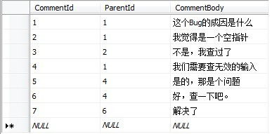

数据库层次表设计是处理树状结构或层次结构数据的一种方式。

[逻辑数据库设计 - 单纯的树（邻接表、路径枚举、嵌套集、闭包表）（引） - 海贼王&汉库克 - 博客园 (cnblogs.com)](https://www.cnblogs.com/yinggu/p/11498981.html)

## 邻接列表（`Adjacency list`）

邻接列表是一种最简单的层次数据表示方法。邻接列表中的每个条目都有一个指向其父条目的指针（外键）。

例如论坛中的评论功能，用户们可以评论帖子原文或其它评论：

> 要存储的树结构示意：
>
> 
>
> 建表示意：
>
> ~~~sql
> CREATE TABLE Comments(
>   CommentId　　int　　PK,
>   ParentId　　 int, -- 记录父节点
>   ArticleId　　int,
>   CommentBody nvarchar(500),
>   FOREIGN KEY (ParentId) REFERENCES Comments(CommentId) -- 自连接，主键外键都在自己表内
>   FOREIGN KEY (ArticleId) REFERENCES Articles(ArticleId)
> )
> ~~~
>
> 表中数据示例：
>
> 

特点：

- 邻接列表易于实现，对于表示深度和宽度都不大的树结构非常有效。
- 当需要执行复杂查询，如计算深度或获取所有子孙节点时，需要递归查询，性能较差。

## 路径枚举（`Path Enumeration`）

路径枚举（`Path Enumeration`）也称为材料化路径（`Materialized Path`）。它会将所有祖先节点的路径信息联合成一个字符串，将其保存为每个节点的一个属性。

将之前的案例使用材料化路径方案存储：

> 建表示意：
>
> ~~~sql
> CREATE TABLE Comments(
>   CommentId　　int　　PK,
>   Path　　 　　 varchar(100), -- 记录所有祖先节点的路径信息
>   ArticleId　　int,
>   CommentBody nvarchar(500),
>   FOREIGN KEY (ArticleId) REFERENCES Articles(ArticleId)
> )
> ~~~
>
> 表中数据示例：
>
> | CommentId | path     | CommentBody          |
> | --------- | -------- | -------------------- |
> | 1         | 1/       | 这个Bug的成因是什么  |
> | 2         | 1/2/     | 我觉得是一个空指针   |
> | 3         | 1/2/3/   | 不是，我查过了       |
> | 4         | 1/4/     | 我们需要查无效的输入 |
> | 5         | 1/4/5/   | 是的，那是个问题     |
> | 6         | 1/4/6/   | 好，查一下吧。       |
> | 7         | 1/4/6/7/ | 解决了               |

特点：

- 能通过路径长度很方便地得知节点的层级。
- 查找节点的祖先或子孙很方便，只需对路径字段进行字符串操作即可。
- 由于没有外键约束，无法保证路径中的节点总是存在。
- 需要依赖高级程序来维护路径中的字符串。

## 嵌套集合（`Nested set`）

嵌套集合方案会通过左值（`nsleft`）和右值（`nsright`）两个数值来表示节点的位置。对于其中的节点，它的 `nsleft` 值小于该节点的所有后代的 `nsleft` 值，它的 `nsright` 值大于该节点的所有后代的 `nsright` 值。

将之前的案例使用嵌套集合方案存储：

> 要存储的树结构示意：
>
> 
>
> 建表示意：
>
> ~~~sql
> CREATE TABLE Comments(
>   CommentId　　int　　PK,
>   nsleft　　　 int,
>   nsright　　　int,
>   ArticleId　　int,
>   CommentBody nvarchar(500),
>   FOREIGN KEY (ArticleId) REFERENCES Articles(ArticleId)
> )
> ~~~
>
> 表中数据示例：
>
> | CommentId | nsleft | nsright | CommentBody          |
> | --------- | ------ | ------- | -------------------- |
> | 1         | 1      | 14      | 这个Bug的成因是什么  |
> | 2         | 2      | 5       | 我觉得是一个空指针   |
> | 3         | 3      | 4       | 不是，我查过了       |
> | 4         | 6      | 13      | 我们需要查无效的输入 |
> | 5         | 7      | 8       | 是的，那是个问题     |
> | 6         | 9      | 12      | 好，查一下吧。       |
> | 7         | 10     | 11      | 解决了               |

特点：

- 可以很方便地查询祖先树和子树。
- 当进行插入和移动节点操作时很麻烦，有时需要修改大量节点的 `nsleft` 和 `nsright` 值。

## 闭包表（`Closure table`）

闭包表方案使用了一个额外的表来存储节点之间的关系，而主表中不会存储树结构。

将之前的案例使用闭包表方案存储：

> 要存储的树结构示意：
>
> 
>
> 建表示意：
>
> ~~~sql
> CREATE TABLE Comments(
> 　　CommentId int PK,
> 　　ArticleId int,
> 　　CommentBody int,
> 　　FOREIGN KEY(ArticleId) REFERENCES Articles(Id)
> )
> ~~~
>
> ~~~sql
> CREATE TABLE TreePaths(
> 　　ancestor   int,
> 　　descendant int,
> 　　PRIMARY KEY (ancestor,descendant), --复合主键
> 　　FOREIGN KEY (ancestor) REFERENCES Comments(CommentId),
> 　　FOREIGN KEY (descendant) REFERENCES Comments(CommentId)
> )
> ~~~
>
> 表中数据示例：
>
> - `Comments`
>
>   | CommentId | CommentBody          |
>   | --------- | -------------------- |
>   | 1         | 这个Bug的成因是什么  |
>   | 2         | 我觉得是一个空指针   |
>   | 3         | 不是，我查过了       |
>   | 4         | 我们需要查无效的输入 |
>   | 5         | 是的，那是个问题     |
>   | 6         | 好，查一下吧。       |
>   | 7         | 解决了               |
>
> - `TreePaths`
>
>   | ancestor | descendant |
>   | -------- | ---------- |
>   | 1        | 1          |
>   | 1        | 2          |
>   | 1        | 3          |
>   | 1        | 4          |
>   | 1        | 5          |
>   | 1        | 6          |
>   | 1        | 7          |
>   | 2        | 2          |
>   | 2        | 3          |
>   | 3        | 3          |
>   | 4        | 4          |
>   | 4        | 5          |
>   | 4        | 6          |
>   | 4        | 7          |
>   | 5        | 5          |
>   | 6        | 6          |
>   | 6        | 7          |
>   | 7        | 7          |

闭包表还可以进一步优化，比如增加一个 `path_length` 字段，对于自我引用的关系为 `0`，下一层子节点为 `1`，再下一层为 `2`，以此类推。