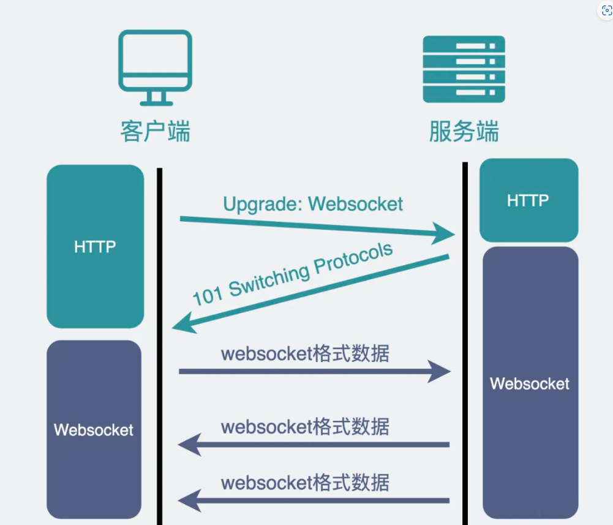

 

## `WebSocket` 协议

`WebSocket` 协议用于进行实时的双向通信。

`WebSocket` 协议需要从 `HTTP` 协议切换。

### 请求头与响应头

请求的 `header` 示意：

~~~
Connection: Upgrade
Upgrade: websocket
Sec-WebSocket-Key: Ia3dQjfWrAug/6qm7mTZOg==
~~~

`Connection` 和 `Upgrade` 表示升级到 `WebSocket` 协议。

`Sec-WebSocket-Key` 是由客户端在 `WebSocket` 握手过程中生成的一个随机字符串，并经过 `Base64` 编码。

响应的 `header` 示意：

~~~
HTTP/1.1 101 Switching Protocols
Connection: Upgrade
Upgrade: websocket
Sec-WebSocket-Accept: JkE58n3uIigYDMvC+KsBbGZsp1A=
~~~

`Sec-WebSocket-Accept` 是请求的 `header` 的 `Sec-WebSocket-Key` 处理之后的结果。只有当这两个值匹配时，`WebSocket` 连接才会被建立。

`Sec-WebSocket-Accept` 的计算方式：

~~~javascript
const crypto = require('crypto');

function hashKey(key) {
  const sha1 = crypto.createHash('sha1');
  sha1.update(key + '258EAFA5-E914-47DA-95CA-C5AB0DC85B11');
  return sha1.digest('base64');
}
~~~

上面的 `258EAFA5-E914-47DA-95CA-C5AB0DC85B11`  是 `WebSocket` 协议的一个固定字符串，将这个字符串与客户端提供的 `Sec-WebSocket-Key` 结合，通过 `SHA-1` 哈希和 `Base64` 编码而生成 `Sec-WebSocket-Accept`。

### 二进制协议

`WebSocket` 是二进制协议，相比 `HTTP` 协议只能传输文本，`WebSocket` 协议传输的数据内容可以是文本，也可以是二进制数据。
